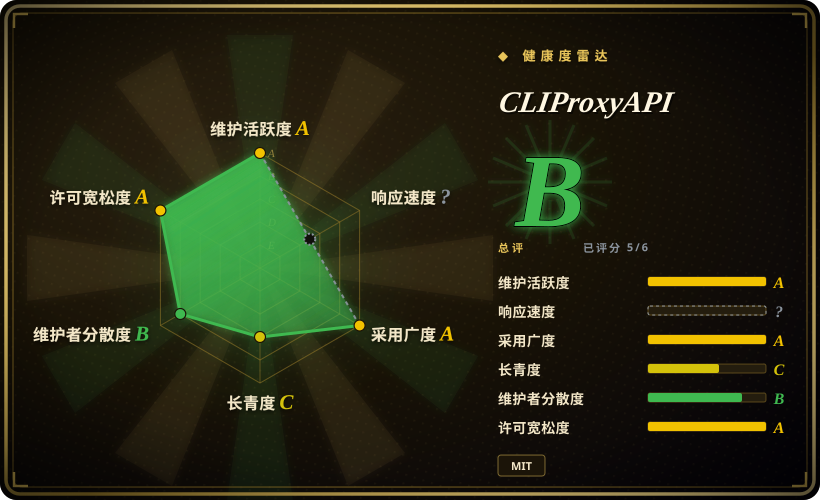

# CLIProxyAPI

把消费级 CLI 与 OAuth 登录态——ChatGPT Codex、Claude Code、Gemini/Antigravity、Grok 等——以及供应商 API key，包装成 OpenAI / Gemini / Claude / Codex 兼容的 HTTP API，供其他工具调用。

## 何时使用

你手上已经有若干模型产品的 CLI 或 OAuth 登录态，想从别的软件——某个 SDK、编辑器、另一个 agent——直接调用，而不为每个集成重写适配；你还想要一个带故障转移的账号池，而不是每个工具配一份凭据。这时选 CLIProxyAPI：它是单个 Go 二进制，同时会说多种 API 形状（OpenAI Chat/Responses、Gemini GenerateContent、Claude Messages、Codex 兼容），账号状态存在本地，所以部署是一个进程加一份配置，而不是一整套平台。

决定性的取舍在于**复用什么资产**。当你的资产是 CLI/OAuth 访问权而非供应商 API key 时，选它而不是 [LiteLLM](litellm.zh.md)——LiteLLM 路由密钥并提供治理，CLIProxyAPI 路由账号；当你要覆盖多个 CLI 产品、多种协议形状，而不是在单个 coding agent 内做路由时，选它而不是 [Claude Code Router](claude-code-router.zh.md)；当你要一个原始 API 门面、而不是带会话与文件的 agent 任务执行时，选它而不是 [HarnessRouter](harnessrouter.zh.md)。复用的代价在法务与运维：这些凭据能否被代理，取决于各家的服务条款，本文不作裁决。[未验证]

## 何时不用

- **不能接受把消费级登录态再暴露为 API 的服务条款与封号风险。** 改用供应商官方 API（OpenAI、Anthropic、Google）或托管中间商；这个风险来自设计本身，不是 bug。[推断]
- **需要租户、RBAC、预算与审计。** 改用 [LiteLLM](litellm.zh.md) 或 Portkey Gateway；CLIProxyAPI 是凭据池，不是治理层。
- **需要合同化的生产 SLA。** 改用官方托管 API、Azure OpenAI 或 Vertex AI；这是无支持合同的自托管社区项目。
- **只需单一供应商且要求完整协议语义。** 用该厂商自己的 SDK；任何兼容层都会损失部分字段保真度。
- **不愿让 OAuth refresh token 留在代理主机上。** 改用托管的密钥网关；CLIProxyAPI 会把账号 token 落盘。
- **只想在单个 coding agent 内做模型路由。** 改用 [Claude Code Router](claude-code-router.zh.md)；多协议代理对这件事是过度机械。
- **想要更简单的、基于密钥的自托管网关。** 改用 One API；CLIProxyAPI 的价值在账号复用，不在密钥管理。

## 横向对比

| 替代品 | 是否收录 | 我们的评价 | 取舍 |
|---|---|---|---|
| [LiteLLM](litellm.zh.md) | 已收录 | 流量基于供应商 key、且需要预算/虚拟密钥/花费追踪时，选 LiteLLM；要复用的资产是 CLI/OAuth 登录态而非 API key 时，选 CLIProxyAPI。 | LiteLLM 是有数据库和商业功能边界的治理型网关；CLIProxyAPI 更轻，但没有多租户控制，并承担账号风险。 |
| [Claude Code Router](claude-code-router.zh.md) | 已收录 | 单个开发者想用桌面 UI 让 coding agent 跨模型路由时，选 Router；目标是覆盖多账号、多协议的 API 门面时，选 CLIProxyAPI。 | Router 更窄、对单机更友好；CLIProxyAPI 暴露更多 API 形状与账号池，代价是更大的运维与合规面。 |
| [HarnessRouter](harnessrouter.zh.md) | 已收录 | 产品需要跑 agent 任务（会话、文件、取消）时，选 HarnessRouter；CLIProxyAPI 只提供模型请求，执行留给调用方。 | HarnessRouter 接管整个任务生命周期与其运维职责；CLIProxyAPI 是纯请求链路代理，更好跑，但能做的事件少得多。 |
| One API | 未收录 | 想要围绕签发密钥与渠道构建的直白自托管网关时，选 One API；只有“复用消费级 CLI 登录态”本身是目的时，才选 CLIProxyAPI。 | One API 保持密钥模型、避开账号政策风险，但不会把 CLI 订阅变成 API。 |
| OpenRouter | 未收录 | 宁可付费给托管中间商、也不自己跑代理并承担账号风险时，选 OpenRouter；流量必须留在自有主机上时，选 CLIProxyAPI。 | OpenRouter 把法务与运维负担接过去，代价是按 token 加价且链路多一个第三方；CLIProxyAPI 全留在本地，后果也留在本地。 |

## 技术栈

- **语言：** Go 1.26，以跨平台 release 二进制和 Docker 镜像分发（Debian 基础镜像，仅装 CA certificates 与 tzdata）。
- **服务层：** Gin 提供 HTTP、Gorilla WebSocket、Bubble Tea 终端 UI，另有 OAuth 流程与插件 SDK；对外提供 OpenAI Chat/Responses、Gemini GenerateContent/Interactions、Claude Messages 以及 Codex/Grok 兼容形状。
- **状态：** 账号 token 与元数据默认以权限 `0600` 的 JSON 存于 `~/.cli-proxy-api`；可选 filestore 包括 PostgreSQL、Git 与 S3 兼容对象存储。
- **配置：** 一份 `config.yaml`，外加代理自己签发给调用方的下游 API key。

## 依赖

- **至少一个上游 CLI/OAuth 登录态**（或供应商 API key）——没有凭据来源，代理无意义。
- **一份配置文件与签发给调用方的下游 API key。**
- **一个能安全保管密钥的主机：** OAuth refresh token 会落盘（`0600`），主机或备份被攻破即暴露凭据。
- **带 TLS 的反向代理**（若暴露到回环之外）；除你签发的 key 外，它没有额外的网关鉴权体系。
- **可选外部存储**（PostgreSQL / Git / S3 兼容），当默认本地 JSON filestore 不够时使用。

## 运维难度

**中等，另加政策成本。** 运行层面是一个二进制或容器加一份配置，默认 filestore 不需要数据库。工作量在别处：每个账号要走浏览器 OAuth 登录、轮换与备份凭据、维持账号池健康，并且要接受内置持久用量统计已被移除、用量需自行观测。近期 issue 显示兼容层才是脆弱处——协议转换会丢 `tool_choice`、`strict`、音频或文件字段，出现 Gemini 工具历史错配、Codex 流错误分类错误——同时一个开放的 P1 cache-poisoning 修复请求（#3105）提醒你：持有凭据的代理是高价值目标。请为高频升级预留时间：近 29 天约 30 个 release。

## 健康度与可持续性

- **维护活跃度（截至 2026-09）：** 最新 release v7.3.8（2026-09-18），约每日一版（29 天约 30 个）；本次核对前一日内仍有推送——极度活跃。
- **治理与 bus factor：** 贡献者 258 人、归属提交 3,950 次，但第一名约占 54.6%、前三合计约 79.2%——在更大的贡献者池里仍是单人核心。归属 `router-for-me` 组织。[推断]
- **背景与长青度：** 社区组织而非基金会；项目约 1.2 年且活跃（2025-07 起）。另有 `CLIProxyAPIBusiness` 仓库采用 SSPL 并要求 CLA，所以**产品线**是分层的，尽管本仓库是 MIT。[推断]
- **采用度：** 约 52k stars、7.9k forks，watchers 仅 110。fork 数是真实部署的有力证据，但 watcher 比例极低，与“关注度部分由推广驱动”一致。[推断]
- **风险旗：** 核心法务风险是被代理账号的服务条款；主仓库有一个开放的 P1 cache-poisoning 修复请求；历史 `pgx` CVE 已通过升级处理，本次核对时 GitHub Security Advisories 为空。密钥以本地 JSON 文件保存。

## 存疑（未验证）

- [未验证] 各上游供应商是否允许把其 CLI/OAuth 登录态再暴露为 API，以及实际封号率；存在用户报告，但不能据此建立因果。
- [未验证] MIT 社区仓库与 SSPL 的 `CLIProxyAPIBusiness` 版之间的完整功能与支持差异；本文只读到后者的 README 声明。
- [推断] 把消费级凭据再暴露为 API 对使用者构成真实的服务条款与封号风险，尽管本页未核实任何厂商的正式表述。
- [未验证] 开放的 P1 cache-poisoning PR（#3105）是否已合并或已发布修复。
- [未验证] 是否原生支持 Qwen CLI 认证——README 的包装产品清单无法完全确认。
- [未验证] 本页没有运行该代理，因此协议转换损失与错误分类行为取自 issue tracker 与文档，而非复现结果。
