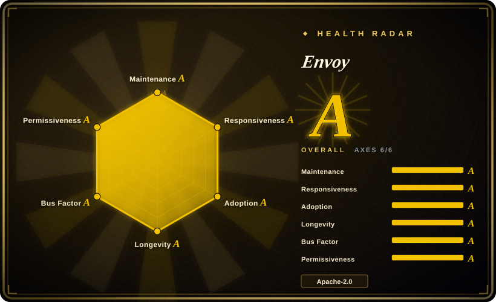
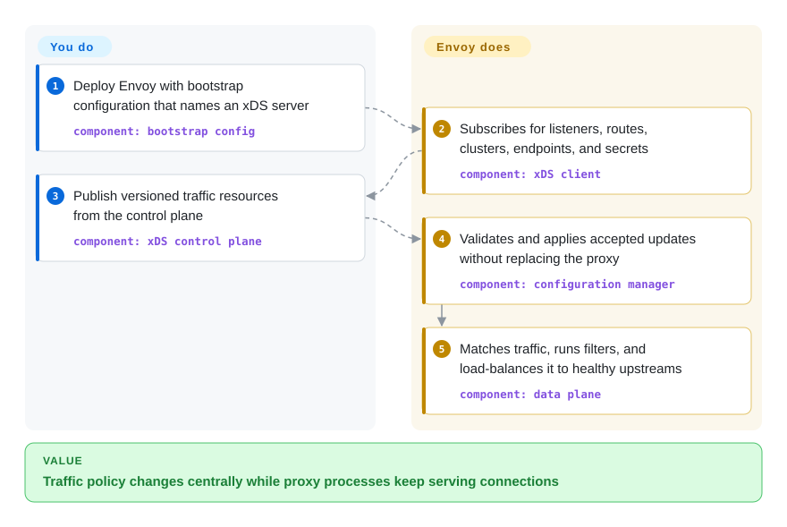

# Envoy

A CNCF-graduated L4/L7 edge and service proxy whose xDS APIs let an external control plane reconfigure traffic handling without replacing the data-plane process.

## When to use

You operate a platform where the same proxy must serve as an ingress, an internal service proxy, or a service-mesh data plane across many workloads. Routes, endpoints, certificates, traffic shifts, and telemetry policy change too often for hand-maintained proxy files, so you need a control plane to distribute them dynamically. Choose Envoy when a programmable xDS data plane and deep L4/L7 traffic controls matter more than a turnkey API-management portal or a bundled policy catalog.

Envoy is also a fit when another system already supplies the control plane and explicitly targets its APIs. In that case, you standardize on the proxy process and extension/filter model while the higher-level platform owns service discovery and policy intent.

## How it works

Envoy runs beside or in front of applications and handles the live connection path through listeners, filter chains, routes, upstream clusters, and load balancing. A small bootstrap file can define everything statically, but larger deployments point Envoy at an external configuration server. That server is the xDS control plane: it sends versioned discovery resources such as listeners, routes, clusters, endpoints, and secrets over gRPC or REST, and Envoy validates and applies accepted updates while continuing to proxy traffic. You own the bootstrap, the control plane or product that provides it, policy generation, deployment, and operations; Envoy owns the data-plane connections, protocol handling, filters, retries, load balancing, health checking, and telemetry hooks described by that configuration.

<!-- flow-steps:begin (generated from flows/envoy.json by tools/flow_card.py — do not edit) -->

Text version of the flow

1. **You**: Deploy Envoy with bootstrap configuration that names an xDS server — component: `bootstrap config`
2. **Envoy**: Subscribes for listeners, routes, clusters, endpoints, and secrets — component: `xDS client`
3. **You**: Publish versioned traffic resources from the control plane — component: `xDS control plane`
4. **Envoy**: Validates and applies accepted updates without replacing the proxy — component: `configuration manager`
5. **Envoy**: Matches traffic, runs filters, and load-balances it to healthy upstreams — component: `data plane`

**Value**: Traffic policy changes centrally while proxy processes keep serving connections

<!-- flow-steps:end -->

## When NOT to use

- **You need an admin portal, consumer identities, API products, and ready-made API-management policy.** Choose [Kong Gateway](kong.md) or Tyk because Envoy is a lower-level proxy and xDS data plane, not a complete API-management product.
- **You do not have or want a control plane for frequently changing configuration.** Choose Apache APISIX for an etcd-backed gateway, or a simpler file-driven reverse proxy for a small route set; operating raw xDS is additional system design, validation, and rollout work.
- **Your main job is backend aggregation and response composition from one declarative gateway configuration.** Choose KrakenD because its product surface is centered on API composition, whereas Envoy centers programmable traffic transport and filtering.
- **You only need a few static routes on one host.** Choose Caddy, Nginx, or Traefik because Envoy's configuration model, extension surface, and operational telemetry are unnecessary complexity at that scale.
- **You need to embed a proxy as an in-process application library.** Choose a language-native HTTP/gRPC library because Envoy is deployed as a separate long-running service process.

## Comparison

| Alternative | In index | Our verdict | Tradeoff |
|---|---|---|---|
| [Kong Gateway](kong.md) | ✅ | Choose Envoy when an existing or custom xDS control plane must drive a general L4/L7 data plane; choose Kong when teams need API consumers, plugins, and administration as a packaged gateway. | Envoy gives lower-level protocol and traffic-control primitives without a turnkey management plane; Kong adds API-management workflow at the cost of a heavier, more opinionated gateway stack. |
| [Apache APISIX](apisix.md) | ✅ | Choose APISIX when dynamic API-gateway configuration and a broad bundled plugin set should work without building an xDS control plane; choose Envoy when service-mesh data-plane interoperability and lower-level traffic control decide the choice. | APISIX combines OpenResty plugins with etcd-backed configuration; Envoy offers the xDS and filter foundation but leaves the control product and policy lifecycle to you. |
| Tyk | 未收录 | Choose Tyk when API keys, quotas, a dashboard, and developer-facing API management are the primary deliverable; choose Envoy when the platform already owns those abstractions and needs a reusable proxy data plane. | Tyk packages more API-management surfaces; Envoy is more infrastructure-level and does not bundle their operator or consumer workflows. |
| KrakenD | 未收录 | Choose KrakenD when stateless API aggregation and composition from a compact configuration are central; choose Envoy when bidirectional proxying, dynamic service discovery, and control-plane-driven traffic policy matter more. | KrakenD narrows the job to an API gateway and aggregator; Envoy exposes a broader network data plane but demands more architecture around it. |

## Tech stack

- **Core:** modern C++ with a multi-threaded event-driven proxy architecture; Bazel is the primary build system.
- **Protocols:** L4 TCP/UDP proxying plus HTTP/1.1, HTTP/2, HTTP/3, gRPC, WebSocket, and extensible network and HTTP filter chains.
- **Configuration:** static YAML/JSON/protobuf configuration or dynamic xDS discovery APIs over gRPC/REST; ADS can carry multiple resource types on one gRPC stream.
- **Extensions:** compiled C++ extensions plus supported extension mechanisms such as WebAssembly filters; extension availability varies by build and distribution.
- **Observability:** access logging, statistics, tracing hooks, an admin interface, and health checking are built into the proxy surface.

## Dependencies

- **Runtime:** a Linux-compatible Envoy binary or container and network access to downstream clients and upstream services; the proxy does not require a database.
- **Configuration:** a bootstrap file is always needed. Static deployments can stop there; dynamic deployments additionally require one or more reachable xDS configuration servers.
- **Control-plane ownership:** raw Envoy does not supply service inventory, an API-management database, or a policy UI. You must run a control plane or adopt a product such as a service mesh or gateway that provides one.
- **Build path:** building from source requires the repository's Bazel toolchain and a large native dependency graph; official release binaries or images avoid that build burden.

## Ops difficulty

**High for raw dynamic deployments; medium for bounded static use.** A single static proxy can be deployed without an external datastore, but production xDS adds a highly available control plane, configuration versioning and validation, safe rollout and rollback, certificate distribution, proxy fleet upgrades, capacity tuning, and telemetry retention. Because Envoy sits directly in the request path, mistakes in listeners, routes, filters, timeouts, or resource limits have broad blast radius. A platform that already wraps Envoy can absorb much of this burden; adopting the bare proxy means your team owns it.

## Health & viability

- **Maintenance:** Grade A — the latest default-branch commit was 0 days old and all 13 measured weeks were active; the latest observed release was v1.39.1.
- **Responsiveness:** Grade A — median first-response time was 14.2 hours across 17 qualifying issues in the measured window.
- **Adoption:** Not scored because the service has no structurally detectable canonical package; CNCF graduation is governance evidence, not a substitute for a package-adoption metric.
- **Longevity:** Grade A — the repository was 3,697 days old with a 0-day-old commit; that age-plus-activity combination is a strong Lindy signal for a network data plane. [推断]
- **Governance:** Grade A — 149 active maintainers were measured over 12 months, with the top contributor at 17.9% and the top three at 41.2%. The upstream README identifies CNCF as the host, CNCF records Envoy as graduated since 2018, and the repository documents maintainer voting and xDS API shepherds.
- **Risk / license:** Grade A — GitHub and the repository LICENSE identify Apache-2.0, and the scorer found no relicense in the measured 36-month window.

## Caveats (unverified)

- [推断] The high-versus-medium operations rating is an architectural judgment based on whether the deployment owns dynamic xDS and fleet operations; it is not a measured benchmark.
- [推断] The strong Lindy verdict combines repository age, current commits, release activity, and foundation governance; it is a selection prior, not a prediction of future maintenance.
