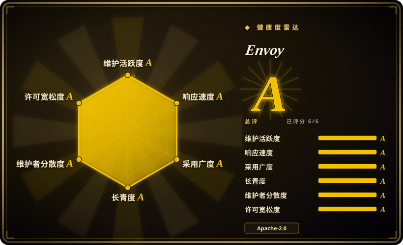
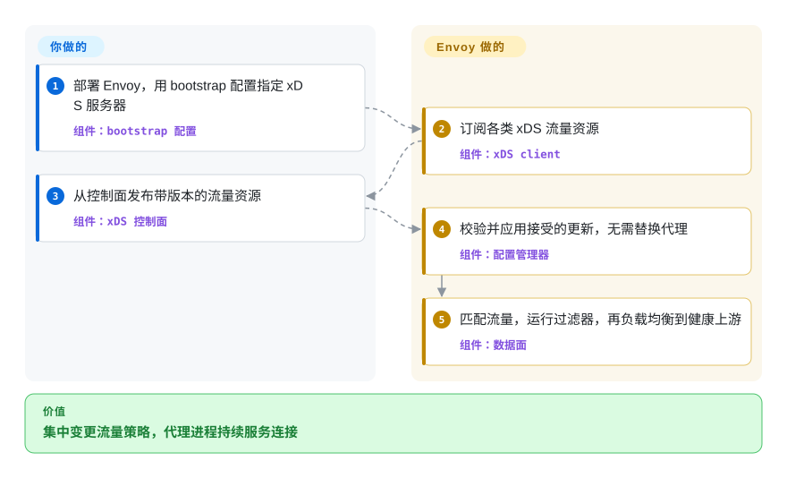

# Envoy

一个 CNCF 毕业的 L4/L7 边缘与服务代理：外部控制面通过 xDS API 改写流量处理方式，无需替换数据面进程。

## 何时使用

你运营的平台需要让同一种代理在大量工作负载前充当入口、内部服务代理或服务网格数据面。路由、端点、证书、流量迁移和遥测策略变动太频繁，手工维护代理配置文件已经不合适，因此你需要控制面动态下发配置。当可编程的 xDS 数据面和深入的 L4/L7 流量控制比开箱即用的 API 管理门户或内置策略目录更重要时，选择 Envoy。

如果另一个系统已经提供控制面并明确以 Envoy API 为目标，它同样合适。此时你把代理进程和扩展、过滤器模型标准化，而更高层平台负责服务发现和策略意图。

## 怎么用起来

Envoy 运行在应用旁边或前面，通过 listener、filter chain、route、upstream cluster 和负载均衡处理实时连接。一个小型 bootstrap 文件可以静态定义全部配置，但大型部署会让 Envoy 指向外部配置服务器。这个服务器就是 xDS 控制面：它通过 gRPC 或 REST 下发带版本的 listener、route、cluster、endpoint、secret 等发现资源，Envoy 校验并应用接受的更新，同时继续代理流量。bootstrap、控制面或提供控制面的产品、策略生成、部署和运维由你负责；数据面连接、协议处理、过滤器、重试、负载均衡、健康检查和配置所描述的遥测 hook 由 Envoy 负责。

<!-- flow-steps:begin (generated from flows/envoy.json by tools/flow_card.py — do not edit) -->

流程文字版

1. **你**：部署 Envoy，用 bootstrap 配置指定 xDS 服务器 — 组件：`bootstrap 配置`
2. **Envoy**：订阅各类 xDS 流量资源 — 组件：`xDS client`
3. **你**：从控制面发布带版本的流量资源 — 组件：`xDS 控制面`
4. **Envoy**：校验并应用接受的更新，无需替换代理 — 组件：`配置管理器`
5. **Envoy**：匹配流量，运行过滤器，再负载均衡到健康上游 — 组件：`数据面`

**价值**：集中变更流量策略，代理进程持续服务连接

<!-- flow-steps:end -->

## 何时不用

- **你需要管理门户、消费者身份、API 产品和现成的 API 管理策略。** 选 [Kong Gateway](kong.zh.md) 或 Tyk，因为 Envoy 是更底层的代理与 xDS 数据面，不是完整的 API 管理产品。
- **你不具备也不想维护频繁变更配置所需的控制面。** 选采用 etcd 配置的 Apache APISIX；路由很少时则选更简单的文件驱动反向代理。直接运营 xDS 会增加系统设计、校验和发布工作。
- **核心任务是用一份声明式网关配置聚合后端并组合响应。** 选 KrakenD，因为它的产品表面聚焦 API 组合，而 Envoy 聚焦可编程的流量传输与过滤。
- **你只在一台主机上需要几条静态路由。** 选 Caddy、Nginx 或 Traefik，因为 Envoy 的配置模型、扩展表面和运维遥测在这个规模下属于多余复杂度。
- **你需要把代理作为进程内 library 嵌入应用。** 选对应语言原生的 HTTP/gRPC library，因为 Envoy 要作为独立的长驻 service 进程部署。

## 横向对比

| 替代品 | 是否收录 | 我们的评价 | 取舍 |
|---|---|---|---|
| [Kong Gateway](kong.zh.md) | 已收录 | 已有或自建 xDS 控制面需要驱动通用 L4/L7 数据面时选 Envoy；团队需要打包好的 API 消费者、插件和管理能力时选 Kong。 | Envoy 提供更底层的协议与流量控制原语，但没有开箱即用的管理面；Kong 增加 API 管理工作流，代价是更重、更有主见的网关栈。 |
| [Apache APISIX](apisix.zh.md) | 已收录 | 动态 API 网关配置和丰富的内置插件应在不自建 xDS 控制面的前提下工作时选 APISIX；service mesh 数据面互操作和底层流量控制决定选择时选 Envoy。 | APISIX 把 OpenResty 插件和 etcd 配置组合起来；Envoy 提供 xDS 与过滤器基础，但控制产品和策略生命周期要由你补齐。 |
| Tyk | 未收录 | API key、配额、dashboard 和面向开发者的 API 管理是主要交付物时选 Tyk；平台已经拥有这些抽象，只需可复用代理数据面时选 Envoy。 | Tyk 打包了更多 API 管理表面；Envoy 更偏基础设施层，不内置相应的运维者与消费者工作流。 |
| KrakenD | 未收录 | 无状态 API 聚合以及用紧凑配置完成组合是核心时选 KrakenD；双向代理、动态服务发现和控制面驱动的流量策略更重要时选 Envoy。 | KrakenD 把任务收窄到 API 网关与聚合器；Envoy 提供更广的网络数据面，但要求在外围补上更多架构。 |

## 技术栈

- **核心：** 现代 C++，采用多线程事件驱动代理架构；主要构建系统是 Bazel。
- **协议：** L4 TCP/UDP 代理，以及 HTTP/1.1、HTTP/2、HTTP/3、gRPC、WebSocket 和可扩展的网络、HTTP filter chain。
- **配置：** 静态 YAML/JSON/protobuf 配置，或通过 gRPC/REST 使用动态 xDS discovery API；ADS 可以在一条 gRPC stream 上承载多种资源。
- **扩展：** 编译进二进制的 C++ extension，以及 WebAssembly filter 等受支持的扩展机制；具体可用 extension 随构建和发行版而变。
- **可观测性：** 代理表面内置 access log、statistics、tracing hook、admin interface 和健康检查。

## 依赖

- **运行时：** Linux 兼容的 Envoy binary 或 container，以及到下游客户端和上游服务的网络连通性；代理本身不需要数据库。
- **配置：** 始终需要 bootstrap 文件。静态部署到此即可；动态部署还需要一个或多个可访问的 xDS 配置服务器。
- **控制面归属：** 原生 Envoy 不提供服务目录、API 管理数据库或策略 UI。你必须自己运行控制面，或采用提供控制面的 service mesh、gateway 产品。
- **构建路径：** 从源码构建需要仓库指定的 Bazel toolchain 和大型原生依赖图；官方 release binary 或 image 可免去这项构建负担。

## 运维难度

**原生动态部署为高，范围受限的静态部署为中。** 单个静态代理不需要外部数据存储，但生产级 xDS 会增加高可用控制面、配置版本与校验、安全发布与回滚、证书分发、代理 fleet 升级、容量调优和遥测保留。Envoy 直接位于请求路径上，因此 listener、route、filter、timeout 或资源上限配置错误会有较大影响面。已经封装 Envoy 的平台能吸收很多负担；直接采用裸代理则意味着团队自己承担这些工作。

## 健康度与可持续性

- **维护：** Grade A——默认分支最近提交距评分 0 天，所测 13 周全部活跃；观察到的最新 release 为 v1.39.1。
- **响应速度：** Grade A——所测窗口中，中位首次响应时间为 14.2 小时，基于 17 个 qualifying issue。
- **采用广度：** 未评分，因为这个 service 没有能被结构化检测到的 canonical package；CNCF 毕业是治理证据，不能替代 package adoption 指标。
- **长青度：** Grade A——仓库已创建 3,697 天，最近提交距评分 0 天；这种年龄与活跃度组合对网络数据面是很强的 Lindy 信号。[推断]
- **治理：** Grade A——过去 12 个月测得 149 名活跃维护者，头部一人占 17.9%，前三人占 41.2%。上游 README 明确 CNCF 是托管方，CNCF 记录 Envoy 自 2018 年起为毕业项目，仓库还记录了 maintainer 投票机制和 xDS API shepherd。
- **风险与许可：** Grade A——GitHub 和仓库 `LICENSE` 均指向 Apache-2.0，评分器在所测 36 个月窗口中未发现重新许可。

## 存疑（未验证）

- [推断]“高与中”的运维评级取决于部署是否自持动态 xDS 和 fleet 运维，是架构判断而非实测基准。
- [推断] 强 Lindy 判断结合了仓库年龄、当前提交、发版活动和基金会治理；它是选型先验，不是对未来维护的预测。
