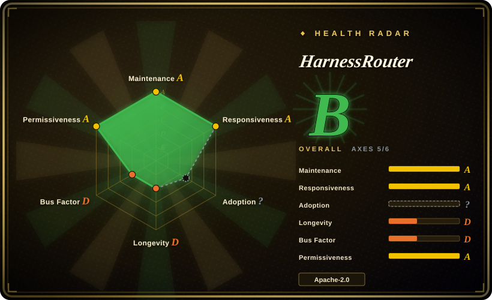

# HarnessRouter

A self-hosted gateway that runs existing agent harnesses — Claude Code, Codex, Hermes, DeepSeek Harness, OpenCode, Qwen Code, Gemini CLI, Cline and others — behind one OpenAI Responses-compatible API, adding sessions, streaming, files, and cancellation.

## When to use

You're a backend engineer adding an agentic feature to a product — "summarize this contract", "fill this spreadsheet row", "draft this deck" — and you need tasks that actually write files and run on a real workspace, not just chat completions. Your team does not want to own one integration per harness, nor to build and operate an agent runtime. You reach for HarnessRouter because it turns those harness CLIs into pluggable backends behind one endpoint: you `POST /v1/responses` with `metadata.harness_id` selecting the harness, continue a conversation with `previous_response_id`, stream progress as server-sent events, upload and retrieve files, and cancel work — all against a contract deliberately shaped like the OpenAI Responses API, so existing SDKs and parsers keep working.

The deciding tradeoff against the nearest substitutes is *level of abstraction*, not features. `claude-code-router` and `CLIProxyAPI` route model requests or expose CLI accounts as an API, so you still own execution, sessions and workspace lifecycle. A general agent framework (AgentScope, LangGraph) makes you build the agent itself. HarnessRouter sits in between: it runs someone else's harness for you, and you keep the provider keys and session state inside your own Docker volume rather than handing them to a managed sandbox service.

## When NOT to use

- **You need to call exactly one harness.** Use that harness's own SDK or CLI directly; HarnessRouter adds a container, a login gate, an API key, and a protocol layer to reach the same model.
- **You must isolate untrusted, multi-tenant agent code.** Use a sandbox-per-session system such as [OpenSandbox](../sandboxing/opensandbox.md), or HarnessRouter **Cloud** (serverless, isolated sandboxes); Community Edition runs every session as a separate OS user inside *one* shared container, which is a permission boundary, not a container boundary.
- **You need a multi-vendor standard you can port away from.** Use the OpenAI Responses API against providers directly, or a provider-agnostic proxy (LiteLLM); UHP is maintained, versioned and trademarked by HarnessRouter itself, so "conforms to UHP" is one vendor's contract, not an independent standard.
- **You need high availability or horizontal scale.** Stay on a managed runner or a K8s-native execution platform; CE is one container whose turn concurrency defaults to the machine's core count, and it states it cannot scale sandboxes on demand.
- **You do not want agent CLIs running shell, git and network on your host's behalf.** Pick a sandboxed platform; CE defaults to `HR_SANDBOX_TRUST=owner`, i.e. the agent is treated as trusted and gets a real POSIX workspace. A per-session user stops it reading other sessions, not from acting as you.
- **You need model-level routing, quotas or a shared gateway for many products.** Use [Kong Gateway](kong.md) or LiteLLM; HarnessRouter selects a *harness*, not a provider, and its Console is single-owner by design.
- **Your dependency budget cannot absorb daily releases.** Use a framework with a slower cadence; this project shipped v0.19.0 within roughly six weeks of creation, so pin the image and expect interface churn.

## Comparison

| Alternative | In index | Our verdict | Tradeoff |
|---|---|---|---|
| [claude-code-router](claude-code-router.md) | ✅ | When the job is pointing Claude Code at a different model endpoint with text configuration, choose claude-code-router; choose HarnessRouter when you need whole-harness execution with sessions, files and cancellation behind one API. | claude-code-router is a lightweight request router you can inspect in an afternoon; HarnessRouter replaces that with a stateful multi-process product you must deploy, back up and upgrade. |
| [CLIProxyAPI](cliproxyapi.md) | ✅ | When the job is turning several CLI logins into a reusable API façade, choose CLIProxyAPI; choose HarnessRouter when the deliverable is a product feature that runs agent tasks, not an account-sharing gateway. | CLIProxyAPI is a smaller, more transparent surface but leaves session, file and workspace lifecycle to you; HarnessRouter owns all of that and therefore owns more of your operational risk. |
| [LiteLLM](litellm.md) | ✅ | When what you need is provider-agnostic model routing, budgets and keys, choose LiteLLM; HarnessRouter solves a different layer and expects you to bring LiteLLM-style provider config anyway. | LiteLLM has a far larger provider surface and a longer production history, but no harness/session model; HarnessRouter adds that model while narrowing the provider set to what it has tested. |
| [Funtool](funtool.md) | ✅ | When the exact Windows + Claude Code + vendor-endpoint path is all you need and a packaged binary is acceptable, choose Funtool; HarnessRouter is the choice when you need a server-side, multi-harness, auditable deployment. | Funtool is a workstation shortcut with no server surface and opaque artifacts; HarnessRouter is source-available infrastructure with real operational duties. |
| [CC Switch](../agent-frameworks/coding-agents/orchestration-and-review/cc-switch.md) | ✅ | When one developer wants to switch coding-agent providers and credentials from a desktop UI, choose CC Switch; HarnessRouter is for a product backend that must call agents programmatically. | CC Switch manages local configuration and never sits in the request path; HarnessRouter puts a network service between your product and the model, and that service must stay up. |

## Tech stack

- **Gateway and Runner:** Python 3.12 services on FastAPI + Uvicorn (`fastapi==0.115.6`, `uvicorn==0.34.0`, pydantic 2.x, httpx), communicating over loopback; the runner additionally carries the MCP Python SDK for its stdio/SSE bridge.
- **Console:** the hosted product's own Next.js console (TypeScript/TSX, React 19, Node 22), built into the image in self-host edition; hosted-only surfaces (accounts, billing, marketplace, analytics) are hidden rather than removed.
- **Storage:** SQLite plus files and a secret store on the single `/data` volume, behind an adapter interface whose hosted implementation is supplied separately — the stated reason CE is the same codebase rather than a fork.
- **Optional image layers:** LibreOffice headless (document preview, on by default), ffmpeg (video assembly, on by default), Playwright + Chromium (`--build-arg WITH_BROWSER=1`).
- **Protocol:** UHP, versioned `2026-09-12` / `2026-08-11`, with OpenAPI 3.1 and JSON Schema 2020-12 under `protocol/schema/`.

## Dependencies

- **Docker**, and about 4 GB of disk; the image download itself is roughly 700 MB.
- **A model-provider API key** — there is no bundled model, trial key or free tier, and nothing runs until you connect a provider.
- **Outbound network on first start**, because the agent CLIs are installed into the volume at first run rather than baked into the image (a licensing requirement, per the Dockerfile) — the default `HR_BACKENDS` set is `claude,codex,hermes,pi,dsh,opencode,qwen,gemini,cline,omp,goose,kimi,aider`.
- **For the Dashboards starter kit:** a reachable SQL database with a read-only account, plus `HR_SECRET_KEY` set, without which the server refuses to store the encrypted connection string.
- **A reverse proxy with streaming-friendly buffering** if you expose it off-loopback; the guide's Caddy example sets `flush_interval -1` because turns stream for minutes.

## Ops difficulty

**Low to launch, medium to own.** A single `docker run` (or Compose) brings up Console, Gateway and Runner against one volume — genuinely no external services. The costs are concentrated in a few places: the container must start as root and drops privileges itself, so `--user` must not be set; the default credentials (`harnessrouter` / `harnessrouter`) must be changed before anyone else can reach the port; releases must be pinned because `0.1.x` and `0.2.0` shipped with no sign-in gate at all; upgrades mean stop-remove-recreate against the same volume; and backups require stopping the container so SQLite and files are consistent. Two footguns are documented rather than hidden: a provider/backend pairing that does not fit fails *quietly* (an empty turn after a long wait) when configured through environment variables instead of the Integrations page, and the dashboard SQL guard is a parser — the guide itself recommends a `SELECT`-only account as the second line of defence. Treat first start as network-dependent and slow.

## Health & viability

- **Age and cadence, as of 2026-09:** the repository was created 2026-08-09, so it is roughly six weeks old, and it already ships daily-or-faster releases (v0.19.0 on 2026-09-19). Active, but with no Lindy track record: a young project moving this fast has not yet demonstrated that its interfaces or its maintainers persist.
- **Governance is single-vendor.** `protocol/GOVERNANCE.md` states UHP is maintained in this repository under a maintainer-led model, and that "Unified Harness Protocol" and "UHP" are marks of HarnessRouter; there is no foundation, no independent certification body, and the conformance badge is a rendering of a report the project generates. Adoption of the standard is therefore adoption of one company's roadmap. [推断]
- **Bus factor is low.** 12 contributors total; one contributor accounts for about 298 commits while the next has 13. A large share of recent commit activity is `github-actions[bot]` (84 of the last 100 commits sampled), so commit-count and release-cadence signals overstate human maintenance.
- **Backing and business model.** Commercial open-core: Apache-2.0 Community Edition, a separately licensed Starter Kits repository, and a managed Cloud. The funding picture and the vendor's track record are not established by the repository. [未验证]
- **Adoption signals are ambiguous.** 1,496 stars and 147 forks against only 11 watchers and roughly 18.5k Docker Hub pulls (as of 2026-09) — visible attention, but the watcher/star ratio is low enough that promotion-driven growth is at least as plausible as organic pull. [推断]
- **Risk flags:** open-core feature boundary (Starter Kits under different terms; Cloud closed); the Dockerfile notes the Hermes backend declares no upstream license and instructs users to check it; agent CLIs are deliberately not redistributed and carry their own terms.

## Caveats (unverified)

- [未验证] The performance claims on the project's benchmark page (a 99.8% cost reduction and 3.2x latency improvement across eight harness × model configurations) are author-reported and were not reproduced here; the report itself notes the cheapest and fastest configuration varies by task.
- [未验证] The recorded conformance run ("all 64 checks at class Full", 2026-09-04) and the "OpenAI Responses-compatible" badge are self-measured by the same project; no independent party re-ran them for this page.
- [未验证] The Starter Kits license, the Cloud terms, and the vendor's funding or corporate backing were not inspected; only Community Edition's Apache-2.0 license was confirmed via the GitHub API.
- [未验证] No production users, references, or downstream dependents were verified, so real-world adoption at scale is unknown.
- [推断] The low watcher-to-star ratio (11 watchers vs 1,496 stars) suggests a meaningful share of stars came from promotion rather than sustained use, but this page did not trace star sources.
- [推断] The high proportion of bot commits means raw commit/release-activity signals overstate how much human maintenance the project receives.
- [未验证] This page did not run the container, so runtime behaviour, the per-session user isolation, and the quiet provider/backend failure mode are taken from the project's own documentation and Dockerfile rather than from a reproduction.
