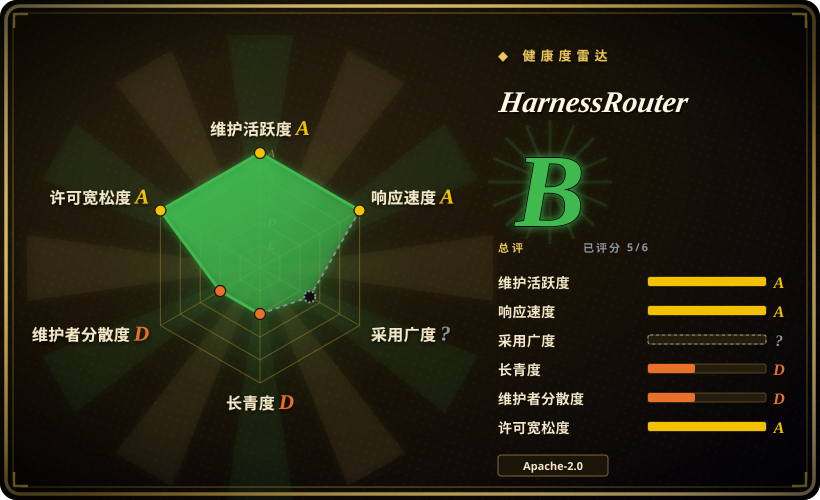

# HarnessRouter

一个自托管网关：把 Claude Code、Codex、Hermes、DeepSeek Harness、OpenCode、Qwen Code、Gemini CLI、Cline 等现成 agent harness 统一跑在一个 OpenAI Responses 兼容 API 之后，并补上会话、流式进度、文件与取消能力。

## 何时使用

你是后端工程师，要给产品加一个 agent 功能——“总结这份合同”“填好表格这一行”“起草这份幻灯片”——而且你需要的不是聊天补全，而是真能写文件、跑在真实工作区里的任务。团队既不想为每个 harness 各维护一套集成，也不想自己造并运维一个 agent 运行时。这时选 HarnessRouter：它把这些 harness CLI 变成同一端点后的可插拔后端，你 `POST /v1/responses` 并用 `metadata.harness_id` 选 harness，用 `previous_response_id` 续接会话，以 server-sent events 接收进度，上传/取回文件，取消任务——契约刻意做成 OpenAI Responses API 的形状，现有 SDK 与解析器可以继续用。

相对最近邻替代品，决定性的取舍是**抽象层级**，不是功能多少。`claude-code-router` 与 `CLIProxyAPI` 做的是模型请求路由或把 CLI 账号包装成 API，执行、会话与工作区生命周期仍归你。通用 agent 框架（AgentScope、LangGraph）则要求你自己写 agent。HarnessRouter 卡在中间：它替你跑别人的 harness，而 provider key 与会话状态留在你自己的 Docker 卷里，不必交给托管沙箱服务。

## 何时不用

- **只需要调一个 harness。** 直接用那家 harness 自己的 SDK 或 CLI；HarnessRouter 会为了到达同一个模型而多出容器、登录门、API key 和一层协议。
- **必须隔离不可信的多租户 agent 代码。** 改用按会话开沙箱的方案，例如 [OpenSandbox](../agent-tooling/opensandbox.zh.md)，或用 HarnessRouter **Cloud**（serverless 隔离沙箱）；社区版把所有会话放进**同一个**容器、只按操作系统用户隔离，那是权限边界，不是容器边界。
- **需要能随时迁走的多厂商标准。** 直接用各 provider 的 OpenAI Responses API，或用与厂商无关的代理（LiteLLM）；UHP 由 HarnessRouter 自己维护、自己定版本、自己持有商标，“符合 UHP”是单一厂商的契约，不是独立标准。
- **需要高可用或横向扩容。** 用托管 runner 或 K8s 原生执行平台；社区版就是一个容器，turn 并发默认等于机器核数，文档也承认它无法按需扩展沙箱。
- **不愿让 agent CLI 代表你在宿主机上跑 shell、git 和网络。** 选沙箱化平台；社区版默认 `HR_SANDBOX_TRUST=owner`，即把 agent 当作可信方并给它真实的 POSIX 工作区。按会话分用户挡得住它读别的会话，挡不住它以你的身份行事。
- **需要模型级路由、配额，或给多个产品共用的网关。** 用 [Kong Gateway](kong.zh.md) 或 LiteLLM；HarnessRouter 选的是**harness**而不是 provider，而且它的 Console 设计上就是单所有者。
- **依赖预算吸收不了日更节奏。** 用发版更慢的框架；本项目创建后约六周就发到 v0.19.0，所以要锁定镜像 tag，并预期接口会变。

## 横向对比

| 替代品 | 是否收录 | 我们的评价 | 取舍 |
|---|---|---|---|
| [claude-code-router](claude-code-router.zh.md) | 已收录 | 任务只是用文本配置把 Claude Code 指向别的模型端点时，选 claude-code-router；需要把“整只 harness 的执行 + 会话 + 文件 + 取消”收进一个 API 时，才选 HarnessRouter。 | claude-code-router 是半小时就能读完的轻量请求路由器；HarnessRouter 用它换掉的是一个有状态的多进程产品，你得部署、备份、升级它。 |
| [CLIProxyAPI](cliproxyapi.zh.md) | 已收录 | 任务是把多个 CLI 登录态变成可复用 API 门面时，选 CLIProxyAPI；交付物是产品里能跑 agent 任务的功能、而不是账号共享网关时，才选 HarnessRouter。 | CLIProxyAPI 面更小更透明，但会话、文件和工作区生命周期都留给你；HarnessRouter 把这些全接过去，也就接走了更多运维风险。 |
| [LiteLLM](litellm.zh.md) | 已收录 | 要的是与厂商无关的模型路由、预算与密钥管理时，选 LiteLLM；HarnessRouter 解决的是另一层，而且本身就要求你提供 LiteLLM 式的 provider 配置。 | LiteLLM 的 provider 覆盖面和上线历史都长得多，但没有 harness/会话模型；HarnessRouter 补上这层模型，代价是把 provider 收窄到它测过的范围。 |
| [Funtool](funtool.zh.md) | 已收录 | 只需要“Windows + Claude Code + 指定厂商端点”这条路径、且接受预打包二进制时，选 Funtool；需要服务端、多 harness、可审计的部署时，选 HarnessRouter。 | Funtool 是没有服务端面的工作站捷径，产物不透明；HarnessRouter 是源码可见的基础设施，也带来实打实的运维职责。 |
| [CC Switch](../agent-frameworks/coding-agents/orchestration-and-review/cc-switch.zh.md) | 已收录 | 单个开发者想从桌面 UI 切换 coding agent 的供应商与凭据时，选 CC Switch；产品后端要以编程方式调用 agent 时，才用 HarnessRouter。 | CC Switch 只管本地配置、从不进入请求链路；HarnessRouter 把网络服务放进产品与模型之间，而这个服务必须一直活着。 |

## 技术栈

- **Gateway 与 Runner：** Python 3.12 上的 FastAPI + Uvicorn 服务（`fastapi==0.115.6`、`uvicorn==0.34.0`、pydantic 2.x、httpx），通过 loopback 通信；Runner 还带 MCP Python SDK，用于 stdio/SSE 桥接。
- **Console：** 与托管产品同一套 Next.js 控制台（TypeScript/TSX、React 19、Node 22），自托管版构建进镜像；仅托管可用的界面（账号、计费、市场、分析）是被隐藏而非删除。
- **存储：** 单 `/data` 卷上的 SQLite 加文件与密钥存储，藏在适配器接口之后；托管实现单独提供——这也是项目自称“同一套代码而非分叉”的依据。
- **可选镜像层：** LibreOffice headless（文档预览，默认开）、ffmpeg（视频合成，默认开）、Playwright + Chromium（`--build-arg WITH_BROWSER=1`）。
- **协议：** UHP，版本 `2026-09-12` / `2026-08-11`，`protocol/schema/` 下有 OpenAPI 3.1 与 JSON Schema 2020-12。

## 依赖

- **Docker**，以及约 4 GB 磁盘；镜像下载本身约 700 MB。
- **一个模型 provider 的 API key**——没有内置模型、试用 key 或免费额度，没接 provider 之前什么都跑不起来。
- **首次启动需要外网**，因为 agent CLI 是首次运行时装进数据卷、而不是烤进镜像的（Dockerfile 说明这是许可要求）；默认 `HR_BACKENDS` 为 `claude,codex,hermes,pi,dsh,opencode,qwen,gemini,cline,omp,goose,kimi,aider`。
- **用 Dashboards 起步套件时：** 一个可达的 SQL 数据库与只读账号，并且要设置 `HR_SECRET_KEY`，否则服务端拒绝存储加密后的连接串。
- **一个对长连接友好的反向代理**（若要暴露到 loopback 之外）；文档的 Caddy 示例设了 `flush_interval -1`，因为一个 turn 会流式输出好几分钟。

## 运维难度

**启动低，长期持有中等。** 一条 `docker run`（或 Compose）就能把 Console、Gateway、Runner 拉起来，只挂一个卷，确实没有外部服务。成本集中在几处：容器必须以 root 启动并自行降权，因此不能加 `--user`；默认口令（`harnessrouter` / `harnessrouter`）必须在别人能访问端口前改掉；必须锁版本，因为 `0.1.x` 与 `0.2.0` 完全没有登录门；升级意味着对着同一个卷 stop-remove-recreate；备份需要先停容器，SQLite 与文件才是一致的。有两个坑文档写明了而不是藏起来：用环境变量（而非 Integrations 页面）配置时，provider 与 backend 不匹配会**静默失败**（等很久后返回空 turn）；仪表盘的 SQL 防护只是个解析器，文档自己也建议再配一个只有 `SELECT` 权限的账号兜底。首次启动请当作依赖网络且偏慢。

## 健康度与可持续性

- **年龄与节奏（截至 2026-09）：** 仓库创建于 2026-08-09，约六周大，却已经日更甚至更快（v0.19.0 于 2026-09-19 发布）。活跃，但没有 Lindy 记录：这么年轻又这么快，还没有证明过它的接口或维护者能长期留存。
- **治理是单一厂商。** `protocol/GOVERNANCE.md` 写明 UHP 在本仓库内以维护者主导模式演进，且 “Unified Harness Protocol” 与 “UHP” 是 HarnessRouter 的商标；没有基金会、没有独立认证机构，conformance 徽章只是渲染该项目自己生成的报告。所以采用这个标准等于采用一家公司的路线图。[推断]
- **bus factor 低。** 贡献者共 12 人，其中一人约 298 次提交，第二名只有 13 次。近期提交里 `github-actions[bot]` 占比很高（抽样的最近 100 次中 84 次），因此提交数与发版节奏会高估人类维护量。
- **背景与商业模式。** 商业 open-core：Apache-2.0 社区版、另行授权的 Starter Kits 仓库、以及托管 Cloud。资金状况与厂商历史无法从仓库确认。[未验证]
- **采用信号含义不清。** 1,496 stars、147 forks，但只有 11 watchers、Docker Hub 约 1.85 万次拉取（截至 2026-09）——关注度可见，可 watcher/star 比足够低，使“推广驱动增长”至少和“自然使用”一样可能。[推断]
- **风险旗：** open-core 功能边界（Starter Kits 另协议、Cloud 闭源）；Dockerfile 指出 Hermes 后端上游未声明许可证并要求使用者自行核查；agent CLI 刻意不再分发，各自带条款。

## 存疑（未验证）

- [未验证] 项目基准页的性能声明（八种 harness × 模型配置上成本降 99.8%、端到端延迟快 3.2 倍）为作者自报，本页未复现；报告本身也说明最低成本与最快配置随任务而变。
- [未验证] 记录的 conformance 结果（2026-09-04 “全部 64 项检查通过，class Full”）与 “OpenAI Responses 兼容” 徽章都由同一项目自测，本页没有独立第三方复跑。
- [未验证] Starter Kits 的许可、Cloud 条款、以及厂商的资金与公司背景均未核查；仅通过 GitHub API 确认了社区版的 Apache-2.0。
- [未验证] 没有核实任何生产用户、案例或下游依赖，因此规模化真实采用情况未知。
- [推断] watcher 与 star 之比偏低（11 对 1,496）提示相当一部分 star 来自推广而非持续使用，但本页没有追踪 star 来源。
- [推断] bot 提交占比高，意味着原始提交/发版活跃度信号会高估项目获得的人类维护投入。
- [未验证] 本页没有运行该容器，因此运行时行为、按会话的用户隔离、以及 provider/backend 的静默失败模式都取自项目自身文档与 Dockerfile，而非复现结果。
