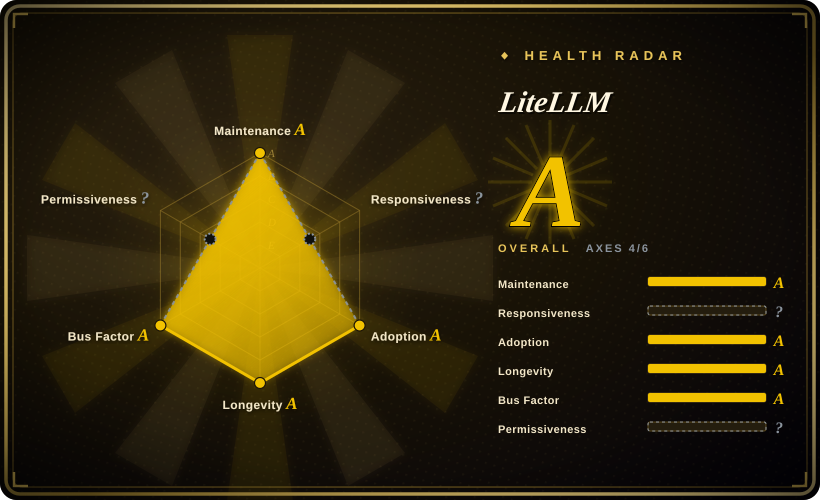

# LiteLLM

A deployable LLM gateway plus a Python SDK that puts 100+ providers behind one OpenAI-compatible API, adding cost tracking, budgets, virtual keys, load balancing, fallback, guardrails, logging and caching.

## When to use

You're a platform engineer and several applications or teams are calling model providers directly with their own keys; you need one endpoint, per-team virtual keys with budgets, spend visibility, and failover when a provider degrades — without pushing that coupling into each app. You reach for LiteLLM because it is purpose-built for LLM traffic: routing by model, token accounting, budgets and guardrails are first-class config, so you do not have to express model semantics as generic gateway plugins.

The deciding tradeoff is *purpose and governance*. Choose it over [Kong Gateway](kong.md) when LLM semantics (model mapping, token cost, budget enforcement) matter more than HTTP-level plugins or Kubernetes ingress; choose it over [Claude Code Router](claude-code-router.md) and [CLIProxyAPI](cliproxyapi.md) when your traffic is provider API keys serving many products, not one developer's coding-agent client or a pool of consumer logins; choose it over a hosted broker such as OpenRouter when keys and traffic must stay on your infrastructure. The price of that governance is that the full feature set is not all MIT: `enterprise/` is commercially licensed. [未验证] whether any specific feature you need sits behind that boundary — check the enterprise matrix before committing.

## When NOT to use

- **You need to execute agent harnesses, sandboxes or task loops.** Use [OpenHands](../agent-frameworks/coding-agents/orchestration-and-review/openhands.md) or [HarnessRouter](harnessrouter.md); LiteLLM routes model calls and does not run agents.
- **A single-provider small app.** Use the vendor SDK directly (`openai`, `anthropic`); a gateway with a database and key management is overhead you will pay for and not use.
- **You require the whole feature surface under a permissive license with no commercial directory.** Use an Apache-2.0 gateway such as [Kong Gateway](kong.md); LiteLLM's SSO, SCIM, audit logs and fine-grained RBAC are enterprise-licensed.
- **You need Kubernetes-native traffic policy and a plugin ecosystem.** Use Kong or an Envoy-based AI gateway; LiteLLM is an application-level proxy, not a data-plane gateway.
- **You cannot tolerate cross-protocol semantic loss or fast upgrade cadence.** Call providers directly or use a hosted broker; compatibility layers drop or misplace fields between OpenAI, Anthropic and Gemini shapes.
- **You want routing for one developer's coding agent rather than a shared gateway.** Use [Claude Code Router](claude-code-router.md); you do not need budgets, keys or a database for that.

## Comparison

| Alternative | In index | Our verdict | Tradeoff |
|---|---|---|---|
| Portkey Gateway | not indexed | When you want an LLM gateway that is fully open source and adds guardrails/observability as a first-class product, evaluate Portkey Gateway; choose LiteLLM when its provider breadth, cost tracking and large community matter more than a permissive-license guarantee. | Portkey is a comparable LLM gateway with a different open-core posture; LiteLLM has the larger ecosystem and more integrations, but the enterprise boundary and a credential-holding proxy's CVE history are real costs. |
| [Kong Gateway](kong.md) | ✅ | When you need an HTTP/API gateway that can also handle LLM and MCP traffic with Kubernetes ingress and a plugin ecosystem, choose Kong; choose LiteLLM when LLM-specific cost, budget and model semantics are the actual requirement. | Kong is a mature data-plane gateway with a steeper configuration model and no native token accounting; LiteLLM is simpler for LLM routing but is application-level and not a general traffic gateway. |
| [Claude Code Router](claude-code-router.md) | ✅ | When a developer wants to route their coding agent across models locally, choose Router; choose LiteLLM when the traffic belongs to products and needs keys, budgets and spend records. | Router is a local single-user tool with no multi-tenant controls; LiteLLM adds databases and governance and must be operated as a service. |
| [CLIProxyAPI](cliproxyapi.md) | ✅ | When the asset being reused is consumer CLI/OAuth logins, choose CLIProxyAPI; choose LiteLLM when the asset is provider API keys and the requirement is governance. | CLIProxyAPI turns subscriptions into an API and carries account-policy risk; LiteLLM stays on issued keys and stays inside vendor terms, at the cost of real infrastructure. |
| OpenRouter | not indexed | When you would rather not operate a gateway and accept a hosted broker with per-token margin, choose OpenRouter; choose LiteLLM when credentials and spend data must remain on your own infrastructure. | OpenRouter removes the ops and the DB, and adds a third party in the path plus margin; LiteLLM keeps control and adds PostgreSQL, Redis and upgrade work. |

## Tech stack

- **Gateway server:** Python ≥3.10 on FastAPI/Uvicorn with Pydantic and HTTPX/AIOHTTP; TypeScript admin UI.
- **Optional Rust core:** the repository describes a "Rust core with Python SDK"; the Rust path is compiled into the wheel via Maturin/PyO3 but is documented as an opt-in beta that is off by default and covers only part of routing — auth, config, routing, logging and cost tracking remain Python. [未验证] its maturity in your deployment.
- **State:** PostgreSQL (via Prisma) for virtual keys, budgets and spend; Redis for multi-worker coordination, rate limiting and caching.
- **Install/distribute:** `pip`/`uv`, Docker, Docker Compose and Helm; configuration is a `config.yaml` plus master and salt keys.

## Dependencies

- **PostgreSQL** if you use the admin UI, virtual keys, budgets or spend tracking; a stateless proxy can run without it.
- **Redis** when running more than one worker or pod, otherwise rate limits, budgets, key revocation and caching diverge per worker.
- **`LITELLM_MASTER_KEY`**, and a fixed **`LITELLM_SALT_KEY`** if you use a database — changing the salt makes stored credentials undecryptable.
- **Provider API keys** for every upstream you route to. LiteLLM holds them, so it is a high-value credential store by construction.
- **A container host or Kubernetes cluster** if you deploy the proxy rather than embedding the SDK.

## Ops difficulty

**Medium to high.** A single-container proxy on one worker is quick, but the feature set that makes LiteLLM worth choosing is exactly what introduces state: PostgreSQL migrations, Redis consistency across workers, master and salt key custody, and per-provider credential rotation. The project's own production guidance is one worker per pod with horizontal scaling, and recent issues show the operational sharp edges — a Slack-alert task leaking and OOMing (#41357), a partitioned spend-table migration failing (#41548), Prisma connections not being released when idle (#41420), and protocol-bridge fields being lost or misplaced (#41954). Upgrade cadence is fast (about weekly minors), and because the proxy concentrates provider credentials, upgrade and attack-surface management is a standing job rather than a one-off.

## Health & viability

- **Maintenance, as of 2026-09:** latest stable release v1.101.0 (2026-09-15) with 23 releases in roughly the last 30 days and a stated weekly minor cadence — highly active.
- **Governance and bus factor:** the contributors API returns 1,731 records and ~51k attributed contributions, but that includes anonymous entries, bots and duplicate identities; the top three accounts hold about 51.5% combined and match BerriAI's founders. Vendor-dominated rather than community-governed. [推断]
- **Backing and longevity:** started 2023-07 and backed by BerriAI, a commercial vendor with a paid enterprise tier. A funded vendor gives longevity and a real support path, and also means roadmap and license decisions serve that business. [推断]
- **Adoption:** about 59k stars and 11.6k forks against 234 watchers — the strongest adoption signals on this page; the repository is very large (~1.66 GB), which is itself a mild operational note for clones and archival.
- **Risk flags:** the license changed on 2024-02-15 from pure MIT to MIT plus an `enterprise/` commercial carve-out (no relicense of existing non-enterprise code); contributors must sign a CLA; the repository publishes 14 security advisories (3 critical, 5 high), including an authentication bypass, a SQL injection and an SSRF credential leak. A fast-moving proxy that holds every provider key is a high-value target by design.

## Caveats (unverified)

- [未验证] Exactly which features you need fall inside `enterprise/`; the boundary was read from the license and enterprise docs but not tested per feature.
- [未验证] The security advisories (14 total, 3 critical, including a reported authentication bypass, SQL injection and SSRF credential leak) were read from GitHub advisories and were not independently reproduced or mapped to the current release.
- [未验证] The "Rust core" claim's real-world maturity; the docs mark it as an opt-in beta, but its coverage was not benchmarked here.
- [未验证] The independent natural-person contributor count is unknown — the contributor API mixes anonymous entries, bots and duplicates, so the bus-factor share above is approximate.
- [推断] Because LiteLLM is vendor-backed with a paid enterprise tier, roadmap and licensing priorities will tend to serve that commercial interest; that is a tradeoff, not a defect.
- [未验证] This page did not deploy the proxy, so the PostgreSQL/Redis failure modes and migration issues above are taken from docs and the issue tracker rather than from a reproduction.
