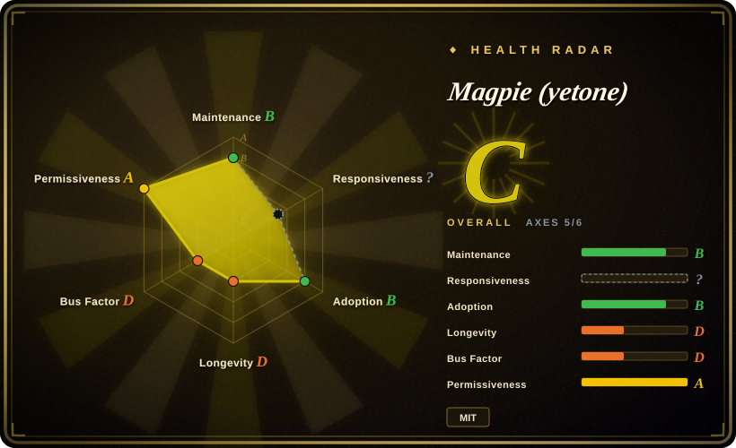
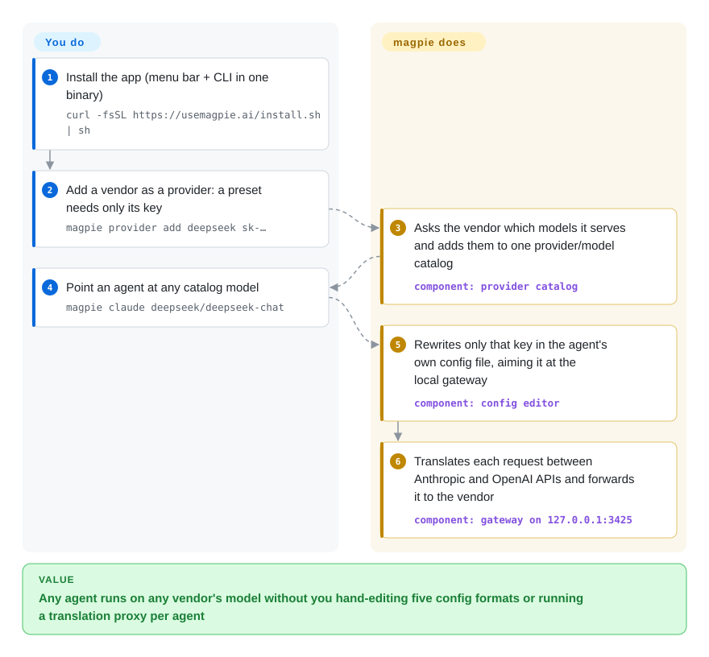

# Magpie (yetone)

Every coding agent keeps its model in a different file and format — Claude Code in `settings.json`, Codex in `config.toml`, OpenCode in `opencode.jsonc` — so trying DeepSeek or Kimi in one of them means hand-editing that file and often standing up a proxy that speaks the agent's API. magpie is one menu-bar app that changes just that one key in each file and runs a local gateway that translates between the Anthropic and OpenAI APIs for all of them.

## When to use

You work in three or four coding agents a day — Claude Code, Codex, OpenCode, Pi — and you hold keys for DeepSeek, Kimi and GLM plus a ChatGPT and a Claude subscription. Today, putting Codex on a DeepSeek model means writing a `[model_providers.*]` table into `~/.codex/config.toml`, putting Claude Code on Kimi means an `ANTHROPIC_BASE_URL` / `ANTHROPIC_AUTH_TOKEN` pair in the `env` block of `~/.claude/settings.json`, and each agent needs a vendor that speaks its wire protocol. You reach for magpie when you want one screen (menu bar, window, `magpie tui`, or plain CLI) that lists every installed agent and its current model, lets you click a value to change it, and makes every provider — including the subscriptions you are already signed in to — appear in every agent's picker as `provider/model` behind one local endpoint.

The deciding tradeoff is *breadth on one workstation vs. maturity*. Choose it over [CC Switch](../agent-frameworks/coding-agents/orchestration-and-review/cc-switch.md) when you want more agents (the README lists 28 config targets), comment-preserving single-key edits, subscription logins exposed as providers, and a small Go binary with a headless CLI/Docker mode — and accept that it is about a week old against CC Switch's year of use. Choose it over [Claude Code Router](claude-code-router.md) when the problem is many agents, not rule-based routing inside Claude Code; over [CLIProxyAPI](cliproxyapi.md) when you want a desktop model switcher rather than a server-side account pool; over [LiteLLM](litellm.md) when it is your laptop, not a team with budgets and virtual keys.

## How it works

magpie does two separate jobs from one binary. The first is a config editor: it knows where each supported agent keeps its settings and, when you pick a model, rewrites only that key — comments, ordering and indentation survive, and the write is atomic (it swaps the whole file in one step, so a crash never leaves half a file). The second is a gateway — a small local server on `127.0.0.1:3425` that agents talk to instead of the vendor: it accepts OpenAI chat completions, OpenAI Responses, Anthropic Messages and Gemini requests, and either passes them straight through or translates them into whatever the vendor speaks, streaming and tool calls included — think of an interpreter who sits in the room so each agent can keep speaking its own language. What you do is add providers (a preset needs only a key) and pick models; what magpie does is fetch each vendor's real model list, write the agent's config to point at the gateway, and restore the previous values when you switch back to a native model. Signed-in agents (Claude Code, Codex/ChatGPT, Copilot, Devin and others) also become providers; for Claude subscriptions magpie drives the real local `claude` binary rather than calling the API itself. Routing groups (`group/<id>`) let one pick spread over several models or accounts, ordered by fallback, rotation, least use, or which subscription's quota renews soonest.

<!-- flow-steps:begin (generated from flows/magpie-model-router.json by tools/flow_card.py — do not edit) -->

Text version of the flow

1. **You**: Install the app (menu bar + CLI in one binary) — `curl -fsSL https://usemagpie.ai/install.sh | sh`
2. **You**: Add a vendor as a provider: a preset needs only its key — `magpie provider add deepseek sk-…`
3. **Magpie (yetone)**: Asks the vendor which models it serves and adds them to one provider/model catalog — component: `provider catalog`
4. **You**: Point an agent at any catalog model — `magpie claude deepseek/deepseek-chat`
5. **Magpie (yetone)**: Rewrites only that key in the agent's own config file, aiming it at the local gateway — component: `config editor`
6. **Magpie (yetone)**: Translates each request between Anthropic and OpenAI APIs and forwards it to the vendor — component: `gateway on 127.0.0.1:3425`

**Value**: Any agent runs on any vendor's model without you hand-editing five config formats or running a translation proxy per agent

<!-- flow-steps:end -->

## When NOT to use

- **You need a shared gateway for a team, with per-user keys, budgets and audit.** Use [LiteLLM](litellm.md) (or TokenHub in this category); magpie's gateway is single-user — on loopback it accepts any key, and LAN sharing adds only one shared key.
- **You cannot accept the terms-of-service or account-suspension risk of using a consumer subscription from other agents.** Stay on vendor API keys (magpie still works with keys only) or the vendor's own client; magpie's README itself warns that Google may suspend an Antigravity account used outside Antigravity, and routing a Claude subscription to Pi or OpenCode depends on driving the real `claude` binary to stay out of Anthropic's third-party classifier. [推断]
- **You want a tool with a track record.** Use [CC Switch](../agent-frameworks/coding-agents/orchestration-and-review/cc-switch.md), which covers the same desktop "switch providers + local format-converting routing + failover" shape and has been public since 2025-08; magpie's first commit is 2026-09-22 and it ships a new build several times a day.
- **You need content-based routing rules inside Claude Code (background vs. long-context vs. reasoning requests).** Use [Claude Code Router](claude-code-router.md); magpie's routing groups decide by order, rotation, usage and quota window, not by what the request is.
- **You want one account pool served to many machines or tools as a remote API.** Use [CLIProxyAPI](cliproxyapi.md); magpie's Docker/`magpie serve` mode exists, but subscription sign-ins cannot be completed inside a container and the design centers on one person's desktop.
- **You need exact protocol semantics for one vendor.** Call that vendor directly; every translation layer loses fields — for example Claude Code's server-side auto-mode `safeguards` only work on Anthropic's own API, and a Codex routing-group session once started at ~216K input tokens until v0.1.447 (issues #250, #258).
- **Your machines must not auto-update or phone home.** Build from source or skip it; release builds update themselves in the background and send one daily usage ping to PostHog unless `DO_NOT_TRACK=1` / `MAGPIE_NO_STATS=1` is set.

## Comparison

| Alternative | In index | Our verdict | Tradeoff |
|---|---|---|---|
| [CC Switch](../agent-frameworks/coding-agents/orchestration-and-review/cc-switch.md) | ✅ | When you want the proven desktop manager for switching coding-agent providers with local routing and failover, pick CC Switch; pick magpie when you need more agents, subscription logins as providers, surgical config edits or a CLI/headless mode. | CC Switch brings a year of releases and ~139k stars on a Rust/Tauri app; magpie is a far smaller Go binary with wider agent coverage, but is days old and single-maintainer. |
| [Claude Code Router](claude-code-router.md) | ✅ | When you mainly live in Claude Code and want requests routed by type (background, long context, reasoning), pick Claude Code Router; pick magpie when the pain is keeping many different agents on the right models. | Router gives finer per-request rules for one client; magpie gives one catalog and one picker across ~28 agents but only order/rotate/usage/quota-based groups. |
| [CLIProxyAPI](cliproxyapi.md) | ✅ | When you want consumer CLI/OAuth accounts exposed as a server API to many callers, pick CLIProxyAPI; pick magpie when you want those accounts inside your own agents on one machine with a GUI. | CLIProxyAPI is a headless multi-protocol account pool with a larger contributor base; magpie adds per-agent config writing and a menu-bar UI, and both carry the same subscription-reuse account risk. |
| [LiteLLM](litellm.md) | ✅ | When a team needs one OpenAI-compatible endpoint with virtual keys, budgets and spend tracking, pick LiteLLM; pick magpie when it is one developer's workstation and the goal is switching agents, not governing spend. | LiteLLM costs PostgreSQL/Redis operations and has a commercial `enterprise/` boundary; magpie needs no database but has no tenant, key-issuance or budget model. |

## Tech stack

- **Language:** Go (`go 1.26.3` in `go.mod`); the UI is plain HTML/CSS/JavaScript shown in the system webview through Wails v3 (`v3.0.0-beta.24`), plus a Bubble Tea terminal UI.
- **Storage:** JSON files under `~/.config/magpie` (`providers.json` with keys at mode `0600`, `profiles.json`, `stash.json` of replaced values) and a models cache under `~/.cache/magpie`; `modernc.org/sqlite` (pure Go) is also a dependency.
- **Config editing:** `go-toml/v2`, `tidwall/gjson` + `jsonc`, `yaml.v3` for the agents' TOML, JSON(C) and YAML files.
- **Gateway surface:** `/v1/chat/completions`, `/v1/responses`, `/v1/messages`, `/v1/messages/count_tokens`, Gemini `generateContent`, and `/v1/models` on `127.0.0.1:3425` (`MAGPIE_ADDR` overrides).
- **Build targets:** desktop app (cgo + platform webview) under 15 MB, terminal-only build ~7 MB with no cgo; a distroless Docker image for `magpie serve` / `magpie web`.

## Dependencies

- **Desktop OS:** macOS, Windows (WebView2, shipped with the OS) or Linux (WebKitGTK 4.1 for the app; otherwise the CLI build).
- **At least one model source:** a vendor API key, a local server (Ollama, LM Studio), or a signed-in agent CLI whose login magpie reuses.
- **For Claude subscriptions:** Claude Code installed and signed in on the same machine — magpie runs the real `claude` binary for those generations.
- **For Gemini CLI / Code Assist sign-ins:** a Gemini Code Assist Standard or Enterprise seat and a named Google Cloud project, per the README.
- **Network:** outbound to each vendor and to models.dev for the catalog; the Mac build is signed and notarised, Windows and Linux builds are not signed yet.

## Ops difficulty

**Low on one workstation, medium as a shared gateway.** Locally it is an install script plus pasting keys; the gateway starts with the app and needs no database. The cost is churn: the app auto-updates and the project cuts several builds a day, so behaviour changes under you, and agents only pick up a model change on their next start (Codex reads its model list at start-up). Because the loopback gateway accepts any key, every local process on the machine can spend your providers' quota. [推断] Running it in Docker or across a LAN means publishing ports deliberately (the README warns that `-p 3425:3425` exposes it past the host firewall), setting a LAN key, and signing into subscriptions on a machine with a browser, since the OAuth callback cannot reach the container.

## Health & viability

- **Maintenance, as of 2026-09-30:** extremely active — about 770 commits since the first commit on 2026-09-22, tags up to `v0.1.457`, and 100+ binary releases in the separate `yetone/magpie-releases` repository within a week. That is launch-week velocity, not yet a sustained cadence.
- **Governance and bus factor:** a personal account (`yetone`, owner type User) wrote ~699 of the ~750 commits attributed to the top 15 contributors (~93%). Contributors are arriving (66 merged PRs), but the roadmap and review sit with one person.
- **Responsiveness:** 189 issues in the first week, 21 still open on 2026-09-30; the maintainer answers most within hours, fixes land in the next build, and declined changes get a stated reason (for example refusing to disguise Claude Code's system prompt to pass WorkBuddy's channel check, #232/#255).
- **Age and Lindy:** about one week old — the Lindy prior gives almost no protection here; treat it as a promising but unproven bet. The author has several other 2026 repositories with thousands of stars, which is a reputation signal, not a maintenance guarantee.
- **Adoption:** ~3.0k stars and 181 forks against only 4 watchers in eight days; the release assets show a few hundred downloads per build. High stars on a week-old repo are a hype signal to discount.
- **Risk flags:** MIT, no CLA or open-core split seen. The load-bearing risk is policy, not license: reusing consumer subscriptions from other agents is exactly what vendors police, and magpie's own docs already route around one vendor classifier. Release builds send a daily PostHog install ping (opt-out).

## Caveats (unverified)

- [未验证] Whether Anthropic, OpenAI, GitHub, Google, Cognition or xAI terms of service permit using a consumer subscription from third-party agents through magpie; no vendor statement was checked, and no ban rate is known.
- [推断] Driving the real `claude` binary for Claude-subscription traffic reduces but does not remove classification/suspension risk — the README states the mechanism, not a vendor guarantee.
- [推断] Because the loopback gateway accepts any key, any process on the same machine can spend configured providers' quota; not tested.
- [未验证] The "under 15 MB / 7 MB" binary sizes and the list of 28 supported agents are taken from the README; not measured or exercised for this page.
- [未验证] Whether translation fidelity (tool calls, reasoning, streaming) holds across every vendor pair; this page relied on issues #250 and #258 rather than running the gateway.
- [未验证] Release download counts per build (a few hundred) were read from three recent releases only; total installs and the PostHog user count are not public.
- [推断] Launch-week commit and release velocity will slow; whether the project settles into sustained maintenance cannot be known yet.
