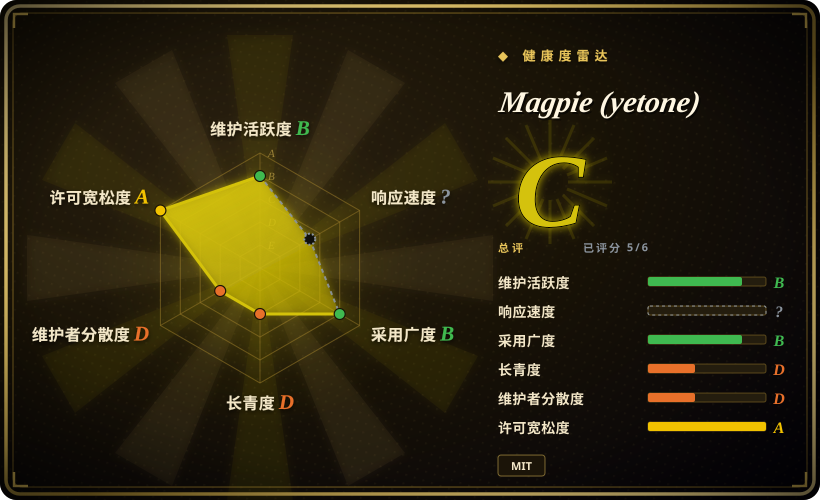
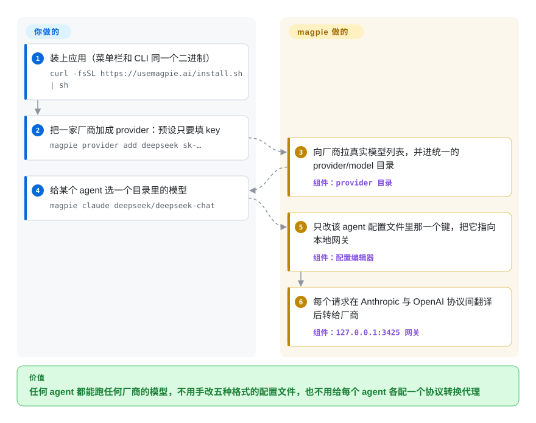

# Magpie (yetone)

每个 coding agent 都把模型写在自己的文件里、格式还各不相同——Claude Code 在 `settings.json`，Codex 在 `config.toml`，OpenCode 在 `opencode.jsonc`——想让其中一个试试 DeepSeek 或 Kimi，就得手改那个文件，往往还要再起一个会说它那套接口的代理。magpie 是一个菜单栏小应用：只改每个文件里那一个键，再在本机跑一个网关，替所有 agent 在 Anthropic 和 OpenAI 两种接口之间互相翻译。

## 何时使用

你每天在三四个 coding agent 之间来回——Claude Code、Codex、OpenCode、Pi——手上有 DeepSeek、Kimi、GLM 的 key，还有一个 ChatGPT 订阅和一个 Claude 订阅。现在想让 Codex 跑 DeepSeek，得往 `~/.codex/config.toml` 里写一张 `[model_providers.*]` 表；想让 Claude Code 跑 Kimi，得在 `~/.claude/settings.json` 的 `env` 块里配 `ANTHROPIC_BASE_URL` 和 `ANTHROPIC_AUTH_TOKEN`；而且每个 agent 都要求厂商说它那套协议。这时你会想到 magpie：一个界面（菜单栏、窗口、`magpie tui` 或纯 CLI）列出本机装了的每个 agent 和它当前的模型，点一下就能换；所有 provider——包括你已经登录的订阅——都以 `provider/model` 的形式出现在每个 agent 的选择列表里，背后只有一个本地端点。

决定性的取舍是“单机上的覆盖面”对“成熟度”。和 [CC Switch](../agent-frameworks/coding-agents/orchestration-and-review/cc-switch.zh.md) 比，当你要覆盖更多 agent（README 列了 28 个配置目标）、只改单个键并保留注释、把订阅登录当 provider 用、还要一个能跑 CLI/Docker 无界面模式的小 Go 二进制时选 magpie——代价是它只有一周左右的历史，而 CC Switch 已经被用了一年。和 [Claude Code Router](claude-code-router.zh.md) 比，问题是“很多个 agent”而不是“在 Claude Code 内部按规则路由”时选它；和 [CLIProxyAPI](cliproxyapi.zh.md) 比，你要的是桌面上的模型切换器而不是服务端账号池时选它；和 [LiteLLM](litellm.zh.md) 比，场景是你自己的笔记本而不是带预算和虚拟 key 的团队时选它。

## 怎么用起来

magpie 用一个二进制干两件不相干的活。第一件是配置编辑器：它知道每个受支持的 agent 把设置放在哪，你选了模型后只改那一个键——注释、顺序、缩进都保留，写入是原子的（一次性替换整个文件，崩溃时不会留下半个文件）。第二件是网关，也就是一个跑在 `127.0.0.1:3425` 的本地小服务，agent 不再直连厂商而是连它：它接收 OpenAI chat completions、OpenAI Responses、Anthropic Messages 和 Gemini 格式的请求，厂商说同一种协议就原样透传，不说就翻译过去，流式输出和工具调用都包括在内——像一个坐在会议室里的同声传译，让每个 agent 继续说自己的语言。你要做的是加 provider（预设只要一个 key）和选模型；magpie 做的是向厂商拉真实模型列表、把 agent 的配置改成指向网关、在你切回原生模型时把原来的值恢复。已经登录的 agent（Claude Code、Codex/ChatGPT、Copilot、Devin 等）也会变成 provider；对 Claude 订阅，magpie 是驱动本机真正的 `claude` 程序去生成，而不是自己调接口。路由组（`group/<id>`）让一次选择分摊到多个模型或账号上，按顺序兜底、轮换、最少使用，或优先用额度最快刷新的那个订阅。

<!-- flow-steps:begin (generated from flows/magpie-model-router.json by tools/flow_card.py — do not edit) -->

流程文字版

1. **你**：装上应用（菜单栏和 CLI 同一个二进制） — `curl -fsSL https://usemagpie.ai/install.sh | sh`
2. **你**：把一家厂商加成 provider：预设只要填 key — `magpie provider add deepseek sk-…`
3. **Magpie (yetone)**：向厂商拉真实模型列表，并进统一的 provider/model 目录 — 组件：`provider 目录`
4. **你**：给某个 agent 选一个目录里的模型 — `magpie claude deepseek/deepseek-chat`
5. **Magpie (yetone)**：只改该 agent 配置文件里那一个键，把它指向本地网关 — 组件：`配置编辑器`
6. **Magpie (yetone)**：每个请求在 Anthropic 与 OpenAI 协议间翻译后转给厂商 — 组件：`127.0.0.1:3425 网关`

**价值**：任何 agent 都能跑任何厂商的模型，不用手改五种格式的配置文件，也不用给每个 agent 各配一个协议转换代理

<!-- flow-steps:end -->

## 何时不用

- **你要一个团队共用的网关，带每人独立的 key、预算和审计。** 用 [LiteLLM](litellm.zh.md)（或本分类的 TokenHub）；magpie 的网关是单人用的——在回环地址上它接受任意 key，开局域网共享也只多一把共用 key。
- **你不能接受把消费级订阅拿给其他 agent 用所带来的服务条款或封号风险。** 只用厂商 API key（magpie 只配 key 也能用）或厂商自己的客户端；magpie 的 README 自己就提醒，Google 可能封禁在 Antigravity 之外使用的 Antigravity 账号，而把 Claude 订阅给 Pi 或 OpenCode 用，靠的是驱动真正的 `claude` 程序来避开 Anthropic 的第三方流量识别。[推断]
- **你要一个有过往记录的工具。** 用 [CC Switch](../agent-frameworks/coding-agents/orchestration-and-review/cc-switch.zh.md)，它是同一形态（桌面切换 provider＋本地格式转换路由＋故障转移），2025-08 就已公开；magpie 第一个提交在 2026-09-22，每天要发好几个版本。
- **你要在 Claude Code 内部按请求内容路由（后台任务、长上下文、推理请求分别走不同模型）。** 用 [Claude Code Router](claude-code-router.zh.md)；magpie 的路由组按顺序、轮换、用量和额度窗口决定，不看请求是什么。
- **你要把一个账号池作为远程 API 提供给很多台机器或工具。** 用 [CLIProxyAPI](cliproxyapi.zh.md)；magpie 虽有 Docker／`magpie serve` 模式，但订阅登录在容器里走不完，整体设计围绕一个人的桌面。
- **你需要某一家厂商的完整协议语义。** 直接调那家厂商；任何翻译层都会丢字段——例如 Claude Code auto mode 的服务端 `safeguards` 只在 Anthropic 官方 API 上生效，Codex 走路由组的会话曾经一开局就占约 216K 输入 token，直到 v0.1.447 才修（issue #250、#258）。
- **你的机器不许自动更新或往外报数据。** 从源码构建，或者别用；发布版会在后台自动更新，并每天向 PostHog 发一次使用计数，除非设置 `DO_NOT_TRACK=1` 或 `MAGPIE_NO_STATS=1`。

## 横向对比

| 替代品 | 是否收录 | 我们的评价 | 取舍 |
|---|---|---|---|
| [CC Switch](../agent-frameworks/coding-agents/orchestration-and-review/cc-switch.zh.md) | ✅ | 想要一个经过验证、能切换 coding agent provider 并带本地路由和故障转移的桌面管理器，选 CC Switch；需要覆盖更多 agent、把订阅登录当 provider、精确改单个配置键或要 CLI/无界面模式时，选 magpie。 | CC Switch 有一年的发版记录和约 13.9 万星，基于 Rust/Tauri；magpie 是体积小得多的 Go 二进制、agent 覆盖更广，但只有几天历史且只有一位维护者。 |
| [Claude Code Router](claude-code-router.zh.md) | ✅ | 主要待在 Claude Code 里、想按请求类型（后台、长上下文、推理）分流，选 Claude Code Router；痛点是让很多不同的 agent 各自用上对的模型，选 magpie。 | Router 对单个客户端给出更细的逐请求规则；magpie 给约 28 个 agent 一个统一目录和选择器，但路由组只有顺序／轮换／用量／额度几种策略。 |
| [CLIProxyAPI](cliproxyapi.zh.md) | ✅ | 想把消费级 CLI/OAuth 账号作为服务端 API 提供给很多调用方，选 CLIProxyAPI；想在一台机器上带界面地把这些账号用进自己的 agent，选 magpie。 | CLIProxyAPI 是无界面的多协议账号池，贡献者基础更大；magpie 多了按 agent 写配置和菜单栏界面，两者都背着同样的订阅复用封号风险。 |
| [LiteLLM](litellm.zh.md) | ✅ | 团队需要一个带虚拟 key、预算和花费追踪的 OpenAI 兼容端点，选 LiteLLM；只是一个开发者的工作站、目标是切换 agent 而不是管控花费，选 magpie。 | LiteLLM 要运维 PostgreSQL/Redis，且有 `enterprise/` 商业边界；magpie 不需要数据库，但没有租户、发 key 和预算的概念。 |

## 技术栈

- **语言：** Go（`go.mod` 里是 `go 1.26.3`）；界面是纯 HTML/CSS/JavaScript，通过 Wails v3（`v3.0.0-beta.24`）显示在系统自带的 webview 里，另有一个 Bubble Tea 终端界面。
- **存储：** `~/.config/magpie` 下的 JSON 文件（含 key 的 `providers.json` 权限为 `0600`、`profiles.json`、记录被替换值的 `stash.json`），模型缓存放在 `~/.cache/magpie`；依赖里还有纯 Go 的 `modernc.org/sqlite`。
- **配置编辑：** 用 `go-toml/v2`、`tidwall/gjson`＋`jsonc`、`yaml.v3` 改各 agent 的 TOML、JSON(C) 和 YAML 文件。
- **网关接口：** `127.0.0.1:3425` 上的 `/v1/chat/completions`、`/v1/responses`、`/v1/messages`、`/v1/messages/count_tokens`、Gemini `generateContent` 和 `/v1/models`（`MAGPIE_ADDR` 可改地址）。
- **构建目标：** 桌面版（需要 cgo 和平台 webview）小于 15 MB，纯终端版约 7 MB、无 cgo；另有跑 `magpie serve`／`magpie web` 的 distroless Docker 镜像。

## 依赖

- **桌面系统：** macOS、Windows（用系统自带的 WebView2）或 Linux（桌面版需要 WebKitGTK 4.1，否则用 CLI 版）。
- **至少一个模型来源：** 厂商 API key、本地服务（Ollama、LM Studio），或 magpie 能复用其登录态的已登录 agent CLI。
- **用 Claude 订阅时：** 同一台机器上装好并登录 Claude Code——magpie 会调用真正的 `claude` 程序来完成这些生成。
- **用 Gemini CLI／Code Assist 登录时：** 按 README，需要 Gemini Code Assist Standard 或 Enterprise 席位，并指定一个 Google Cloud 项目。
- **网络：** 出站访问各厂商以及拉目录用的 models.dev；Mac 版已签名并公证，Windows 和 Linux 版暂未签名。

## 运维难度

**单机上低，做共享网关时中等。** 本机使用就是一条安装脚本加粘贴 key，网关随应用启动，不需要数据库。代价在于变动频繁：应用会自动更新，项目一天发好几个版本，行为会在你脚下变化；而且 agent 只在下次启动时才读到新模型（Codex 启动时读取模型列表）。由于回环网关接受任意 key，这台机器上的任何本地进程都能花你 provider 的额度。[推断] 放进 Docker 或开局域网时，要有意识地发布端口（README 提醒 `-p 3425:3425` 会绕过宿主防火墙对外暴露）、设置局域网 key，并且得在有浏览器的机器上登录订阅，因为 OAuth 回调到不了容器里。

## 健康度与可持续性

- **维护情况（截至 2026-09-30）：** 极度活跃——自 2026-09-22 第一个提交以来约 770 个提交，tag 到了 `v0.1.457`，一周内在单独的 `yetone/magpie-releases` 仓库发了 100 多个二进制版本。这是发布周的速度，还谈不上稳定的节奏。
- **治理与巴士因子：** 个人账号（`yetone`，owner 类型为 User）在前 15 名贡献者约 750 个提交里写了约 699 个（约 93%）。贡献者在进来（66 个已合并 PR），但路线图和评审都在一个人手里。
- **响应速度：** 第一周 189 个 issue，2026-09-30 时仍开着 21 个；维护者大多几小时内回复，修复在下一个版本里发出，拒绝的改动会写明理由（例如拒绝改写 Claude Code 系统提示去骗过 WorkBuddy 的渠道检查，#232／#255）。
- **年龄与 Lindy：** 约一周大——Lindy 先验在这里几乎不提供保护；把它当成有前景但未经验证的押注。作者在 2026 年还有几个数千星的仓库，这是声誉信号，不是维护保证。
- **采用度：** 八天约 3.0k 星、181 个 fork，但只有 4 个 watcher；发布附件每个版本几百次下载。一周大的仓库星数高，是要打折看的热度信号。
- **风险信号：** MIT 许可，没有看到 CLA 或开源核心拆分。真正的风险在政策而不在许可：把消费级订阅拿给其他 agent 用，正是厂商在管的事，magpie 自己的文档已经在绕开一家厂商的识别器。发布版每天向 PostHog 发一次安装计数（可关闭）。

## 存疑（未验证）

- [未验证] Anthropic、OpenAI、GitHub、Google、Cognition 或 xAI 的服务条款是否允许通过 magpie 把消费级订阅给第三方 agent 用；没有核对任何厂商声明，也不知道封号率。
- [推断] 用真正的 `claude` 程序承载 Claude 订阅流量能降低但不能消除被识别／封号的风险——README 只说明了机制，不是厂商保证。
- [推断] 回环网关接受任意 key，所以同一台机器上的任何进程都能花已配置 provider 的额度；未实测。
- [未验证] “小于 15 MB／约 7 MB”的体积和 28 个受支持 agent 的清单来自 README，本页没有实测或逐个试用。
- [未验证] 翻译保真度（工具调用、推理、流式）是否在每一对厂商组合上都成立；本页依据的是 issue #250 和 #258，没有实际运行网关。
- [未验证] 每个版本几百次的下载数只看了最近三个版本；总安装量和 PostHog 统计的用户数不公开。
- [推断] 发布周的提交和发版速度会放缓；项目能否转入持续维护目前无法判断。
