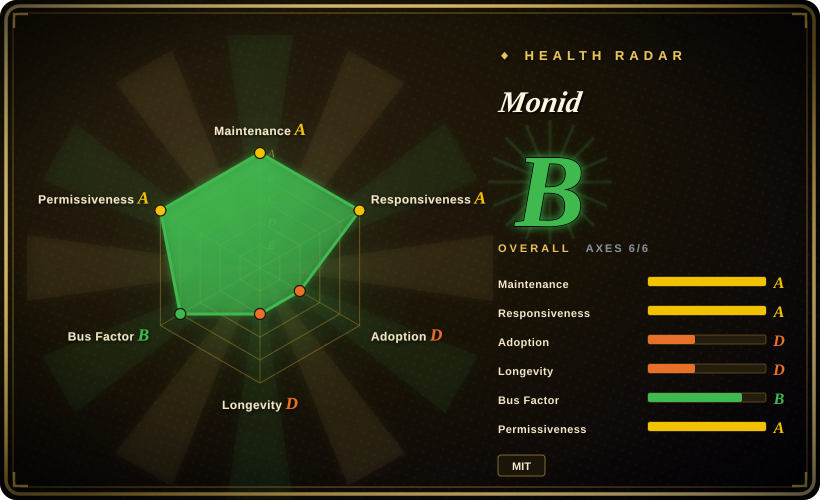
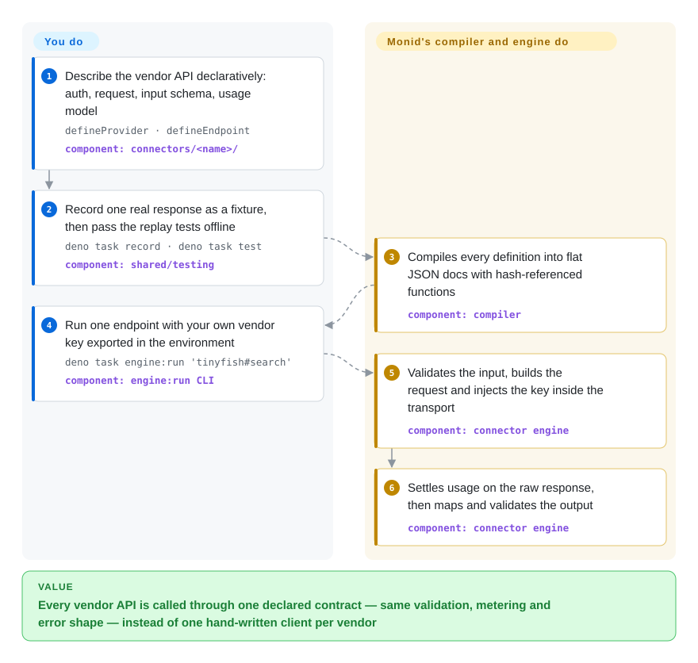

# Monid

Your agent needs company data from one vendor, search results from a second and a video model from a third — three SDKs, three key formats, and three different ways of saying "no match" or "that cost $0.04". Monid's open repo is the shared contract those vendors are written in: each API becomes one declarative file that a single engine validates, calls, meters and maps the same way.

## When to use

You are building an agent product, or an internal agent platform, that leans on paid data and media APIs — web search, scraping actors, people and company enrichment, SEO metrics, image and video generation. Each vendor arrived with its own client: one throws on an unmatched company while another returns `200 {"error":"not found"}`, one puts the price in `costDollars.total` and another only on its invoice, and your agent's tool schemas drift from what the APIs actually accept. You reach for Monid when you want every one of those calls to go through one written-down contract: a provider file declares auth and how usage is counted, an endpoint file declares the request and a zod input schema, and one generic engine runs the same pipeline for all of them — validate input, build the request, inject the key, settle usage on the raw response, map and validate the output. A vendor error completes as data at zero usage instead of an exception. The repo already describes 699 endpoints across 31 providers (Exa, Firecrawl, Apify actors, Ahrefs, DataForSEO, Apollo, Kling, Alibaba Wan and others, as of 2026-10-09), so you start from a catalog rather than an empty adapter folder.

Two kinds of reader pick it. An **API vendor** who wants to be in Monid's hosted catalog writes a connector here — the merged pull request *is* the integration, and the endpoint then shows up in the hosted `discover` for every agent on the platform. A **builder** who wants the connector standard and engine itself runs those endpoints locally with their own vendor keys. The deciding tradeoff against [LiteLLM](litellm.md) is the object being unified: LiteLLM puts one key and one schema in front of *language models*; Monid does the same for *tool and data APIs*, with per-call metering as a first-class part of every definition. Against Composio and Nango, Monid is about API-key data and media vendors with metered prices, not end-user OAuth actions in SaaS apps such as Gmail or GitHub.

## How it works

You write a connector as data plus a few tiny functions: `defineProvider` (identity, auth, usage model) and `defineEndpoint` (request path, input schema, timeouts). The compiler turns every definition into a flat JSON document; any function in it is replaced by a fingerprint of its source — a content hash, so the same code is stored once and tampering is detectable — and an endpoint runs from a "sealed unit": its document plus exactly the functions it references, passed by value into the engine, nothing else in scope. Think of a recipe card the kitchen follows the same way for every dish: the card says what goes in, what comes out and how the bill is computed; the kitchen never improvises a per-vendor code path. **The engine and the catalog of connector files are what you get here; the routing brain is not.** The hosted `discover` ranking (price, live health, p50/p95 latency across all vendors), the single Monid key, the pricing broker and the credential relay run in Monid's private `monid-services` — locally you run each endpoint with that vendor's own key.

<!-- flow-steps:begin (generated from flows/monid.json by tools/flow_card.py — do not edit) -->

Text version of the flow

1. **You**: Describe the vendor API declaratively: auth, request, input schema, usage model — `defineProvider · defineEndpoint` — component: `connectors/<name>/`
2. **You**: Record one real response as a fixture, then pass the replay tests offline — `deno task record · deno task test` — component: `shared/testing`
3. **Monid**: Compiles every definition into flat JSON docs with hash-referenced functions — component: `compiler`
4. **You**: Run one endpoint with your own vendor key exported in the environment — `deno task engine:run 'tinyfish#search'` — component: `engine:run CLI`
5. **Monid**: Validates the input, builds the request and injects the key inside the transport — component: `connector engine`
6. **Monid**: Settles usage on the raw response, then maps and validates the output — component: `connector engine`

**Value**: Every vendor API is called through one declared contract — same validation, metering and error shape — instead of one hand-written client per vendor

<!-- flow-steps:end -->

## When NOT to use

- **You want the "OpenRouter for tools" experience self-hosted.** What the README sells — one key, `discover` ranking every vendor by price and live latency — is the hosted platform; this repo's `relayTransport` is an interface stub whose implementation lives in the closed `monid-services`, and there is no `discover` command in the repo. Locally you get `deno task engine:run` per endpoint with each vendor's own key. If one self-hosted key in front of many integrations is the requirement, evaluate Nango (self-hostable, but Elastic License 2.0) instead.
- **Your agent acts inside users' SaaS accounts.** Sending Gmail, opening GitHub issues or editing Notion pages needs end-user OAuth and token refresh; Monid's connectors are API-key data and media vendors. Use Composio or Nango for OAuth-authorized actions.
- **You want to `import` the engine into an existing Node or Python service.** `@monid/connector-engine` (0.5.0 in `engine/deno.json`) is not published on JSR or npm as of 2026-10-09, the workspace is Deno 2.x, and a full host (async polling, resource persistence, webhook ingress, the hosted credential relay) is yours to build. For a few tools inside your own agent, write them with Arcade's MCP framework or call vendor SDKs directly.
- **You need a stable contract.** The repo is about six weeks old, catalog releases are `0.0.x`, and the hook ABI and document format are still allowed to change with a minor engine bump. Merges stopped after 2026-09-28 while about 45 pull requests — mostly vendor connector submissions — wait, so do not plan on your own PR landing quickly either.
- **You call one or two vendors.** A contract, compiler and replay harness are overhead for that; the vendor's own SDK is simpler and better documented.
- **You expect the whole advertised catalog to be open.** The hosted site advertises 2,000+ tools across 72+ providers; this repo holds 31 providers, and `AGENT.md` says the legacy adaptors still live in the private `monid-services` and are being migrated change by change.
- **You do not want an agent spending money on its own initiative.** The README tells agents to fetch `monid.ai/SKILL.md`; that skill instructs the agent to run `monid discover` *proactively* before writing a scraper and lists premium paid endpoints. Cloning this repo does not install it, but if you follow the README's agent note, gate the API key and spending on Monid's side yourself.

## Comparison

| Alternative | In index | Our verdict | Tradeoff |
|---|---|---|---|
| Composio | not indexed | When your agent must act inside end users' SaaS accounts with managed OAuth, choose Composio; choose Monid when the calls are metered data and media APIs and you want each vendor described in a reviewable open contract. | Composio (ComposioHQ/composio, ~30k stars, MIT SDK, active 2026-10) brings a far larger toolkit ecosystem and handles user auth, but its tool runtime is its hosted platform; Monid's open part is the connector definitions and engine, with routing hosted. Real repo, not added in this tab batch. |
| Nango | not indexed | When you must self-host the integration layer and own the credentials, choose Nango; choose Monid when per-call usage metering and a shared vendor catalog matter more than self-hosting. | Nango (NangoHQ/nango, ~12.6k stars) runs on your own infrastructure and covers OAuth plus API-key APIs, but it is Elastic License 2.0 — no offering it as a managed service; Monid is MIT but its hosted half is closed. Real repo, not added in this tab batch. |
| Arcade MCP | not indexed | When you are writing a handful of custom tools for your own agent, choose Arcade's MCP framework; choose Monid when you want hundreds of existing third-party vendor endpoints under one contract rather than writing them yourself. | Arcade MCP (ArcadeAI/arcade-mcp, ~1k stars, MIT) is a library for building and serving your own MCP tools; Monid is a catalog-plus-engine whose value is the pre-described vendors and metering. Real repo, not added in this tab batch. |
| [LiteLLM](litellm.md) | ✅ | When the thing you call through one key is a language model, choose LiteLLM; when it is a tool or data API (search, enrichment, scraping, media generation), choose Monid. | LiteLLM is a mature, self-hostable gateway with budgets and virtual keys for LLM traffic; Monid applies the same "one contract in front of many vendors" idea to tool APIs, but is weeks old and keeps its gateway half hosted. |
| Apify Store | not a repo | When the job is specifically a scraping actor and you are fine paying Apify directly, call the Apify platform; choose Monid when actors are one of several vendor types your agent needs behind one contract. | Hosted actor marketplace and runtime, not a repository; Monid wraps a set of Apify actors as endpoints (and scaffolds new ones from their input schemas), so it adds a contract layer, not scraping capacity. |

## Tech stack

- **Runtime:** TypeScript on Deno 2.x as one workspace (`shared/app-config`, `shared/logging`, `shared/core`, `shared/compiler`, `shared/testing`, `engine`); CLI entrypoints under `scripts/` built with Cliffy.
- **Contract:** zod 4.3.6 schemas compiled to JSON Schema and enforced by Ajv at run time; hook functions are closed terms (no imports, no captured variables), normalized through the TypeScript compiler and interned by RFC 8785 canonical SHA-256 hashes.
- **Engine:** load → link → execute with load gates that fail closed (`BAD_DOC`, `UNKNOWN_FN`, `LINK_INTEGRITY`, …); a `directTransport` for local runs and a `relayTransport` interface for hosted credential injection; a Temporal-activity-shaped `start/poll/stop` async run protocol.
- **Local host loop:** Deno KV (`--unstable-kv`) at `.output/local.db` for owned resources; a webhook simulator/listener with optional cloudflared or Tailscale tunnels; pino logging.
- **Process:** OpenSpec change records under `openspec/changes/` as the design log; GitHub Actions for CI, an Apify input-schema drift check, and tag-triggered catalog publishing; CodeRabbit reviews on PRs.

## Dependencies

- **Deno 2.x** and the `git` binary (most tasks run with `--allow-run=git`). No database or server is needed for local use.
- **One API key per vendor you call**, read from `<PROVIDER>_CREDENTIALS_<FIELD>` (bare `<PROVIDER>_API_KEY` works for a single `apiKey` field); live runs reach the vendor's API directly. `apify:scaffold` additionally needs `APIFY_CREDENTIALS_API_KEY`.
- **Optional:** `cloudflared` or `tailscale` for `deno task webhook listen`.
- **For the hosted features** (`discover`, a single key, billing): a Monid account at app.monid.ai and the `@monid-ai/cli` npm package — a commercial service outside this repo.

## Ops difficulty

**Low for local use, high to self-host the platform half.** Running and testing connectors is clone, `deno task check && deno task test` (replayed fixtures, no network), and `engine:run` with a vendor key. Embedding the engine in your own service is a different job: the engine is a library with ports, and you must supply the host — scheduling the async poll loop, persisting resource provisions and releases, verifying and routing webhooks, injecting credentials, and pricing usage (the repo reports usage; the broker that prices it is hosted). Upgrades track a pre-1.0 contract whose ABI and document format can still move.

## Health & viability

- **Maintenance (as of 2026-10-09):** repo created 2026-08-26 (an OpenSpec init commit dates to 2026-08-05); four catalog tags `catalog-v0.0.1`–`v0.0.4` between 2026-09-14 and 2026-09-30; last default-branch commit 2026-09-28. Very active through September, then an 11-day pause in merges while external PRs keep arriving.
- **Governance / bus factor:** owned by the Monid Inc organization (copyright holder in `LICENSE`); 8 contributors, of whom three (`ooctoo777`, `FeiyouG`, `Jasper0122`) wrote nearly all of it. The roadmap and the hosted half are the company's; no CONTRIBUTING, governance or CLA file is in the tree.
- **Backing & age/Lindy:** about six weeks old — no Lindy protection at all. Its survival is tied to a venture-stage startup's hosted product; if the platform folds, the repo remains a useful MIT connector standard but loses the reason vendors contribute to it. [推断]
- **Adoption:** ~3.2k stars and 399 forks in six weeks, with a steady stream of vendor PRs (venice, brightdata, linkup, anymailfinder…) — real vendor interest, though the stargazer list is not readable through the GitHub API, so star velocity cannot be audited. The companion `@monid-ai/cli` had 6,991 npm downloads from 2026-09-08 to 2026-10-07.
- **Risk flags:** open-core split — `discover`, pricing, the credential relay and most of the advertised catalog are closed; the engine package is not published to a registry; the agent-facing `SKILL.md` steers agents toward paid endpoints. MIT throughout with no relicense history.

## Caveats (unverified)

- [未验证] The hosted claims — 2,000+ tools across 72+ providers, `discover`/`inspect` being free, live health and p50/p95 latency in rankings — come from the README and monid.ai; the platform was not exercised.
- [未验证] "188 replay tests, zero network" is the README's number; the suite was not run here (the tree has 242 `*.test.ts` files, which is a different count than tests).
- [未验证] Stargazer authenticity: the REST stargazers endpoint returned 404 and GraphQL returned no edges on 2026-10-09, so the star timeline could not be inspected; 3.2k stars on a six-week-old company repo is treated as a flag, not proof.
- [推断] The merge pause is inferred from the commit log (last commit 2026-09-28) and ~45 open PRs, most opened 2026-09-22 to 2026-10-09; maintainers may be batching reviews rather than stalled.
- [推断] Startup dependency and what happens if the hosted platform ends is judgment; no funding or governance document was found.
- [未验证] Endpoint and provider counts (699 `endpoint.ts` files under `connectors/*/endpoints/`, 31 `provider.ts` files) were counted from the default-branch tree on 2026-10-09; they change with every connector PR.
- [推断] The health radar's responsiveness grade (median time-to-first-response 0.0 h over 14 PRs) is driven by the CodeRabbit bot reviewing every PR instantly; it does not show human maintainer responsiveness, which the merge pause since 2026-09-28 argues is slower.
- [推断] That the open catalog is a subset of the hosted one rests on `AGENT.md` ("legacy imperative provider adaptors live in the sibling repo `monid-services` … being migrated") and the 31-vs-72+ provider gap.
