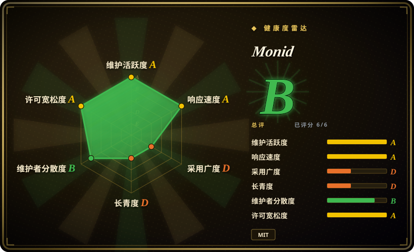
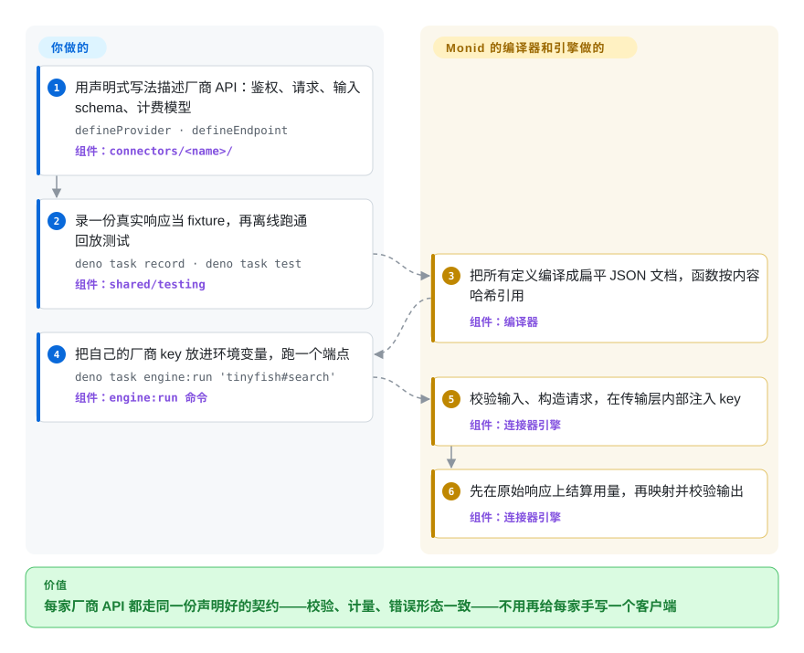

# Monid

你的 agent 要从一家厂商查公司数据、从另一家拿搜索结果、再调第三家的视频模型——三套 SDK、三种 key 格式，“查无此人”和“这次花了 4 美分”也各有各的说法。Monid 的开源仓库就是这些厂商共用的那份契约：每个 API 写成一个声明式文件，由同一个引擎按同一套流程校验、调用、计量和映射。

## 何时使用

你在做一个 agent 产品或公司内部的 agent 平台，重度依赖付费的数据和媒体 API：网页搜索、爬虫 actor、人和公司的信息补全、SEO 指标、图片和视频生成。每家厂商都带着自己的客户端进来：一家查不到公司就抛异常，另一家返回 `200 {"error":"not found"}`；一家把价格放在 `costDollars.total` 里，另一家只在月底账单上体现；agent 里写的工具 schema 也慢慢和 API 实际接受的参数对不上。当你希望所有这些调用都走一份写清楚的契约时，就会想到 Monid：provider 文件声明鉴权和用量怎么算，endpoint 文件声明请求和 zod 输入 schema，一个通用引擎对所有厂商跑同一条流水线——校验输入、构造请求、注入 key、在原始响应上结算用量、映射并校验输出。厂商报错会作为数据正常结束、用量记零，而不是抛异常。截至 2026-10-09，仓库里已经描述了 31 家 provider 的 699 个端点（Exa、Firecrawl、Apify actor、Ahrefs、DataForSEO、Apollo、Kling、阿里 Wan 等），你是从一个现成目录起步，不是从空的适配器文件夹起步。

选它的有两类人。**API 厂商**想进 Monid 托管目录，就在这里写一个连接器——PR 合并就等于接入完成，端点随即出现在平台上所有 agent 都能用的托管 `discover` 里。**开发者**想要这套连接器标准和引擎本身，就用自己的厂商 key 在本地跑这些端点。和 [LiteLLM](litellm.zh.md) 的分界在于统一的对象：LiteLLM 用一把 key、一套 schema 统一的是**大语言模型**；Monid 统一的是**工具和数据 API**，而且每个定义里都把按次计量当成一等公民。和 Composio、Nango 比，Monid 面向的是按 API key 计费的数据和媒体厂商，不是在 Gmail、GitHub 这类 SaaS 里代表终端用户做 OAuth 授权操作。

## 怎么用起来

你把连接器写成“数据加几个小函数”：`defineProvider`（身份、鉴权、计费模型）和 `defineEndpoint`（请求路径、输入 schema、超时）。编译器把每个定义变成一份扁平的 JSON 文档，里面的函数全换成它源码的指纹——也就是内容哈希，同样的代码只存一份，被篡改也能发现；一个端点运行时用的是“密封单元”：它的文档加上它实际引用的那几个函数，按值传进引擎，除此之外什么都不在作用域里。可以把它想成厨房按菜谱卡做菜：卡上写清楚放什么、出什么、账怎么算，厨房对每道菜都照卡执行，从不为某家厂商临时开小灶。**这里给你的是引擎和连接器目录，路由大脑不在这里。**托管的 `discover` 排序（跨所有厂商比价格、实时健康度、p50/p95 延迟）、单一 Monid key、定价代理和凭据中继都跑在 Monid 私有的 `monid-services` 里——本地只能用各厂商自己的 key 逐个端点地跑。

<!-- flow-steps:begin (generated from flows/monid.json by tools/flow_card.py — do not edit) -->

流程文字版

1. **你**：用声明式写法描述厂商 API：鉴权、请求、输入 schema、计费模型 — `defineProvider · defineEndpoint` — 组件：`connectors/<name>/`
2. **你**：录一份真实响应当 fixture，再离线跑通回放测试 — `deno task record · deno task test` — 组件：`shared/testing`
3. **Monid**：把所有定义编译成扁平 JSON 文档，函数按内容哈希引用 — 组件：`编译器`
4. **你**：把自己的厂商 key 放进环境变量，跑一个端点 — `deno task engine:run 'tinyfish#search'` — 组件：`engine:run 命令`
5. **Monid**：校验输入、构造请求，在传输层内部注入 key — 组件：`连接器引擎`
6. **Monid**：先在原始响应上结算用量，再映射并校验输出 — 组件：`连接器引擎`

**价值**：每家厂商 API 都走同一份声明好的契约——校验、计量、错误形态一致——不用再给每家手写一个客户端

<!-- flow-steps:end -->

## 何时不用

- **你想自托管一个“工具版 OpenRouter”。**README 卖的那套体验——一把 key、`discover` 按价格和实时延迟给所有厂商排序——是托管平台的功能；仓库里的 `relayTransport` 只是一个接口桩，实现在闭源的 `monid-services` 里，仓库中也没有 `discover` 命令。本地你拿到的是每个端点一条 `deno task engine:run`，用各家自己的 key。如果硬需求是“自己部署、一把 key 管很多集成”，改评估 Nango（可自托管，但许可是 Elastic License 2.0）。
- **你的 agent 要在用户的 SaaS 账号里干活。**发 Gmail、开 GitHub issue、改 Notion 页面需要终端用户 OAuth 和 token 刷新；Monid 的连接器是按 API key 计费的数据和媒体厂商。这类 OAuth 授权操作用 Composio 或 Nango。
- **你想把引擎 `import` 进现有的 Node 或 Python 服务。**`@monid/connector-engine`（`engine/deno.json` 里是 0.5.0）截至 2026-10-09 没有发布到 JSR 或 npm，工作区是 Deno 2.x，一个完整的宿主（异步轮询、资源持久化、webhook 入口、托管的凭据中继）都得你自己写。只是给自己的 agent 加几个工具，用 Arcade 的 MCP 框架自己写，或直接调厂商 SDK。
- **你需要一份稳定的契约。**仓库大约六周大，目录发布还在 `0.0.x`，hook ABI 和文档格式仍允许随引擎小版本变化。2026-09-28 之后就没有再合并，约 45 个 PR（多数是厂商提交的连接器）在排队，所以也别指望你自己的 PR 很快进去。
- **你只调一两家厂商。**为此上一套契约、编译器和回放测试框架是负担；直接用厂商自己的 SDK 更简单，文档也更全。
- **你以为宣传的整个目录都是开源的。**官网宣称 72 家以上 provider、2000 多个工具；这个仓库里只有 31 家，`AGENT.md` 也写明旧的适配器还在私有的 `monid-services` 里，正在一个变更一个变更地迁过来。
- **你不想让 agent 自作主张花钱。**README 让 agent 去拉 `monid.ai/SKILL.md`；那份 skill 要求 agent 在写爬虫之前**主动**跑 `monid discover`，还列出了付费的高级端点。克隆这个仓库不会装上它，但如果你照 README 里给 agent 的那句话做了，就要自己在 Monid 那边把 API key 和花费额度管住。

## 横向对比

| 替代品 | 是否收录 | 我们的评价 | 取舍 |
|---|---|---|---|
| Composio | 未收录 | 当 agent 必须在终端用户的 SaaS 账号里操作、需要托管 OAuth 时，选 Composio；当调用对象是按次计费的数据和媒体 API、你希望每家厂商都写成一份可审阅的开源契约时，选 Monid。 | Composio（ComposioHQ/composio，约 3 万星，SDK 为 MIT，2026-10 仍活跃）工具生态大得多，还替你处理用户鉴权，但工具运行时在它的托管平台上；Monid 开源的是连接器定义和引擎，路由同样托管。真实仓库，本批未收录。 |
| Nango | 未收录 | 当集成层必须自己部署、凭据必须握在自己手里时，选 Nango；当按次计量和共享的厂商目录比自托管更重要时，选 Monid。 | Nango（NangoHQ/nango，约 1.26 万星）跑在你自己的基础设施上，OAuth 和 API key 两类接口都覆盖，但许可是 Elastic License 2.0——不能拿它做托管服务对外提供；Monid 是 MIT，可托管那一半是闭源的。真实仓库，本批未收录。 |
| Arcade MCP | 未收录 | 只是给自己的 agent 写几个自定义工具时，选 Arcade 的 MCP 框架；想直接拿到几百个已经描述好的第三方厂商端点、统一在一份契约下时，选 Monid。 | Arcade MCP（ArcadeAI/arcade-mcp，约 1 千星，MIT）是自己写、自己托管 MCP 工具的库；Monid 的价值在于现成的厂商描述和计量，是目录加引擎。真实仓库，本批未收录。 |
| [LiteLLM](litellm.zh.md) | 已收录 | 一把 key 后面要调的是语言模型时，选 LiteLLM；要调的是工具或数据 API（搜索、信息补全、爬虫、媒体生成）时，选 Monid。 | LiteLLM 是成熟、可自托管的 LLM 流量网关，带预算和虚拟 key；Monid 把“一份契约挡在很多厂商前面”的思路用到工具 API 上，但只有几周大，网关那一半还在托管侧。 |
| Apify Store | 非仓库 | 任务就是某个爬虫 actor、而且你愿意直接付钱给 Apify 时，直接用 Apify 平台；actor 只是 agent 所需的多类厂商之一、你想把它们统一到一份契约下时，选 Monid。 | 托管的 actor 市场和运行时，不是仓库；Monid 把一批 Apify actor 包成端点（还能按 actor 的输入 schema 生成新端点的骨架），它加的是契约层，不是爬取能力。 |

## 技术栈

- **运行时：**TypeScript，跑在 Deno 2.x 上，一个工作区包含 `shared/app-config`、`shared/logging`、`shared/core`、`shared/compiler`、`shared/testing`、`engine`；`scripts/` 下的命令行入口基于 Cliffy。
- **契约：**zod 4.3.6 schema 编译成 JSON Schema，运行时由 Ajv 强制校验；hook 函数必须是闭合项（不 import、不捕获外部变量），经 TypeScript 编译器规范化后按 RFC 8785 规范化的 SHA-256 哈希去重存放。
- **引擎：**加载 → 链接 → 执行，加载关卡按序失败即拒（`BAD_DOC`、`UNKNOWN_FN`、`LINK_INTEGRITY` 等）；本地用 `directTransport`，托管凭据注入走 `relayTransport` 接口；异步运行协议 `start/poll/stop` 按 Temporal activity 的形状设计。
- **本地宿主循环：**用 Deno KV（`--unstable-kv`）在 `.output/local.db` 存自有资源；webhook 模拟器和监听器，可选 cloudflared 或 Tailscale 隧道；日志用 pino。
- **流程：**`openspec/changes/` 下的 OpenSpec 变更记录充当设计日志；GitHub Actions 负责 CI、Apify 输入 schema 漂移检查和打 tag 触发的目录发布；PR 上有 CodeRabbit 审查。

## 依赖

- **Deno 2.x** 和 `git` 可执行文件（大多数任务带 `--allow-run=git`）。本地使用不需要数据库或服务端。
- **每家要调的厂商各一把 API key**，从 `<PROVIDER>_CREDENTIALS_<FIELD>` 读取（只有一个 `apiKey` 字段时也认 `<PROVIDER>_API_KEY`）；实时运行直接打到厂商 API。`apify:scaffold` 另外需要 `APIFY_CREDENTIALS_API_KEY`。
- **可选：**跑 `deno task webhook listen` 时要 `cloudflared` 或 `tailscale`。
- **要用托管功能**（`discover`、单一 key、计费）：需要 app.monid.ai 的 Monid 账号和 npm 包 `@monid-ai/cli`——那是仓库之外的商业服务。

## 运维难度

**本地使用低，自托管平台那一半高。**跑和测连接器就是克隆、`deno task check && deno task test`（回放 fixture，不联网），再用厂商 key 跑 `engine:run`。把引擎嵌进自己的服务是另一回事：引擎是带端口的库，宿主得你来提供——调度异步轮询、持久化资源的开通和释放、校验并路由 webhook、注入凭据、给用量定价（仓库只上报用量，定价的代理在托管侧）。升级要跟着一份 1.0 之前的契约走，ABI 和文档格式都还可能变。

## 健康度与可持续性

- **维护（截至 2026-10-09）：**仓库建于 2026-08-26（一个 OpenSpec 初始化提交早到 2026-08-05）；2026-09-14 到 2026-09-30 之间打了 `catalog-v0.0.1` 到 `v0.0.4` 四个目录 tag；默认分支最后一次提交在 2026-09-28。九月非常活跃，之后合并停了 11 天，外部 PR 还在不断进来。
- **治理与巴士因子：**归 Monid Inc 组织所有（`LICENSE` 里的版权方）；8 位贡献者，其中 `ooctoo777`、`FeiyouG`、`Jasper0122` 三人写了几乎全部代码。路线图和托管那一半都是公司说了算；仓库里没有 CONTRIBUTING、治理或 CLA 文件。
- **背书与年龄（Lindy）：**大约六周大，完全没有 Lindy 保护。它能不能活下去绑在一家早期创业公司的托管产品上；平台一旦关掉，仓库仍是一份可用的 MIT 连接器标准，但厂商往这里提交的理由就没了。[推断]
- **采用度：**六周约 3.2 千星、399 个 fork，厂商 PR 持续进来（venice、brightdata、linkup、anymailfinder 等）——厂商兴趣是真的，但 GitHub API 读不到星标用户列表，星标增速无法审计。配套的 `@monid-ai/cli` 在 2026-09-08 到 2026-10-07 之间 npm 下载 6991 次。
- **风险信号：**开放核心式拆分——`discover`、定价、凭据中继和宣传目录的大部分都闭源；引擎包没发布到任何仓库；面向 agent 的 `SKILL.md` 会把 agent 引向付费端点。全程 MIT，没有改许可的历史。

## 存疑（未验证）

- [未验证] 托管侧的说法——72 家以上 provider 的 2000 多个工具、`discover`/`inspect` 免费、排序里带实时健康度和 p50/p95 延迟——来自 README 和 monid.ai，没有实际使用过平台。
- [未验证] “188 个回放测试、零网络”是 README 给的数字，这里没有跑测试（目录树里有 242 个 `*.test.ts` 文件，文件数和测试数不是一回事）。
- [未验证] 星标真实性：2026-10-09 REST 的 stargazers 接口返回 404、GraphQL 返回空列表，所以没法看星标时间线；一个六周大的公司仓库有 3.2 千星，按风险信号对待，不当作证据。
- [推断] “合并停滞”是从提交记录（最后提交 2026-09-28）和约 45 个未合并 PR（多数开于 2026-09-22 到 2026-10-09）推出来的；维护者也可能只是攒着批量审。
- [推断] 对创业公司依赖、以及托管平台终止后会怎样的判断属于推断；没有找到融资或治理文件。
- [未验证] 端点和 provider 数（`connectors/*/endpoints/` 下 699 个 `endpoint.ts`、31 个 `provider.ts`）是 2026-10-09 按默认分支目录树数的，每个连接器 PR 都会改变它。
- [推断] 健康度雷达里的响应度评级（14 个 PR 的首次响应中位时间 0.0 小时）来自 CodeRabbit 机器人对每个 PR 的即时审查，并不代表维护者本人的响应速度；2026-09-28 以来的合并停滞说明人工响应更慢。
- [推断] “开源目录是托管目录的子集”依据的是 `AGENT.md`（旧的命令式适配器在同级仓库 `monid-services` 里，正在迁移）以及 31 对 72+ 的 provider 数差距。
