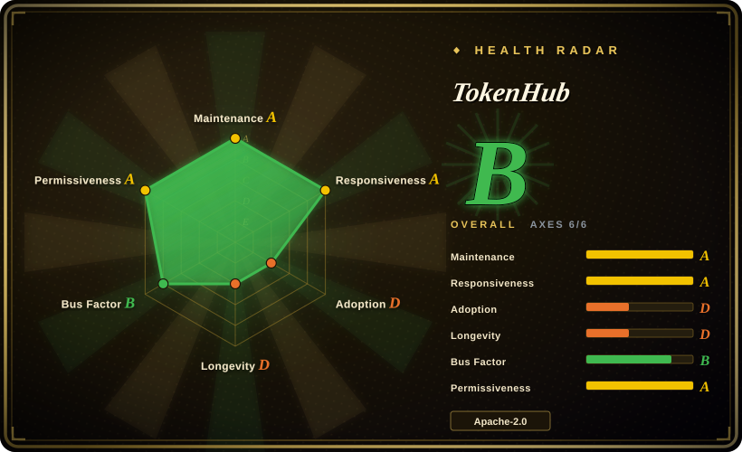
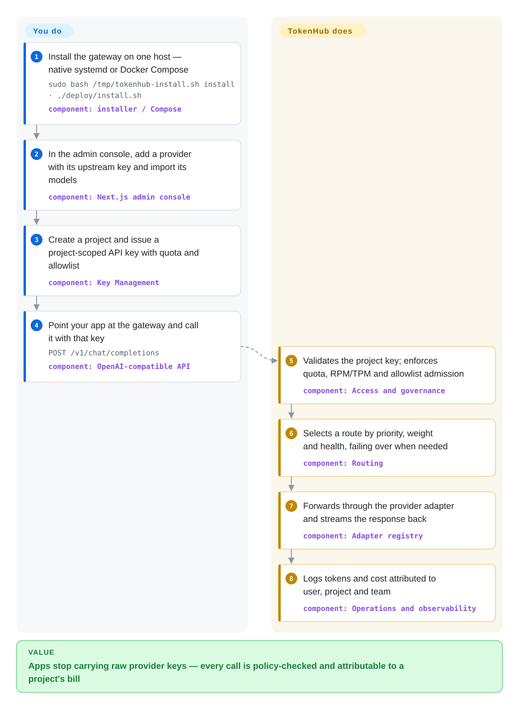

# TokenHub

Every team pastes its own provider API keys into app code, and at month's end nobody can say which project burned which tokens — or reconcile the invoice against internal usage. TokenHub is a self-hosted AI gateway that stands in front of every model call, so keys, quotas, routing and cost attribution become admin policy instead of app code.

## When to use

You run internal platform infrastructure at a company where multiple teams and applications call OpenAI, Anthropic, Gemini, DeepSeek or Qwen directly. The pain is no longer connectivity — it is governance: raw provider keys copied into every app, no per-project spend attribution, quotas that exist only in spreadsheets, and a finance team holding a provider bill that maps to nothing internal. You deploy TokenHub, hand out project-scoped keys instead of provider keys, and let admins set routing (priority/weight/failover), quotas, model allowlists and OIDC login as console policy. Usage lands attributed to user, project, team and cost center, and the provider-bill reconciliation view is built for explaining the invoice, not just pretty charts.

The deciding tradeoff versus [LiteLLM](litellm.md) is *governance-first and deployment shape*: TokenHub is a Go backend plus Next.js console that starts on one host with SQLite (installer or Docker Compose) and treats reconciliation, RBAC workspaces (user / team leader / administrator) and audit as core product; LiteLLM brings the larger provider ecosystem and battle-tested multi-tenant spend tracking at the price of PostgreSQL + Redis for the full feature set and a commercial `enterprise/` boundary. Versus [Kong Gateway](kong.md): choose TokenHub when the traffic is model API calls and token accounting is the actual requirement, not a plugin on a general HTTP gateway. Claude Code and Codex clients can also point at the gateway directly (`/v1/messages`, OpenAI-compatible `/v1`), so coding-agent traffic flows through the same quotas and audit as production apps.

## How it works

TokenHub is one Go process that hosts everything: the admin API, the OpenAI/Anthropic/Gemini-compatible model APIs (`/v1/*`), routing, provider adapters, audit and persistence. **You never write routing logic — you declare it in the console**: which upstream providers exist (with their credentials), which external models are exposed, and which routes (with priority, weight, failover) serve each model. Think of it as a corporate expense system for tokens: every app calls the gateway with a project key instead of a provider key, and each call is admitted against quota, metered, and booked to a project — like charges on a company card. The Next.js console is the control plane (providers, model catalog, routes, projects, keys, identity sources, audit); the Go backend is the data plane that validates each `/v1/chat/completions` call, picks a healthy route, translates to the upstream protocol via native adapters (OpenAI, Azure OpenAI, Anthropic, Gemini, DeepSeek, Qwen, Codex subscriptions, local models — other templates connect OpenAI-compatibly), and records usage and cost. State lives in SQLite by default; PostgreSQL (and replicas behind Nginx) when you outgrow one host.

<!-- flow-steps:begin (generated from flows/tokenhub.json by tools/flow_card.py — do not edit) -->

Text version of the flow

1. **You**: Install the gateway on one host — native systemd or Docker Compose — `sudo bash /tmp/tokenhub-install.sh install · ./deploy/install.sh` — component: `installer / Compose`
2. **You**: In the admin console, add a provider with its upstream key and import its models — component: `Next.js admin console`
3. **You**: Create a project and issue a project-scoped API key with quota and allowlist — component: `Key Management`
4. **You**: Point your app at the gateway and call it with that key — `POST /v1/chat/completions` — component: `OpenAI-compatible API`
5. **TokenHub**: Validates the project key; enforces quota, RPM/TPM and allowlist admission — component: `Access and governance`
6. **TokenHub**: Selects a route by priority, weight and health, failing over when needed — component: `Routing`
7. **TokenHub**: Forwards through the provider adapter and streams the response back — component: `Adapter registry`
8. **TokenHub**: Logs tokens and cost attributed to user, project and team — component: `Operations and observability`

**Value**: Apps stop carrying raw provider keys — every call is policy-checked and attributable to a project's bill

<!-- flow-steps:end -->

## When NOT to use

- **You need a multi-year stability track record.** First release was 2026-07 and the project is at v0.9.0 with forward-only migrations and documented metering-ledger compatibility fixes between releases; if the gateway must be boring infrastructure, [LiteLLM](litellm.md) (since 2023, weekly releases) or [Kong Gateway](kong.md) (12+ years) carry more operational history.
- **You want to extend the gateway with your own executable code.** TokenHub's external plugin packages are metadata/presentation-only in the current release — the `stdio-json-v1` devkit is a future runtime contract, not an operational execution path. Write plugins for [Kong](kong.md) or APISIX today instead.
- **You are one developer routing your own coding agent.** A console, projects and quotas are overhead for a single user — use [Claude Code Router](claude-code-router.md) locally.
- **You want to farm consumer OAuth logins into an API pool.** That is [CLIProxyAPI](cliproxyapi.md)'s specific tradeoff; TokenHub's governance model is built around issued project keys. (Its Codex-subscription channels do carry the same platform-ToS exposure — that risk is inherent to the channel type, and it lands on your enterprise gateway if you enable it.)
- **Your protocol surface must be complete today.** Azure OpenAI Responses (and streaming Responses) returns `501 provider_capability_not_supported`; request-side content policies do not inspect tool arguments or provider responses. Audit the provider/protocol matrix against your needs first.
- **You have one small app on one provider.** The vendor SDK direct is simpler; a governance layer nobody reads is pure overhead.

## Comparison

| Alternative | In index | Our verdict | Tradeoff |
|---|---|---|---|
| [LiteLLM](litellm.md) | ✅ | Choose LiteLLM when provider breadth, the Python ecosystem and proven multi-tenant spend tracking matter most; choose TokenHub when bill reconciliation, role-separated admin workspaces and a Go/SQLite-first private deploy are the actual requirement. | LiteLLM has the larger community and integration surface but needs PostgreSQL + Redis for its full feature set and gates features behind a commercial `enterprise/`; TokenHub is all Apache-2.0 on a lighter stack but is 3 months old with a far thinner track record. |
| New API | not indexed | When you want a lightweight self-hosted relay console with per-key billing (the one-api lineage), New API is the quicker start; choose TokenHub when enterprise governance — RBAC workspaces, OIDC identity, audit, provider-bill reconciliation — is the point rather than key fan-out. | New API is the popular relay/billing console in the same Chinese-enterprise niche and lighter to stand up; TokenHub trades that lightness for governance depth (cost centers, reconciliation, role separation). Real repo, not added in this tab-intake batch. |
| [Kong Gateway](kong.md) | ✅ | Choose Kong when the same edge must also carry general HTTP/microservice traffic, Kubernetes ingress and a mature plugin ecosystem; choose TokenHub when the traffic is model API calls and token governance is the product. | Kong adds LLM semantics to a general data-plane gateway via plugins, with no native token accounting or project/bill attribution; TokenHub is AI-native governance but does not proxy arbitrary HTTP APIs. |
| [CLIProxyAPI](cliproxyapi.md) | ✅ | When the asset being reused is consumer CLI/OAuth logins and you accept account risk for personal or small-team use, choose CLIProxyAPI; when governance of issued project keys across many teams is the requirement, choose TokenHub. | The overlap is subscription channels (TokenHub's Codex-subscription providers carry similar ToS/account exposure for that channel type); TokenHub concentrates on keys, quotas, attribution and audit rather than login reuse. |
| Portkey Gateway | not indexed | Evaluate Portkey when guardrails and observability are the flagship requirement and a JS-first gateway fits your stack; choose TokenHub when reconciliation and an admin-console governance model matter more. | Portkey is an LLM-native gateway with a different open-core posture; TokenHub is fully Apache-2.0 with cost attribution and RBAC first, but far younger. Real repo, not added in this tab-intake batch. |

## Tech stack

- **Backend:** Go 1.26 on the standard library `net/http`; one process for admin API, model APIs, routing, adapters, audit and persistence.
- **Persistence:** GORM over SQLite (default, single instance) or PostgreSQL (production, multi-instance); forward-only migrations.
- **Console:** Next.js/React admin console with role-aware workspaces (user / team leader / administrator) and EN/zh/ja/ru localization.
- **Protocols:** OpenAI-compatible `/v1/chat/completions`, `/v1/responses`, `/v1/embeddings`, `/v1/images/*`; Anthropic `/v1/messages` (+ `count_tokens`); Gemini `/v1beta`; `/v1/rerank`; `/healthz`, `/livez`, `/readyz`.
- **Providers:** native adapters for OpenAI, Azure OpenAI, Anthropic, Gemini, DeepSeek, Qwen, Codex subscriptions and local models; 150+ catalog templates connect OpenAI-compatibly. [未验证] template count from README, not independently counted.
- **Observability:** Prometheus metrics, OpenTelemetry traces; optional Redis for the high-write admission path (per-minute RPM/TPM, concurrency leases).
- **Plugin surface:** in-process built-in plugins; external packages are declarative-only (manifest, admin UI panels) — external execution (`stdio-json-v1` devkit) is not operational in this release.

## Dependencies

- **A Linux host** with systemd (native installer) or Docker/Compose; a Helm chart ships since v0.9.0 for Kubernetes.
- **SQLite** by default — no separate database service (docs scope it to single-host deployments under ~1000 users); **PostgreSQL** for high concurrency, >1000 users or multi-instance replicas; **Nginx** (in the remote-PostgreSQL Compose mode) in front of scaled replicas.
- **Optional Redis** (`TOKENHUB_BILLING_REDIS_URL`) for high-concurrency admission; the database remains the durable billing ledger without it.
- **Provider credentials** for every upstream — the gateway is a credential concentrator by construction, and Codex-subscription channels additionally depend on consumer accounts staying valid.
- **Ports:** console `:3000`, backend API `:8080` by default.

## Ops difficulty

**Low to medium.** The genuinely low end is one host: the native installer verifies release checksums, installs a systemd service, and supports update/rollback from the version panel; SQLite means no database to run. Difficulty rises with the PostgreSQL path (connection pools, migrations), multi-instance replicas behind Nginx, and the pre-1.0 reality: v0.x releases have shipped metering-ledger and migration compatibility fixes between versions, so upgrades need the release notes read and a backup taken — treat it as actively developing software, not boring infrastructure yet.

## Health & viability

- **Maintenance (as of 2026-09-28):** created 2026-06-10; six releases v0.4.0 (2026-07-29) → v0.9.0 (2026-09-25) at roughly two-week cadence; commits daily through 2026-09-27 — very active development.
- **Governance / bus factor:** owned by astaxie's personal account (astaxie = Beego's creator, a long-standing Go-community figure); contributor stats over the project's life so far show the top contributor at 59.6% and the top three at 79.4% of contributions, with 26 active maintainers in the window — author-dominated, no foundation or vendor governance. [推断] shares are machine-computed from GitHub stats and shift with anonymous/duplicate identities.
- **Backing & age/Lindy:** ~3.5 months old — no Lindy protection; the author's decade-plus track record (Beego, since 2010) is the substitute trust signal, not the project's own history. [推断] The docs homepage lives under `thinkinai-labs.github.io`, suggesting development tied to the author's company ThinkInAI; the repo states no governance doc, so backing is unconfirmed.
- **Adoption:** ~1.3k stars and 175 forks in 3.5 months with only 10 watchers; distribution is release binaries/Compose (no package registry), so there are no download numbers to cross-check — treat adoption as plausible-but-unproven. [未验证]
- **Risk flags:** monetization runs through sponsor links (an API-relay reseller and a subscription-upgrade service) — commercial adjacency worth knowing, not a license risk; Apache-2.0 throughout with no relicense history observed; Codex-subscription channel support carries inherent platform-ToS exposure; external plugin execution is advertised as a contract but not yet operational — do not build against it.

## Caveats (unverified)

- [未验证] Star/fork/watch counts (1,344 / 175 / 10) read from the GitHub API on 2026-09-28; not audited for authenticity, and star velocity on a famous author's young repo is a risk flag, not proof of adoption.
- [推断] ThinkInAI relationship inferred from the homepage host (`thinkinai-labs.github.io/tokenhome/`) and the repo being on a personal account; no governance/GOVERNANCE file states the actual corporate arrangement.
- [推断] Contributor-concentration figures (top1 0.596 / top3 0.794, 26 active maintainers) are computed by `tools/health.py` from GitHub stats; anonymous and duplicate identities can shift them.
- [未验证] "150+ provider templates" and the exact native-adapter list come from the README and docs; not independently counted against `data/provider-catalog.json`.
- [未验证] Multi-instance and HA behavior under load not reproduced here; the repo ships a `benchmarks/` suite and a performance doc, but they were not re-run for this page.
- [未验证] Azure OpenAI Responses `501` and the guardrail coverage gaps (tool arguments / provider responses uninspected) are read from `docs/user-guide.md` and `docs/administrator-guide.md` as of v0.9.0 and may change in later releases.
- [推断] The pre-1.0 migration/ledger-compatibility risk is inferred from v0.9.0 release notes ("restore compatibility for historical metering migration checksums") — no upgrade was performed to confirm.
