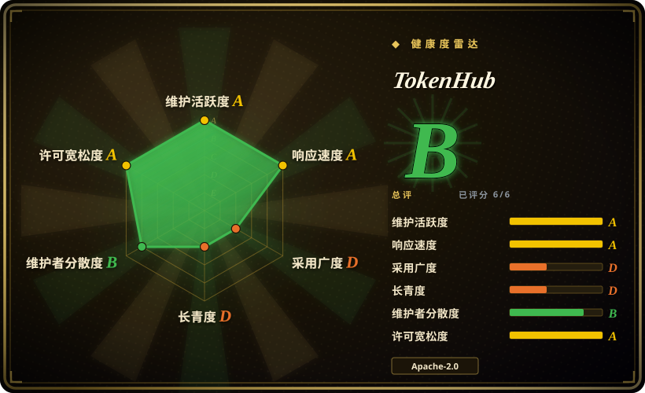
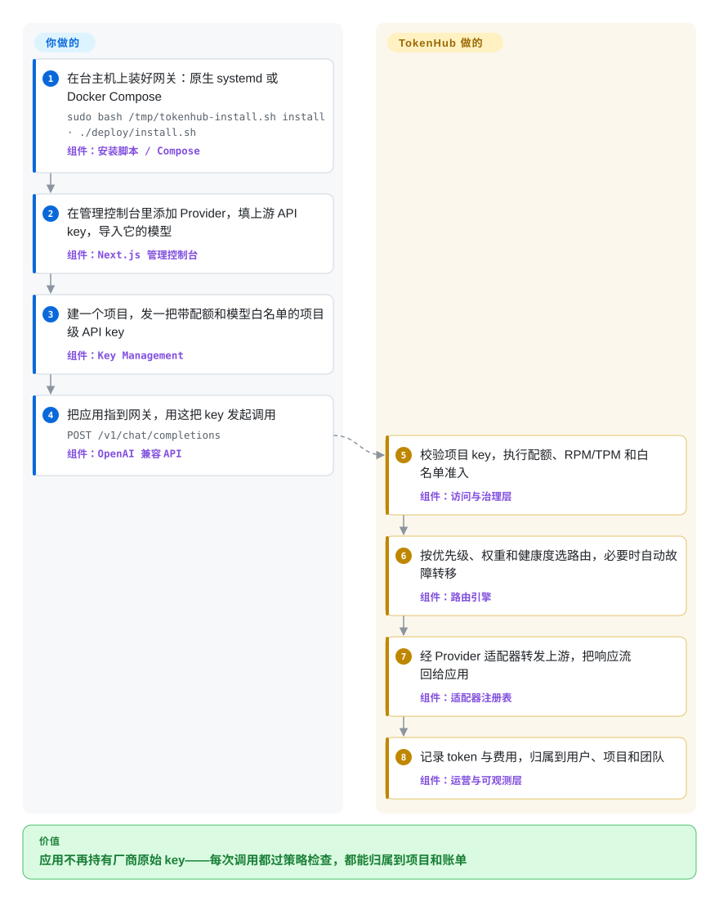

# TokenHub

每个团队把各自的模型厂商 API key 硬贴在应用代码里，月底没人说得清哪个项目烧掉了哪些 token，供应商账单也对不上内部账。TokenHub 是一个自部署的 AI 网关，挡在每一次模型调用前面，把 key、配额、路由和成本归属从应用代码变成管理员策略。

## 何时使用

你是公司内部平台基础设施的负责人，多个团队和多套应用都在直连 OpenAI、Anthropic、Gemini、DeepSeek 或 Qwen。痛点已经不是「接不上」，而是「管不住」：厂商原始 key 被复制进每个应用，没有按项目归集的费用视图，配额只存在于表格里，财务拿着一张对不上内部任何东西的供应商账单。你部署 TokenHub，发给各团队的是项目级 key 而不是厂商 key，由管理员在控制台里设定路由（优先级／权重／故障转移）、配额、模型白名单和 OIDC 登录。用量自动归属到用户、项目、团队和成本中心，供应商账单核对视图就是为「解释这张发票」做的，不是好看的花板。

与 [LiteLLM](litellm.zh.md) 的取舍在「治理优先」和部署形态：TokenHub 是 Go 后端加 Next.js 控制台，一台主机加 SQLite 就能起步（安装脚本或 Docker Compose），把账单核对、按角色分的工作台（普通用户／团队负责人／管理员）和审计当核心产品做；LiteLLM 有更大的供应商生态和久经考验的多租户费用追踪，代价是全功能要 PostgreSQL 加 Redis，还有一个商业 `enterprise/` 边界。与 [Kong Gateway](kong.zh.md) 相比：当流量本身就是模型 API 调用、token 记账才是真正需求时选 TokenHub，而不是在通用 HTTP 网关上挂插件。Claude Code 和 Codex 客户端也能直接指向网关（`/v1/messages` 与 OpenAI 兼容的 `/v1`），于是编码 agent 的流量和生产应用走同一套配额与审计。

## 怎么用起来

TokenHub 是一个 Go 进程，装下了全部东西：管理 API、OpenAI／Anthropic／Gemini 兼容的模型 API（`/v1/*`）、路由、Provider 适配器、审计和持久化。**你不写任何路由逻辑——只在控制台里声明**：有哪些上游 Provider（连同凭据）、对外暴露哪些模型、每个模型由哪些路由（优先级、权重、故障转移）来服务。可以把它想成给 token 装一套公司报销制度：每个应用拿项目 key 而不是厂商 key 来调网关，每次调用先过配额准入，再计量记账，落到某个项目头上——像刷公司卡留账。Next.js 控制台是控制面（Provider、模型目录、路由、项目、key、身份源、审计）；Go 后端是数据面，校验每一次 `/v1/chat/completions` 调用、挑一条健康路由、经原生适配器（OpenAI、Azure OpenAI、Anthropic、Gemini、DeepSeek、Qwen、Codex 订阅、本地模型；其余模板走 OpenAI 兼容）翻译成上游协议，并记下用量与费用。状态默认存 SQLite；一台主机不够时换 PostgreSQL（加 Nginx 后面的多副本）。

<!-- flow-steps:begin (generated from flows/tokenhub.json by tools/flow_card.py — do not edit) -->

流程文字版

1. **你**：在台主机上装好网关：原生 systemd 或 Docker Compose — `sudo bash /tmp/tokenhub-install.sh install · ./deploy/install.sh` — 组件：`安装脚本 / Compose`
2. **你**：在管理控制台里添加 Provider，填上游 API key，导入它的模型 — 组件：`Next.js 管理控制台`
3. **你**：建一个项目，发一把带配额和模型白名单的项目级 API key — 组件：`Key Management`
4. **你**：把应用指到网关，用这把 key 发起调用 — `POST /v1/chat/completions` — 组件：`OpenAI 兼容 API`
5. **TokenHub**：校验项目 key，执行配额、RPM/TPM 和白名单准入 — 组件：`访问与治理层`
6. **TokenHub**：按优先级、权重和健康度选路由，必要时自动故障转移 — 组件：`路由引擎`
7. **TokenHub**：经 Provider 适配器转发上游，把响应流回给应用 — 组件：`适配器注册表`
8. **TokenHub**：记录 token 与费用，归属到用户、项目和团队 — 组件：`运营与可观测层`

**价值**：应用不再持有厂商原始 key——每次调用都过策略检查，都能归属到项目和账单

<!-- flow-steps:end -->

## 何时不用

- **你要多年的稳定履历。** 首个版本发布于 2026-07，目前是 v0.9.0，迁移只向前走，且版本之间出现过计量账本兼容性修复；如果网关必须是「无聊的基础设施」，选 [LiteLLM](litellm.zh.md)（2023 年起、每周发版）或 [Kong Gateway](kong.zh.md)（12 年以上）更稳妥。
- **你想用自己写的可执行代码扩展网关。** 当前版本的外部插件包只有元数据与展示能力——`stdio-json-v1` 开发包是未来运行时契约，不是已可用的执行路径；今天要写插件请用 [Kong](kong.zh.md) 或 APISIX。
- **你是单个开发者，只想给自己的编码 agent 换模型。** 控制台、项目、配额对单人全是负担，本地跑 [Claude Code Router](claude-code-router.zh.md) 就够。
- **你想把消费级 OAuth 登录养成本人 API 池。** 那是 [CLIProxyAPI](cliproxyapi.zh.md) 的专属取舍；TokenHub 的治理模型围绕签发的项目 key 建立。（它的 Codex 订阅通道确实带有同类的平台条款风险——这个风险是通道类型固有的，启用它就落在你的企业网关上。）
- **你的协议覆盖必须今天就是全的。** Azure OpenAI 的 Responses（含流式）返回 `501 provider_capability_not_supported`；请求侧内容策略不检查工具参数和厂商响应。先拿供应商／协议矩阵对照你的需求。
- **你只有一个应用、一个厂商。** 直接用厂商 SDK 更简单，没人看的治理层纯属负担。

## 横向对比

| 替代品 | 是否收录 | 我们的评价 | 取舍 |
|---|---|---|---|
| [LiteLLM](litellm.zh.md) | ✅ | 供应商广度、Python 生态和久经考验的多租户费用追踪更重要时，选 LiteLLM；账单核对、按角色分的 admin 工作台和 Go／SQLite 优先的私有部署才是硬需求时，选 TokenHub。 | LiteLLM 社区更大、集成面更广，但全功能要 PostgreSQL 加 Redis，部分功能关在商业 `enterprise/` 后面；TokenHub 全部 Apache-2.0、栈更轻，但只有三个月大，履历薄得多。 |
| New API | 未收录 | 只想要一个带按 key 计费的轻量自建中转控制台（one-api 一系）时，New API 上手更快；企业治理——RBAC 工作台、OIDC 身份、审计、供应商账单核对——才是目的时，选 TokenHub。 | New API 是同一中文企业场景里流行的中转计费控制台，立起来更轻；TokenHub 用这份轻换治理深度（成本中心、账单核对、角色分离）。真实仓库，本批 tab-intake 未收录。 |
| [Kong Gateway](kong.zh.md) | ✅ | 同一边界还要承载通用 HTTP／微服务流量、Kubernetes 入口和成熟插件生态时，选 Kong；流量就是模型 API 调用、token 治理本身是产品时，选 TokenHub。 | Kong 用插件给通用数据面网关补 LLM 语义，没有原生 token 记账和项目／账单归属；TokenHub 是 AI 原生治理，但不代理任意 HTTP API。 |
| [CLIProxyAPI](cliproxyapi.zh.md) | ✅ | 复用的资产是消费级 CLI／OAuth 登录、且个人或小团队愿意承担账号风险时，选 CLIProxyAPI；要求对多团队签发项目 key 做治理时，选 TokenHub。 | 重叠只在订阅通道（TokenHub 的 Codex 订阅 Provider 带同类条款／账号风险）；TokenHub 聚焦 key、配额、归属和审计，不做登录复用。 |
| Portkey Gateway | 未收录 | guardrails 与可观测是头号需求、且 JS 优先的网关合你栈时，评估 Portkey；账单核对和管理控制台式治理更重要时，选 TokenHub。 | Portkey 是 LLM 原生网关，open-core 姿态不同；TokenHub 全 Apache-2.0、成本归属与 RBAC 优先，但年轻得多。真实仓库，本批 tab-intake 未收录。 |

## 技术栈

- **后端：** Go 1.26，标准库 `net/http`；管理 API、模型 API、路由、适配器、审计和持久化在同一个进程里。
- **持久化：** GORM，默认 SQLite（单实例），生产用 PostgreSQL；迁移只向前。
- **控制台：** Next.js/React 管理控制台，按角色分工作台（普通用户／团队负责人／管理员），支持英／中／日／俄四语。
- **协议：** OpenAI 兼容的 `/v1/chat/completions`、`/v1/responses`、`/v1/embeddings`、`/v1/images/*`；Anthropic 的 `/v1/messages`（含 `count_tokens`）；Gemini 的 `/v1beta`；`/v1/rerank`；以及 `/healthz`、`/livez`、`/readyz`。
- **Provider：** OpenAI、Azure OpenAI、Anthropic、Gemini、DeepSeek、Qwen、Codex 订阅和本地模型有原生适配器，另有 150 多个目录模板走 OpenAI 兼容接入。[未验证] 模板数出自 README，未独立清点。
- **可观测：** Prometheus 指标、OpenTelemetry trace；高写入准入路径可选 Redis（每分钟 RPM/TPM、并发租约）。
- **插件面：** 内置插件进程内运行；外部插件包只有声明式能力（manifest、admin 面板）——外部执行（`stdio-json-v1` 开发包）本版本尚未开放。

## 依赖

- **一台 Linux 主机**，systemd（原生安装器）或 Docker/Compose 均可；v0.9.0 起自带 Kubernetes Helm chart。
- **SQLite** 默认——无需单独数据库服务（文档将其定位于单主机、约 1000 用户以内部署）；高并发、超 1000 用户或多副本用 **PostgreSQL**；remote-PostgreSQL Compose 模式下副本前面加 **Nginx**。
- **可选 Redis**（`TOKENHUB_BILLING_REDIS_URL`）用于高并发准入；不配时数据库仍是持久计费台账。
- **每个上游的凭据**——网关天然是凭据集中器，Codex 订阅通道还额外依赖消费级账号持续有效。
- **端口：** 默认控制台 `:3000`、后端 API `:8080`。

## 运维难度

**低到中等。** 真正低的是单主机形态：原生安装器校验 Release 校验和、装 systemd 服务、版本面板里直接升级回滚；SQLite 意味着没有数据库要运维。难度随 PostgreSQL 路径（连接池、迁移）、Nginx 后面的多副本，以及 1.0 之前的现实上升：v0.x 版本之间修过计量账本和迁移兼容性问题，升级前要读 release notes、先备份——把它当活跃开发中的软件，暂时还不是「无聊的基础设施」。

## 健康度与可持续性

- **维护（截至 2026-09-28）：** 仓库建于 2026-06-10；从 v0.4.0（2026-07-29）到 v0.9.0（2026-09-25）共六个版本，约两周一个；提交持续到 2026-09-27——开发非常活跃。
- **治理／bus factor：** 仓库在 astaxie 个人账号下（astaxie 是 Beego 作者、Go 社区老人）；项目至今的贡献统计显示头部贡献者占 59.6%、前三名占 79.4%，窗口内活跃维护者 26 人——作者主导，无基金会或厂商治理。[推断] 份额由 GitHub 统计机器算出，匿名／重复身份会带来偏差。
- **背书与年龄／Lindy：** 约 3.5 个月大——没有 Lindy 保护；作者的十多年履历（Beego，2010 年起）是替代信任信号，不是项目自身的历史。[推断] 文档主页挂在 `thinkinai-labs.github.io` 下，暗示开发与其公司 ThinkInAI 相关；仓库没有治理文件，背书未获确认。
- **采用：** 三个半月约 1.3k star、175 fork，但 watcher 只有 10；分发走 Release 二进制和 Compose（无包注册表），没有下载数据可交叉验证——采用情况算「可信但未证实」。[未验证]
- **风险标记：** 变现走赞助链接（一家 API 中转分销商和一个订阅升级服务）——商业相邻关系值得知道，但不是 license 风险；全程 Apache-2.0，未观察到改 license 历史；Codex 订阅通道自带平台条款风险；外部插件执行只宣示了契约、尚未开放——不要基于它做开发。

## 存疑（未验证）

- [未验证] star/fork/watch 数（1344／175／10）读自 2026-09-28 的 GitHub API；未做真实性审计，且名家新仓库的 star 增速本身是风险信号，不是采用的证明。
- [推断] 与 ThinkInAI 的关系是从主页域名（`thinkinai-labs.github.io/tokenhome/`）和个人账号托管推断的；没有治理文件说明实际的公司安排。
- [推断] 贡献集中度数字（top1 0.596／top3 0.794、26 名活跃维护者）由 `tools/health.py` 按 GitHub 统计算出；匿名与重复身份会带来偏差。
- [未验证] 「150 多个 Provider 模板」和原生适配器清单出自 README 与文档；未对照 `data/provider-catalog.json` 独立清点。
- [未验证] 多实例与高可用行为未在此复现；仓库带 `benchmarks/` 套件和性能文档，但本页没有重跑。
- [未验证] Azure OpenAI Responses 返回 `501`、guardrails 不检查工具参数与厂商响应，读自 v0.9.0 的 `docs/user-guide.md` 与 `docs/administrator-guide.md`，后续版本可能变化。
- [推断] 1.0 前的迁移／账本兼容风险由 v0.9.0 release notes（「restore compatibility for historical metering migration checksums」）推得——未实际执行升级验证。
