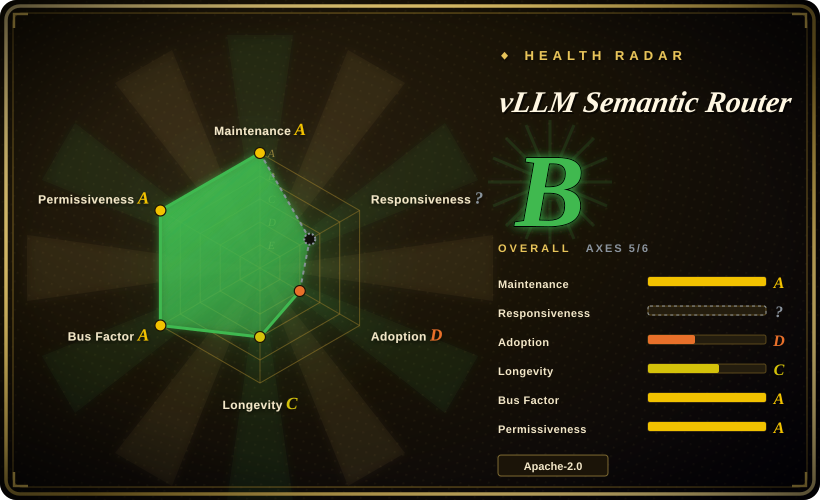
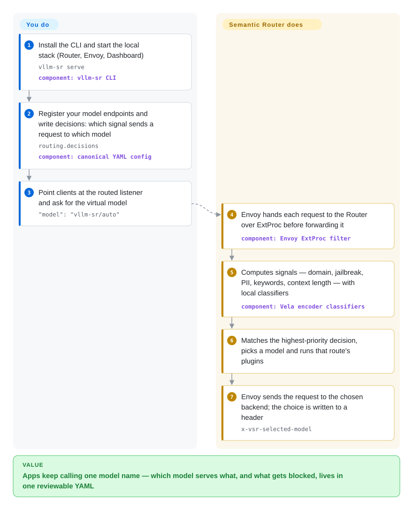

# vLLM Semantic Router

Every app sends every prompt to the same big model: "hi" costs as much as a proof, a coding question never reaches your code model, and a jailbreak attempt reaches the model unchecked because the routing is hard-coded in client code. Semantic Router sits beside the Envoy proxy, reads each request with small local classifiers, and picks the model — or chain of models — by rules you write in YAML.

## When to use

You run the inference platform for a company that already serves several models — a small local model on vLLM, a code specialist, a reasoning model, maybe a frontier API — and every product team picks one in its own code. The bill shows `model=big-reasoner` on 80% of calls, most of which are greetings and FAQ lookups, and the security review asks why prompts with customer phone numbers go to an external API. You want one stable model name for clients (`vllm-sr/auto`) while the platform decides per request which model serves it, blocks jailbreaks, keeps PII-bearing prompts on local models, and can escalate hard questions through a cascade.

You pick Semantic Router over a general LLM gateway such as [LiteLLM](litellm.md) because the deciding input is the **content** of the request, not just the model name or the caller's key: it runs its own encoder classifiers (domain, jailbreak, PII, fact-check, feedback) and a boolean decision language on those signals, then records the choice in `x-vsr-selected-model`. Gateways route by name, key and health; RouteLLM-style routers route by one learned strong/weak score. Semantic Router is the policy layer in between — and it deliberately leaves credentials, rate limits, TLS and replica scheduling to the gateway and the inference platform around it.

## How it works

The request path is Envoy plus the Router: Envoy (the proxy) accepts OpenAI Chat Completions, OpenAI Responses or Anthropic Messages calls and, before forwarding, hands each one to the Router through ExtProc — Envoy's hook that lets an outside service inspect and rewrite a request in flight. Think of a hospital triage nurse: the nurse does not treat anyone, but decides which ward each patient goes to. The Router computes **signals** (named facts: a keyword match, context length, the domain or jailbreak verdict from a 307M-parameter Vela encoder model it runs on CPU), combines them into **decisions** (boolean rules with priorities, each naming candidate models), lets an **algorithm** pick one candidate or run a bounded cascade, and runs route **plugins** such as a semantic cache, memory or retrieval. **What you do** is supply reachable model endpoints and write the routing YAML (or click it together in the Dashboard); **what it does** is the per-request classification, the decision and the header rewrite. It never loads your backend model weights and does not choose which replica serves the request — that stays with vLLM, llm-d, AIBrix or your provider.

<!-- flow-steps:begin (generated from flows/vllm-semantic-router.json by tools/flow_card.py — do not edit) -->

Text version of the flow

1. **You**: Install the CLI and start the local stack (Router, Envoy, Dashboard) — `vllm-sr serve` — component: `vllm-sr CLI`
2. **You**: Register your model endpoints and write decisions: which signal sends a request to which model — `routing.decisions` — component: `canonical YAML config`
3. **You**: Point clients at the routed listener and ask for the virtual model — `"model": "vllm-sr/auto"`
4. **vLLM Semantic Router**: Envoy hands each request to the Router over ExtProc before forwarding it — component: `Envoy ExtProc filter`
5. **vLLM Semantic Router**: Computes signals — domain, jailbreak, PII, keywords, context length — with local classifiers — component: `Vela encoder classifiers`
6. **vLLM Semantic Router**: Matches the highest-priority decision, picks a model and runs that route's plugins
7. **vLLM Semantic Router**: Envoy sends the request to the chosen backend; the choice is written to a header — `x-vsr-selected-model`

**Value**: Apps keep calling one model name — which model serves what, and what gets blocked, lives in one reviewable YAML

<!-- flow-steps:end -->

## When NOT to use

- **You serve one model, or all traffic goes to one provider.** There is nothing to route between; call [vLLM](../llm-inference/serving-engines/vllm.md) or the provider SDK directly and skip an extra Envoy hop plus classifier inference on every request.
- **Your real need is keys, budgets, spend tracking and provider breadth.** Use [LiteLLM](litellm.md) or [TokenHub](tokenhub.md). The Router's own FAQ says it does not terminate TLS or load-balance providers, and puts credentials and rate limits in the AI-gateway layer, so you would still run one of those in front of it.
- **You need to pick a healthy replica or exploit KV-cache locality inside one model pool.** That is an inference-scheduler job (llm-d, the vLLM Router, the AIBrix gateway). Semantic Router chooses the pool, not the pod, and its docs say not to configure both layers to make the same decision.
- **You want a lightweight in-process router for a strong/weak model pair.** A few lines of rules in LiteLLM, or RouteLLM's learned threshold router, cost far less to run than a Docker/Kubernetes stack with Envoy, a Dashboard and several classifier models; RouteLLM itself has not been pushed since 2024-08, so treat it as a pattern source.
- **Latency is your tightest budget.** Every routed request adds an ExtProc round trip and encoder inference; the project's own data-plane epic (#2992, open) still lists "establish latency, throughput, streaming, resource and failure baselines" as unfinished. Map model names statically in [Envoy](envoy.md) or your gateway until you have measured the overhead on your traffic.
- **You need a qualified guardrail or PII redactor.** The support matrix marks the jailbreak, hallucination and PII demos as "experimental example … not a qualified guardrail"; the learned signals are probabilistic, and the docs themselves say to use trusted identity for authorization-sensitive routing. Put a guardrail stack you have evaluated behind it, and use the Router's signals for routing, not as the only safety control.
- **You need a stable configuration contract across upgrades.** It is pre-1.0 with a minor release roughly every quarter, a v0.3 "unified config contract" rewrite, and a support matrix that tells you to take the CLI, chart, CRDs, controller and images from one release. Pin a release set and budget upgrade testing, or wait for 1.0.
- **One developer routing a coding agent across providers.** Use [Claude Code Router](claude-code-router.md); a local proxy with conditional rules is enough, and you do not need an Envoy data plane.

## Comparison

| Alternative | In index | Our verdict | Tradeoff |
|---|---|---|---|
| [LiteLLM](litellm.md) | ✅ | When the problem is giving many apps one OpenAI-compatible endpoint with keys, budgets, spend records and failover, choose LiteLLM; choose Semantic Router when the model must be chosen from the request's content and safety signals, and run it behind a gateway like LiteLLM. | LiteLLM covers 100+ providers and the governance surface but routes by model name, weight and health; Semantic Router adds classifier-driven decisions and cascades but has no key management and needs Envoy plus classifier models. |
| Agent Router (formerly Envoy AI Gateway) | not indexed | When you need a Kubernetes-native AI gateway for provider credentials, translation and token rate limits, choose Agent Router; add Semantic Router on top only when you also need per-request semantic model selection — the two are integrated through ExtProc and tested in the Router's PR CI. | Agent Router is traffic infrastructure with no content classifiers; Semantic Router is a decision layer with no provider credential handling, so production stacks tend to need both. Not added in this tab batch. |
| RouteLLM | not indexed | If you only need to choose between one strong and one weak model with a learned cost threshold, RouteLLM's router is a smaller idea to copy; choose Semantic Router for multi-model policies, safety signals and a maintained deployment, since RouteLLM has had no push since 2024-08. | RouteLLM is a Python library/server with pretrained routers and no operator surface; Semantic Router is a full Go/Envoy service with its own classifier family and operations cost. Not added in this tab batch. |
| NVIDIA LLM Router (AI Blueprint) | not indexed | When you are on NVIDIA's NIM/Triton stack and want a reference blueprint for task- or complexity-based routing, start from NVIDIA's blueprint; choose Semantic Router when you want a vendor-neutral router with AMD ROCm support, a Kubernetes Operator and a broader decision language. | The blueprint is a small reference architecture (~350 stars) tied to NVIDIA components; Semantic Router has a far larger community and deployment surface, and correspondingly more to operate. Not added in this tab batch. |
| [Claude Code Router](claude-code-router.md) | ✅ | When one developer wants to switch a coding agent's models by task type from a desktop app, choose Claude Code Router; choose Semantic Router when a platform team routes shared production traffic and needs classifiers, audit headers and Kubernetes deployment. | Claude Code Router is a single-user local proxy with simple conditional rules; Semantic Router is a multi-service stack whose extra cost only pays off for shared, heterogeneous traffic. |

## Tech stack

- **Router core:** Go 1.25 service implementing Envoy's External Processing gRPC API (`envoyproxy/go-control-plane`), with Kubernetes `controller-runtime` for the Operator and OpenTelemetry/Prometheus instrumentation.
- **In-process ML:** Rust bindings (`candle-binding`, `ml-binding`, `nlp-binding`) plus ONNX Runtime and OpenVINO bindings run the Vela 1.0 encoder family (307M-parameter classifiers for domain, guard, safety, PII, fact-check, feedback, modality, embedding, reranking) on CPU by default, with CUDA and AMD ROCm paths.
- **Operator surface:** Python `vllm-sr` CLI (click, pydantic, `huggingface_hub`, PyPI `vllm-sr`), a TypeScript Dashboard, a Helm chart and a Kubernetes Operator with CRDs.
- **Optional state:** Redis/Valkey, Milvus, Qdrant and PostgreSQL clients for semantic cache, memory, vector stores and Responses-API state.
- **Research side:** `src/training` (classifier training), `src/fleet-sim` (fleet simulation) and `bench` (sr-bench evaluation) live in the same repository.

## Dependencies

- **Docker or Podman** plus Python ≥3.10 for the CLI-managed local stack (Linux, macOS or WSL2), or **Kubernetes** for the Helm chart / Operator.
- **Envoy** (the CLI runs it for you locally) or a supported gateway — Agent Router, agentgateway, Istio — that calls the Router through ExtProc.
- **Reachable model endpoints** (vLLM, Ollama, a Kubernetes inference platform or a hosted OpenAI/Anthropic-compatible API). The Router does not serve or provision their weights.
- **Router-side models** fetched from the `llm-semantic-router` Hugging Face organization; startup can take long enough that the CLI waits up to 1800 seconds for readiness by default.
- **Optional:** Redis/Valkey, Milvus or Qdrant for cache, memory and vector stores; a GPU (NVIDIA or AMD) only if measurements show the Router's own classifiers need it.

## Ops difficulty

**Medium to high.** The local path is short — one installer, `vllm-sr serve`, a Dashboard on `localhost:8700` — but production means operating Envoy, the Router, its classifier models, optional Redis/Valkey/vector stores and a gateway, and qualifying each model backend separately (the docs warn that a configured URL is not proof the backend speaks the protocol). The routing policy itself becomes a thing to test: the project ships `vllm-sr route preview` / `route probe`, replay records and sr-bench precisely because a mis-routed request still returns HTTP 200. Upgrades must move the CLI, chart, CRDs, controller and images together, and open resource issues (#2222, unbounded request-path memory retention under repeated load) mean you should load-test before exposing it.

## Health & viability

- **Maintenance, as of 2026-09-30:** very active — v0.4.0 "Hermes" shipped 2026-09-27 after v0.1 (2026-01), v0.2 (2026-03) and v0.3 (2026-06), a roughly quarterly minor cadence, and 537 commits landed on `main` in September 2026 alone.
- **Governance and bus factor:** a consensus model with per-directory `OWNER` files and five root maintainers; the top contributor has about 595 commits against 204 for the second, and the v0.4 notes claim 130 contributors since v0.3. Leadership is concentrated in a few people but the contributor base is broad.
- **Backing and longevity:** hosted in the `vllm-project` GitHub organization, with AMD named as sponsor for GPU resources. At about 13 months old it has almost no Lindy credit — the age × activity bet is carried by activity and the vLLM brand, not track record. Whether the vLLM project's foundation hosting formally covers this repository is not stated in the repo.
- **Adoption:** about 6.0k stars and 990 forks; a documentation site, papers and blog posts, and PR-CI-tested integrations with llm-d, AIBrix, Istio, agentgateway and Agent Router. Named production deployments were not found in the repository.
- **Risk flags:** Apache-2.0 with no enterprise carve-out found, but pre-1.0 with repeated config-contract changes; about 387 open issues (59 labelled bug) and 203 open PRs; minor doc drift (GOVERNANCE.md and the README give different community-meeting days; `pyproject.toml` still points to a `vllm-semantic-router` repository URL).

## Caveats (unverified)

- [未验证] Per-request latency and CPU/memory overhead of the ExtProc hop plus classifier inference; the project has no published baseline yet (#2992) and this page did not benchmark it.
- [未验证] Classification quality of the Vela models on your traffic; the model cards publish their own evaluations, which were not reproduced here.
- [未验证] Whether `vllm-project`'s foundation hosting (vLLM itself sits under the PyTorch Foundation) extends governance or trademark protection to this repository; nothing in the repo states it.
- [推断] Leadership concentration: commit counts show two accounts well ahead of the rest; employer affiliations of the maintainers were not verified.
- [未验证] Real production adopters; none are listed in the repository, and star/fork counts are not usage evidence.
- [未验证] The stack was not deployed for this page; operational claims (startup wait, port defaults, upgrade coupling) come from the project's docs and issue tracker.
