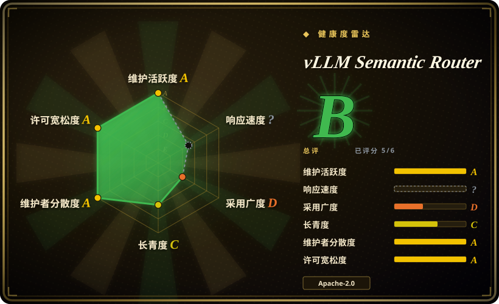
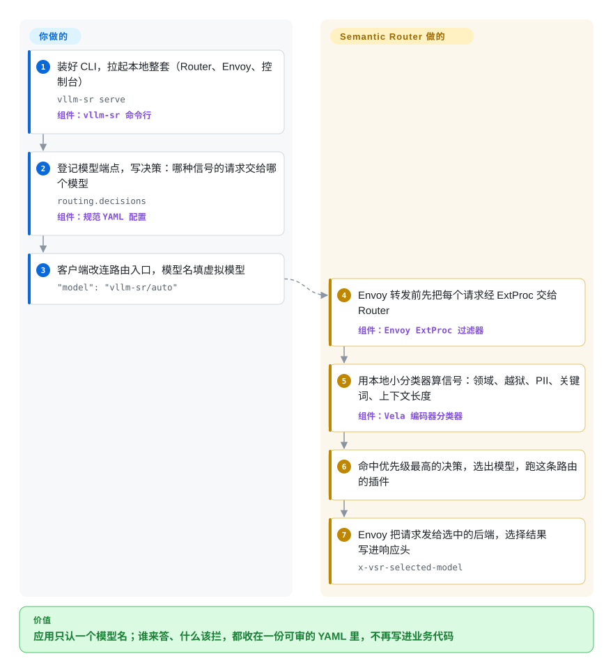

# vLLM Semantic Router

每个应用都把所有提问发给同一个大模型：一句“你好”和一道证明题花一样的钱，写代码的问题到不了你的代码模型，越狱提示也原样送进模型——因为选哪个模型是写死在客户端代码里的。Semantic Router 挂在 Envoy 代理旁边，用本地小分类器先读一遍请求，再按你在 YAML 里写的规则决定这次由哪个模型（或哪一串模型）来答。

## 何时使用

你负责公司的推理平台，手里已经有好几个模型：vLLM 上跑的小模型、一个代码专精模型、一个推理模型，也许还有一个前沿闭源 API；可每个业务团队都在自己代码里写死用哪一个。账单上 80% 的调用是 `model=big-reasoner`，其中大半是打招呼和查常见问题；安全评审还追问：为什么带客户手机号的提示会发到外部 API？你想让客户端只认一个稳定的模型名（`vllm-sr/auto`），由平台按请求决定谁来答、拦掉越狱、把含个人信息的请求留在本地模型上，难题再走级联升级。

选它而不是 [LiteLLM](litellm.zh.md) 这类通用 LLM 网关，决定因素是：路由依据的是请求的**内容**，而不只是模型名或调用方的密钥。它自带编码器分类器（领域、越狱、PII、事实核查、用户反馈），在这些信号上写布尔决策，最后把选择写进 `x-vsr-selected-model`。网关按名字、密钥和健康度路由；RouteLLM 一类路由器只按一个学出来的强/弱分数路由。Semantic Router 是夹在中间的策略层——它刻意把凭据、限流、TLS 和副本调度留给外围的网关和推理平台。

## 怎么用起来

请求路径是 Envoy 加 Router：Envoy（代理）接收 OpenAI Chat Completions、OpenAI Responses 或 Anthropic Messages 调用，在转发前通过 ExtProc 把每个请求交给 Router——ExtProc 是 Envoy 的一个钩子，允许外部服务在请求途中检查并改写它。可以把它想成医院的分诊护士：护士不看病，只决定病人去哪个科室。Router 先算**信号**（有名字的事实：命中某个关键词、上下文长度、或者它在 CPU 上跑的 3.07 亿参数 Vela 编码器给出的领域、越狱判定），再把信号组合成**决策**（带优先级的布尔规则，每条列出候选模型），由**算法**选出一个候选或跑一段有上限的级联，最后执行这条路由上的**插件**，比如语义缓存、记忆或检索。**你要做的**是提供可达的模型端点、写好路由 YAML（或在控制台里点出来）；**它替你做的**是逐请求分类、做决策、改写请求头。它从不加载你的后端模型权重，也不决定由哪个副本来服务——那是 vLLM、llm-d、AIBrix 或你的模型供应商的事。

<!-- flow-steps:begin (generated from flows/vllm-semantic-router.json by tools/flow_card.py — do not edit) -->

流程文字版

1. **你**：装好 CLI，拉起本地整套（Router、Envoy、控制台） — `vllm-sr serve` — 组件：`vllm-sr 命令行`
2. **你**：登记模型端点，写决策：哪种信号的请求交给哪个模型 — `routing.decisions` — 组件：`规范 YAML 配置`
3. **你**：客户端改连路由入口，模型名填虚拟模型 — `"model": "vllm-sr/auto"`
4. **vLLM Semantic Router**：Envoy 转发前先把每个请求经 ExtProc 交给 Router — 组件：`Envoy ExtProc 过滤器`
5. **vLLM Semantic Router**：用本地小分类器算信号：领域、越狱、PII、关键词、上下文长度 — 组件：`Vela 编码器分类器`
6. **vLLM Semantic Router**：命中优先级最高的决策，选出模型，跑这条路由的插件
7. **vLLM Semantic Router**：Envoy 把请求发给选中的后端，选择结果写进响应头 — `x-vsr-selected-model`

**价值**：应用只认一个模型名；谁来答、什么该拦，都收在一份可审的 YAML 里，不再写进业务代码

<!-- flow-steps:end -->

## 何时不用

- **你只有一个模型，或全部流量只走一家供应商。** 没有可选的对象；直接调 [vLLM](../llm-inference/serving-engines/vllm.zh.md) 或供应商 SDK，省掉每个请求多一跳 Envoy 加一次分类器推理。
- **你真正要的是密钥、预算、花费统计和供应商覆盖面。** 用 [LiteLLM](litellm.zh.md) 或 [TokenHub](tokenhub.zh.md)。Router 自己的 FAQ 说它不终止 TLS、不在供应商之间做负载均衡，并把凭据和限流划给 AI 网关层，所以你前面仍然要跑一个这样的网关。
- **你要在同一个模型池里挑健康副本、利用 KV 缓存局部性。** 那是推理调度器的活（llm-d、vLLM Router、AIBrix 网关）。Semantic Router 选的是池子，不是 Pod，文档也明说不要让两层做同一个决定。
- **你只想在进程内给一对强/弱模型做个轻量路由。** 在 LiteLLM 里写几条规则，或借鉴 RouteLLM 的学习阈值路由，都比跑一套带 Envoy、控制台和多个分类器模型的 Docker/Kubernetes 栈便宜得多；RouteLLM 本身自 2024-08 起就没有推送，只宜当思路参考。
- **延迟是你最紧的预算。** 每个被路由的请求都多一次 ExtProc 往返和一次编码器推理；项目自己的数据面性能史诗（#2992，仍开着）把“建立延迟、吞吐、流式、资源和故障基线”列为未完成。在你用自己的流量量出开销之前，先在 [Envoy](envoy.zh.md) 或网关里做静态模型映射。
- **你需要一个经过验证的护栏或 PII 脱敏器。** 支持矩阵把越狱、幻觉和 PII 演示都标成“实验示例……不是经过验证的护栏”；学习型信号本质是概率判断，文档也说涉及授权的路由要用可信身份。把你评估过的护栏栈放在它后面，Router 的信号用来路由，别当唯一的安全防线。
- **你需要跨升级稳定的配置契约。** 它还没到 1.0，大约每季度一个小版本，v0.3 重写过一次统一配置契约，支持矩阵还要求 CLI、chart、CRD、控制器和镜像必须取自同一个版本。锁定整套版本并预留升级测试，或者等 1.0。
- **一个开发者想让编码智能体在多家供应商之间切换。** 用 [Claude Code Router](claude-code-router.zh.md)；一个带条件规则的本地代理就够了，用不着 Envoy 数据面。

## 横向对比

| 替代品 | 是否收录 | 我们的评价 | 取舍 |
|---|---|---|---|
| [LiteLLM](litellm.zh.md) | ✅ | 如果问题是给很多应用一个 OpenAI 兼容入口，外加密钥、预算、花费记录和故障切换，选 LiteLLM；如果模型必须按请求内容和安全信号来挑，选 Semantic Router，并把它放在 LiteLLM 这类网关后面。 | LiteLLM 覆盖 100 多家供应商和整套治理能力，但按模型名、权重和健康度路由；Semantic Router 多了分类器驱动的决策和级联，但没有密钥管理，还要 Envoy 和分类器模型。 |
| Agent Router（原 Envoy AI Gateway） | 未收录 | 如果你要一个 Kubernetes 原生的 AI 网关来管供应商凭据、协议转换和 token 限流，选 Agent Router；只有还需要逐请求的语义选模型时，再在上面加 Semantic Router——两者通过 ExtProc 集成，并在 Router 的 PR CI 里测试。 | Agent Router 是流量基础设施，没有内容分类器；Semantic Router 是决策层，不处理供应商凭据，所以生产栈往往两个都要。本批次未收录。 |
| RouteLLM | 未收录 | 如果你只是在一个强模型和一个弱模型之间按学出来的成本阈值二选一，RouteLLM 的路由器是更小、更值得照抄的思路；要多模型策略、安全信号和有人维护的部署，选 Semantic Router，因为 RouteLLM 自 2024-08 起没有推送。 | RouteLLM 是带预训练路由器的 Python 库/服务，没有运维面；Semantic Router 是完整的 Go/Envoy 服务，自带分类器家族，也带来相应的运维成本。本批次未收录。 |
| NVIDIA LLM Router（AI Blueprint） | 未收录 | 如果你在 NVIDIA 的 NIM/Triton 栈上，想要一个按任务或复杂度路由的参考蓝图，从 NVIDIA 的蓝图起步；如果要不绑厂商、支持 AMD ROCm、带 Kubernetes Operator 和更丰富决策语言的路由器，选 Semantic Router。 | 蓝图是绑 NVIDIA 组件的小型参考架构（约 350 星）；Semantic Router 社区和部署面大得多，要运维的东西也相应更多。本批次未收录。 |
| [Claude Code Router](claude-code-router.zh.md) | ✅ | 如果是一个开发者想在桌面应用里按任务类型切换编码智能体的模型，选 Claude Code Router；如果是平台团队路由共享的生产流量，需要分类器、审计响应头和 Kubernetes 部署，选 Semantic Router。 | Claude Code Router 是单用户本地代理，规则简单；Semantic Router 是多服务栈，多出来的成本只有在共享、异构的流量上才划算。 |

## 技术栈

- **Router 核心：** Go 1.25 服务，实现 Envoy 的 External Processing gRPC 接口（`envoyproxy/go-control-plane`），Operator 用 Kubernetes `controller-runtime`，埋点用 OpenTelemetry 和 Prometheus。
- **进程内机器学习：** Rust 绑定（`candle-binding`、`ml-binding`、`nlp-binding`）加上 ONNX Runtime、OpenVINO 绑定，运行 Vela 1.0 编码器家族（3.07 亿参数的分类器，覆盖领域、防护、安全、PII、事实核查、反馈、模态、向量化、重排），默认跑在 CPU 上，也有 CUDA 和 AMD ROCm 路径。
- **运维入口：** Python 的 `vllm-sr` 命令行（click、pydantic、`huggingface_hub`，PyPI 包名 `vllm-sr`）、TypeScript 控制台、Helm chart，以及带 CRD 的 Kubernetes Operator。
- **可选状态：** Redis/Valkey、Milvus、Qdrant 和 PostgreSQL 客户端，用于语义缓存、记忆、向量库和 Responses API 状态。
- **研究部分：** `src/training`（分类器训练）、`src/fleet-sim`（集群仿真）和 `bench`（sr-bench 评测）都在同一个仓库里。

## 依赖

- **Docker 或 Podman**，加 Python ≥3.10，用于命令行托管的本地整套（Linux、macOS 或 WSL2）；或者 **Kubernetes**，用于 Helm chart / Operator。
- **Envoy**（本地由命令行替你起），或一个通过 ExtProc 调用 Router 的受支持网关——Agent Router、agentgateway、Istio。
- **可达的模型端点**（vLLM、Ollama、Kubernetes 推理平台，或托管的 OpenAI/Anthropic 兼容 API）。Router 不负责部署或加载它们的权重。
- **Router 自用的模型**，从 Hugging Face 的 `llm-semantic-router` 组织拉取；启动可能很慢，命令行默认最多等 1800 秒才判定就绪。
- **可选：** Redis/Valkey、Milvus 或 Qdrant，用于缓存、记忆和向量库；只有测量表明 Router 自己的分类器需要时，才上 GPU（NVIDIA 或 AMD）。

## 运维难度

**中到高。** 本地路径很短——一个安装脚本、`vllm-sr serve`、`localhost:8700` 上的控制台；但上生产意味着要运维 Envoy、Router、它的分类器模型、可选的 Redis/Valkey/向量库和一个网关，还要逐个验证模型后端（文档提醒：配了 URL 不等于后端真支持那个协议）。路由策略本身也变成要测试的东西：项目提供 `vllm-sr route preview` / `route probe`、回放记录和 sr-bench，正是因为路由错了的请求照样返回 HTTP 200。升级时 CLI、chart、CRD、控制器和镜像必须一起动；还有未关闭的资源问题（#2222，重复负载下请求路径内存无界滞留），对外暴露前应先压测。

## 健康度与可持续性

- **维护，截至 2026-09-30：** 非常活跃——v0.4.0 “Hermes” 于 2026-09-27 发布，此前是 v0.1（2026-01）、v0.2（2026-03）、v0.3（2026-06），大约每季度一个小版本；仅 2026 年 9 月就有 537 个提交进入 `main`。
- **治理与巴士因子：** 共识制，按目录设 `OWNER` 文件，根目录列 5 名维护者；贡献最多的账号约 595 个提交，第二名 204 个，v0.4 发布说明称自 v0.3 以来有 130 名贡献者。主导权集中在少数人手里，但贡献者基础很广。
- **背书与存续：** 放在 `vllm-project` GitHub 组织下，AMD 以提供 GPU 资源的赞助方身份署名。项目约 13 个月大，几乎拿不到林迪效应的加分——“年龄 × 仍活跃”这笔押注靠的是活跃度和 vLLM 品牌，而不是过往记录。vLLM 项目的基金会托管是否正式覆盖这个仓库，仓库里没有说明。
- **采用度：** 约 6.0k 星、990 个 fork；有文档站、论文和博客，与 llm-d、AIBrix、Istio、agentgateway、Agent Router 的集成在 PR CI 里测试。仓库里没找到点名的生产用户。
- **风险信号：** Apache-2.0，没发现企业版划区；但还没到 1.0，配置契约改过不止一次；约 387 个未关闭 issue（59 个标了 bug）、203 个未合并 PR；文档有小的不一致（GOVERNANCE.md 和 README 给出的社区会议日期不同；`pyproject.toml` 里的仓库地址还指向 `vllm-semantic-router`）。

## 存疑（未验证）

- [未验证] ExtProc 往返加分类器推理对每个请求的延迟和 CPU/内存开销；项目尚未发布基线（#2992），本页也没有实测。
- [未验证] Vela 模型在你自己流量上的分类质量；模型卡给出了自己的评测，本页没有复现。
- [未验证] `vllm-project` 的基金会托管（vLLM 本身在 PyTorch 基金会下）是否把治理或商标保护延伸到这个仓库；仓库里没有任何说明。
- [推断] 主导权集中：提交数显示有两个账号远超其他人；维护者的雇主归属没有核实。
- [未验证] 真实的生产用户；仓库没有列出，星数和 fork 数不是使用证据。
- [未验证] 本页没有部署这套系统；运维结论（启动等待、默认端口、升级耦合）来自项目文档和 issue。
