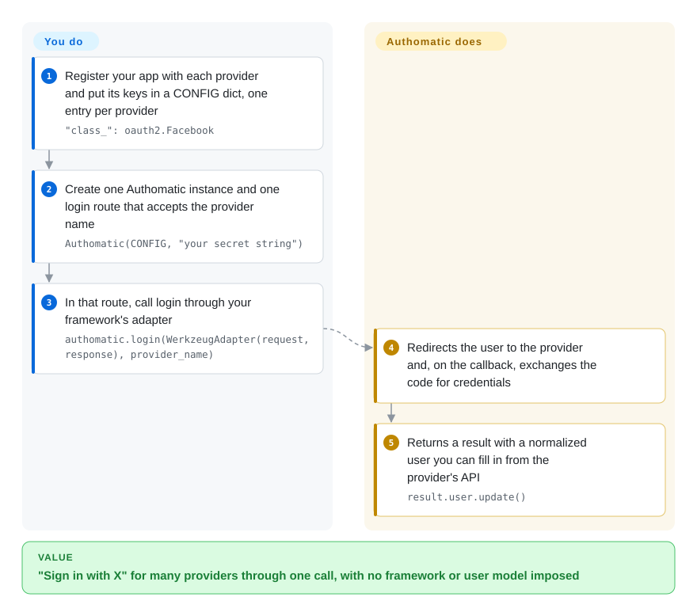

# Authomatic

A Python library for federated login / "sign in with X" — a framework-agnostic OAuth 1.0a, OAuth 2.0 and OpenID client that handles the provider handshake and hands you the authenticated user plus an API-call helper.

## When to use

You're building a Python web app (Flask, Django, WebOb, a WSGI app — Authomatic is deliberately framework-agnostic) and you need "log in with Google / GitHub / Facebook / Twitter" without hand-rolling each provider's OAuth dance. You configure a dict of providers and credentials, drop Authomatic's `login()` call into a single endpoint, and it runs the redirect/callback handshake for whichever provider the user picked, then returns a normalized `user` (id, name, email where available) and a session you can use to make further authorized API requests to that provider. It abstracts OAuth 1.0a *and* OAuth 2.0 *and* OpenID behind one interface, so adding a new provider is mostly a config entry, not a new integration.

You reach for it when you want a *thin, embeddable* social-login client that doesn't impose a framework or a user model — it gives you the authenticated identity and gets out of the way, leaving session/user persistence to your app. It's well-suited to small-to-medium apps and to glue code where a full identity platform would be overkill.

## How it works

Authomatic is an in-process Python library, not a service: you describe each provider once in a plain `CONFIG` dict (which provider class, your client key and secret, the permissions — *scope* — you want), and point one login route at it. **The library runs the whole provider handshake — the redirect to Google or GitHub, the callback, swapping the one-time code for an access token, signing OAuth 1.0a requests — and you decide what a logged-in user means in your app.** Your route calls `authomatic.login()` through an *adapter*, a small wrapper that lets the library read your framework's request and write its response (one ships for Werkzeug/Flask, Django, Pyramid and webapp2); on the first call it returns nothing and has already set up a redirect, and when the provider sends the user back it returns a result with a normalized `user` and the credentials. You then store that user wherever your app keeps users, and can keep using the credentials to call the provider's API. Note that the README on `main` announces a 2.0 that drops OAuth 1.0a and OpenID, while PyPI still serves 1.3.0 (2024-05) with all three protocols.

<!-- flow-steps:begin (generated from flows/authomatic.json by tools/flow_card.py — do not edit) -->

Text version of the flow

1. **You**: Register your app with each provider and put its keys in a CONFIG dict, one entry per provider — `"class_": oauth2.Facebook`
2. **You**: Create one Authomatic instance and one login route that accepts the provider name — `Authomatic(CONFIG, "your secret string")`
3. **You**: In that route, call login through your framework's adapter — `authomatic.login(WerkzeugAdapter(request, response), provider_name)`
4. **Authomatic**: Redirects the user to the provider and, on the callback, exchanges the code for credentials
5. **Authomatic**: Returns a result with a normalized user you can fill in from the provider's API — `result.user.update()`

**Value**: "Sign in with X" for many providers through one call, with no framework or user model imposed

<!-- flow-steps:end -->

## When NOT to use

- **You want a full auth/identity platform (sessions, RBAC, MFA, admin).** Authomatic is a *login client*, not an IdP or auth server — for hosted identity, SSO, SAML, MFA and user management you want Keycloak, Auth0/Okta, or Django's own auth + allauth.
- **You're on Django and want batteries included.** `django-allauth` integrates social + local accounts with Django's user/session model out of the box; Authomatic leaves persistence to you, which is more work on Django specifically.
- **You need SAML / enterprise SSO.** Authomatic targets OAuth/OpenID consumer login; for SAML2 enterprise federation use a SAML library (python3-saml) or an IdP.
- **You need an actively, rapidly-maintained dependency.** Activity is low and release cadence slow; OAuth provider quirks and security fixes may lag — verify recent commits and provider support before betting on it. [推断]
- **You depend on OAuth 1.0a or OpenID providers for the long term.** The README on `main` announces a 2.0 that removes OAuth 1.0a (Twitter, Flickr, Xero and the rest move to OAuth 2.0 or go) and OpenID and requires Python 3.10+, yet no 2.0 is on PyPI and the old modules are still in the tree (checked 2026-10-08). Pin `authomatic<2` knowingly, or use `requests-oauthlib`, which keeps an OAuth 1 client.
- **You're a confident OAuth implementer with one provider.** For a single OAuth2 provider, a focused client (`authlib`, `requests-oauthlib`) or the provider SDK may be simpler than a multi-protocol abstraction.

## Comparison

| Alternative | In index | Our verdict | Tradeoff |
|---|---|---|---|
| Authlib | 未收录 | Choose Authlib when you need a broader and more current OAuth/OIDC/JWT toolkit, especially server-side support; choose Authomatic only when a thin, provider-preset login client is enough. | Comprehensive, actively-maintained Python OAuth1/OAuth2/OIDC + JWT library (client *and* server); broader and more current, but a larger API to learn. |
| django-allauth | 未收录 | Choose django-allauth for Django apps that want social and local auth wired into Django's user/session model; choose Authomatic when framework-agnostic embedding matters more than Django batteries. | Django-specific social + local auth integrated with Django's user/session model; batteries-included on Django, not framework-agnostic. |
| requests-oauthlib / oauthlib | 未收录 | Choose requests-oauthlib or oauthlib when you want lower-level control over one OAuth flow; choose Authomatic when provider presets and a normalized social-login wrapper save more work. | Lower-level OAuth client building blocks; you wire the flow yourself — more control, less convenience than Authomatic's provider presets. |
| python-social-auth | 未收录 | Choose python-social-auth when backend breadth and multi-framework social auth are the priority; choose Authomatic when you want a smaller in-process client and can tolerate lower activity. | Multi-framework social-auth with many backends; broader provider list, heavier and framework-coupling per integration. |
| [Keycloak](keycloak.md) / Auth0 (IdP) | 部分已收录 | Choose Keycloak or Auth0 when you need an identity platform with SSO, MFA, admin, or SAML; choose Authomatic only for app-embedded OAuth/OpenID login client duties. | Full identity providers (hosted or self-run) — SSO, MFA, admin, SAML; a platform, not a client library — different scope entirely. |

## Tech stack

- **Language:** Python; framework-agnostic (works with Flask/Django/WebOb/WSGI via adapters). [未验证]
- **Protocols:** OAuth 1.0a, OAuth 2.0, and OpenID consumer flows behind a single client interface, with a catalog of preconfigured providers.
- **Surface:** a `login()` entry that runs the handshake, returns a normalized `User`, and exposes a session for authorized provider API calls.
- **Distribution:** PyPI (`pip install authomatic`); docs on the project's GitHub Pages site.

## Dependencies

- **Runtime:** Python plus a small set of pip dependencies (HTTP, crypto/signing for OAuth1); exact list is in the packaging metadata. [未验证]
- **Provider credentials:** you must register your app with each OAuth provider and supply client id/secret and redirect URIs.
- **Your web framework + session store:** Authomatic does the handshake; persisting the user/session is your app's responsibility (cookies/DB/etc.).
- **No bundled service or datastore** — it's an in-process client library.

## Ops difficulty

**Low-to-medium.** As code it's just a library — `pip install` and configure. The operational burden is the OAuth lifecycle around it: registering apps per provider, managing client secrets safely, configuring redirect URIs across environments, and keeping up when a provider changes its endpoints or deprecates a flow. Because it leaves user/session persistence to you, you also own that storage. No service of its own to run; the moving parts are the external providers and your secrets handling.

## Health & viability

- **Responsiveness**: Cannot be scored — no_traffic.
- **Maintenance (2026-10).** Last push 2025-12-12 (a FUNDING file); the last code change was the 2.0 branch merged 2025-10-21 during a Google Summer of Code project. Five PRs opened between 2026-02 and 2026-05 sit unreviewed, and the newest PyPI release is still 1.3.0 from 2024-05. Reads as **low-velocity and stalling between bursts**, not abandoned; not archived. [推断]
- **Governance / bus factor.** Hosted under the `authomatic` GitHub **organization** with multiple contributors over time, though clearly led by a small core. Org ownership is a mild positive over a personal account. [推断]
- **Age & Lindy verdict.** ~13.5 years old (created 2013-02) and still receiving bursts of work, most recently a 2025 GSoC push ⇒ a **reasonable Lindy** signal: long-lived and stable, tempered by low recent velocity and an unreleased breaking 2.0. [推断]
- **Adoption.** ~1k stars; an established but niche choice, now competing with the more active Authlib and (on Django) allauth. [未验证]
- **Risk flags.** Auth libraries carry security-sensitivity, so slow fix cadence matters: confirm provider support and recent security commits before depending on it. MIT-licensed, no relicense history found. [推断]

## Caveats (unverified)

- [未验证] ~1k stars and a 2025-12 last-push as of 2026-06; star counts and dates drift — indicative only.
- [未验证] Exact Python version floor, supported framework adapters, and the runtime dependency list are governed by current packaging metadata and change across releases.
- [未验证] The set of preconfigured OAuth providers and their current working status depend on third-party endpoints that change; verify the specific provider you need against the current repo.
- [未验证] The 2.0 state is contradictory as of 2026-10-08: the `main` README and `setup.cfg` (`version = 2.0`) announce removal of OAuth 1.0a/OpenID and Python < 3.10, but `authomatic/providers/oauth1.py` and `openid.py` still define their provider classes, `setup.py` still lists the OpenID extra, and PyPI's latest is 1.3.0. Re-check before assuming either behaviour.
- [推断] "Low-velocity" is inferred from the 2025-12 last-push and slow tag cadence, not a measured release-interval figure.
- [推断] The security-cadence caution is a general property of auth libraries plus the observed low velocity, not a finding of a specific unpatched vulnerability.
