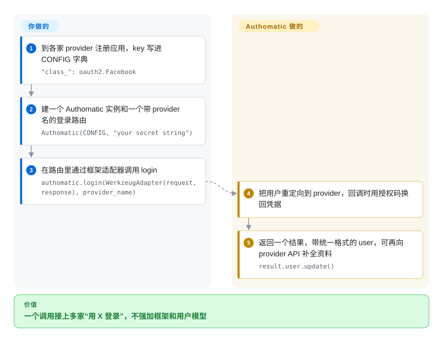

# Authomatic

一个用于联合登录 / “用 X 登录”的 Python 库——框架无关的 OAuth 1.0a、OAuth 2.0 和 OpenID 客户端，替你处理与 provider 的握手，并把认证后的用户和一个 API 调用 helper 交到你手上。

## 何时使用

你在做一个 Python Web 应用（Flask、Django、WebOb、某个 WSGI 应用——Authomatic 刻意做成框架无关），需要“用 Google / GitHub / Facebook / Twitter 登录”，又不想为每个 provider 手搓那套 OAuth 舞步。你配一个 provider 和凭据的字典，在单个端点里放一行 Authomatic 的 `login()` 调用，它就为用户选中的那个 provider 跑完 redirect/callback 握手，然后返回一个规范化的 `user`（id、姓名、尽量含 email）和一个会话，供你继续向该 provider 发已授权的 API 请求。它把 OAuth 1.0a *和* OAuth 2.0 *和* OpenID 藏在一个接口后面，所以新增一个 provider 大多只是加一条配置，而非一次新集成。

当你想要一个*轻、可嵌入*、不强加框架或用户模型的社交登录客户端时你会选它——它把认证身份给你后就让开，会话/用户持久化交回你的应用。它很适合中小型应用，以及那种用完整身份平台属于杀鸡用牛刀的胶水代码。

## 怎么用起来

Authomatic 是进程内的 Python 库，不是一个服务：你在一个普通的 `CONFIG` 字典里把每家 provider 描述一次（用哪个 provider 类、你的 client key 和 secret、要申请的权限范围 scope），再把一个登录路由指向它。**整个与 provider 的握手——把用户重定向到 Google 或 GitHub、接回调、用一次性授权码换 access token、给 OAuth 1.0a 请求签名——都由库来做；“登录成功的用户在你的应用里算什么”由你决定。** 你的路由通过*适配器*调用 `authomatic.login()`——适配器是一层薄包装，让库能读你框架的请求、写它的响应（自带 Werkzeug/Flask、Django、Pyramid、webapp2 几种）；第一次调用时它什么都不返回，但已经安排好重定向，等 provider 把用户送回来，它返回一个结果，里面是统一格式的 `user` 和凭据。之后你把这个用户存进应用自己的用户表，还可以继续拿凭据调 provider 的 API。注意：`main` 分支的 README 宣布了一个去掉 OAuth 1.0a 和 OpenID 的 2.0，而 PyPI 上仍是三种协议都支持的 1.3.0（2024-05）。

<!-- flow-steps:begin (generated from flows/authomatic.json by tools/flow_card.py — do not edit) -->

流程文字版

1. **你**：到各家 provider 注册应用，key 写进 CONFIG 字典 — `"class_": oauth2.Facebook`
2. **你**：建一个 Authomatic 实例和一个带 provider 名的登录路由 — `Authomatic(CONFIG, "your secret string")`
3. **你**：在路由里通过框架适配器调用 login — `authomatic.login(WerkzeugAdapter(request, response), provider_name)`
4. **Authomatic**：把用户重定向到 provider，回调时用授权码换回凭据
5. **Authomatic**：返回一个结果，带统一格式的 user，可再向 provider API 补全资料 — `result.user.update()`

**价值**：一个调用接上多家“用 X 登录”，不强加框架和用户模型

<!-- flow-steps:end -->

## 何时不用

- **你想要完整的认证/身份平台（会话、RBAC、MFA、后台）。** Authomatic 是*登录客户端*，不是 IdP 或认证服务器——要托管身份、SSO、SAML、MFA 和用户管理，你要的是 Keycloak、Auth0/Okta，或 Django 自带 auth + allauth。
- **你在 Django 上、想要开箱即用。** `django-allauth` 把社交 + 本地账号与 Django 的用户/会话模型开箱集成；Authomatic 把持久化留给你，在 Django 上具体而言更费事。
- **你需要 SAML / 企业 SSO。** Authomatic 面向 OAuth/OpenID 的消费级登录；企业 SAML2 联合请用 SAML 库（python3-saml）或一个 IdP。
- **你需要一个活跃、快速维护的依赖。** 活跃度低、发布节奏慢；OAuth provider 的怪癖和安全修复可能滞后——下注前请核实近期提交和 provider 支持。[推断]
- **你长期依赖 OAuth 1.0a 或 OpenID 的 provider。** `main` 分支的 README 宣布 2.0 将移除 OAuth 1.0a（Twitter、Flickr、Xero 等要么迁到 OAuth 2.0、要么去掉）和 OpenID，并要求 Python 3.10 以上；可 PyPI 上还没有 2.0，老模块也仍在代码树里（2026-10-08 查）。要么心里有数地钉住 `authomatic<2`，要么改用仍保留 OAuth 1 客户端的 `requests-oauthlib`。
- **你是熟练的 OAuth 实现者、只对接一个 provider。** 单个 OAuth2 provider，用聚焦的客户端（`authlib`、`requests-oauthlib`）或 provider SDK 可能比多协议抽象更简单。

## 横向对比

| 替代品 | 是否收录 | 我们的评价 | 取舍 |
|---|---|---|---|
| Authlib | 未收录 | 当你需要更广、更新的 OAuth/OIDC/JWT 工具箱，尤其是服务端能力时，选 Authlib；只有当薄登录客户端和 provider 预设已经够用时，才选 Authomatic。 | 全面、活跃维护的 Python OAuth1/OAuth2/OIDC + JWT 库（客户端*和*服务端）；更广更新，但 API 更大要学。 |
| django-allauth | 未收录 | 当 Django 应用想把社交和本地认证接进 Django 用户/会话模型时，选 django-allauth；当框架无关嵌入比 Django 开箱能力更重要时，选 Authomatic。 | Django 专属的社交 + 本地认证，与 Django 用户/会话模型集成；Django 上开箱即用，但非框架无关。 |
| requests-oauthlib / oauthlib | 未收录 | 当你想自己掌控更底层的单个 OAuth 流程时，选 requests-oauthlib 或 oauthlib；当 provider 预设和规范化社交登录包装能省更多事时，选 Authomatic。 | 更底层的 OAuth 客户端积木；流程你自己接——比 Authomatic 的 provider 预设更可控、更不便利。 |
| python-social-auth | 未收录 | 当后端覆盖面和多框架社交认证优先时，选 python-social-auth；当你要更小的进程内客户端且能接受较低活跃度时，选 Authomatic。 | 多框架社交认证、后端众多；provider 列表更广，但更重、每次集成与框架耦合。 |
| [Keycloak](keycloak.zh.md) / Auth0（IdP） | 部分已收录 | 当你需要带 SSO、MFA、后台或 SAML 的身份平台时，选 Keycloak 或 Auth0；只有应用内 OAuth/OpenID 登录客户端职责才交给 Authomatic。 | 完整身份提供方（托管或自建）——SSO、MFA、后台、SAML；是平台而非客户端库——范围完全不同。 |

## 技术栈

- **语言：** Python；框架无关（通过 adapter 支持 Flask/Django/WebOb/WSGI）。[未验证]
- **协议：** OAuth 1.0a、OAuth 2.0 和 OpenID 消费端流程藏在单一客户端接口后面，附带一份预配置 provider 目录。
- **接口面：** 一个 `login()` 入口跑完握手、返回规范化的 `User`，并暴露一个会话用于已授权的 provider API 调用。
- **分发：** PyPI（`pip install authomatic`）；文档在项目的 GitHub Pages 站点。

## 依赖

- **运行时：** Python 加一小撮 pip 依赖（HTTP、OAuth1 的加密/签名）；确切清单见打包元数据。[未验证]
- **provider 凭据：** 你必须在每个 OAuth provider 注册应用，并提供 client id/secret 和 redirect URI。
- **你的 Web 框架 + 会话存储：** Authomatic 负责握手；持久化用户/会话是你的应用的责任（cookie/DB 等）。
- **不捆绑服务或数据存储**——它是进程内客户端库。

## 运维难度

**低到中。** 作为代码它只是个库——`pip install` 再配置即可。运维负担在于它周围的 OAuth 生命周期：为每个 provider 注册应用、安全地管理 client secret、在各环境配 redirect URI，以及在 provider 改端点或弃用某流程时跟进。因为它把用户/会话持久化留给你，那块存储也归你管。它自身没有要跑的服务；活动部件是外部 provider 和你的 secret 处理。

## 健康度与可持续性

- **响应速度**：无法计算——no_traffic。
- **维护（2026-10）。** 最后 push 在 2025-12-12（加了一个 FUNDING 文件）；最后一次代码改动是 2025-10-21 合入的 2.0 分支，来自一次 Google Summer of Code 项目。2026-02 到 2026-05 之间提的五个 PR 都没人审，PyPI 上最新的仍是 2024-05 的 1.3.0。读作**低速、两波之间趋于停滞**，并非废弃；未归档。[推断]
- **治理 / bus factor。** 托管在 `authomatic` GitHub **组织**下，历来有多位贡献者，但明显由一小撮核心主导。组织归属比个人账号略好。[推断]
- **年龄与 Lindy 判断。** 约 13 年半（2013-02 创建），仍会一阵一阵地有人投入，最近一次是 2025 年的 GSoC⇒ **尚可的 Lindy** 信号：存活久、稳定，但被近期低速和一个尚未发布的破坏性 2.0 抵消一部分。[推断]
- **采用度。** 约 1k star；一个成熟但小众的选择，如今与更活跃的 Authlib 和（在 Django 上）allauth 竞争。[未验证]
- **风险标记。** 认证库带安全敏感性，所以修复节奏慢很要紧：依赖前请确认 provider 支持和近期安全提交。MIT 许可，未发现 relicense 历史。[推断]

## 存疑（未验证）

- [未验证] 截至 2026-06 约 1k star、2025-12 最后 push；star 数和日期会漂移，仅供参考。
- [未验证] 确切的 Python 最低版本、支持的框架 adapter 和运行时依赖清单由当前打包元数据决定且随版本变化。
- [未验证] 预配置 OAuth provider 的集合及其当前可用状态取决于会变的第三方端点；请对照当前仓库核实你需要的那个 provider。
- [未验证] 截至 2026-10-08，2.0 的状态自相矛盾：`main` 上的 README 和 `setup.cfg`（`version = 2.0`）宣布移除 OAuth 1.0a/OpenID 和 Python 3.10 以下支持，但 `authomatic/providers/oauth1.py`、`openid.py` 仍定义着各自的 provider 类，`setup.py` 仍列着 OpenID 可选依赖，PyPI 最新版仍是 1.3.0。按哪种行为来用之前先复查。
- [推断] “低速”是从 2025-12 最后 push 和缓慢的 tag 节奏推断，而非实测的发布间隔数字。
- [推断] 安全节奏的提醒是认证库的一般属性加上观察到的低速，而非发现了某个具体未修补漏洞。
