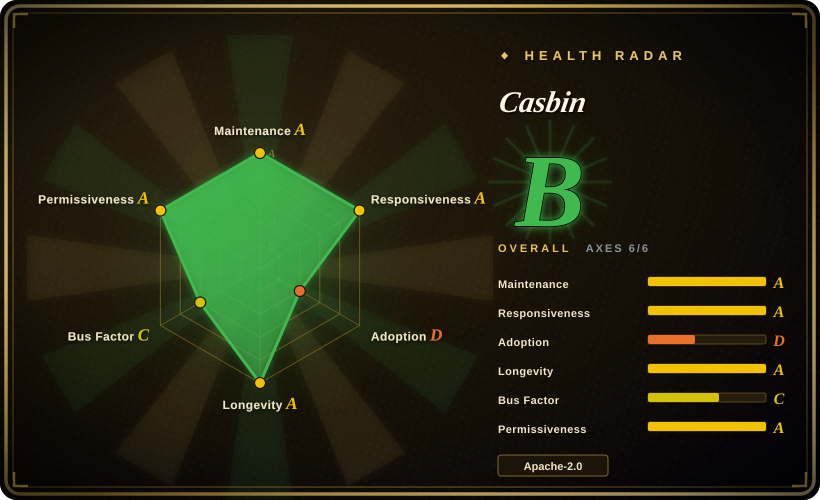
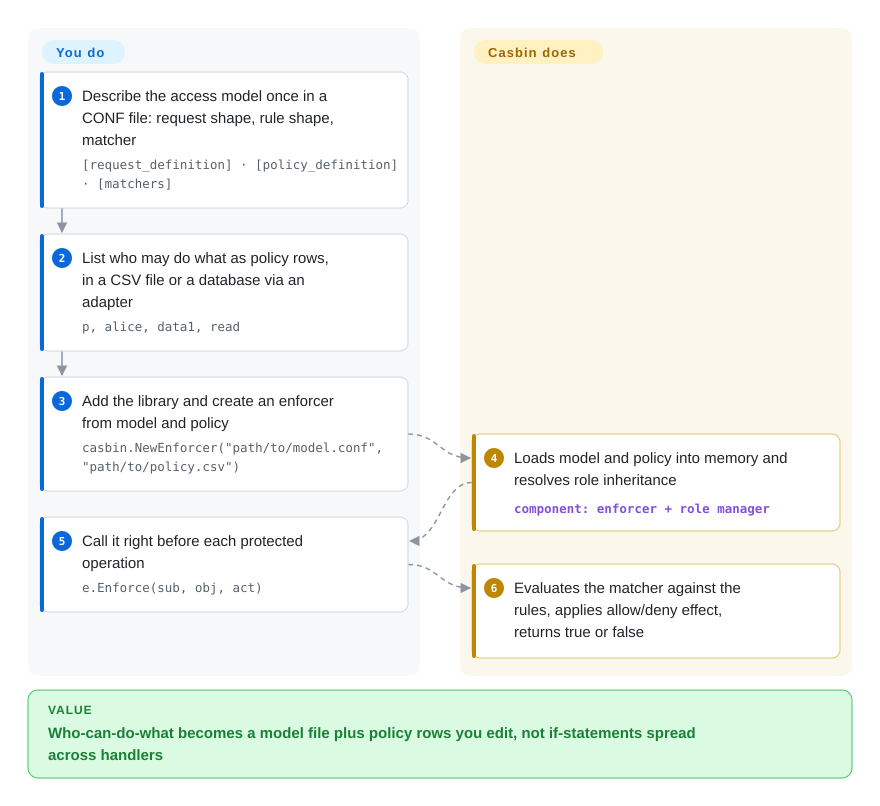

# Casbin

Permission checks end up as `if user.role == "admin" || user.id == doc.owner_id` scattered across a hundred handlers, and every new rule ("managers can approve, but only in their own tenant") means hunting through all of them. Casbin moves those rules into one model file plus a table of policy rows, and your handlers only ask `e.Enforce(user, resource, action)` — a library call inside your own process, no extra server.

## When to use

You're building a Go service (or Java, Node.js, Python, PHP, .NET, Rust — Casbin has ports for each) and authorization has outgrown hard-coded role checks. Product now wants per-tenant roles, a "deny beats allow" rule for suspended accounts, and URL-pattern rules like `/api/projects/:id` → `GET`. Each change means editing and redeploying code in many places. You add Casbin, write the access model once — "a request is (subject, object, action); a rule matches if the role and path pattern match" — store the rules as rows in a file or your existing database, and replace the scattered checks with one `Enforce` call before each protected operation. Changing who-can-do-what becomes a policy-row edit, not a code change.

Choose it over a central authorization service such as OpenFGA or OPA when you want **no extra service on the request path**: Casbin runs in-process, its decision is a function call, and the model language covers ACL, RBAC (with role hierarchy and per-tenant domains), ABAC attributes, RESTful path matching and deny-override in one config format. Choose it over a framework-specific helper such as django-rules when you need the same policy model across several languages or want rules stored as data rather than Python functions.

## How it works

Casbin splits authorization into two pieces you write and one engine it supplies. The **model** is a small CONF file describing the shape of a request (`r = sub, obj, act`), the shape of a rule, how multiple matching rules combine (for example "any allow wins" or "deny overrides"), and a **matcher** — a boolean expression such as `r.sub == p.sub && keyMatch(r.obj, p.obj)`. The **policy** is the list of concrete rules (`p, alice, data1, read`, `g, alice, admin` for role membership), kept in a CSV file or, through an **adapter** (a plug-in storage driver), in MySQL, PostgreSQL, MongoDB, Redis and dozens of other stores. **What Casbin does for you:** the enforcer loads model and policy into memory, resolves role inheritance, evaluates the matcher against every candidate rule and applies the effect, and offers management APIs to add or remove rules at run time. **What you do:** design the model, populate the policy, call `Enforce` at each access point, and — because Casbin explicitly does not do it — authenticate users and keep the user list yourself. With several service instances you also wire a **watcher** (a pub/sub plug-in) so a policy change on one node is reloaded on the others.

<!-- flow-steps:begin (generated from flows/casbin.json by tools/flow_card.py — do not edit) -->

Text version of the flow

1. **You**: Describe the access model once in a CONF file: request shape, rule shape, matcher — `[request_definition] · [policy_definition] · [matchers]`
2. **You**: List who may do what as policy rows, in a CSV file or a database via an adapter — `p, alice, data1, read`
3. **You**: Add the library and create an enforcer from model and policy — `casbin.NewEnforcer("path/to/model.conf", "path/to/policy.csv")`
4. **Casbin**: Loads model and policy into memory and resolves role inheritance — component: `enforcer + role manager`
5. **You**: Call it right before each protected operation — `e.Enforce(sub, obj, act)`
6. **Casbin**: Evaluates the matcher against the rules, applies allow/deny effect, returns true or false

**Value**: Who-can-do-what becomes a model file plus policy rows you edit, not if-statements spread across handlers

<!-- flow-steps:end -->

## When NOT to use

- **You need login, SSO or user management.** Casbin's README states it does not authenticate users or manage the user list. Put an identity provider such as [Keycloak](keycloak.md) in front, and use Casbin only for the "may this user do this" decision afterwards.
- **Your permissions are mostly relationship chains at large scale** — "Bob may edit this file because his team edits the parent folder", over more objects than one process can hold. Casbin can model per-resource roles (its docs call it ReBAC), but its own Casbin-vs-OpenFGA guide says the policy set must fit in application memory and points to OpenFGA when rules are relationship chains or the tuple count outgrows memory. Use [OpenFGA](openfga.md) there.
- **Many services in different languages must give identical answers.** The ports live in separate repositories with uneven features (the README notes the `in` operator works in Go but not in jCasbin or node-Casbin). A single policy decision service — [OpenFGA](openfga.md), or OPA/Cerbos (not indexed) — removes cross-port drift. (Casbin Server can wrap Casbin as a service too, but then you've given up its main advantage.)
- **You run many replicas and won't wire policy sync.** Each process holds its own copy of the policy; without a watcher and a shared adapter, nodes serve stale decisions after a change. If you don't want to own that, use a central service such as [OpenFGA](openfga.md).
- **A few permission predicates inside one Django app.** Casbin's model file and adapter are overhead there; [django-rules](django-rules.md) keeps rules as plain Python functions in process.
- **You need policy as general code (loops, data joins, external lookups).** A Casbin matcher is one boolean expression over request and rule fields (it can call functions you register in Go, but the logic lives in your code, not the policy); OPA's Rego (not indexed) is a full policy language for that.

## Comparison

| Alternative | In index | Our verdict | Tradeoff |
|---|---|---|---|
| [OpenFGA](openfga.md) | ✅ | When permissions follow relationships (owner, member-of, parent-folder) and you need "list what X can access" across services, pick OpenFGA; pick Casbin when rule-based RBAC/ABAC inside the process is enough and you don't want another service. | OpenFGA centralizes a relationship store with reverse queries but adds a networked service and a database; Casbin is an in-process call with no server, but every replica holds its own policy copy. |
| [django-rules](django-rules.md) | ✅ | For a single Django app with a handful of object-level predicates, pick django-rules; pick Casbin when you need RBAC with domains, deny-override or the same model across several languages. | django-rules is plain Python predicates with zero storage; Casbin adds a model file and an adapter but makes rules data you can edit at run time. |
| [Keycloak](keycloak.md) | ✅ | Use Keycloak for who-you-are (login, SSO, users) and Casbin for what-you-may-do inside your service; pick Keycloak's own Authorization Services only if you accept central, token-based permission checks. | Different layers: Keycloak is a whole identity server to operate; Casbin is a library that assumes authentication already happened. |
| OPA (Open Policy Agent) | not indexed | When policies need real logic (Rego) and one decision point for Kubernetes, APIs and CI alike, pick OPA; pick Casbin when a declarative ACL/RBAC/ABAC model is enough and you want an in-process library. | OPA's Rego is far more expressive and language-neutral but is a separate language and usually a sidecar; Casbin is simpler but tied to per-language ports. |
| Cerbos | not indexed | When you want a stateless policy decision service with YAML policies and versioned tests, pick Cerbos; pick Casbin when you want no service at all. | Cerbos gives one decision point for all languages at the cost of running it; Casbin avoids the hop but repeats the engine in each language port. |

## Tech stack

- **Language:** Go; module path `github.com/casbin/casbin/v3` (v3.0.0 shipped 2025-12-09; the v2 line ended at v2.135.0).
- **Direct dependencies:** only three — `casbin/govaluate` (the matcher expression evaluator), `bmatcuk/doublestar` (glob matching) and `google/uuid`.
- **Model format:** CONF files based on the PERM metamodel (Policy, Effect, Request, Matchers); policy as CSV or via adapters.
- **Variants in the core package:** cached, synced (thread-safe), context-aware, transactional and distributed enforcers; an opt-in `Explain` API that asks an OpenAI-compatible endpoint to describe why a decision was made.
- **Other languages:** separate repositories for Java (jCasbin), Node.js, PHP, Python (PyCasbin), .NET, C++ and Rust.

## Dependencies

- **Runtime:** none beyond the library itself; a policy CSV file is enough to start.
- **Policy storage (optional):** an adapter package plus the database it talks to (the adapters docs list MySQL, PostgreSQL, MongoDB, Redis and dozens more; e.g. `xorm-adapter`).
- **Multi-node sync (optional):** a watcher package plus its message bus (the watchers docs name etcd, Redis, Kafka and NATS) so replicas reload policy after changes.
- **Authentication:** an external system of your choice — Casbin does not provide it.
- **`Explain` (optional):** an OpenAI-compatible API endpoint and key, only if you turn that feature on.

## Ops difficulty

**Low** for a single process with file or DB-backed policy: it's a dependency, not a service. **Medium** once you run many replicas: you pick and maintain an adapter and a watcher (both separate, community-maintained packages of varying quality), reason about consistency windows after policy edits, and keep model files under review because a wrong matcher silently grants or denies. Upgrading from v2 means changing import paths to `/v3`.

## Health & viability

- **Maintenance (2026-10-08):** active — v3.11.0 shipped 2026-08-20 and the default branch had commits on 2026-10-05; the radar's median time-to-first-response on issues is under 10 hours.
- **Governance & bus factor:** now under the Apache Software Foundation as an **incubating** project (the repo carries the ASF incubation DISCLAIMER), but one person still dominates: the founder has ~743 commits against ~53 for the next contributor, and the radar puts the top contributor at ~62% of recent activity. ASF process mitigates this; it doesn't remove it until graduation.
- **Backing & Lindy:** created 2017-04 (about 9.5 years) and active throughout, with ports in eight languages — a strong age-and-still-active signal for a library.
- **Adoption:** ~20.4k stars on the Go repo, plus the separate ports; the README lists adopters and framework middlewares. The radar's D on adoption reflects that Go modules have no public download counter (it found only 142 release-asset downloads), not low use [推断].
- **Risk flags:** Apache-2.0 throughout; the main risks are the v2 → v3 module-path break and the quality spread across third-party adapters and watchers.

## Caveats (unverified)

- [未验证] The in-memory ceiling comes from Casbin's own docs ("the policy set of one application should fit in memory", with policy subset loading as the mitigation); no benchmark at a given policy size was checked here.
- [未验证] Feature parity between the Go core and each language port beyond the `in`-operator gap the README names was not audited.
- [未验证] The quality and maintenance of individual adapters and watchers was not checked; they live in separate repositories.
- [推断] The ASF graduation timeline is unknown; incubation status was read from the repo's DISCLAIMER file, not from ASF board reports.
- [推断] The radar's adoption D is a measurement gap for Go modules (no registry download counts), judged from stars and ports rather than measured usage.
