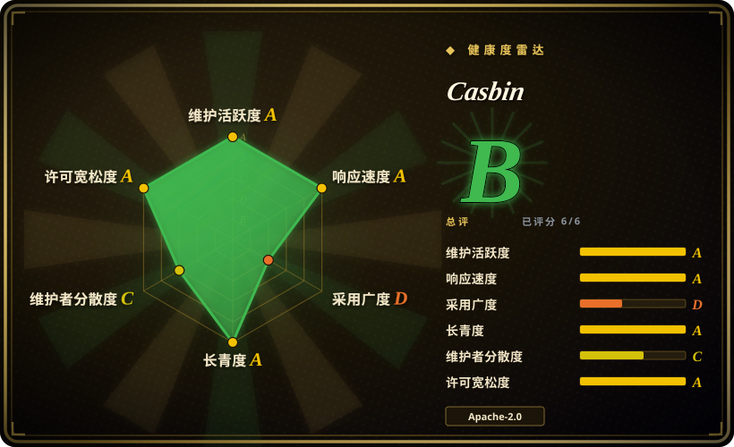
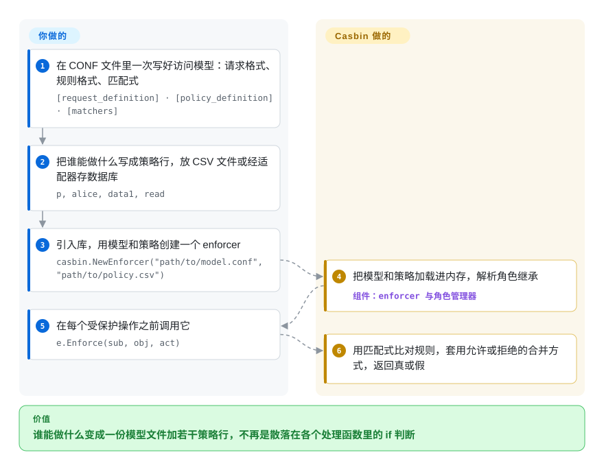

# Casbin

权限判断写成 `if user.role == "admin" || user.id == doc.owner_id`，散落在上百个处理函数里；每加一条新规则（“经理可以审批，但只限自己的租户”），就得把它们全翻一遍。Casbin 把这些规则收进一份模型文件和一张策略表，处理函数只问一句 `e.Enforce(用户, 资源, 动作)`——这是你自己进程里的一次库调用，不用再起一个服务。

## 何时使用

你在写一个 Go 服务（Java、Node.js、Python、PHP、.NET、Rust 也行——Casbin 每种都有移植版），权限已经不是几个写死的角色判断能撑住的了。产品要按租户分角色、要“拒绝优先于允许”来处理被停用的账号、还要 `/api/projects/:id` → `GET` 这种按路径模式的规则，每改一次都得在很多地方改代码、重新发布。你引入 Casbin，把访问模型写一次——“一个请求是（主体、对象、动作）；角色和路径模式都对上就算命中”——把规则作为行存进文件或你现有的数据库，再把散落的判断换成每个受保护操作前的一次 `Enforce` 调用。以后改“谁能做什么”只是改策略行，不再改代码。

和 OpenFGA、OPA 这类集中式授权服务比，当你**不想在请求路径上多一个服务**时选它：Casbin 在进程内运行，一次判断就是一次函数调用；它的模型语言用一种配置格式就覆盖了 ACL、RBAC（含角色继承和按租户划分的域）、ABAC 属性、RESTful 路径匹配和拒绝优先。和 django-rules 这类绑定框架的工具比，当你需要在多种语言之间共用同一套策略模型、或者希望规则是数据而不是 Python 函数时选它。

## 怎么用起来

Casbin 把授权拆成两份由你写的东西和一个由它提供的引擎。**模型**是一个小 CONF 文件，描述请求长什么样（`r = sub, obj, act`）、规则长什么样、多条命中规则如何合并（比如“有一条允许就放行”或“拒绝优先”），以及一个**匹配式**——一个布尔表达式，例如 `r.sub == p.sub && keyMatch(r.obj, p.obj)`。**策略**是一条条具体规则（`p, alice, data1, read`，角色归属写成 `g, alice, admin`），可以放在 CSV 文件里，也可以通过**适配器**（可插拔的存储驱动）存进 MySQL、PostgreSQL、MongoDB、Redis 等几十种存储。**Casbin 替你做的：**enforcer 把模型和策略加载进内存，解析角色继承，拿匹配式逐条比对候选规则并套用合并方式，还提供在运行时增删规则的管理 API。**你要做的：**设计模型、填策略、在每个访问点调用 `Enforce`，以及——因为 Casbin 明确不做——自己负责用户认证和用户列表。服务有多个实例时，你还要接一个**watcher**（发布订阅插件），让一个节点上的策略改动能被其他节点重新加载。

<!-- flow-steps:begin (generated from flows/casbin.json by tools/flow_card.py — do not edit) -->

流程文字版

1. **你**：在 CONF 文件里一次写好访问模型：请求格式、规则格式、匹配式 — `[request_definition] · [policy_definition] · [matchers]`
2. **你**：把谁能做什么写成策略行，放 CSV 文件或经适配器存数据库 — `p, alice, data1, read`
3. **你**：引入库，用模型和策略创建一个 enforcer — `casbin.NewEnforcer("path/to/model.conf", "path/to/policy.csv")`
4. **Casbin**：把模型和策略加载进内存，解析角色继承 — 组件：`enforcer 与角色管理器`
5. **你**：在每个受保护操作之前调用它 — `e.Enforce(sub, obj, act)`
6. **Casbin**：用匹配式比对规则，套用允许或拒绝的合并方式，返回真或假

**价值**：谁能做什么变成一份模型文件加若干策略行，不再是散落在各个处理函数里的 if 判断

<!-- flow-steps:end -->

## 何时不用

- **你需要登录、单点登录或用户管理。** Casbin 的 README 写明它不做用户认证、不管理用户列表。前面放一个身份提供方，比如 [Keycloak](keycloak.zh.md)，Casbin 只负责之后“这个用户能不能做这件事”的判断。
- **你的权限主要是大规模的关系链。** 比如“Bob 能编辑这个文件，是因为他所在团队能编辑上级文件夹”，而且对象多到一个进程装不下。Casbin 能表达按资源划分的角色（文档里叫 ReBAC），但它自己的《Casbin vs. OpenFGA》指南说策略集要能放进应用内存，并在规则以关系链为主、或元组数量超出内存时推荐 OpenFGA。这种情况用 [OpenFGA](openfga.zh.md)。
- **多种语言写的很多服务必须给出完全一致的答案。** 各语言移植版在不同仓库里，功能不齐（README 提到 `in` 运算符在 Go 版可用，jCasbin 和 node-Casbin 不支持）。用一个集中的策略决策服务——[OpenFGA](openfga.zh.md)，或 OPA、Cerbos（未收录）——就不会有移植版之间的偏差。（Casbin Server 也能把 Casbin 包成服务，但那样就丢掉了它最大的优势。）
- **你跑很多副本，又不打算接策略同步。** 每个进程各持一份策略；没有 watcher 和共享的适配器，改动之后各节点会给出过期的判断。不想自己管这件事，就用 [OpenFGA](openfga.zh.md) 这样的集中服务。
- **只是一个 Django 应用里的几条权限判断。** Casbin 的模型文件和适配器在这里是额外负担；[django-rules](django-rules.zh.md) 把规则写成进程内的普通 Python 函数就够了。
- **你需要把策略写成通用代码（循环、数据关联、外部查询）。** Casbin 的匹配式是作用在请求和规则字段上的单个布尔表达式（可以调用你在 Go 里注册的函数，但逻辑在你的代码里，不在策略里）；这类需求用 OPA 的 Rego（未收录），它是一门完整的策略语言。

## 横向对比

| 替代品 | 是否收录 | 我们的评价 | 取舍 |
|---|---|---|---|
| [OpenFGA](openfga.zh.md) | ✅ | 权限沿着关系走（所有者、成员、上级文件夹），而且要跨服务查“X 能访问哪些东西”时选 OpenFGA；进程内基于规则的 RBAC、ABAC 就够用、不想多一个服务时选 Casbin。 | OpenFGA 集中存关系、支持反向查询，但多了一个联网服务和一个数据库；Casbin 是进程内调用、没有服务端，但每个副本各持一份策略。 |
| [django-rules](django-rules.zh.md) | ✅ | 单个 Django 应用、只有几条对象级判断时选 django-rules；需要带域的 RBAC、拒绝优先，或在几种语言间共用同一模型时选 Casbin。 | django-rules 是普通 Python 判断函数，不用存储；Casbin 多了模型文件和适配器，但规则成了运行时可改的数据。 |
| [Keycloak](keycloak.zh.md) | ✅ | 用 Keycloak 解决“你是谁”（登录、单点登录、用户），用 Casbin 解决服务内部“你能做什么”；只有接受集中式、基于令牌的权限检查时，才用 Keycloak 自带的 Authorization Services 代替它。 | 层次不同：Keycloak 是要整体运维的身份服务器；Casbin 是一个库，前提是认证已经做完。 |
| OPA（Open Policy Agent） | 未收录 | 策略需要真正的逻辑（Rego），并且要给 Kubernetes、API、CI 用同一个决策点时选 OPA；声明式的 ACL、RBAC、ABAC 模型就够、想要进程内库时选 Casbin。 | OPA 的 Rego 表达力强得多、与语言无关，但要学一门新语言，通常还得跑 sidecar；Casbin 更简单，但依赖各语言的移植版。 |
| Cerbos | 未收录 | 想要一个用 YAML 写策略、带版本化测试的无状态策略决策服务时选 Cerbos；完全不想跑服务时选 Casbin。 | Cerbos 为所有语言提供同一个决策点，代价是要运行它；Casbin 省掉网络往返，但每种语言都要各自实现一遍引擎。 |

## 技术栈

- **语言：** Go；模块路径 `github.com/casbin/casbin/v3`（v3.0.0 发布于 2025-12-09，v2 线停在 v2.135.0）。
- **直接依赖：** 只有三个——`casbin/govaluate`（匹配式求值器）、`bmatcuk/doublestar`（通配符匹配）和 `google/uuid`。
- **模型格式：** 基于 PERM 元模型（Policy、Effect、Request、Matchers）的 CONF 文件；策略用 CSV 或经适配器存储。
- **核心包里的变体：** 带缓存、线程安全（synced）、带 context、带事务和分布式的 enforcer；还有一个需手动开启的 `Explain` API，会调用兼容 OpenAI 的接口，用自然语言解释某次判断的原因。
- **其他语言：** Java（jCasbin）、Node.js、PHP、Python（PyCasbin）、.NET、C++、Rust 各有独立仓库。

## 依赖

- **运行时：** 除库本身外没有别的；一份策略 CSV 文件就能开始。
- **策略存储（可选）：** 一个适配器包加它连接的数据库（适配器文档列了 MySQL、PostgreSQL、MongoDB、Redis 等几十种，例如 `xorm-adapter`）。
- **多节点同步（可选）：** 一个 watcher 包加它用的消息总线（watcher 文档点名了 etcd、Redis、Kafka、NATS），让各副本在改动后重新加载策略。
- **认证：** 由你自选的外部系统负责——Casbin 不提供。
- **`Explain`（可选）：** 只有开启这个功能时，才需要一个兼容 OpenAI 的 API 端点和 key。

## 运维难度

**单进程、策略放文件或数据库：低。** 它是一个依赖，不是一个服务。**跑很多副本时：中。** 你要挑选并维护一个适配器和一个 watcher（都是独立的社区包，质量参差），要考虑策略修改后的一致性窗口，还要把模型文件纳入评审，因为写错的匹配式会悄无声息地多放行或多拒绝。从 v2 升级需要把导入路径改成 `/v3`。

## 健康度与可持续性

- **维护（2026-10-08）：** 活跃——v3.11.0 发布于 2026-08-20，默认分支 2026-10-05 还有提交；雷达统计的 issue 首次响应中位时间不到 10 小时。
- **治理与单点风险：** 现在归 Apache 软件基金会，处于**孵化**阶段（仓库带有 ASF 孵化 DISCLAIMER），但仍由一个人主导：创始人约 743 次提交，第二名约 53 次，雷达测得头号贡献者占近期活动约 62%。ASF 的流程能缓解这一点，但在毕业之前消除不了。
- **背书与 Lindy：** 2017-04 创建（约 9.5 年），一直活跃，有八种语言的移植版——对一个库来说，是“年头长且仍活跃”的强信号。
- **采用：** Go 仓库约 2.04 万 stars，另有各语言移植版；README 列了采用者和各框架的中间件。雷达给采用打 D，是因为 Go 模块没有公开的下载计数（它只找到 142 次 release 资源下载），不代表用的人少 [推断]。
- **风险信号：** 一直是 Apache-2.0；主要风险是 v2 → v3 的模块路径断裂，以及第三方适配器和 watcher 的质量参差。

## 存疑（未验证）

- [未验证] 内存上限来自 Casbin 自己的文档（“一个应用的策略集应能放进内存”，缓解手段是按需加载策略子集）；本页没有核对某个策略规模下的基准数据。
- [未验证] 除 README 点名的 `in` 运算符差异外，Go 核心与各语言移植版之间的功能对齐情况没有逐项核查。
- [未验证] 各适配器和 watcher 的质量与维护情况没有检查，它们在独立仓库里。
- [推断] ASF 毕业时间未知；孵化状态读自仓库的 DISCLAIMER 文件，不是 ASF 理事会报告。
- [推断] 雷达的采用 D 是 Go 模块的测量盲区（没有注册表下载计数），这是从 stars 和移植版推断的，不是实测使用量。
