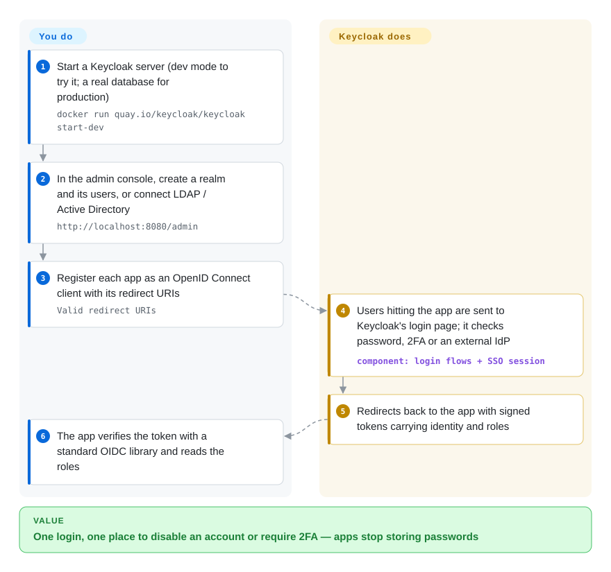

# Keycloak

Every internal app ships its own login form, password table and "forgot password" email, so a departing employee has to be removed in seven places and nobody can turn on two-factor auth everywhere at once. Keycloak is a login server you run once: apps send users to it, it handles passwords, 2FA, social and corporate logins, and hands each app a signed token saying who the user is and which roles they hold.

## When to use

You're the platform or security engineer for a company with a dozen internal tools and two customer-facing apps, written in different stacks. Each one grew its own `users` table; offboarding is a checklist of seven admin panels, auditors are asking for MFA everywhere, and the sales team wants "Sign in with Google" plus SAML login for an enterprise customer whose staff live in Azure AD. You deploy Keycloak, create a realm (Keycloak's word for an isolated tenant of users and apps), connect your LDAP/Active Directory or let it store users itself, and register each app as a client. From then on every app redirects to the same login page, gets back a standard OpenID Connect token, and disabling one account locks the person out of everything.

Pick it over a hosted identity provider such as Auth0 or Okta when you must self-host (data residency, air-gapped networks, per-user SaaS pricing at your scale) and want the broadest protocol coverage — OIDC, OAuth 2.0, SAML 2.0, LDAP/Kerberos federation, identity brokering — in one Apache-2.0 server with an admin console. Pick it over lighter self-hosted options such as Authentik, Zitadel or Authelia when that breadth and a 13-year, CNCF-hosted track record matter more than a small footprint.

## How it works

Keycloak is a standalone Java server with its own database; your applications never see a password. **What it does for you:** serves the login, registration, password-reset and 2FA pages (themeable), stores and hashes credentials or delegates them to LDAP/Active Directory, brokers logins from Google, GitHub or another SAML/OIDC provider, keeps the single-sign-on session, and issues signed tokens — compact JSON documents carrying the user's identity and roles that your app can verify without calling back. It also ships an admin console, an account console for end users, a REST admin API, and (opt-in) features such as SCIM provisioning and verifiable credentials. **What you do:** run it with a production database and TLS, model realms, clients and roles, and make each app "OIDC-aware" — usually by adding your framework's standard OpenID Connect library rather than a Keycloak-specific SDK — so that it redirects unauthenticated users to Keycloak and checks the token on the way back. Deciding what a logged-in user may do inside the app (beyond the roles in the token) stays your job, or that of an authorization engine.

<!-- flow-steps:begin (generated from flows/keycloak.json by tools/flow_card.py — do not edit) -->

Text version of the flow

1. **You**: Start a Keycloak server (dev mode to try it; a real database for production) — `docker run quay.io/keycloak/keycloak start-dev`
2. **You**: In the admin console, create a realm and its users, or connect LDAP / Active Directory — `http://localhost:8080/admin`
3. **You**: Register each app as an OpenID Connect client with its redirect URIs — `Valid redirect URIs`
4. **Keycloak**: Users hitting the app are sent to Keycloak's login page; it checks password, 2FA or an external IdP — component: `login flows + SSO session`
5. **Keycloak**: Redirects back to the app with signed tokens carrying identity and roles
6. **You**: The app verifies the token with a standard OIDC library and reads the roles

**Value**: One login, one place to disable an account or require 2FA — apps stop storing passwords

<!-- flow-steps:end -->

## When NOT to use

- **One app, a few social logins.** A whole identity server is overkill; use a login library in the app — e.g. [Authomatic](authomatic.md) for Python OAuth/OpenID, or your framework's auth module.
- **You need per-object permissions** ("Alice may edit document 42 because she's in the team that owns its folder"). Keycloak's strength is authentication and coarse roles in the token; its Authorization Services are central and token-oriented. Keep identity in Keycloak and put object-level decisions in [OpenFGA](openfga.md) (relationship-based, central) or [Casbin](casbin.md) (in-process library).
- **You have no JVM ops capacity or very tight resources.** Keycloak needs a JDK-based server, a relational database and, when clustered, a distributed cache. For protecting a handful of self-hosted apps behind a reverse proxy, Authelia (not indexed) is far lighter; if you want no ops at all, use a hosted IdP such as Auth0 (not a repo).
- **You want a headless, API-first identity layer with your own login UI.** Keycloak's login experience is server-rendered pages you theme. Ory Kratos (not indexed) exposes identity flows as APIs for your own frontend.
- **You need long-term support on one version.** The community project releases a minor about four times a year, ships security fixes only for the latest minor, and its RELEASES.md says important fixes may break compatibility in any release. If you can't upgrade quarterly, buy the Red Hat build of Keycloak (commercial, not a repo) or pick a product with an LTS branch.
- **Your team is building multi-tenant B2B SaaS and wants organizations, invitations and branded per-tenant login out of the box with minimal setup.** Keycloak can do it with realms or its Organizations feature, but Zitadel (not indexed) is built around that model from the start.

## Comparison

| Alternative | In index | Our verdict | Tradeoff |
|---|---|---|---|
| Authentik | not indexed | For a homelab or small company that wants SSO across self-hosted apps with a friendlier UI and built-in reverse-proxy outpost, pick Authentik; pick Keycloak when you need enterprise federation (Kerberos, SAML brokering) and a long, foundation-hosted track record. | Authentik is easier to start and has proxy-auth built in; Keycloak has broader protocol coverage and far more production mileage, at higher JVM and ops cost. |
| Zitadel | not indexed | For multi-tenant B2B SaaS where every customer is an organization with its own login branding, pick Zitadel; pick Keycloak for an internal or single-product identity hub with LDAP/AD federation. | Zitadel is built around organizations and an API-first, event-sourced design; Keycloak is more mature but tenancy is bolted onto realms and the newer Organizations feature. |
| Ory Kratos + Hydra | not indexed | When you want headless identity APIs and full control of the login UI in your own frontend, pick Ory; pick Keycloak when you want login pages, admin console and federation working on day one. | Ory splits identity and OAuth2 into small Go services with no UI; you write the screens. Keycloak gives you everything in one server, but customizing beyond themes means Java SPIs. |
| Auth0 / Okta | not a repo | If you'd rather pay per user than operate an identity server, pick Auth0/Okta; pick Keycloak when self-hosting, data residency or per-user cost at scale rules out SaaS. | Hosted: no ops, strong SLAs and integrations, but vendor lock-in and pricing that grows with monthly active users. |
| [Casbin](casbin.md) | ✅ | Not a substitute but the usual partner: Keycloak answers "who is this", Casbin answers "may they do this" inside your service. Pick Casbin only for the authorization half. | Using both means two systems to keep consistent (roles in Keycloak tokens vs. policies in Casbin); in exchange each does the half it is good at. |

## Tech stack

- **Language / framework:** Java on Quarkus (3.40.x on `main`); JPA/Hibernate for persistence; admin and account consoles in JavaScript/TypeScript under `js/`.
- **Caching & clustering:** embedded Infinispan with JGroups transport by default; external Infinispan for multi-site; 26.8 adds a supported stateless multi-cluster mode without an external cache.
- **Protocols:** OpenID Connect, OAuth 2.0, SAML 2.0, LDAP/Active Directory and Kerberos federation, identity brokering; newer additions include SCIM, OID4VCI/OID4VP and token-exchange delegation.
- **Distribution:** a ZIP (`bin/kc.sh`), the container image `quay.io/keycloak/keycloak`, and a Kubernetes Operator.
- **Extension model:** Java SPIs (service provider interfaces) for custom authenticators, user storage, event listeners and themes.

## Dependencies

- **JDK** 17, 21 or 25 if you run the ZIP (the container image bundles one).
- **A relational database for production:** PostgreSQL, MySQL, MariaDB, Microsoft SQL Server, Oracle or TiDB. The default `dev-file` database is for development only.
- **TLS and a hostname** configured on the server or a reverse proxy in front of it.
- **For HA:** several nodes sharing the database and an Infinispan cluster (embedded or external), or the newer stateless mode.
- **Optional:** LDAP/Active Directory for user federation, an SMTP server for verification and reset emails, external identity providers for brokering.

## Ops difficulty

**Medium to high.** `start-dev` runs in one command, but production is a different mode: you pick a database, set hostname and TLS, size JVM memory, often build an optimized image (`kc.sh build`), and plan clustering. The heaviest recurring cost is upgrades — four minors a year, security fixes only on the latest one, possible breaking changes in any release, and custom themes or Java extensions that may need rework each time. In exchange, one well-run cluster replaces login code in every app.

## Health & viability

- **Maintenance (2026-10-08):** very active — 26.8.0 shipped 2026-10-01 and 26.7.5 the day before; the radar measures a median first response on issues of 2.6 hours (2026-10-09). ~3.2k open issues reflect its size, not neglect.
- **Governance & bus factor:** 11 listed maintainers, 9 of them at IBM (which now carries the former Red Hat team), plus Bosch, Hitachi and Identity Tailor; the project lead is Stian Thorgersen. Contributions are broad (radar: 164 active contributors in 12 months, top contributor ~11%), but the roadmap is vendor-driven.
- **Backing & Lindy:** created 2013-07 (about 13 years) and continuously active, now a CNCF project (README links CNCF Slack, Code of Conduct and CLOMonitor); a commercial Red Hat build funds the core team. One of the strongest age-and-still-active cases in this category.
- **Adoption:** ~37.2k stars, 18,502,580 Docker Hub pulls (radar, 2026-10-09) plus Quay.io distribution, and a Kubernetes Operator on OperatorHub/Artifact Hub; it is the default self-hosted IdP many other projects document integrations for.
- **Risk flags:** Apache-2.0 with no relicense history; the risks are upgrade churn (security fixes only on the latest minor) and dependence on one vendor's staffing decisions.

## Caveats (unverified)

- [未验证] Keycloak's exact CNCF maturity level (incubating vs. graduated) was not checked against CNCF's project list; membership is inferred from README links.
- [推断] "Authorization Services are central and token-oriented, so per-object app permissions belong elsewhere" is a design judgment, not a benchmarked limit.
- [未验证] The claim that custom themes and Java extensions often need rework on upgrade comes from the upgrade-guide model and community reports, not from testing a specific upgrade.
- [未验证] Comparisons with Authentik, Zitadel, Ory and Authelia are based on their public positioning; none of them has a page in this index yet.
- [推断] The Docker Hub pull count understates real use because the official image is also distributed from Quay.io.
