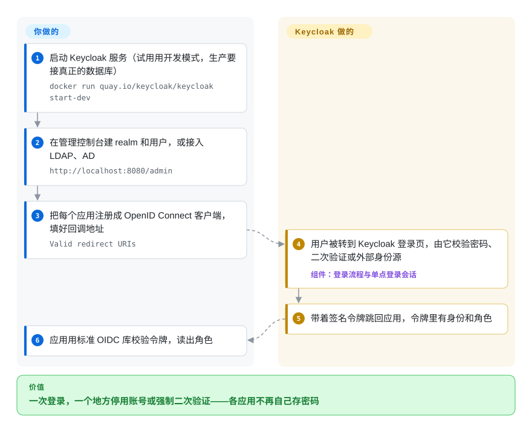

# Keycloak

每个内部系统都自带登录框、密码表和“忘记密码”邮件，结果员工离职要在七个地方删账号，想统一开二次验证也无从下手。Keycloak 是一台你自己运行的登录服务器：各应用把用户送过来，由它处理密码、二次验证、社交账号和企业账号登录，再给每个应用发一张签名令牌，写明这个人是谁、有哪些角色。

## 何时使用

你是公司的平台或安全工程师，手上有十几个内部工具和两个对外产品，技术栈各不相同。每个系统都长出了自己的 `users` 表；员工离职要按清单去七个后台删人，审计要求全员开二次验证，销售还想要“用 Google 登录”，外加给一个员工都在 Azure AD 里的企业客户接 SAML 登录。你部署 Keycloak，建一个 realm（Keycloak 对“一个隔离的用户与应用租户”的叫法），接上公司的 LDAP 或 Active Directory，或者让它自己存用户，再把每个应用注册成客户端。从此所有应用都跳到同一个登录页，拿回标准的 OpenID Connect 令牌；停用一个账号，这个人就哪儿都进不去了。

和 Auth0、Okta 这类托管身份服务比，当你必须自托管（数据驻留、隔离网络、按用户计费在你的规模下太贵），又想用一个 Apache-2.0 的服务器加管理控制台覆盖最全的协议——OIDC、OAuth 2.0、SAML 2.0、LDAP 和 Kerberos 联合、身份代理——时选它。和 Authentik、Zitadel、Authelia 这类更轻的自托管方案比，当协议覆盖面和 13 年、托管在 CNCF 的记录比体积小更重要时选它。

## 怎么用起来

Keycloak 是一个带自己数据库的独立 Java 服务，你的应用永远碰不到密码。**它替你做的：**提供登录、注册、重置密码和二次验证页面（可换主题），存储并哈希凭据，或把校验委托给 LDAP、Active Directory；代理来自 Google、GitHub 或其他 SAML、OIDC 身份源的登录；维持单点登录会话；签发签名令牌——一段紧凑的 JSON，带着用户身份和角色，应用无需回调就能自己验证。它还自带管理控制台、给终端用户的账户控制台、REST 管理 API，以及需要手动开启的 SCIM 用户同步、可验证凭证等功能。**你要做的：**用生产数据库和 TLS 把它跑起来，规划 realm、客户端和角色，并让每个应用“支持 OIDC”——通常是加上你所用框架的标准 OpenID Connect 库，而不是 Keycloak 专用 SDK——让它把未登录用户转到 Keycloak、回来时校验令牌。用户登录之后在应用里能做什么（令牌里的角色之外），仍由你或者一个授权引擎来决定。

<!-- flow-steps:begin (generated from flows/keycloak.json by tools/flow_card.py — do not edit) -->

流程文字版

1. **你**：启动 Keycloak 服务（试用用开发模式，生产要接真正的数据库） — `docker run quay.io/keycloak/keycloak start-dev`
2. **你**：在管理控制台建 realm 和用户，或接入 LDAP、AD — `http://localhost:8080/admin`
3. **你**：把每个应用注册成 OpenID Connect 客户端，填好回调地址 — `Valid redirect URIs`
4. **Keycloak**：用户被转到 Keycloak 登录页，由它校验密码、二次验证或外部身份源 — 组件：`登录流程与单点登录会话`
5. **Keycloak**：带着签名令牌跳回应用，令牌里有身份和角色
6. **你**：应用用标准 OIDC 库校验令牌，读出角色

**价值**：一次登录，一个地方停用账号或强制二次验证——各应用不再自己存密码

<!-- flow-steps:end -->

## 何时不用

- **只有一个应用、几个社交登录。** 整套身份服务器太重了；在应用里用一个登录库即可——比如 Python 的 OAuth、OpenID 登录可用 [Authomatic](authomatic.zh.md)，或者用框架自带的认证模块。
- **你需要对象级权限**（“Alice 能编辑 42 号文档，因为她所在团队拥有它所在的文件夹”）。Keycloak 的长处是认证和放在令牌里的粗粒度角色；它的 Authorization Services 是集中式、围绕令牌设计的。身份留在 Keycloak，对象级判断交给 [OpenFGA](openfga.zh.md)（基于关系、集中式）或 [Casbin](casbin.zh.md)（进程内的库）。
- **你没有 JVM 运维能力，或资源很紧。** Keycloak 需要基于 JDK 的服务、一个关系数据库，集群时还要分布式缓存。如果只是给反向代理后面几个自托管应用加登录，Authelia（未收录）轻得多；完全不想运维，就用 Auth0 这类托管身份服务（非仓库）。
- **你想要无界面、API 优先的身份层，登录界面自己做。** Keycloak 的登录体验是服务端渲染、靠主题定制的页面。Ory Kratos（未收录）把身份流程做成 API，供你自己的前端调用。
- **你需要在一个版本上长期获得支持。** 社区版大约每年发四个小版本，安全修复只给最新的小版本，它的 RELEASES.md 还写明重要修复在任何版本里都可能破坏兼容。做不到每季度升级，就买 Red Hat build of Keycloak（商业版，非仓库），或选一个有长期支持分支的产品。
- **你在做多租户 B2B SaaS，希望组织、邀请、按租户定制登录品牌开箱即用、配置量最小。** Keycloak 用 realm 或它的 Organizations 功能也能做到，但 Zitadel（未收录）从一开始就是围绕这个模型设计的。

## 横向对比

| 替代品 | 是否收录 | 我们的评价 | 取舍 |
|---|---|---|---|
| Authentik | 未收录 | 家庭实验室或小公司想给一批自托管应用加单点登录、界面更友好、自带反向代理组件时选 Authentik；需要企业级联合（Kerberos、SAML 代理）和长期、有基金会托管的记录时选 Keycloak。 | Authentik 上手更容易，自带代理认证；Keycloak 协议覆盖更广、生产使用多得多，代价是更高的 JVM 和运维成本。 |
| Zitadel | 未收录 | 多租户 B2B SaaS、每个客户都是一个有独立登录品牌的组织时选 Zitadel；做接 LDAP、AD 的内部或单产品身份中枢时选 Keycloak。 | Zitadel 围绕组织模型、API 优先、事件溯源设计；Keycloak 更成熟，但多租户是在 realm 和较新的 Organizations 功能上补出来的。 |
| Ory Kratos + Hydra | 未收录 | 想要无界面的身份 API、登录界面完全由自己的前端掌控时选 Ory；希望登录页、管理控制台和联合登录第一天就能用时选 Keycloak。 | Ory 把身份和 OAuth2 拆成几个不带界面的小 Go 服务，界面你自己写；Keycloak 一个服务全包，但主题之外的定制要写 Java SPI。 |
| Auth0 / Okta | 非仓库 | 宁愿按用户付费也不想运维身份服务器时选 Auth0、Okta；自托管、数据驻留或规模化后的按用户成本让 SaaS 不可行时选 Keycloak。 | 托管服务：免运维、SLA 和集成都强，但有厂商锁定，价格随月活用户增长。 |
| [Casbin](casbin.zh.md) | ✅ | 不是替代品，而是常见搭档：Keycloak 回答“这是谁”，Casbin 在你的服务里回答“他能不能做这件事”。只有授权那一半才选 Casbin。 | 两者一起用，就有两套系统要保持一致（Keycloak 令牌里的角色 vs. Casbin 里的策略）；换来的是各自只做自己擅长的那一半。 |

## 技术栈

- **语言与框架：** 基于 Quarkus 的 Java（`main` 分支上是 3.40.x）；持久化用 JPA、Hibernate；管理控制台和账户控制台是 `js/` 目录下的 JavaScript、TypeScript。
- **缓存与集群：** 默认内嵌 Infinispan，用 JGroups 通信；多站点用外部 Infinispan；26.8 新增了正式支持的无状态多集群模式，不再需要外部缓存。
- **协议：** OpenID Connect、OAuth 2.0、SAML 2.0、LDAP 和 Active Directory 以及 Kerberos 联合、身份代理；较新的有 SCIM、OID4VCI、OID4VP 和令牌交换委托。
- **分发形式：** ZIP 包（`bin/kc.sh`）、容器镜像 `quay.io/keycloak/keycloak`、Kubernetes Operator。
- **扩展方式：** Java SPI（服务提供者接口），用来写自定义认证器、用户存储、事件监听器和主题。

## 依赖

- **JDK** 17、21 或 25（跑 ZIP 包时需要；容器镜像自带）。
- **生产用关系数据库：** PostgreSQL、MySQL、MariaDB、Microsoft SQL Server、Oracle 或 TiDB。默认的 `dev-file` 数据库只用于开发。
- **TLS 和主机名**：在服务本身或它前面的反向代理上配置。
- **高可用：** 多个节点共用数据库和一个 Infinispan 集群（内嵌或外部），或者用较新的无状态模式。
- **可选：** 用于用户联合的 LDAP、Active Directory，用于验证和重置邮件的 SMTP 服务器，用于身份代理的外部身份源。

## 运维难度

**中到高。** `start-dev` 一条命令就能跑，但生产是另一种模式：选数据库、配主机名和 TLS、估 JVM 内存，往往还要构建优化镜像（`kc.sh build`），并规划集群。最重的持续成本是升级——每年四个小版本，安全修复只给最新的一个，任何版本都可能有破坏性改动，自定义主题和 Java 扩展每次都可能要返工。换来的是：一个运维良好的集群替掉了每个应用里的登录代码。

## 健康度与可持续性

- **维护（2026-10-08）：** 非常活跃——26.8.0 于 2026-10-01 发布，前一天还发了 26.7.5；雷达测得 issue 首次响应中位时间约 1.4 小时。约 3,200 个未关闭 issue 反映的是体量，不是疏于维护。
- **治理与单点风险：** 列出的 11 名维护者里有 9 名在 IBM（原 Red Hat 团队如今在其名下），另有 Bosch、Hitachi 和 Identity Tailor；项目负责人是 Stian Thorgersen。贡献面很广（雷达：12 个月内 164 名活跃贡献者，头号贡献者约占 11%），但路线图由厂商主导。
- **背书与 Lindy：** 2013-07 创建（约 13 年），一直活跃，现为 CNCF 项目（README 链接了 CNCF 的 Slack、行为准则和 CLOMonitor）；商业版 Red Hat build 为核心团队提供资金。这是本分类里“年头长且仍活跃”最强的例子之一。
- **采用：** 约 3.72 万 stars，Docker Hub 拉取 18,459,944 次（雷达，2026-10-08），另有 Quay.io 分发，Kubernetes Operator 上架 OperatorHub 和 Artifact Hub；很多项目都会为它写集成文档，是事实上的默认自托管身份服务。
- **风险信号：** Apache-2.0，没有换许可证的历史；风险在于升级负担（安全修复只给最新小版本），以及依赖单一厂商的人员安排。

## 存疑（未验证）

- [未验证] Keycloak 在 CNCF 的具体成熟度级别（孵化还是毕业）没有对照 CNCF 项目列表核实；CNCF 成员身份是从 README 链接推断的。
- [推断] “Authorization Services 是集中式、围绕令牌的，所以应用内对象级权限该交给别的工具”是设计层面的判断，不是测出来的限制。
- [未验证] “自定义主题和 Java 扩展升级时常要返工”来自升级指南的模式和社区反馈，没有针对某次具体升级做测试。
- [未验证] 与 Authentik、Zitadel、Ory、Authelia 的对比依据的是它们的公开定位；它们在本索引里都还没有页面。
- [推断] Docker Hub 拉取数低估了实际使用量，因为官方镜像同时从 Quay.io 分发。
