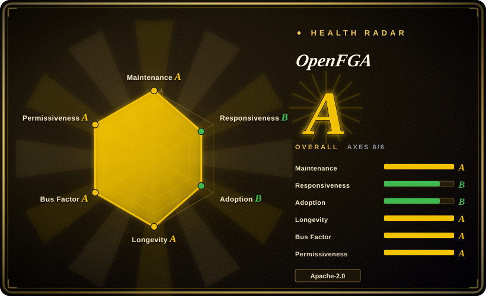
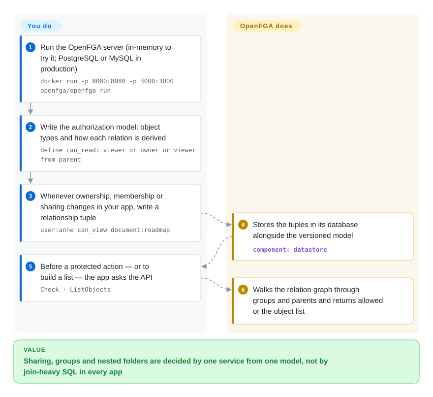

# OpenFGA

Your app has Google-Drive-style sharing — files in folders, folders shared with teams, teams containing people — and the "can Anne open this file?" query has become a five-table SQL join copied into every service, while "show Anne every file she can see" times out. OpenFGA is a separate permissions service: you describe the relationships once in a small model language, write facts like "Anne is in team Design", and every service asks it `Check` or `ListObjects` instead of re-deriving the answer.

## When to use

You're the backend lead of a B2B SaaS product where access follows relationships rather than fixed roles: an organization owns projects, projects contain documents, documents can be shared with a user, a group or "anyone with the link", and an editor of a folder is automatically an editor of everything inside it. Today that logic lives in SQL joins duplicated across a Go API, a Python worker and a Node.js frontend server, the three disagree at the edges, and the "list everything this user can see" endpoint takes seconds. You stand up OpenFGA, write the model once (`define can_read: viewer or owner or viewer from parent`), mirror ownership and membership changes into it as relationship tuples, and replace every hand-written check with a call to its API through the official SDK for each language.

Pick it over an in-process library such as Casbin when several services in different languages must share one answer and the rules are relationship chains rather than "role X may do Y". Pick it among the Zanzibar-style services (Google's paper on its global authorization system) — SpiceDB, Permify — when you want a CNCF-hosted project with Auth0/Okta's production use behind it, a readable modeling DSL, and PostgreSQL or MySQL as the store you already know how to run.

## How it works

OpenFGA is a server (HTTP and gRPC) backed by a database. You give it two things. The **authorization model** declares object types and how each relation is derived — "a doc's viewer is anyone directly granted, any member of a granted group, the owner, or a viewer of its parent folder". The **relationship tuples** are the facts, each one a `user relation object` triple such as `user:anne can_view document:roadmap` or `folder:product parent document:roadmap`. **What OpenFGA does for you:** stores the tuples, and at query time walks the graph the model describes — through groups, parents and other indirections — to answer `Check` ("may Anne read this?") and the reverse queries `ListObjects` ("which documents can Anne read?") and `ListUsers`. It also versions models, supports conditions (rules evaluated against request context such as time or IP), and ships a Playground, a CLI with model tests, and SDKs for Go, Java, Node.js, Python and .NET. **What you do:** design the model, write a tuple every time the corresponding fact changes in your own database (that synchronization is yours to build), call `Check` before protected actions, and run the server and its database. Authentication stays outside — OpenFGA trusts whatever user ID you pass it.

<!-- flow-steps:begin (generated from flows/openfga.json by tools/flow_card.py — do not edit) -->

Text version of the flow

1. **You**: Run the OpenFGA server (in-memory to try it; PostgreSQL or MySQL in production) — `docker run -p 8080:8080 -p 3000:3000 openfga/openfga run`
2. **You**: Write the authorization model: object types and how each relation is derived — `define can_read: viewer or owner or viewer from parent`
3. **You**: Whenever ownership, membership or sharing changes in your app, write a relationship tuple — `user:anne can_view document:roadmap`
4. **OpenFGA**: Stores the tuples in its database alongside the versioned model — component: `datastore`
5. **You**: Before a protected action — or to build a list — the app asks the API — `Check · ListObjects`
6. **OpenFGA**: Walks the relation graph through groups and parents and returns allowed or the object list

**Value**: Sharing, groups and nested folders are decided by one service from one model, not by join-heavy SQL in every app

<!-- flow-steps:end -->

## When NOT to use

- **Your rules are plain roles inside one service.** A network hop, a second database and tuple synchronization are overhead for "admins can delete, members can edit". Use [Casbin](casbin.md) in-process, or [django-rules](django-rules.md) inside a Django app.
- **You can't keep a second copy of your relationship data in sync.** Every membership, share and ownership change must also be written as a tuple; missed writes become wrong answers. If you can't own that pipeline, keep authorization next to your data (database queries or row-level security) and accept slower list queries.
- **Your policies are mostly attribute logic** — request time, IP ranges, document status, amounts. OpenFGA has conditions, but its core is the relationship graph; OPA or Cerbos (not indexed) are built for rule logic over attributes.
- **You need login or user management.** OpenFGA only authorizes; put [Keycloak](keycloak.md) or another identity provider in front of it.
- **You need Zanzibar's strict consistency tokens.** OpenFGA lets a request ask for `HIGHER_CONSISTENCY`, but evaluate SpiceDB (not indexed) if you need a token-based guarantee that a check sees a specific earlier write.
- **You embed it as a Go library and want a frozen API.** Minor releases can change Go-level APIs (v1.22.0 added a required parameter to `mysql.NewWithDB`). Run it as a server and talk through the SDKs, or pin and read the CHANGELOG on every bump.

## Comparison

| Alternative | In index | Our verdict | Tradeoff |
|---|---|---|---|
| [Casbin](casbin.md) | ✅ | For RBAC/ABAC inside one process with no extra service, pick Casbin; pick OpenFGA when many services need the same relationship-based answers and reverse queries like "list what Anne can see". | Casbin is a function call with policy in memory per replica; OpenFGA adds a server, a database and tuple sync, but holds one shared graph that scales past one process's memory. |
| SpiceDB | not indexed | When strict, token-based consistency and Zanzibar fidelity matter most, pick SpiceDB; pick OpenFGA for a CNCF-hosted project with a simpler DSL and the Postgres/MySQL stores most teams already run. | SpiceDB offers more consistency control and storage options (including distributed databases) at the cost of a steeper schema language; OpenFGA is easier to model in but vendor-concentrated around Okta. |
| Permify | not indexed | If you want a Zanzibar-style service with built-in multi-tenancy and attribute rules in the same schema, evaluate Permify; pick OpenFGA when foundation governance and large-vendor production use weigh more. | Both store tuples and answer checks; Permify is a younger, startup-backed project, OpenFGA has Auth0's production history since 2021. |
| OPA (Open Policy Agent) | not indexed | When authorization is general policy over request attributes (Kubernetes admission, API gateways, CI), pick OPA; pick OpenFGA when the decision depends on a large, changing graph of who-relates-to-what. | OPA evaluates Rego against the data you push to it — great for rules, awkward for millions of relationships; OpenFGA stores and walks the graph but is weaker at arbitrary logic. |
| [Keycloak](keycloak.md) | ✅ | Use Keycloak to log users in and issue tokens; add OpenFGA when per-object permissions outgrow the roles in those tokens. | Keycloak's Authorization Services handle coarse, centrally managed permissions; OpenFGA handles fine-grained, data-driven ones, at the cost of another service. |

## Tech stack

- **Language:** Go (minimum Go 1.26 as of v1.22.0); module `github.com/openfga/openfga`; can also be embedded as a Go library (`pkg/server`).
- **APIs:** HTTP and gRPC; the HTTP server talks to the gRPC server over a Unix domain socket, falling back to TCP.
- **Storage:** PostgreSQL 14+ and MySQL 8 (both with optional read replicas as of v1.22.0), SQLite (beta), and an in-memory store for development only.
- **Tooling:** `fga` CLI with model testing, a local Playground on port 3000, a Terraform provider, and official SDKs for Go, Java, Node.js, Python and .NET.
- **Supply chain:** releases built with GoReleaser and labeled SLSA level 3 in the README; OpenSSF Scorecard and Best Practices badges.

## Dependencies

- **A database:** PostgreSQL 14+ or MySQL 8 in production (MySQL has stricter length limits on tuple fields). The default in-memory store loses everything on restart.
- **A way to run a service:** Docker image `openfga/openfga`, Homebrew, release binaries or the `openfga/helm-charts` chart; ports 8080 (HTTP), 8081 (gRPC) and 3000 (Playground) by default.
- **Authentication in front of it:** OpenFGA can require a preshared key or OIDC on its own API, but it does not authenticate your end users — that is your IdP's job.
- **Your own tuple-sync code** (or an outbox/CDC pipeline) that writes relationship tuples whenever source data changes.

## Ops difficulty

**Medium.** The server itself is a single stateless Go binary that scales horizontally, and `docker run … openfga/openfga run` gets a dev instance in seconds. The real work is around it: operating PostgreSQL or MySQL, running migrations on upgrade, securing the API (preshared keys or OIDC), monitoring check latency as the graph grows, and — the part teams underestimate — keeping tuples consistent with your source of truth. Releases arrive about every two weeks; read the CHANGELOG, since minor versions can change Go-level APIs and experimental flags.

## Health & viability

- **Maintenance (2026-10-08):** very active — v1.18.3 through v1.22.0 shipped between 2026-08-05 and 2026-10-06. Issue responsiveness is the weaker signal: the radar measures a median first response of about 107.3 hours.
- **Governance & bus factor:** a CNCF Incubation project (per the `openfga/community` README), so the code and trademark sit with a foundation. But the maintainer list is vendor-concentrated: 25 of 28 listed maintainers work at Okta, with one each from Grafana Labs, Netlight and an independent. Contribution spread inside that group is healthy (radar: 42 active maintainers in 12 months, top contributor ~21%).
- **Backing & Lindy:** open-sourced 2022-06 (about 4.3 years), but it is the engine behind Auth0 FGA, in production since December 2021 per the README. Young by Lindy standards, offset by a large vendor's commercial dependence on it.
- **Adoption:** 44,846,775 Docker Hub pulls (radar, 2026-10-08) and ~5.9k stars; the README names Auth0, Grafana Labs, Canonical and Docker among adopters.
- **Risk flags:** Apache-2.0, no relicense history. The main risk is strategic: if Okta's priorities change, most maintainers go with them; CNCF ownership limits but does not remove that exposure.

## Caveats (unverified)

- [未验证] The SpiceDB consistency-token comparison reflects SpiceDB's public docs as remembered, not a side-by-side test in this re-verify.
- [未验证] Permify's positioning (multi-tenancy, attribute rules in the schema, startup backing) was not re-checked against its repository for this page.
- [推断] "Teams underestimate tuple sync" is a judgment from the architecture (tuples are a second copy of your data), not a measured failure rate.
- [未验证] Adopter names are from the README and its ADOPTERS link; scale of each deployment is unknown.
