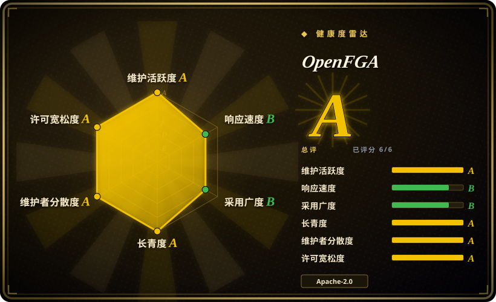
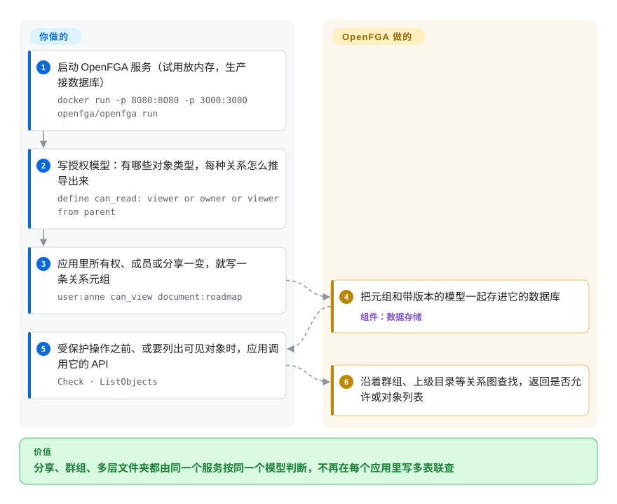

# OpenFGA

你的应用有类似 Google Drive 的分享：文件放在文件夹里，文件夹分享给团队，团队里有人；“Anne 能不能打开这个文件”成了一条五张表的 SQL 联查，被复制进每个服务，而“列出 Anne 能看到的所有文件”直接超时。OpenFGA 是一个独立的权限服务：用一门小的建模语言把关系描述一次，写入“Anne 在设计组”这样的事实，各个服务都去问它 `Check` 或 `ListObjects`，不再各自推导答案。

## 何时使用

你是一款 B2B SaaS 产品的后端负责人，访问权限跟着关系走，而不是几个固定角色：组织拥有项目，项目里有文档，文档可以分享给某个人、某个群组或“任何拿到链接的人”，文件夹的编辑者自动是里面所有内容的编辑者。现在这套逻辑写成 SQL 联查，分别复制在一个 Go API、一个 Python 后台任务和一个 Node.js 前端服务器里，三者在边界情况上互相矛盾，“列出这个用户能看到的全部内容”的接口要好几秒。你部署 OpenFGA，把模型写一次（`define can_read: viewer or owner or viewer from parent`），把所有权和成员关系的变化同步成关系元组写进去，再用各语言的官方 SDK 把所有手写的判断换成对它 API 的调用。

和 Casbin 这类进程内的库比，当多个不同语言的服务必须共享同一个答案、而且规则是关系链而不是“角色 X 可以做 Y”时选它。在 Zanzibar 风格的服务（Zanzibar 是 Google 公开的全球授权系统论文）——SpiceDB、Permify——之间，当你想要一个托管在 CNCF、背后有 Auth0 和 Okta 生产使用、建模语言易读、存储用你本来就会运维的 PostgreSQL 或 MySQL 的项目时选它。

## 怎么用起来

OpenFGA 是一个以数据库为后端的服务（HTTP 和 gRPC）。你给它两样东西。**授权模型**声明有哪些对象类型、每种关系怎么推导——“一篇文档的查看者是：被直接授权的人、被授权群组的成员、所有者，或它上级文件夹的查看者”。**关系元组**是事实，每条都是一个“用户 关系 对象”三元组，比如 `user:anne can_view document:roadmap`，或 `folder:product parent document:roadmap`。**OpenFGA 替你做的：**存储元组，查询时按模型描述的图——经过群组、上级目录等间接关系——去回答 `Check`（“Anne 能读这个吗？”）以及反向查询 `ListObjects`（“Anne 能读哪些文档？”）和 `ListUsers`。它还给模型做版本管理，支持条件（按请求上下文，比如时间或 IP 来求值的规则），并提供 Playground、带模型测试的 CLI，以及 Go、Java、Node.js、Python、.NET 的 SDK。**你要做的：**设计模型；每当你自己数据库里的对应事实变化时写一条元组（这条同步链路要你自己搭）；在受保护操作前调用 `Check`；运行服务和它的数据库。认证在它之外——你传什么用户 ID，OpenFGA 就信什么。

<!-- flow-steps:begin (generated from flows/openfga.json by tools/flow_card.py — do not edit) -->

流程文字版

1. **你**：启动 OpenFGA 服务（试用放内存，生产接数据库） — `docker run -p 8080:8080 -p 3000:3000 openfga/openfga run`
2. **你**：写授权模型：有哪些对象类型，每种关系怎么推导出来 — `define can_read: viewer or owner or viewer from parent`
3. **你**：应用里所有权、成员或分享一变，就写一条关系元组 — `user:anne can_view document:roadmap`
4. **OpenFGA**：把元组和带版本的模型一起存进它的数据库 — 组件：`数据存储`
5. **你**：受保护操作之前、或要列出可见对象时，应用调用它的 API — `Check · ListObjects`
6. **OpenFGA**：沿着群组、上级目录等关系图查找，返回是否允许或对象列表

**价值**：分享、群组、多层文件夹都由同一个服务按同一个模型判断，不再在每个应用里写多表联查

<!-- flow-steps:end -->

## 何时不用

- **只是一个服务里的普通角色规则。** 为了“管理员能删、成员能改”多一次网络往返、多一个数据库、再搭一条元组同步，是额外负担。用进程内的 [Casbin](casbin.zh.md)，Django 应用里用 [django-rules](django-rules.zh.md)。
- **你没法让第二份关系数据保持同步。** 每次成员、分享、所有权变化都要同时写成元组；漏写一次就是一次错误答案。如果你接不住这条链路，就把授权留在数据旁边（数据库查询或行级安全），接受列表查询慢一些。
- **你的策略主要是属性逻辑**——请求时间、IP 段、文档状态、金额。OpenFGA 有条件功能，但核心是关系图；OPA 或 Cerbos（未收录）才是为基于属性的规则逻辑设计的。
- **你需要登录或用户管理。** OpenFGA 只做授权；前面放 [Keycloak](keycloak.zh.md) 或其他身份提供方。
- **你需要 Zanzibar 那种严格的一致性令牌。** OpenFGA 允许单次请求要求 `HIGHER_CONSISTENCY`，但如果你需要基于令牌、保证某次检查一定能看到之前某次写入，去评估 SpiceDB（未收录）。
- **你把它当 Go 库嵌入，又希望 API 稳定不变。** 小版本也可能改 Go 层面的 API（v1.22.0 给 `mysql.NewWithDB` 加了一个必填参数）。以服务方式运行、通过 SDK 调用；或者锁定版本，每次升级都读 CHANGELOG。

## 横向对比

| 替代品 | 是否收录 | 我们的评价 | 取舍 |
|---|---|---|---|
| [Casbin](casbin.zh.md) | ✅ | 单个进程内的 RBAC、ABAC、不想多一个服务时选 Casbin；多个服务需要基于关系的同一答案、还要“列出 Anne 能看什么”这类反向查询时选 OpenFGA。 | Casbin 是一次函数调用，每个副本在内存里各持一份策略；OpenFGA 多了服务、数据库和元组同步，但维护一张共享的关系图，规模可以超出单进程内存。 |
| SpiceDB | 未收录 | 最看重严格的基于令牌的一致性和对 Zanzibar 的忠实度时选 SpiceDB；想要托管在 CNCF、DSL 更简单、存储用大多数团队已经在跑的 Postgres 或 MySQL 时选 OpenFGA。 | SpiceDB 的一致性控制和存储选择更多（包括分布式数据库），代价是 schema 语言更陡；OpenFGA 建模更容易，但维护者集中在 Okta。 |
| Permify | 未收录 | 想要一个内置多租户、能在同一 schema 里写属性规则的 Zanzibar 风格服务时，可以评估 Permify；更看重基金会治理和大厂生产使用时选 OpenFGA。 | 两者都存元组、答检查；Permify 更年轻、由创业公司支持，OpenFGA 有 Auth0 自 2021 年以来的生产历史。 |
| OPA（Open Policy Agent） | 未收录 | 授权是对请求属性的通用策略（Kubernetes 准入、API 网关、CI）时选 OPA；判断依赖一张又大又常变的“谁和什么有关系”的图时选 OpenFGA。 | OPA 拿你推给它的数据跑 Rego——写规则很好，装几百万条关系很别扭；OpenFGA 存储并遍历关系图，但写任意逻辑不如 OPA。 |
| [Keycloak](keycloak.zh.md) | ✅ | 用 Keycloak 让用户登录、签发令牌；当对象级权限超出令牌里角色能表达的范围时，再加上 OpenFGA。 | Keycloak 的 Authorization Services 处理粗粒度、集中管理的权限；OpenFGA 处理细粒度、由数据驱动的权限，代价是多一个服务。 |

## 技术栈

- **语言：** Go（自 v1.22.0 起最低 Go 1.26）；模块 `github.com/openfga/openfga`；也能作为 Go 库嵌入（`pkg/server`）。
- **API：** HTTP 和 gRPC；HTTP 服务通过 Unix 域套接字连到 gRPC 服务，连不上时退回 TCP。
- **存储：** PostgreSQL 14+ 和 MySQL 8（自 v1.22.0 起两者都支持可选的只读副本），SQLite（beta），以及只用于开发的内存存储。
- **工具：** 带模型测试的 `fga` CLI、3000 端口上的本地 Playground、Terraform provider，以及 Go、Java、Node.js、Python、.NET 的官方 SDK。
- **供应链：** 用 GoReleaser 构建发布，README 标注为 SLSA 3 级；有 OpenSSF Scorecard 和 Best Practices 徽章。

## 依赖

- **一个数据库：** 生产用 PostgreSQL 14+ 或 MySQL 8（MySQL 对元组字段的长度限制更严）。默认的内存存储一重启就全丢。
- **运行服务的方式：** Docker 镜像 `openfga/openfga`、Homebrew、发布的二进制文件，或 `openfga/helm-charts` 里的 chart；默认端口 8080（HTTP）、8081（gRPC）和 3000（Playground）。
- **它前面的认证：** OpenFGA 可以要求调用方用预共享密钥或 OIDC 访问它自己的 API，但不负责认证你的终端用户——那是身份提供方的事。
- **你自己的元组同步代码**（或 outbox、CDC 管道），在源数据变化时写入关系元组。

## 运维难度

**中。** 服务本身是一个无状态的 Go 二进制，可以水平扩展，`docker run … openfga/openfga run` 几秒钟就能起一个开发实例。真正的工作在它周围：运维 PostgreSQL 或 MySQL、升级时跑迁移、保护 API（预共享密钥或 OIDC）、随着关系图变大监控检查延迟，以及——团队最容易低估的——让元组和你的数据源保持一致。大约每两周一个版本；请读 CHANGELOG，小版本也可能改 Go 层面的 API 和实验性开关。

## 健康度与可持续性

- **维护（2026-10-08）：** 非常活跃——2026-08-05 到 2026-10-06 之间发布了 v1.18.3 到 v1.22.0。issue 响应是较弱的信号：雷达测得首次响应中位时间约 107.3 小时。
- **治理与单点风险：** 按 `openfga/community` README，它是 CNCF 孵化项目，代码和商标归基金会。但维护者高度集中在一家厂商：列出的 28 名维护者里 25 名在 Okta，Grafana Labs、Netlight 和独立开发者各一名。这个群体内部的贡献分布是健康的（雷达：12 个月内 42 名活跃维护者，头号贡献者约占 21%）。
- **背书与 Lindy：** 2022-06 开源（约 4.3 年），但按 README，它是 Auth0 FGA 背后的引擎，2021 年 12 月起就在生产使用。按 Lindy 标准还年轻，好在有一家大厂在商业上依赖它。
- **采用：** Docker Hub 拉取 44,846,775 次（雷达，2026-10-08），约 5,900 stars；README 列出的采用者包括 Auth0、Grafana Labs、Canonical 和 Docker。
- **风险信号：** Apache-2.0，没有换许可证的历史。主要是战略风险：Okta 的优先级一变，大部分维护者会跟着走；归属 CNCF 能限制、但不能消除这层风险。

## 存疑（未验证）

- [未验证] 与 SpiceDB 一致性令牌的对比依据的是记忆中的 SpiceDB 公开文档，本次重核没有做并排测试。
- [未验证] Permify 的定位（多租户、schema 里写属性规则、创业公司支持）本页没有对照它的仓库重新核查。
- [推断] “团队最容易低估元组同步”是从架构推出的判断（元组是你数据的第二份副本），不是实测的故障率。
- [未验证] 采用者名单来自 README 及其 ADOPTERS 链接；各自的部署规模未知。
