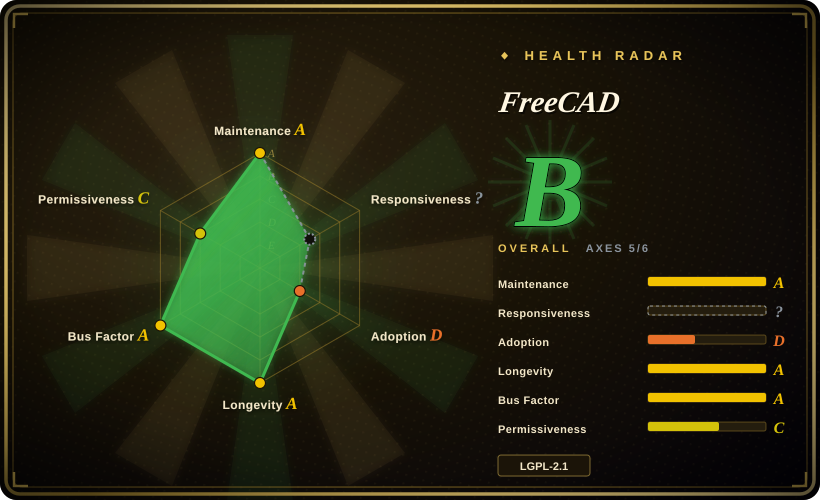
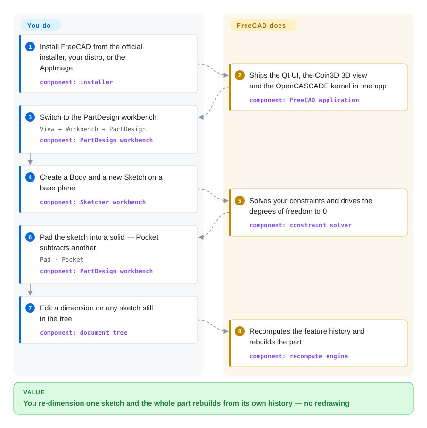

# FreeCAD

A cross-platform, open-source **parametric 3D CAD modeler** for mechanical and product design: sketch a constrained 2D profile, pad or pocket it into a solid, keep every step in an editable construction history, and drive the same document from a built-in Python API — all on local files.

## When to use

You are designing a physical part — a bracket to 3D-print, a plate to laser-cut, an enclosure someone will machine — and you know it will change: a hole moves, a wall thickens, a customer wants the 100 mm version instead of the 80 mm one. So you need a *parametric history*, where you edit a dimension and the whole model rebuilds, not a mesh you re-sculpt. You also are not going to put every seat of a small hardware team on a per-seat CAD subscription, hand the design files to a vendor's cloud, or accept export limits on the geometry you already designed. FreeCAD gives you that history (a Body of cumulative features built on constraint-solved sketches), an industrial B-rep solid kernel (OpenCASCADE), and files that stay on your disk in an open format.

It is also the CAD pick when the model has to be *programmatic*: FreeCAD embeds Python, so the operations you click can be scripted, recorded as a macro, or run headless for batch generation. That is the deciding tradeoff against the code-first tools — OpenSCAD and CadQuery give you a model that lives in a text file and diffs cleanly in CI, while FreeCAD gives you an interactive, constraint-solved sketch workflow *and* a Python API, paid for with a heavier install and a wider, less tidy scripting surface than a purpose-built code-CAD library.

## How it works

FreeCAD is a shell around *workbenches*, each a tool set for one job. The PartDesign workbench is feature-based: a **Body** container holds an ordered list of cumulative features, most of them built on sketches, and the Sketcher workbench solves your geometric and dimensional constraints until the profile has zero degrees of freedom. An additive **Pad** extrudes the sketch into the developing solid; a subtractive **Pocket** cuts into it. The document tree keeps every feature and its parameters, so editing one dimension re-runs the history and rebuilds the part — that editable history is the whole point of the tool. Underneath, OpenCASCADE does the solid geometry and the STEP/IGES/BREP exchange, Coin3D draws the 3D view, and Qt is the UI. FreeCAD owns the constraint solving, the history recompute, the geometry kernel, the file I/O and the Python bindings; you draw the sketch, set the dimensions and choose the features. Because the same API is exposed to Python, identical operations run from the built-in console, a recorded macro, or `FreeCADCmd` with no GUI at all.

<!-- flow-steps:begin (generated from flows/freecad.json by tools/flow_card.py — do not edit) -->

Text version of the flow

1. **You**: Install FreeCAD from the official installer, your distro, or the AppImage — component: `installer`
2. **FreeCAD**: Ships the Qt UI, the Coin3D 3D view and the OpenCASCADE kernel in one app — component: `FreeCAD application`
3. **You**: Switch to the PartDesign workbench — `View → Workbench → PartDesign` — component: `PartDesign workbench`
4. **You**: Create a Body and a new Sketch on a base plane — component: `Sketcher workbench`
5. **FreeCAD**: Solves your constraints and drives the degrees of freedom to 0 — component: `constraint solver`
6. **You**: Pad the sketch into a solid — Pocket subtracts another — `Pad · Pocket` — component: `PartDesign workbench`
7. **You**: Edit a dimension on any sketch still in the tree — component: `document tree`
8. **FreeCAD**: Recomputes the feature history and rebuilds the part — component: `recompute engine`

**Value**: You re-dimension one sketch and the whole part rebuilds from its own history — no redrawing

<!-- flow-steps:end -->

## When NOT to use

- **You need the polish, integrated simulation and vendor support of a commercial suite.** For large assemblies, drawing-standards compliance and someone to call when a model breaks, Autodesk Fusion 360, Onshape or SolidWorks are the low-friction choice; choose them when a seat license and cloud storage are acceptable and engineering hours cost more than the subscription.
- **Your work is mesh, sculpting, animation or rendering.** FreeCAD is a B-rep solid modeler, not an artist's polygon tool — use Blender for that pipeline.
- **The model itself should be code in a text file.** If the design must be reviewable as a diff, parameterized from a script and built headless with no GUI at all, OpenSCAD (its own CSG language) or CadQuery / build123d (Python on OCCT) are leaner; FreeCAD scripting is powerful, but it edits a document (`.FCStd`, a ZIP container), not a text model.
- **You only need 2D drafting.** LibreCAD or QCAD target that job without a solid modeler's weight.
- **You need real-time multi-user co-editing or a browser-only workflow.** FreeCAD is a local desktop document with no built-in concurrent editing; Onshape is the answer for that shape of team.
- **You depend on vendor-native files.** The import/export matrix covers STEP, IGES, BREP, STL/OBJ, DXF and many more, but not SolidWorks/Fusion/Inventor native documents, and DWG import is 2D-only and needs external software — if those formats are hard requirements, keep a commercial tool in the loop. [推断]
- **You want to contribute code through an AI agent.** FreeCAD's `AI_POLICY.md` requests disclosure of AI assistance and states the project will not accept pull requests with clearly AI-generated code, commit messages, PR descriptions or reviewer responses — read it before pointing an agent at upstream, and prefer a fork or a downstream addon instead.

## Comparison

| Alternative | In index | Our verdict | Tradeoff |
|---|---|---|---|
| OpenSCAD | 未收录 | Choose OpenSCAD when the part is better *written* as code — parameters, loops and CSG that diff cleanly and build headless; choose FreeCAD when a human must sketch, drag and constrain interactively and re-dimension a feature tree over a real B-rep solid. | A code-first CSG language with a text model and trivial CI, but no interactive sketching, no assembly and a much smaller modeling vocabulary. |
| CadQuery / build123d | 未收录 | Choose CadQuery or build123d when a Python program should generate the geometry so the model lives in source control as text; choose FreeCAD when the same model also has to be edited and inspected visually by a designer. | Python on the same OCCT kernel with library ergonomics — excellent for parametric families and automation, but no GUI, no constraint solver and no visual edit loop. |
| Blender | 未收录 | Choose Blender for mesh modeling, sculpting, animation, rendering and asset pipelines; choose FreeCAD when the model must be a dimensioned, manufacturable solid whose history you can re-parameterize and draw. | An artist's DCC suite with unmatched mesh and rendering power; no parametric B-rep history and no drawing/CAM workflow for machined parts. |
| LibreCAD / QCAD | 未收录 | Choose LibreCAD or QCAD for 2D drafting and legacy DXF drawings; choose FreeCAD when the drawing should be *generated from* a 3D model (TechDraw) rather than maintained by hand. | Purpose-built 2D CAD, lighter than a solid modeler, but no 3D history — a design change means editing the drawing itself. |
| Autodesk Fusion · Onshape · SolidWorks | 未收录 | Choose a commercial suite when large assemblies, integrated CAM/FEA, certified drawings, vendor support or cloud collaboration decide the project; choose FreeCAD when license cost, local files and full source control over the tool matter more. | Polished UX, mature assembly/simulation and someone accountable, priced per seat with cloud or license lock-in — the workflows FreeCAD substitutes for and only partly matches. |

## Tech stack

- **Core:** C++ for the application, the document/feature framework and the kernel integration; Qt 6 for the GUI.
- **Geometry & rendering:** OpenCASCADE (OCCT) as the B-rep solid kernel and the STEP/IGES/BREP exchange, Coin3D as the Open-Inventor-style 3D scene graph (maintained in-tree as the `src/3rdParty/coin` submodule), and `pivy` for Python access to Coin.
- **Python layer:** much of the user-facing surface is Python — many workbenches (Draft, BIM/Arch, CAM/Path, the FEM glue), the built-in console and macro recorder, and `src/Mod/AddonManager` for the addon/plugin manager. The dev environment pins Python 3.13 against the VFX Platform for Blender compatibility (`pixi.toml`).
- **Optional domain libraries** (from `pixi.toml`): VTK, PCL, HDF5, Eigen, gmsh, OpenCAMLib, CalculiX, ifcopenshell, matplotlib, numpy — each backing a workbench or importer.
- **Build:** CMake + Ninja, driven in-repo by `pixi` over conda-forge; `pixi.toml` currently pins `qt6-main >=6.11,<6.12`, `occt >=8.0,<8.1`, `pyside6` and `python >=3.13,<3.14`. Git submodules carry OndselSolver, microsoft/GSL, AddonManager, coin and pivy.

## Dependencies

- **Desktop install:** prebuilt 64-bit installer or portable `.7z` (Windows 10/11), macOS disk images (ARM and Intel; macOS 12 minimum), and Linux x86_64/aarch64 AppImages; also distro packages, Chocolatey on Windows and snap/Flathub channels.
- **Source build:** CMake, a modern C++ toolchain, Qt 6, OpenCASCADE, Coin3D, Python 3.13, Boost, Eigen, Xerces-C and friends; Windows builders use a prebuilt LibPack. The `pixi.toml` combination is the maintained shortcut.
- **Runtime:** no database, no server and no core network dependency — the document is local and modeling works offline. The native format is `.FCStd`; exchange formats include STEP, IGES, BREP, STL, OBJ and DXF.
- **External converters and the AddonManager:** DWG import (2D only) needs external software per the official import/export matrix, and the AddonManager fetches third-party workbenches and macros over the network.
- **Python embedding:** scripting inside the app needs nothing extra; using FreeCAD as a library from an external interpreter needs that interpreter to find `FreeCAD.so` / `FreeCAD.pyd`.

## Ops difficulty

**Low as a desktop app, medium only when you build or automate it.** As shipped, FreeCAD is install-and-run: no service, no database, one file per document. The friction sits at the edges. Building from source means matching the Qt 6 / OCCT / Python versions, and the 1.x line changed enough internals that older macros and addons need rework. `.FCStd` is a ZIP container, so documents do not diff or merge meaningfully — teams share by exchanging exported formats or locking files, and there is no concurrent editing. Headless scripting (`FreeCADCmd`) is straightforward, but it is a full CAD kernel to load for what a code-CAD library would do in a few hundred megabytes less. The weekly development builds are for testing, not production.

## Health & viability

- **Maintenance — active (verified 2026-09-22).** Latest commit 2026-09-21; the stable line shipped 1.1.0 (2026-03), 1.1.1 (2026-04), 1.1.2 (2026-07-23) and 1.1.3 (2026-07-25), alongside weekly development builds (e.g. `weekly-2026.09.16`). The ~4.0k open issues read as a large, busy tracker for a 20-year desktop application, not as neglect. [推断]
- **Governance / bus factor — foundation-backed, multi-maintainer.** The repo is Organization-owned and the project is anchored by the **FreeCAD Project Association**, an international non-profit AISBL seated in Belgium, created in November 2021 by FreeCAD administrators and core developers; it owns the trademark, collects donations and runs a grant program. There is a published contribution process (`CONTRIBUTING.md`), a code of conduct, a security policy and an explicit `AI_POLICY.md` — a real decision structure, not one person's repo.
- **Age & Lindy — strong: old *and* active.** Development dates to 2002 and the GitHub repo to 2012-09, and it is still shipping stable releases and weekly builds. Age × still-active is exactly the prior that favors a safe long-term bet, and the 1.0 release (2024-11-18) was a step change: it fixed the long-standing topological-naming problem and added a built-in Assembly workbench.
- **Backing & resilience — the project absorbed a sponsor's exit.** Ondsel, Inc. (the company that built the Ondsel Solver and Lens addon around FreeCAD) announced it was shutting down, yet the constraint solver the Assembly workbench now depends on lives under the FreeCAD org as the `src/3rdParty/OndselSolver` submodule — unarchived, LGPL-2.1, receiving commits through 2026-09. That is evidence the community can take over a critical dependency, not merely that it has backing.
- **Adoption — broad in the real world, under-read by the radar.** The scored axis comes out `D` because it only sees package registries and the GitHub dependency graph (conda-forge `freecad`, 508,217 downloads in the last month, 4 dependent repos) — a poor fit for a desktop C++ CAD application whose adoption lives in distro packages, installers and an addon ecosystem rather than as a library dependency. The wider evidence is distribution and community: distro repositories, official Windows/macOS installers, AppImage, Flathub and Snap, plus a large wiki/forum/Crowdin translation and macro/workbench ecosystem.
- **Responsiveness — unscored (`?`).** The sampler found no qualifying issue/PR first-response in its window, so the axis is unknown rather than bad; with ~4.0k open issues on a very large tracker, maintainer latency is simply unmeasured here.
- **Risk flags — license clean, policy-loaded.** LGPL-2.1-or-later on the core (weak file-level copyleft, no relicense history found, no open-core feature gating observed). The realistic risks are maturity gaps versus commercial CAD (assembly, CAM and FEA workbenches trail the paid tools [推断]) and the AI-contribution policy, which constrains agent-driven upstream work even though it does not restrict using the software.

## Caveats (unverified)

- [未验证] Star/fork/open-issue counts (33,696 / 6,063 / 4,023) are a GitHub API snapshot taken 2026-09-22 and move constantly.
- [未验证] The conda-forge download figures (~508k in the last month, ~742k lifetime, from the Anaconda.org API) include automated pulls and mirror traffic, so they bound adoption poorly.
- [推断] "Assembly, CAM and FEA trail the commercial tools" is inferred from release notes and workbench documentation, not from a benchmark; how much it matters depends heavily on the workflow.
- [推断] That SolidWorks / Fusion / Inventor native documents are unsupported is inferred from their absence in the official import/export matrix, not from an explicit statement.
- [未验证] Exact minimum CMake / Qt / OCCT / compiler versions for a source build were not pinned from the build files; only the `pixi.toml` combination (Qt 6.11, OCCT 8.0, Python 3.13) was read, and other supported setups may differ.
- [未验证] `version.json` on `main` reads `26.3.0 dev`, which suggests a versioning change beyond the 1.1.x line; the next release's name and schedule were not confirmed.
- [未验证] The quality and cross-version stability of the third-party workbench/macro ecosystem through the AddonManager was not measured; individual addons are known to break across releases.
- [推断] The Ondsel shutdown and the solver's move to the FreeCAD org are read from ondsel.com's shutdown notice, the archived `ondsel-Development` GitHub org and the `.gitmodules` entry; what that means for long-term Assembly maintenance is a judgment, not a measurement.
- [未验证] The claim that no relicense history exists is based on the current LICENSE and file headers (SPDX `LGPL-2.1-or-later`), not on a full history audit.
