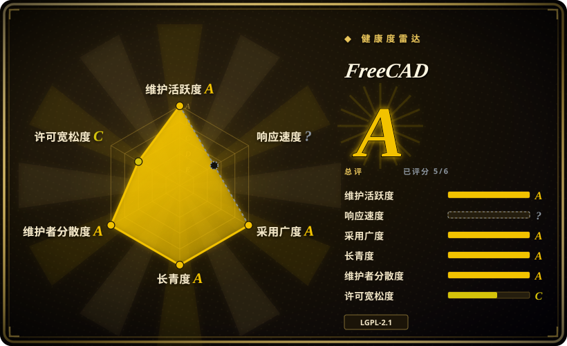
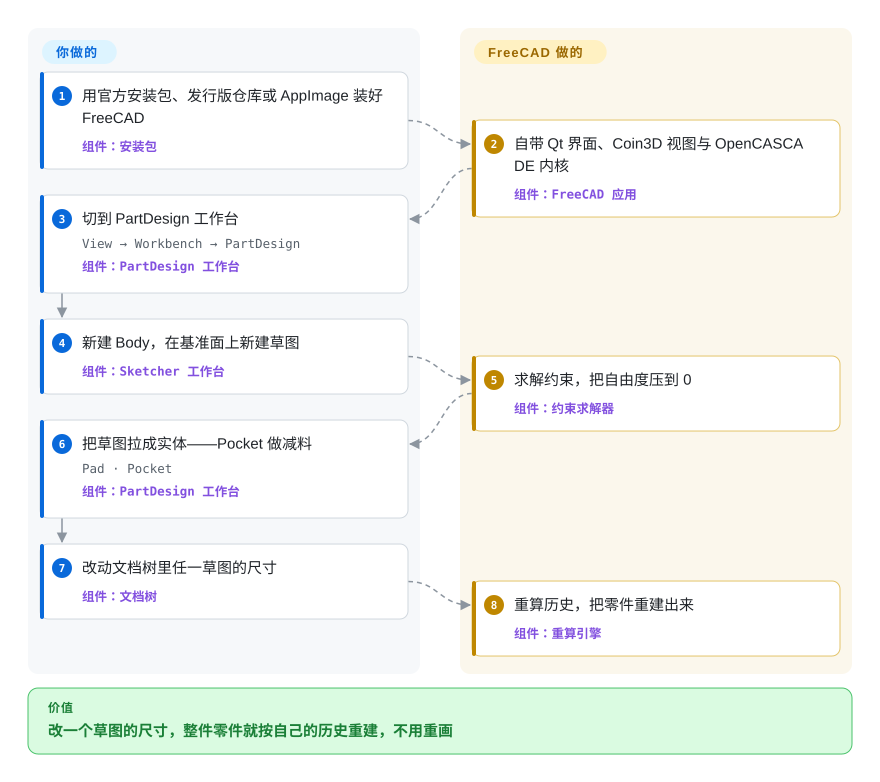

# FreeCAD

跨平台、开源的**参数化三维 CAD 建模器**，面向机械与产品设计：画出带约束的二维草图，Pad 或 Pocket 成实体，每一步都留在可编辑的构造历史里，同一个文档还能由内建 Python API 驱动——文件全在本地。

## 何时使用

你在设计一个真实零件——要 3D 打印的支架、要激光切割的板、别人要上机床的外壳——而且你知道它一定会改：孔位挪了、壁厚加了、客户要 100 mm 而不是 80 mm 那版。所以你需要的是*参数化历史*，改一个尺寸让整个模型重建，而不是重新雕一遍网格。同时你也不会给一个小硬件团队的每个人各买一份按席位计费的 CAD 订阅，不会把设计文件交给厂商的云，更不会接受对你自己画出来的几何还要限次导出。FreeCAD 给的就是这套历史（一个 Body 装着一串累加特征，每个特征建在带约束的草图上）、一个工业级 B-rep 实体内核（OpenCASCADE），以及留在你磁盘上、格式开放的文件。

当模型必须*可编程*时，它也是那个 CAD 选择：FreeCAD 内嵌 Python，你点出来的操作可以写进脚本、录成宏，或者无界面批量跑。这正是它对代码优先工具的取舍点——OpenSCAD 和 CadQuery 让模型活在一个文本文件里、在 CI 里能干净地出 diff，而 FreeCAD 给你可交互、带约束求解的草图流程*外加*一个 Python API，代价是安装更重，脚本面比一个专门做代码 CAD 的库更宽也更不整齐。

## 怎么用起来

FreeCAD 是一个外壳，套着一堆*工作台*，每个工作台管一类活。PartDesign 工作台基于特征：一个 **Body** 容器按顺序装着累加特征，多数特征建在草图上，而 Sketcher 工作台负责求解你的几何与尺寸约束，直到草图自由度为 0。加料的 **Pad** 把草图拉伸进正在生长的实体，减料的 **Pocket** 往里挖。文档树保留每个特征及其参数，所以改一个尺寸就会重跑历史、把零件重建出来——这套可编辑的历史就是这个工具的全部意义。底下由 OpenCASCADE 负责实体几何与 STEP/IGES/BREP 交换，Coin3D 画三维视图，Qt 是界面。约束求解、历史重算、几何内核、文件读写和 Python 绑定都由 FreeCAD 承担；你负责画草图、定尺寸、挑特征。因为同一套 API 也暴露给 Python，完全相同的操作可以从内建控制台、录制的宏，或者完全无界面的 `FreeCADCmd` 跑出来。

<!-- flow-steps:begin (generated from flows/freecad.json by tools/flow_card.py — do not edit) -->

流程文字版

1. **你**：用官方安装包、发行版仓库或 AppImage 装好 FreeCAD — 组件：`安装包`
2. **FreeCAD**：自带 Qt 界面、Coin3D 视图与 OpenCASCADE 内核 — 组件：`FreeCAD 应用`
3. **你**：切到 PartDesign 工作台 — `View → Workbench → PartDesign` — 组件：`PartDesign 工作台`
4. **你**：新建 Body，在基准面上新建草图 — 组件：`Sketcher 工作台`
5. **FreeCAD**：求解约束，把自由度压到 0 — 组件：`约束求解器`
6. **你**：把草图拉成实体——Pocket 做减料 — `Pad · Pocket` — 组件：`PartDesign 工作台`
7. **你**：改动文档树里任一草图的尺寸 — 组件：`文档树`
8. **FreeCAD**：重算历史，把零件重建出来 — 组件：`重算引擎`

**价值**：改一个草图的尺寸，整件零件就按自己的历史重建，不用重画

<!-- flow-steps:end -->

## 何时不用

- **你需要商业套件的打磨度、集成仿真和厂商支持。** 大型装配、制图标准合规、模型崩了有人可找——这些场景选 Autodesk Fusion 360、Onshape 或 SolidWorks 摩擦最小；当席位费与云存储可接受、且工程工时比订阅费更贵时，选它们。
- **你的活是网格、雕刻、动画或渲染。** FreeCAD 是 B-rep 实体建模器，不是美术用的多边形工具——这条管线用 Blender。
- **模型本身就该是一个文本文件里的代码。** 如果设计要能当 diff 审、由脚本参数化、完全无界面地在 CI 里构建，OpenSCAD（自带 CSG 语言）或 CadQuery / build123d（跑在 OCCT 上的 Python）更轻；FreeCAD 的脚本能力很强，但它编辑的是文档（`.FCStd`，一个 ZIP 容器），不是文本模型。
- **你只需要二维制图。** LibreCAD 或 QCAD 直接干这件事，不必背一个实体建模器的重量。
- **你需要实时多人协同编辑或纯浏览器工作流。** FreeCAD 是本地桌面文档，没有内建并发编辑；这类团队该选 Onshape。
- **你依赖厂商原生文件格式。** 导入导出矩阵覆盖 STEP、IGES、BREP、STL/OBJ、DXF 等很多格式，但不含 SolidWorks/Fusion/Inventor 原生文档，而且 DWG 导入只有二维、还要外部软件——这些格式是硬需求时，商业工具得留在链路里。[推断]
- **你想通过 AI agent 向上游贡献代码。** FreeCAD 的 `AI_POLICY.md` 要求披露 AI 辅助，并明确表示不接受明显由 AI 生成的代码、提交信息、PR 描述或对评审意见的回复——把 agent 指向上游之前先读它，改走 fork 或下游插件。

## 横向对比

| 替代品 | 是否收录 | 我们的评价 | 取舍 |
|---|---|---|---|
| OpenSCAD | 未收录 | 零件更适合*写成*代码时就选 OpenSCAD——参数、循环、CSG，diff 干净、能无界面构建；当需要人交互地画草图、拖动加约束、并在真 B-rep 实体上按特征树重新尺寸驱动时，选 FreeCAD。 | 代码优先的 CSG 语言，文本模型加极简 CI，但没有交互式草图、没有装配，建模词汇也小得多。 |
| CadQuery / build123d | 未收录 | 当一个 Python 程序该负责生成几何、模型要以文本进版本控制时，选 CadQuery 或 build123d；当同一个模型还要被人可视化地编辑和查看时，选 FreeCAD。 | 跑在同一个 OCCT 内核上的 Python，库的工效很好，适合参数化族与自动化，但没有 GUI、没有约束求解器，也没有可视化改模的回路。 |
| Blender | 未收录 | 网格建模、雕刻、动画、渲染和资产管线选 Blender；当模型必须是有尺寸、可制造、历史可重新参数化并出图的实体时，选 FreeCAD。 | 美术 DCC 套件，网格与渲染能力无可匹敌，但没有参数化 B-rep 历史，也没有面向机加工零件的出图与 CAM 流程。 |
| LibreCAD / QCAD | 未收录 | 二维制图和遗留 DXF 图纸选 LibreCAD 或 QCAD；当图纸应该*由*三维模型生成（TechDraw）而不是手工维护时，选 FreeCAD。 | 专门的二维 CAD，比实体建模器轻，但没有三维历史——设计一改就得改图纸本身。 |
| Autodesk Fusion · Onshape · SolidWorks | 未收录 | 当大型装配、集成 CAM/FEA、合规图纸、厂商支持或云端协作决定项目成败时，选商业套件；当许可证成本、本地文件与对工具的完整源码掌控更重要时，选 FreeCAD。 | 交互打磨、装配/仿真成熟、有人负责，代价是按席位计费并绑定云端或授权——这正是 FreeCAD 想替代、却只部分对齐的工作流。 |

## 技术栈

- **核心：** 应用、文档/特征框架与内核集成用 C++；界面用 Qt 6。
- **几何与渲染：** OpenCASCADE（OCCT）作为 B-rep 实体内核并负责 STEP/IGES/BREP 交换；Coin3D 作为 Open Inventor 风格的三维场景图（以 `src/3rdParty/coin` 子模块在树内维护）；`pivy` 提供 Python 访问 Coin 的绑定。
- **Python 层：** 面向用户的很大一块是 Python——不少工作台（Draft、BIM/Arch、CAM/Path、FEM 的粘合层）、内建控制台与宏录制，以及 `src/Mod/AddonManager` 插件管理器。开发环境按 VFX Platform 对齐 Blender 的版本，钉住 Python 3.13（`pixi.toml`）。
- **可选领域库**（见 `pixi.toml`）：VTK、PCL、HDF5、Eigen、gmsh、OpenCAMLib、CalculiX、ifcopenshell、matplotlib、numpy——各自支撑一个工作台或导入器。
- **构建：** CMake + Ninja，仓库内由 `pixi` 跑在 conda-forge 上；`pixi.toml` 当前钉住 `qt6-main >=6.11,<6.12`、`occt >=8.0,<8.1`、`pyside6` 与 `python >=3.13,<3.14`。Git 子模块还带着 OndselSolver、microsoft/GSL、AddonManager、coin 与 pivy。

## 依赖

- **桌面安装：** 预编译 64 位安装包或便携 `.7z`（Windows 10/11）、macOS 磁盘镜像（ARM 与 Intel；最低 macOS 12）、Linux x86_64/aarch64 的 AppImage；另有发行版仓库、Windows 上的 Chocolatey，以及 snap/Flathub 渠道。
- **源码构建：** CMake、较新的 C++ 工具链、Qt 6、OpenCASCADE、Coin3D、Python 3.13、Boost、Eigen、Xerces-C 等等；Windows 构建者用预编译 LibPack。`pixi.toml` 那套组合是维护中的捷径。
- **运行时：** 没有数据库、没有服务端，核心也不依赖网络——文档在本地，建模可离线进行。原生格式是 `.FCStd`；交换格式包括 STEP、IGES、BREP、STL、OBJ 与 DXF。
- **外部转换器与 AddonManager：** 按官方导入导出矩阵，DWG 导入（仅二维）需要外部软件；AddonManager 则通过网络获取第三方工作台与宏。
- **Python 嵌入：** 应用内脚本不需要额外安装；把 FreeCAD 当库给外部解释器用时，需要该解释器能找到 `FreeCAD.so` / `FreeCAD.pyd`。

## 运维难度

**作为桌面应用是低，只有构建或自动化时才升到中。** 按发布版用起来就是装上即用：没有服务、没有数据库，一个文档一个文件。摩擦都在边上。从源码构建意味着要凑齐 Qt 6 / OCCT / Python 的版本，而 1.x 改动的内部结构足以让旧宏和插件需要改。`.FCStd` 是 ZIP 容器，文档做不出有意义的 diff 与合并——团队靠交换导出格式或锁文件协作，也没有并发编辑。无界面脚本（`FreeCADCmd`）本身直接，但为一个代码 CAD 库几百兆内存就能做的事，却要加载一整套 CAD 内核。每周开发版是给测试用的，不是生产。

## 健康度与可持续性

- **维护——活跃（核对于 2026-09-22）。** 最近一次提交在 2026-09-21；稳定线在 2026 年相继发布 1.1.0（2026-03）、1.1.1（2026-04）、1.1.2（2026-07-23）与 1.1.3（2026-07-25），同时有每周开发构建（如 `weekly-2026.09.16`）。约 4.0k 未关闭 issue 读起来是一个二十年桌面应用庞大而繁忙的追踪器，不是无人打理。[推断]
- **治理／bus factor——有基金会托底、多维护者。** 仓库归 Organization 所有，项目由 **FreeCAD Project Association** 锚定：一个 2021 年 11 月由 FreeCAD 管理员与核心开发者创立、设在比利时的国际非营利 AISBL，持有商标、接收捐赠并运营资助计划。仓库发布了贡献流程（`CONTRIBUTING.md`）、行为准则、安全政策与明确的 `AI_POLICY.md`——这是一套真实决策结构，不是某个人的仓库。
- **年龄与 Lindy——强：又老*又*活跃。** 开发可追溯到 2002 年，GitHub 仓库建于 2012-09，至今仍在发稳定版和每周构建。年龄 × 仍然活跃正是偏向长期安全下注的那种先验；而 1.0（2024-11-18）是一次台阶式变化：解决了长期存在的拓扑命名问题，并加入内建 Assembly 工作台。
- **托底与韧性——项目吸收过一次赞助方退出。** 围绕 FreeCAD 做 Ondsel Solver 与 Lens 插件的公司 Ondsel, Inc. 宣布关停，但 Assembly 工作台如今依赖的约束求解器已迁到 FreeCAD 组织下，作为 `src/3rdParty/OndselSolver` 子模块存在——未归档、LGPL-2.1、提交持续到 2026-09。这是社区能接手关键依赖的证据，而不只是「有人托底」。
- **采用度——现实里很广，雷达这次也测到了。** 该轴测出来是 `A`，除了包注册表与 GitHub 依赖图（conda-forge 的 `freecad`，上月 508,217 次下载，4 个依赖仓库）之外，还纳入了 Homebrew 90 天 8,970 次安装——这才适配一个桌面 C++ CAD 应用：它的采用体现在发行版软件包、安装器和插件生态里，而不是作为库被依赖。更广的证据是分发与社区：发行版仓库、官方 Windows/macOS 安装包、AppImage、Flathub 与 Snap，以及庞大的 wiki/论坛/Crowdin 翻译与宏/工作台生态。
- **响应度——未评分（`?`）。** 采样窗口内没有找到符合条件的 issue/PR 首次响应，所以该轴是未知而不是差；在约 4.0k 未关闭 issue 的超大追踪器上，维护者响应延迟在这里就是没有被测到。
- **风险项——许可证干净，政策有负担。** 核心是 LGPL-2.1-or-later（弱文件级 copyleft，未发现改许可历史，也没观察到 open-core 功能阉割）。现实风险是与商业 CAD 的成熟度差距（装配、CAM 与有限元工作台落后于付费工具 [推断]），以及 AI 贡献政策——它不限制使用软件，但会约束 agent 驱动的上游工作。

## 存疑（未验证）

- [未验证] star／fork／未关闭 issue 数（33,696 / 6,063 / 4,023）是 2026-09-22 抓取的 GitHub API 快照，时刻在变。
- [未验证] conda-forge 的下载数（上月约 508k、累计约 742k，来自 Anaconda.org API）含自动拉取与镜像流量，对采用度的刻画很粗。
- [推断] “装配、CAM 与有限元落后于商业工具”是从发布说明与工作台文档推断的，不是基准测试；影响多大高度取决于具体工作流。
- [推断] “不支持 SolidWorks / Fusion / Inventor 原生文档”是从官方导入导出矩阵中缺席推断的，而不是来自某句明确声明。
- [未验证] 源码构建所需的最低 CMake / Qt / OCCT / 编译器版本没有从构建文件中钉出来；这里只读了 `pixi.toml` 那一套组合（Qt 6.11、OCCT 8.0、Python 3.13），其它受支持的配置可能不同。
- [未验证] `main` 上的 `version.json` 写着 `26.3.0 dev`，暗示 1.1.x 之后有版本号方案变化；下一个版本的名字与时间表未确认。
- [未验证] 通过 AddonManager 分发的第三方工作台／宏生态的质量与跨版本稳定性没有测量；已知个别插件会在大版本间失效。
- [推断] Ondsel 关停与求解器迁入 FreeCAD 组织这两件事，分别读自 ondsel.com 的关停公告、已归档的 `ondsel-Development` GitHub 组织与 `.gitmodules` 记录；这对 Assembly 长期维护意味着什么属判断，不是测量。
- [未验证] “无改许可历史”的结论基于当前 LICENSE 与文件头（SPDX `LGPL-2.1-or-later`），不是完整历史审计。
