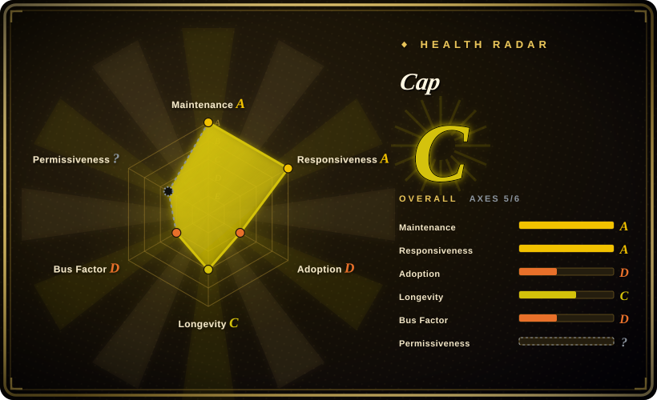
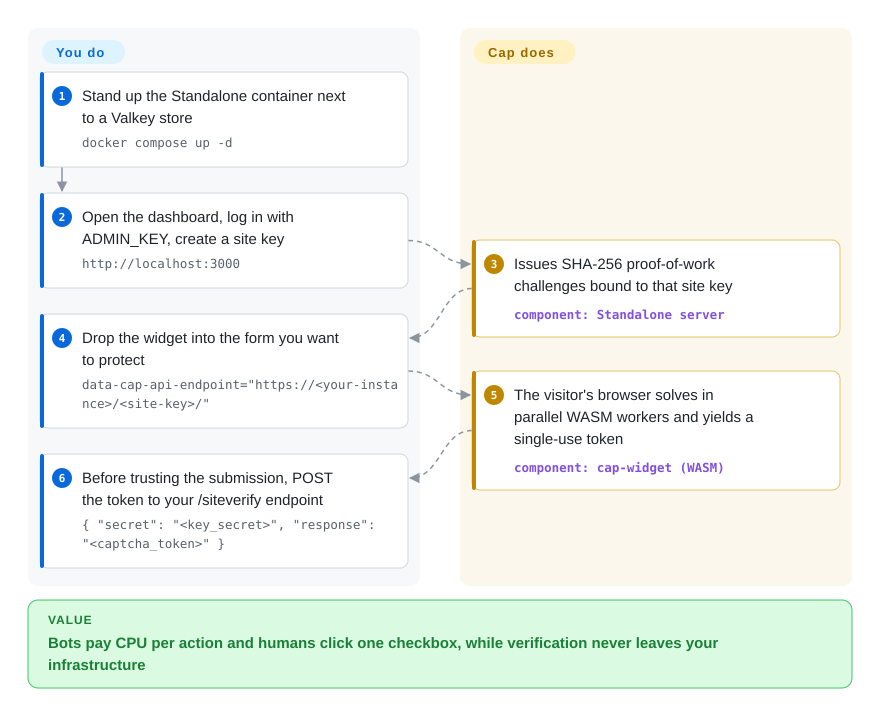

# Cap

Bots hammer your signup form, and every mainstream anti-bot option either makes humans squint at traffic-light grids or ships their data to Google/Cloudflare. Cap gates the action with an invisible proof-of-work challenge instead — the visitor's browser burns a few hundred milliseconds of CPU on a SHA-256 nonce search (Rust→WASM workers), and your own server verifies the single-use token this produces; no images, and with the widget file self-hosted, no request leaves your infrastructure.

## When to use

You're a backend or full-stack engineer running a signup form, a contact endpoint, or a public API route that bots keep hammering — fake accounts, spam submissions, credential-stuffing. You don't want to embed reCAPTCHA or Turnstile because that ships user data and a script to Google/Cloudflare, and you'd rather not make humans squint at traffic-light grids. You want the abuse cost to land on the *machine* (CPU spent solving a puzzle), not on your users' patience or privacy.

Cap fits here, and its docs now point most people at one default path: run the **Standalone** Docker container (`tiago2/cap:latest`, alongside Valkey), create a site key in its built-in dashboard, drop `<cap-widget>` into the protected form, and verify each submission by POSTing to the project's reCAPTCHA-compatible `/siteverify` endpoint — if you already call Google's `siteverify`, Cap is a one-URL swap you can run side by side before cutting over. When you *can't* run the container, the `capjs-core` library (v0.1.x, Node/Bun) gives you the same generate/verify pair (`generateChallenge()` / `validateChallenge()`) as a stateless module — the challenge config rides in a signed JWT, so there is no token store and replay prevention is an optional `consumeNonce` hook into your own KV. The widget itself is a ~20 KB web component with normal, invisible-floating, and programmatic modes.

## How it works

Cap splits the work in two: a browser-side widget and a server-side verifier. The server issues a *challenge* — a batch of random salt strings plus a difficulty target — and `<cap-widget>` on your page solves it with parallel WebAssembly workers: the visitor's browser concatenates salt+nonce and hashes with SHA-256 until enough hashes begin with the required zero prefix (that is the "proof of work" — cheap for one browser, ruinously expensive at bot scale). When the solution comes back, the server re-derives the challenge, checks it, and mints a single-use token; the default **Standalone** container exposes it behind the dashboard (site keys, analytics, optional headless-browser detection) and your backend redeems tokens via `/siteverify`, while the `capjs-core` library path returns the equivalent `generateChallenge()` / `validateChallenge()` pair and keeps the whole challenge state inside a signed JWT — you supply only an optional `consumeNonce` callback against your own store to block token replay. Optional *instrumentation challenges* (enabled by default for new Standalone site keys) run a small JavaScript payload in a sandboxed iframe as a second signal alongside the PoW. What stays yours: running the container + Valkey (or wiring the library), choosing difficulty per endpoint, and refusing to process any request whose token fails verification.

<!-- flow-steps:begin (generated from flows/capjs.json by tools/flow_card.py — do not edit) -->

Text version of the flow

1. **You**: Stand up the Standalone container next to a Valkey store — `docker compose up -d`
2. **You**: Open the dashboard, log in with ADMIN_KEY, create a site key — `http://localhost:3000`
3. **Cap**: Issues SHA-256 proof-of-work challenges bound to that site key — component: `Standalone server`
4. **You**: Drop the widget into the form you want to protect — `data-cap-api-endpoint="https://<your-instance>/<site-key>/"`
5. **Cap**: The visitor's browser solves in parallel WASM workers and yields a single-use token — component: `cap-widget (WASM)`
6. **You**: Before trusting the submission, POST the token to your /siteverify endpoint — `{ "secret": "<key_secret>", "response": "<captcha_token>" }`

**Value**: Bots pay CPU per action and humans click one checkbox, while verification never leaves your infrastructure

<!-- flow-steps:end -->

## When NOT to use

- **You need to stop a determined, well-funded attacker or CAPTCHA-farm.** Proof-of-work raises the *cost* of abuse; it does not *defeat* a solver willing to spend CPU or pay humans. It is friction, not a wall — high-value targets still need rate limits, fraud scoring, and server-side checks.
- **You want a site-wide / reverse-proxy bot wall.** Cap guards *specific actions* (forms, endpoints) and lets normal browsing through. To gate an entire site against scrapers at the proxy layer, Anubis (`未收录`) is the shaped tool; Cap is per-action.
- **Proof-of-work is a dealbreaker for your users' devices.** PoW spends client CPU/battery; on low-end phones or with high difficulty it adds latency and drains battery. If you can't accept any client compute, an invisible behavioral/risk-scoring service (Turnstile) is a different trade.
- **You need a fully managed, SLA-backed, zero-ops service.** Self-hosting means *you* run the server (or the Standalone container + Redis), rotate keys, and own uptime. There is no vendor to page.
- **You want CAPTCHA as a legal/compliance accessibility checkbox with audited support.** This is a young open-source project (library `capjs-core` still v0.1.x), not an enterprise vendor with a support contract.
- **You expect strong out-of-the-box bot *classification*.** Cap's instrumentation layer adds signals, but it is not an ML risk engine; it won't score "how human" a visitor is the way commercial services claim to.

## Comparison

| Alternative | In index | Our verdict | Tradeoff |
|---|---|---|---|
| reCAPTCHA (Google) | 未收录 | Choose reCAPTCHA when you want a managed, free service with strong risk scoring and accept Google as a third-party dependency. | Sends user data to Google, ships visual puzzles, and is not self-hosted. Cap keeps the flow on your infra but gives up Google-scale risk signals. |
| hCaptcha | 未收录 | Choose hCaptcha when a managed image-challenge service and publisher-payment ecosystem matter more than self-hosting. | Still third-party and image-based. Cap is a much smaller self-hostable widget with no external calls. |
| Cloudflare Turnstile | 未收录 | Choose Turnstile when you want managed invisible checks, no client PoW, and Cloudflare network signals. | Hosted dependency on Cloudflare; Cap trades that risk-scoring network for self-hosted operation. |
| Altcha | 未收录 | Choose Altcha when you want the closest open-source PoW widget and can assemble the server/dashboard layer yourself. | Altcha OSS is PoW-only; ML detection is a paid Sentinel product. Cap bundles instrumentation plus a Standalone server with dashboard. |
| mCaptcha | 未收录 | Choose mCaptcha when you want a self-hosted Rust PoW CAPTCHA with its own rate-limited difficulty model. | Overlapping goal, different stack and ergonomics. |
| FriendlyCaptcha | 未收录 | Choose FriendlyCaptcha when you want privacy-focused PoW but are comfortable with the maintained product being hosted and commercial. | Cap is fully open-source and self-hosted instead. |
| Anubis | 未收录 | Choose Anubis when you need a reverse-proxy or site-wide PoW gate against scrapers and AI crawlers. | Different scope: entry gate vs per-action challenge. The two are complementary, not substitutes. |

## Tech stack

- **Widget:** JavaScript web component (`<cap-widget>`, npm `cap-widget` v0.1.x), ~20 KB gzipped with zero runtime dependencies; supports normal, floating (invisible), and programmatic modes.
- **Solver:** challenges are solved client-side by repeatedly hashing salt+nonce with **SHA-256** until the hash hits a target prefix; the hot loop is **Rust compiled to WebAssembly** (`@cap.js/wasm`) and run across **Web Workers** in parallel.
- **Server library (`capjs-core`, v0.1.3):** a stateless ESM module for Node.js and Bun exposing `generateChallenge(secret, opts)` and `validateChallenge(secret, {token, solutions, instr}, opts)`. The challenge config is embedded in a signed JWT, so there is *no token store* — replay prevention is opt-in via a `consumeNonce` callback you back with your own KV (e.g. Redis `SET NX EX`).
- **Standalone server:** built on **Bun** + **Elysia** (~50 MB idle per its docs), ships a dashboard, a reCAPTCHA-compatible `/siteverify` endpoint, multi-site-key support, optional MaxMind GeoIP and headless-browser detection.
- **Instrumentation challenges:** optional, decompressed and executed in a sandboxed iframe alongside the PoW for a second verification layer (on by default for new Standalone site keys).

## Dependencies

- **Library path (`capjs-core`):** Node.js or Bun runtime. Stateless — the JWT carries the challenge config, so *no storage is required at all*; you only need a KV (Redis `SET NX EX`, Postgres, anything) if you opt into replay prevention via `consumeNonce`.
- **Standalone path:** Docker (image `tiago2/cap:latest`) and a **Redis-compatible store** (the official `docker compose` uses **Valkey** via `REDIS_URL`). Config via env: `ADMIN_KEY` (dashboard login, 32+ chars recommended), `REDIS_URL`; default port `3000`.
- **Client:** a modern browser with WebAssembly + Web Workers support (i.e. effectively all current browsers).

## Ops difficulty

**Low for the library path, low-to-medium for Standalone.** Using `capjs-core` inside an existing Node/Bun service is mostly a wiring exercise: call `generateChallenge()` on one route and `validateChallenge()` before your handler runs, embed the widget — there is no token store to provision at all, and only replay prevention needs a KV you may already have. There's no separate service to babysit. The **Standalone** route adds a container plus a Redis/Valkey instance to run and back up, an `ADMIN_KEY` secret to manage, and key rotation across sites — standard small-service ops, but more than "drop in a script tag." The real operational judgment is *tuning difficulty*: too low and PoW barely deters bots; too high and you tax legitimate users' devices. Expect to tune per-endpoint and watch abuse metrics rather than set-and-forget.

## Health & viability

- **Responsiveness**: Grade A — median first-response time 33.7 hours across 16 qualifying issues/PRs (re-scored 2026-09-28).
- **Maintenance (as of 2026-09):** last pushed 2026-09-24, latest GitHub release `standalone@3.1.13` on 2026-09-23 — active, with frequent patch trains through the summer. The standalone server is at a mature-looking v3.1.x while the library (`capjs-core`) is still v0.1.3, so the *library* API surface is the less-settled half — and its JWT redesign (replacing the older `@cap.js/server` constructor + token-store API) proves that surface is still moving. [推断]
- **Governance & bus factor:** `User`-owned (tiagozip), effectively single-author (top1 commit share ~89%). At ~7.9k stars the bus-factor exposure is real but more contained than a 40k-star one-person project — still, there is no foundation or vendor behind it, so continuity rides on one author. [推断]
- **Age & Lindy verdict:** created 2025-01, so ~1.7 years old — **young; Lindy not yet established**. It is past the first-month vapor stage and shipping steadily, but not proven across years; the pre-1.0 `capjs-core` reinforces "expect API churn, pin versions" (and the docs now explicitly advise pinning the widget build in production). [推断]
- **Risk flags:** Apache-2.0 but GitHub's API reports `NOASSERTION` on the LICENSE header (see Caveats), which an automated SPDX scanner may flag — a cosmetic licensing wrinkle, not a relicense. Security-wise this is friction (proof-of-work), not a hardened anti-abuse engine, and self-hosting means you own uptime and difficulty tuning.

## Caveats (unverified)

- [未验证] Reported popularity (~7.9k GitHub stars / ~596 forks, GitHub API 2026-09-28) — stars are unreliable and date-sensitive; treat as indicative only.
- [未验证] The "~20 KB / 250x smaller than hCaptcha" and bundle-size comparisons (e.g. vs Altcha's ~34 KB), and Standalone's "~50 MB idle memory", are the project's own figures from its README/docs; not independently benchmarked here.
- [未验证] The Cap-vs-Altcha / vs-Anubis / vs-Turnstile framing in the Comparison table draws on Cap's own documentation positioning; the competing projects' current capabilities (e.g. Altcha Sentinel, Turnstile internals) were not independently re-verified. mCaptcha's main repo shows no default-branch push since 2025-10 (GitHub API 2026-09-28), worth weighing before choosing it.
- [推断] License is Apache-2.0: the repo's LICENSE file is verbatim Apache 2.0 text, but GitHub's API reports `NOASSERTION` (a non-standard header on the file), so an automated SPDX detector may flag it.
- [未验证] Effectiveness against real-world CAPTCHA-solving services / farms is not measured here; proof-of-work raises cost but is defeatable by sufficient compute or paid human solvers.
- [推断] `capjs-core` at v0.1.3 signals a young, pre-1.0 library surface; the JWT-based `generateChallenge`/`validateChallenge` redesign (per its README, replacing `@cap.js/server`) shows the API still moves between releases — pin versions.
- [推断] The latest published GitHub release is `standalone@3.1.13` (2026-09-23), but the repo's `standalone/package.json` already reads 3.1.14 (commit 2026-09-24) — a release presumably pending; this page cites 3.1.13 as the shipping version.
- [未验证] MaxMind GeoIP and headless-browser detection in Standalone are described in docs as optional features; their exact behavior/accuracy was not exercised. The core README's benchmark (instrumentation level ≥3 blocks the event loop, ~44 ops/s at the default level) is also the project's own measurement.
