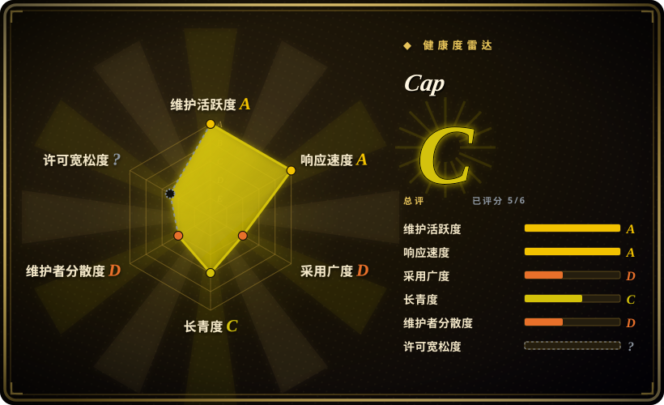
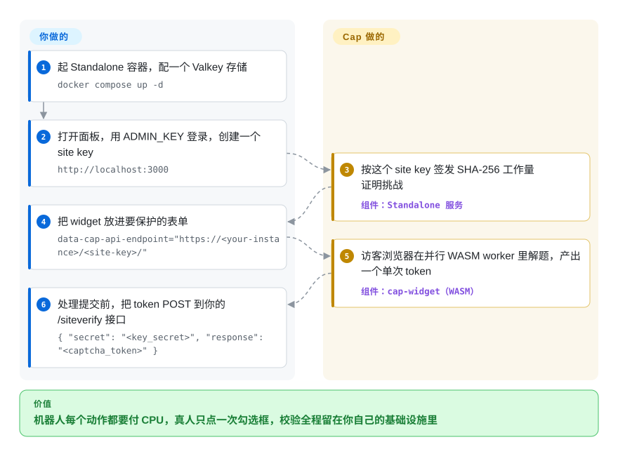

# Cap

机器人不停刷你的注册表单，而主流反机器人方案要么让真人去点红绿灯方格图，要么把用户数据送到 Google/Cloudflare。Cap 改用一道无感的工作量证明（proof-of-work）拦住动作：访客浏览器花几百毫秒在 Rust→WASM worker 里做 SHA-256 nonce 搜索，你的服务器自己校验由此换来的单次 token——没有图片题，widget 文件自托管后请求也不出你的基础设施。

## 何时使用

你是后端或全栈工程师，手上有一个注册表单、一个联系页接口，或一条公开 API 路由，老被机器人刷——刷假账号、刷垃圾提交、撞库。你不想嵌 reCAPTCHA 或 Turnstile，因为那会把用户数据和一段脚本送到 Google/Cloudflare，你也不想让真人去点红绿灯方格图。你希望把滥用的成本压到**机器**身上（花 CPU 去解题），而不是耗用户的耐心和隐私。

Cap 正好适合这个场景，而它的文档现在把大多数人指向一条默认路径：跑 **Standalone** Docker 容器（`tiago2/cap:latest`，配一个 Valkey），在内置面板里创建 site key，把 `<cap-widget>` 放进受保护的表单，再向它兼容 reCAPTCHA 的 `/siteverify` 接口 POST 一次来校验每笔提交——如果你本来就在调 Google 的 `siteverify`，换成 Cap 只是改一个 URL，可以先并行跑再切换。当你*不能*跑容器时，`capjs-core` 库（v0.1.x，Node/Bun）把同样的生成/校验能力（`generateChallenge()` / `validateChallenge()`）以无状态模块给你——挑战配置装在一个签名 JWT 里，所以没有 token 存储，防重放只是一个可选的、接到你自己 KV 上的 `consumeNonce` 钩子。widget 本身是一个约 20 KB 的 web component，支持 normal、floating（无感）和编程式三种模式。

## 怎么用起来

Cap 把工作切成两半：浏览器侧的 widget 和服务端的校验器。服务端发出一道*挑战*——一串随机 salt 加一个难度目标——你页面上的 `<cap-widget>` 用并行的 WebAssembly worker 来解它：访客浏览器把 salt 拼上 nonce 反复做 SHA-256，直到足够多个 hash 以要求数量的零开头（这就是「工作量证明」——对一台浏览器很便宜，对机器人军团贵到离谱）。解被提交回来后，服务端重新生成同样的挑战、校验通过后铸造一个单次 token；默认的 **Standalone** 容器把这一切藏在面板后面（site key、分析、可选的无头浏览器检测），你的后端经 `/siteverify` 兑换 token；而 `capjs-core` 库路径给出等价的 `generateChallenge()` / `validateChallenge()` 函数对，把全部挑战状态装进签名 JWT——你只需要在想要防重放时，用一个 `consumeNonce` 回调接到自己的存储上。可选的 *instrumentation 挑战*（Standalone 新建 site key 时默认开启）会在沙箱 iframe 里执行一小段 JavaScript，作为 PoW 之外的第二层信号。留在你手上的事：跑容器加 Valkey（或接库）、按接口挑难度、以及在 token 校验失败时拒绝处理请求。

<!-- flow-steps:begin (generated from flows/capjs.json by tools/flow_card.py — do not edit) -->

流程文字版

1. **你**：起 Standalone 容器，配一个 Valkey 存储 — `docker compose up -d`
2. **你**：打开面板，用 ADMIN_KEY 登录，创建一个 site key — `http://localhost:3000`
3. **Cap**：按这个 site key 签发 SHA-256 工作量证明挑战 — 组件：`Standalone 服务`
4. **你**：把 widget 放进要保护的表单 — `data-cap-api-endpoint="https://<your-instance>/<site-key>/"`
5. **Cap**：访客浏览器在并行 WASM worker 里解题，产出一个单次 token — 组件：`cap-widget（WASM）`
6. **你**：处理提交前，把 token POST 到你的 /siteverify 接口 — `{ "secret": "<key_secret>", "response": "<captcha_token>" }`

**价值**：机器人每个动作都要付 CPU，真人只点一次勾选框，校验全程留在你自己的基础设施里

<!-- flow-steps:end -->

## 何时不用

- **你要挡住一个有钱有决心的攻击者或打码平台。** 工作量证明抬高的是滥用的*成本*，并不能*打败*一个愿意烧 CPU 或雇真人的求解者。它是摩擦，不是墙——高价值目标仍需限流、风控评分和服务端校验。
- **你想要一道全站 / 反向代理级的机器人墙。** Cap 守的是*具体动作*（表单、接口），放正常浏览通行。要在代理层把整站对爬虫封死，Anubis（`未收录`）才是对口工具；Cap 是按动作粒度的。
- **工作量证明对你用户的设备是硬伤。** PoW 会消耗客户端 CPU/电量；在低端手机上或难度调高时会增加延迟、耗电。如果你不能接受任何客户端计算，无感的行为/风险评分服务（Turnstile）是另一种取舍。
- **你要的是全托管、有 SLA、零运维的服务。** 自托管意味着*你*来跑服务（或 Standalone 容器 + Redis）、轮换密钥、自己扛可用性。没有厂商可呼叫。
- **你想把 CAPTCHA 当成一个有审计支持的法务/合规无障碍勾选项。** 这是个年轻的开源项目（库 `capjs-core` 仍在 v0.1.x），不是带支持合同的企业级供应商。
- **你指望开箱即用的强机器人*分类*能力。** Cap 的 instrumentation 层增加了一些信号，但它不是 ML 风控引擎；它不会像商业服务宣称的那样去给访客打“有多像真人”的分。

## 横向对比

| 替代品 | 是否收录 | 我们的评价 | 取舍 |
|---|---|---|---|
| reCAPTCHA (Google) | 未收录 | 想要托管、免费、风控评分强，且能接受 Google 作为第三方依赖时，选 reCAPTCHA。 | 它会把用户数据送到 Google、要点图，且不可自托管。Cap 把流程留在你自己的基础设施里，但没有 Google 量级的风控信号。 |
| hCaptcha | 未收录 | 托管图片挑战和站长分成生态比自托管更重要时，选 hCaptcha。 | 它仍是第三方、基于图片。Cap 的 widget 小得多，可自托管且无外部请求。 |
| Cloudflare Turnstile | 未收录 | 想要托管无感检查、客户端不做 PoW，并借 Cloudflare 网络信号时，选 Turnstile。 | 它是托管在 Cloudflare 上的依赖；Cap 用自托管运维换掉这套风控网络。 |
| Altcha | 未收录 | 想要最接近的开源 PoW widget，且能自己组装服务端和面板时，选 Altcha。 | Altcha 开源版只有 PoW；ML 检测是付费 Sentinel 产品。Cap 打包了 instrumentation 和带面板的 Standalone 服务。 |
| mCaptcha | 未收录 | 想要自托管 Rust PoW CAPTCHA，并需要它自己的限流式难度模型时，选 mCaptcha。 | 目标重叠，但技术栈与手感不同。 |
| FriendlyCaptcha | 未收录 | 想要注重隐私的 PoW，但能接受维护中的产品是托管商业服务时，选 FriendlyCaptcha。 | Cap 则是完全开源、自托管。 |
| Anubis | 未收录 | 需要反向代理或全站级 PoW 网关来挡爬虫和 AI crawler 时，选 Anubis。 | 作用域不同：入口闸门 vs 按动作挑战。两者互补而非互替。 |

## 技术栈

- **Widget：** JavaScript web component（`<cap-widget>`，npm 包 `cap-widget` v0.1.x），gzip 后约 20 KB、运行时零依赖；支持 normal、floating（无感）和编程式三种模式。
- **求解器：** 挑战在客户端通过反复对 salt+nonce 做 **SHA-256** 直到 hash 命中目标前缀来求解；热循环是 **Rust 编译成 WebAssembly**（`@cap.js/wasm`），并在多个 **Web Worker** 里并行跑。
- **服务端库（`capjs-core`，v0.1.3）：** 面向 Node.js 和 Bun 的无状态 ESM 模块，暴露 `generateChallenge(secret, opts)` 与 `validateChallenge(secret, {token, solutions, instr}, opts)`。挑战配置嵌在签名 JWT 里，因此*没有 token 存储*——防重放是可选的，靠你用自有 KV（如 Redis `SET NX EX`）实现 `consumeNonce` 回调。
- **Standalone 服务：** 基于 **Bun** + **Elysia**（文档称空闲内存约 50 MB），自带面板、兼容 reCAPTCHA 的 `/siteverify` 接口、多 site key 支持，可选 MaxMind GeoIP 与无头浏览器检测。
- **Instrumentation 挑战：** 可选，在沙箱 iframe 中解压并执行，与 PoW 一起构成第二道校验层（Standalone 新建 site key 时默认开启）。

## 依赖

- **库路径（`capjs-core`）：** Node.js 或 Bun 运行时。无状态——挑战配置装在 JWT 里，*完全不需要存储*；只有当你选择开启防重放时，才需要一个 KV（Redis、Postgres，任何你已有的）来支撑 `consumeNonce` 回调。
- **Standalone 路径：** Docker（镜像 `tiago2/cap:latest`）加一个 **Redis 兼容存储**（官方 `docker compose` 用 **Valkey**，经 `REDIS_URL` 连接）。配置走环境变量：`ADMIN_KEY`（面板登录，建议 32+ 字符）、`REDIS_URL`；默认端口 `3000`。
- **客户端：** 支持 WebAssembly + Web Workers 的现代浏览器（实际上等于所有当前浏览器）。

## 运维难度

**库路径低，Standalone 低到中。** 在已有的 Node/Bun 服务里用 `capjs-core` 基本就是接线活：一个路由上调 `generateChallenge()`，在 handler 之前调一次 `validateChallenge()`，再嵌上 widget——没有 token 存储要建，只有选择防重放时才需要你顺手接一个多半已经存在的 KV。没有独立服务要看护。**Standalone** 路线则多出一个容器加一个 Redis/Valkey 实例要运行和备份、一个 `ADMIN_KEY` secret 要管理、跨站点的密钥轮换——是标准的小型服务运维，但比“插一段 script”要重。真正需要判断的是*难度调参*：调太低，PoW 几乎挡不住机器人；调太高，会拖累正常用户的设备。预期要按接口逐个调参、盯着滥用指标，而不是一劳永逸。

## 健康度与可持续性

- **响应速度**：Grade A——中位首次响应时间 33.7 小时，基于 16 个 qualifying issues/PRs（2026-09-28 重算）。
- **维护（截至 2026-09）：** 最后 push 2026-09-24，最新 GitHub release `standalone@3.1.13`（2026-09-23）——活跃，整个夏天都在密集出补丁。Standalone 服务已到看起来成熟的 v3.1.x，而库（`capjs-core`）还在 v0.1.3，所以*库*这一半的 API 面更不稳定——它用 JWT 无状态设计替换了旧的 `@cap.js/server`（构造函数加 token 存储）那一套，本身就证明这半边还在动。[推断]
- **治理与 bus factor：** `User` 所有（tiagozip），实质单一作者（top1 提交占比约 89%）。约 7.9k star 下 bus-factor 暴露真实存在，但比 4 万 star 的单人项目更可控——只是背后没有基金会或厂商，延续性押在一位作者身上。[推断]
- **年龄与 Lindy 判断：** 建于 2025-01，约 1.7 年——**年轻；Lindy 尚未建立**。它过了头一个月的「蒸汽」阶段、且持续在发货，但还没跨年证明自己；pre-1.0 的 `capjs-core` 进一步说明「预期 API 变动、请锁版本」（文档也已明确建议生产环境锁定 widget 版本）。[推断]
- **风险标记：** Apache-2.0，但 GitHub API 在 LICENSE 头部报 `NOASSERTION`（见存疑），自动 SPDX 扫描器可能会标记——是 license 的表层瑕疵，而非 relicense。安全上它是摩擦（工作量证明），不是经过加固的反滥用引擎；自托管也意味着可用性与难度调参都归你。

## 存疑（未验证）

- [未验证] 仓库活跃度与所谓热度（2026-09-28 GitHub API 约 7,873 star / 596 fork）——GitHub stars 不可靠且对日期敏感，仅供参考。
- [未验证] “约 20 KB / 比 hCaptcha 小 250 倍”、与 Altcha（约 34 KB）的体积对比、以及 Standalone“空闲内存约 50 MB”，都是项目自己 README/docs 里的数字，本页未独立复测。
- [未验证] 对比表里 Cap-vs-Altcha / vs-Anubis / vs-Turnstile 的定位取自 Cap 自己的文档；竞品当前能力（如 Altcha Sentinel、Turnstile 内部机制）未独立复核。mCaptcha 主仓库默认分支自 2025-10 起未见 push（GitHub API 2026-09-28），选它之前值得掂量。
- [推断] License 判为 Apache-2.0：仓库 LICENSE 文件是逐字的 Apache 2.0 文本，但 GitHub API 报 `NOASSERTION`（文件头部非标准），自动 SPDX 检测器可能会标记。
- [未验证] 对真实打码服务 / 打码平台的实际抵抗效果本页未测；工作量证明抬高成本但可被足够算力或付费人工求解攻破。
- [推断] `capjs-core` 处于 v0.1.3，说明是年轻的、pre-1.0 的库面；JWT 化的 `generateChallenge`/`validateChallenge` 重设计（其 README 里替换掉了 `@cap.js/server`）说明 API 在版本间仍会变化——请锁定版本。
- [推断] 已发布的最新 GitHub release 是 `standalone@3.1.13`（2026-09-23），但仓库里 `standalone/package.json` 已写到 3.1.14（2026-09-24 提交）——应该是有版本待发；本页按 3.1.13 记在产版本。
- [未验证] Standalone 里的 MaxMind GeoIP 与无头浏览器检测在文档中被描述为可选特性，其确切行为/准确度未实测。core README 的基准（instrumentation 混淆等级 ≥3 会阻塞事件循环、默认等级约 44 ops/s）同样是项目自测数字。
