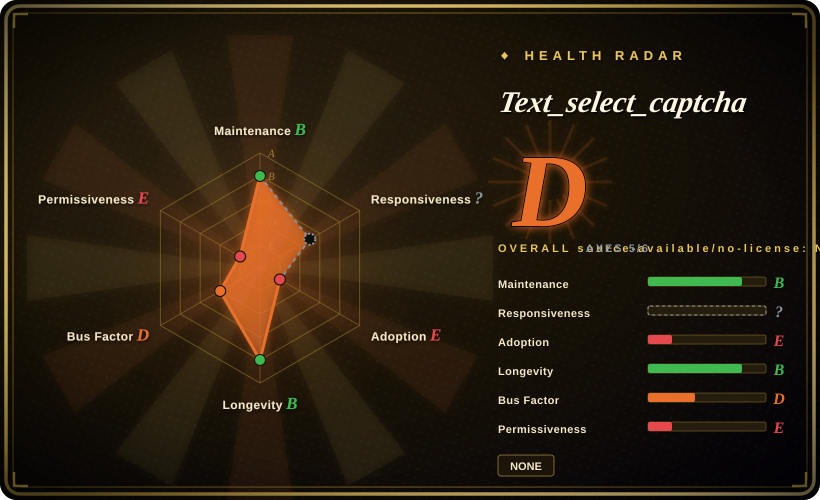
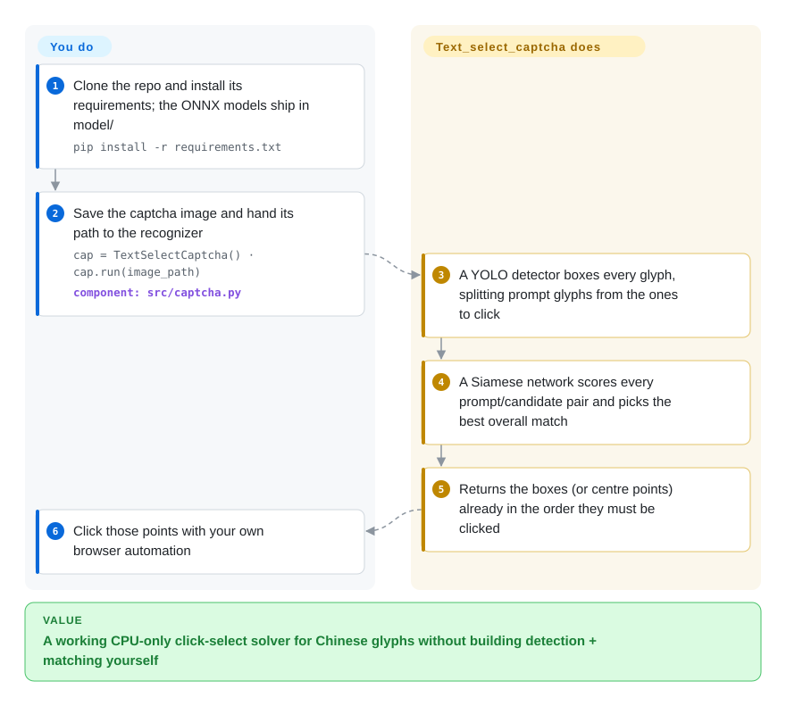

# Text_select_captcha

A Chinese deep-learning library for **click/text-select CAPTCHA** recognition — given an image that asks "click these characters in order", it detects the candidate glyphs (YOLO) and matches them to the prompt (Siamese network), returning the click coordinates.

## When to use

You're a Python developer building a scraper or automation that hits a site guarded by a *click-to-select-text* CAPTCHA — the kind that shows scrambled Chinese characters and tells you "click 春, 夏, 秋 in that order". OCR alone won't solve it: you need to *locate* each candidate glyph and *rank* it against the prompt. This library packages exactly that pipeline — a YOLO detector to find the character boxes plus a Siamese/twin network to match a target glyph against the candidates — and exposes it behind a simple call (and an optional FastAPI service) that returns coordinates. It ships ONNX runtime inference so you can run it CPU-only on a modest box (the README claims a 1-core/2G server works), and it can be retrained on ~300 of your own labeled images to adapt to a specific site's font/style.

You reach for it specifically when your target is the interactive *click-select* family (文字点选 / 选字 / 消消乐-style) rather than plain text-in-image CAPTCHAs, and you want a working Chinese-glyph pipeline rather than assembling detection + matching yourself.

## How it works

A click-select CAPTCHA is two problems glued together: *where* are the characters, and *which* one matches each prompt character. This repo answers them with two pre-trained models shipped as ONNX files (a portable model format that runs on CPU through ONNX Runtime). First a *YOLO* detector — a model that draws boxes around objects in one pass — boxes every glyph and sorts them into two kinds: the small prompt glyphs that spell out the order, and the scattered glyphs you have to click. Then a *Siamese network* — two copies of the same encoder that score how alike two images are — compares every prompt glyph against every candidate, picks the best overall pairing, and returns the candidate boxes in click order. **It does the vision; you do the browser**: fetching the image, and clicking the returned points with your own automation (the repo's `bilbil.py` is one example), are yours. The same recognizer can also run as an HTTP service (`python service.py`, docs at `:8000/docs`) instead of an in-process call. If your target's fonts differ from the shipped weights, retraining is on you, and the detailed training guide is behind the author's paid course.

<!-- flow-steps:begin (generated from flows/text-select-captcha.json by tools/flow_card.py — do not edit) -->

Text version of the flow

1. **You**: Clone the repo and install its requirements; the ONNX models ship in model/ — `pip install -r requirements.txt`
2. **You**: Save the captcha image and hand its path to the recognizer — `cap = TextSelectCaptcha() · cap.run(image_path)` — component: `src/captcha.py`
3. **Text_select_captcha**: A YOLO detector boxes every glyph, splitting prompt glyphs from the ones to click
4. **Text_select_captcha**: A Siamese network scores every prompt/candidate pair and picks the best overall match
5. **Text_select_captcha**: Returns the boxes (or centre points) already in the order they must be clicked
6. **You**: Click those points with your own browser automation

**Value**: A working CPU-only click-select solver for Chinese glyphs without building detection + matching yourself

<!-- flow-steps:end -->

## When NOT to use

- **Legality / ToS.** The repo's own disclaimer says it's for research/learning only; defeating a site's CAPTCHA may violate its terms or local law. This is the decisive filter — confirm you're authorized before any real use.
- **No open-source license.** There is **no LICENSE file** in the repo, so it is *not* open-source in the permissive sense — default copyright = all rights reserved. You have no granted right to use, modify, or redistribute it; don't vendor it into a product on the assumption it's free. [推断]
- **Your CAPTCHA isn't click-select.** For plain text-in-image OCR, a sliding-puzzle/gap CAPTCHA, or reCAPTCHA/hCaptcha/Turnstile behavioral challenges, this is the wrong tool — it's specialized for click-to-select-text.
- **You need accuracy guarantees.** The README's "96% accuracy / 300ms" figures are the author's own, on their data; real accuracy depends on the target site's font, distortion, and whether you retrain. Treat as marketing until you measure on *your* captcha.
- **You want long-term support.** It's a single-author project with no tagged releases and a tutorial-monetization angle (links to a paid course); the free repo may lag the paid materials.

## Comparison

| Alternative | In index | Our verdict | Tradeoff |
|---|---|---|---|
| [Cap](capjs.md) | ✅ | Choose Cap when you need a CAPTCHA *generation/challenge* system rather than a solver. | Proof-of-work and server-side challenge flow, the opposite side of the problem. Listed to disambiguate "captcha" tooling, not as a substitute. |
| ddddocr | 未收录 | Choose ddddocr when you need a popular Chinese general OCR/CAPTCHA library with detection, classification, and slide-match coverage. | Broader solver coverage and often the first thing to try for mixed CAPTCHA types; use only in authorized settings. |
| Commercial solving services (打码平台) | 未收录 | Choose commercial solving services when a human/hybrid CAPTCHA-solving API is acceptable. | Pay-per-solve and no model to host, but ongoing cost, third-party dependency, and the same legal questions. |
| Roll-your-own YOLO + Siamese | 未收录 | Choose a custom YOLO + Siamese pipeline when clean licensing and full control matter more than using this repo as-is. | You build, label, and train the whole pipeline this repo already assembles. |

## Tech stack

- **Models:** a YOLO-family detector for locating glyphs + a Siamese/twin network for matching a target to candidates, both exported to ONNX and shipped in `model/` (`best_v3.onnx`, `pre_model_v7.onnx`); inference via **ONNX Runtime**.
- **Serving:** an optional **FastAPI** + `uvicorn` HTTP service (RESTful API) wrapping the recognizer; `python-multipart` for image upload.
- **Imaging:** OpenCV (`opencv-python-headless`), Pillow, NumPy; `playwright`/`aiohttp`/`requests` appear for example fetching/automation.
- **Training:** trainable on your own labeled set (README claims ~300 images suffice); the heavier training tutorial is gated behind a paid course.

## Dependencies

- **Runtime:** Python **3.8+**, ONNX Runtime, OpenCV, Pillow, NumPy, FastAPI/uvicorn for the service (per `requirements.txt`).
- **Hardware:** CPU-only inference is supported; the README claims it runs on a 1-core/2G machine — no GPU required for inference.
- **Models/weights:** ships ONNX model files in-repo (the `model/` dir) for the recognizer; retraining needs your own labeled images.

## Ops difficulty

**Low for inference; the cost is data, not deploy.** Running it is a `pip install -r requirements.txt`, load the bundled ONNX models, and call the recognizer (or run the FastAPI service) — CPU-only, no GPU or external datastore. The real effort is **adapting accuracy** to your target: if the site's font/distortion differs from the shipped model's training data, you must collect and label images and retrain, and the most detailed training guidance sits behind a paid course. There's also the standing operational reality that the target site can change its CAPTCHA at any time, breaking your pipeline — this is an arms race, not a set-and-forget dependency. [推断]

## Health & viability

- **Responsiveness**: Cannot be scored — no_traffic.
- **Maintenance (2026-06).** Last push 2026-05 — recently touched, so **active** in the loose sense, but there are **no tagged releases** and no changelog, so version discipline is absent. [推断]
- **Governance / bus factor.** A **single-author** project (`MgArcher`, ~1.6k stars) on a personal account — a clear bus-factor risk; high stars on a solo repo is a flag, not a guarantee of continuity. [推断]
- **Age & Lindy verdict.** Created 2020-08 (~6 years) and still touched ⇒ a **moderate** Lindy signal — it has persisted for years, but a solo maintainer and a CAPTCHA arms-race domain cap how far that prior carries. [推断]
- **Backing / incentive.** The README ties the project to a paid Chinese AI course (道满PythonAI) and solicits donations; the free repo may serve partly as a funnel, so the most complete materials may be paywalled. [推断]
- **Risk flags.** **No license** (all-rights-reserved by default) is the dominant flag — legal usage rights are not granted. Plus single-author governance, self-reported accuracy, and the inherent fragility of CAPTCHA solvers. [推断]

## Caveats (unverified)

- [未验证] No LICENSE file exists in the repo (GitHub reports no license); recorded as "NONE — all rights reserved". Absent an explicit grant, you have no permission to use/modify/redistribute — confirm with the author before relying on it.
- [未验证] ~1.6k stars and last push 2026-05 as of 2026-06; no tagged releases, so no version number is asserted.
- [未验证] "96% accuracy", "300–500ms", and "~300 images to train" are the author's README claims on their own data — not independently measured; your results depend on the target captcha.
- [推断] Which detector class is the prompt strip and which is the clickable glyphs is inferred from `src/captcha.py` (one class is sorted left-to-right to give the order, the other is returned as click boxes); the README's labeling note is terse and the model weights were not inspected.
- [推断] The most detailed training tutorial is linked to a paid course; the extent to which the free repo is complete vs. a funnel is an inference.
