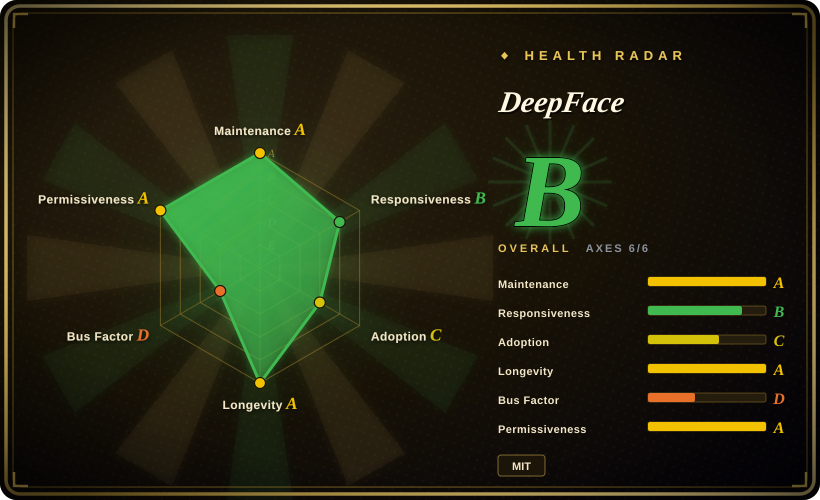
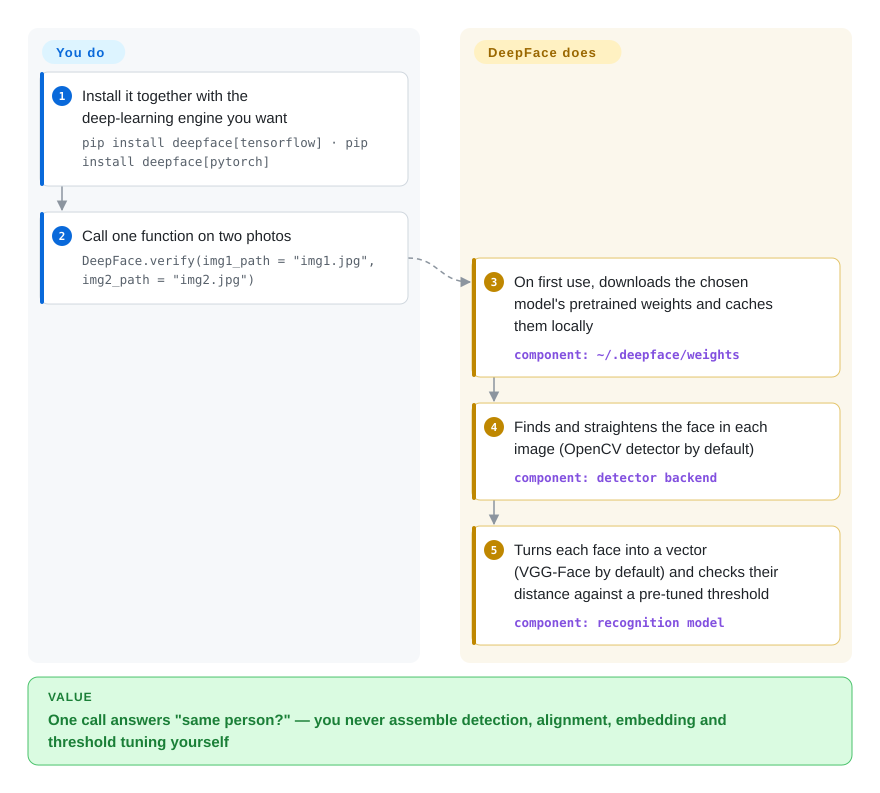

# DeepFace

You want to know whether the face in a selfie matches the one on an ID photo, or who in a folder of employee pictures just walked past a camera — and doing it yourself means stitching together a face detector, an alignment step, a recognition network and a distance threshold you have to tune. DeepFace wraps that whole chain behind one Python call that answers "same person?" or "who is this?", and can also guess age, gender, emotion and race.

## When to use

You're a Python developer adding face matching to a product or an internal tool: a KYC flow that compares a selfie with a passport scan, an attendance or door system that checks a camera frame against a few hundred enrolled staff photos, or a photo-library feature that groups pictures by person. You tried stitching it yourself and hit the real problem: an ArcFace embedding for two photos of the same colleague came out at cosine distance 0.61 and you had no idea whether that means "match" — the threshold depends on the model, the metric, the detector and whether faces were aligned. With DeepFace you `pip install deepface[tensorflow]` (or `[pytorch]`), call `DeepFace.verify(img1_path, img2_path)` and get back a dict with `verified: True/False`, the distance and the pre-tuned threshold it used; `DeepFace.find(img_path, db_path)` does the 1:N version against a folder, and `register`/`search` move that gallery into Postgres/pgvector, Mongo or a vector database.

You pick it over the alternatives because it is the **model-agnostic, batteries-included wrapper**: eleven recognition models (VGG-Face, FaceNet-128/512, ArcFace, Dlib, SFace, GhostFaceNet, Buffalo_L…) and ~20 detector backends are swappable by a string argument, each with a shipped threshold table and a published LFW benchmark grid, under an MIT code licence and with a REST/gRPC server in the same package. InsightFace gives stronger ArcFace-family models but you assemble the pipeline and its pretrained weights are non-commercial; ageitgey's face_recognition is simpler but hard-wired to dlib and has not had a PyPI release since 2020.

## How it works

DeepFace is a pure-Python orchestration layer over other people's models: it runs the classic five-stage face pipeline — **detect** where the face is, **align** it (rotate so the eyes are level), **normalize** it to the input size the model expects, **represent** it as an embedding (a list of a few hundred numbers where similar faces land close together) and **verify** by measuring the distance between two embeddings against a threshold. You choose models by name and supply images (paths, URLs, base64 or NumPy arrays); DeepFace downloads each model's pretrained weights the first time it is used (from the author's `deepface_models` GitHub releases or Google Drive, into `~/.deepface/weights`), picks TensorFlow or PyTorch as the engine (TensorFlow wins if both are installed unless `DEEPFACE_BACKEND_ENGINE` says otherwise), and ships the thresholds so you do not calibrate them. For 1:N search it either caches every gallery embedding in a pickle file inside your folder (`find`) or writes them to a database you run (`register`/`search`, optional approximate-nearest-neighbour index). Think of it as a universal remote for face models: it does not make any model better, it makes switching and comparing them a one-word change.

<!-- flow-steps:begin (generated from flows/deepface.json by tools/flow_card.py — do not edit) -->

Text version of the flow

1. **You**: Install it together with the deep-learning engine you want — `pip install deepface[tensorflow] · pip install deepface[pytorch]`
2. **You**: Call one function on two photos — `DeepFace.verify(img1_path = "img1.jpg", img2_path = "img2.jpg")`
3. **DeepFace**: On first use, downloads the chosen model's pretrained weights and caches them locally — component: `~/.deepface/weights`
4. **DeepFace**: Finds and straightens the face in each image (OpenCV detector by default) — component: `detector backend`
5. **DeepFace**: Turns each face into a vector (VGG-Face by default) and checks their distance against a pre-tuned threshold — component: `recognition model`

**Value**: One call answers "same person?" — you never assemble detection, alignment, embedding and threshold tuning yourself

<!-- flow-steps:end -->

## When NOT to use

- **Commercial product that ships the Buffalo_L model (or any wrapped weights) without checking their licence.** DeepFace's code is MIT, but its README says the wrapped models' licences "will be inherited"; Buffalo_L comes from InsightFace, whose README restricts its pretrained models to non-commercial research. Pick a model whose weight licence you have verified (e.g. SFace, whose OpenCV-zoo directory is Apache-2.0) or license InsightFace's models commercially — do not assume "MIT library" covers the weights.
- **Emotion or race inference on people at work, in schools, or in the EU generally.** `analyze(actions=['emotion','race'])` is exactly what EU AI Act Art. 5(1)(f)/(g) prohibits in workplaces/education (emotion) and for biometric categorisation by race — applicable since 2025-02-02. Use only verification/recognition with a lawful basis, or drop attribute analysis entirely; the author's own tutorial accuracy figures (age ±4.65 MAE, gender 97.44%) do not make it compliant, and a 2026-08 issue (#1618) reports emotion is unreliable beyond neutral/happy.
- **You need a PyTorch-only install today.** On PyPI 0.0.101 `tensorflow` and `keras` are still unconditional install requirements (the `[pytorch]` extra adds torch on top; `setup.py` says the split waits for a breaking release), and the PyTorch engine itself landed only in 2026-09. If a TensorFlow-free image matters, use facenet-pytorch or InsightFace's ONNX models directly, or install DeepFace with `--no-deps` and pin its base requirements yourself.
- **Air-gapped or locked-down deployment.** Weights are fetched at first call from GitHub releases and Google Drive via `gdown`; a firewall turns that into a runtime error. Pre-seed `~/.deepface/weights` (or `DEEPFACE_HOME`) in your image, or choose a library that ships weights as versioned artifacts you mirror.
- **Million-face 1:N search on the `find()` folder path.** `find` recomputes a pickle of embeddings in your image folder and compares against all of them; pickles also execute code when loaded, which is why the docs offer optional LightDSA signing. At scale use the database-backed `register`/`search` with pgvector or a vector DB (DeepFace supports Milvus, Qdrant, Weaviate, Pinecone), or skip DeepFace and index embeddings in that database yourself.
- **Security-grade liveness / identity proofing.** The bundled anti-spoofing is a single silent-liveness model (MiniVision's FasNet) toggled by `anti_spoofing=True`, with no published attack-presentation evaluation in the repo. For regulated KYC use a certified liveness vendor; treat DeepFace's flag as a first filter.
- **Exposing the REST API directly.** The Flask/gunicorn service has no authentication unless `DEEPFACE_AUTH_TOKEN` is set, and then it is one static bearer token. Put it behind your own gateway with real auth and rate limits (e.g. an API gateway), never on a public port.
- **Real-time or edge at low latency.** DeepFace is a Python/TensorFlow-or-PyTorch stack with many optional heavy dependencies; a camera loop on a small device is better served by OpenCV's built-in `FaceDetectorYN` (YuNet) and `FaceRecognizerSF` (SFace) classes or an ONNX runtime model you call directly.

## Comparison

| Alternative | In index | Our verdict | Tradeoff |
|---|---|---|---|
| InsightFace (deepinsight/insightface) | not indexed | Pick InsightFace when accuracy of the ArcFace family, training/fine-tuning code or ONNX deployment matter and your use is research; pick DeepFace when you want one API across many models with shipped thresholds and a server. | Stronger, actively released models (v2.0 on PyPI 2026-09-08) but you assemble detection→embedding→threshold yourself, and its README limits pretrained models to non-commercial research. Not added in this tab-intake batch. |
| face_recognition (ageitgey/face_recognition) | not indexed | Pick it only for a quick dlib-based script where its two-line API is enough; for anything maintained or needing model choice, pick DeepFace. | Simplest API and MIT, but locked to dlib's single model and last released on PyPI as 1.3.0 in 2020-02 — the 2026 commits are README/link fixes. Not added in this tab-intake batch. |
| CompreFace (exadel-inc/CompreFace) | not indexed | Pick CompreFace when non-Python teams need a ready Docker service with an admin UI and per-app API keys; pick DeepFace when you call from Python or need model choice. | Apache-2.0 service with UI and roles instead of a library, but last release v1.2.0 was 2023-08 and the last push 2024-10, so treat it as stalled. Not added in this tab-intake batch. |
| facenet-pytorch (timesler/facenet-pytorch) | not indexed | Pick facenet-pytorch when you want a small pure-PyTorch MTCNN + FaceNet pair with no TensorFlow; pick DeepFace when you need more models, attributes or a gallery store. | Minimal, torch-native and MIT, but one recognition model, no thresholds tuned for you, and last pushed 2025-09. Not added in this tab-intake batch. |
| AWS Rekognition / deepface.dev cloud | not a repo | Pick a hosted API when you cannot operate GPUs or model weights and are allowed to send face images to a third party; pick self-hosted DeepFace when biometric data must stay in your infrastructure. | Managed scaling and SLAs, paid per call; you hand biometric data to a vendor. Rekognition is a closed AWS service; deepface.dev is the author's paid hosted API built on DeepFace, not a separate repository. |

## Tech stack

- **Language:** Python (`python_requires >= 3.7`), single package `deepface` with a `deepface` CLI entry point (Fire).
- **Engines:** TensorFlow/Keras or PyTorch, selected at runtime by `deepface/commons/backend_utils.py`; nine recognition models ported to PyTorch in 2026-09 (PR #1624); Dlib, SFace, Buffalo_L and all detectors are engine-agnostic.
- **Detectors wrapped:** OpenCV (default), SSD, Dlib, MTCNN, Fast-MTCNN, RetinaFace, MediaPipe, YOLOv8/11/12 face, YuNet, CenterFace.
- **Serving:** Flask + gunicorn REST API (`deepface/api/src`), gRPC server from `deepface.proto`, Dockerfile on `python:3.8.12`.
- **Storage adapters:** local folder + pickle, S3/FTP, Postgres, pgvector, MongoDB, Neo4j, Pinecone, Milvus, Qdrant, Weaviate.

## Dependencies

- **Always installed (PyPI 0.0.101):** numpy, pandas, opencv-python, Pillow, gdown, requests, tqdm, Flask, flask-cors, gunicorn, fire, python-dotenv, lightphe, lightdsa, **tensorflow, keras, mtcnn, retina-face**.
- **Extras:** `[pytorch]` adds torch ≥ 2.1.2; `[tensorflow]` repeats the TF set.
- **Per-model optional packages** (install only what you select): dlib, mediapipe, ultralytics, facenet-pytorch, insightface + onnxruntime, opencv-contrib-python; boto3 for S3; grpcio for gRPC; the relevant DB driver for each store.
- **Network at first use:** GitHub Releases (`serengil/deepface_models`) and Google Drive for weights, cached under `DEEPFACE_HOME`.
- **Hardware:** runs on CPU; a GPU speeds up heavier models/detectors but is not required.

## Ops difficulty

**Low as a library, medium as a service.** Import-and-call is easy, but the dependency tree is heavy (TensorFlow is pulled in even for PyTorch users) and each model you enable may add a native package (dlib needs a compiler/cmake). Production work is mostly packaging: pre-download weights into the image, pin versions (0.0.x releases with no semver promise), pick a detector deliberately (the default OpenCV detector scores lowest in the project's own LFW table), and warm models at startup (`DEEPFACE_FACE_RECOGNITION_MODELS`) to avoid a slow first request. If you run the API, you own auth, TLS, rate limiting, and the database for the gallery.

## Health & viability

- **Maintenance (2026-09-28):** very active — v0.0.101 on 2026-09-16 after roughly monthly-to-quarterly releases through 2025–2026, and multiple feature PRs merged in the last week (gRPC server, S3, `identify`). Only 3 issues/PRs open: the maintainer closes quickly, sometimes tersely (#1616 was closed with "Couldn't understand what is expected").
- **Governance / bus factor:** effectively one person. Sefik Ilkin Serengil owns the user account repo and wrote ~1,536 commits; 62 of 69 default-branch commits in the last 12 months are his. No foundation or company governance.
- **Backing & funding:** personal project funded by Patreon/GitHub Sponsors plus the author's paid hosted API (deepface.dev); there is no feature-gating in the OSS code that we found, but the hosted offering is where the author's commercial interest sits.
- **Age & Lindy:** created 2020-02 (~6.6 years) and still actively developed — a solid Lindy prior for a single-maintainer library, discounted by the bus factor.
- **Adoption:** ~23.5k stars, ~3.2k forks, 94,433 PyPI downloads in the last month and 144 dependent repos (registry data in the health block, 2026-09-28); a 2026 peer-reviewed paper (Gazi University Journal of Science) is the citation.
- **Risk flags:** version still `0.0.x` after 100+ releases (no semver contract); inherited model licences (InsightFace-derived Buffalo_L is non-commercial); attribute analysis (race, emotion) is legally restricted in the EU; weights served from personal GitHub/Google Drive links.

## Caveats (unverified)

- [未验证] Benchmark accuracies (e.g. Facenet512 + RetinaFace 98.4% on LFW) are the author's own runs on LFW, a dataset easier than most production traffic; we did not reproduce them.
- [未验证] Age MAE ±4.65 and gender 97.44% accuracy come from the author's blog tutorial, not an independent evaluation.
- [推断] That no OSS feature is gated behind deepface.dev is based on reading the README and module list, not on a full comparison with the hosted API's feature set.
- [未验证] The anti-spoofing model's resistance to print/replay/mask attacks is not evaluated in the repo.
- [推断] EU AI Act reading (Art. 5(1)(f) and (g) cover DeepFace's emotion and race analysis) is our interpretation of the article text, not legal advice; applicability depends on deployment context.
- [未验证] Licences of each wrapped weight file were not all opened; only InsightFace's (non-commercial models) was read directly.
