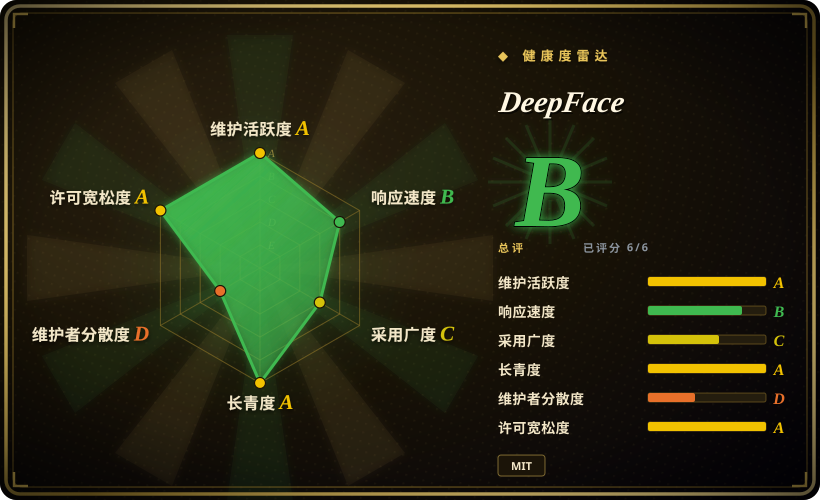
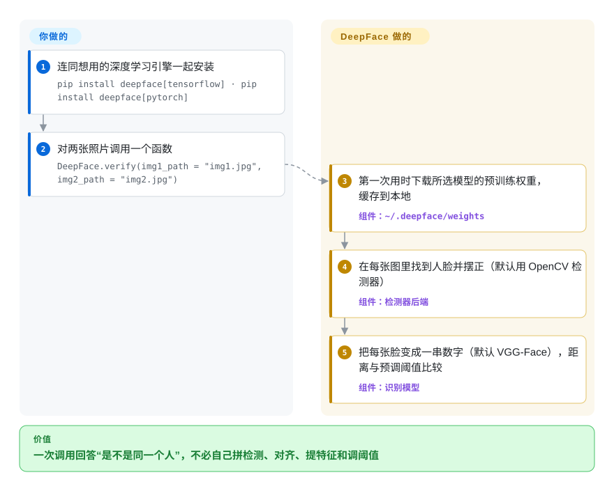

# DeepFace

你想确认自拍里的人和证件照上是不是同一个，或者摄像头刚拍到的人是员工照片文件夹里的哪一位——自己做就得拼一个人脸检测器、一步对齐、一个识别网络，再调一个说不清该设多少的距离阈值。DeepFace 把这整条链封装成一次 Python 调用，直接回答“是不是同一个人”或“这是谁”，顺带还能估年龄、性别、情绪和种族。

## 何时使用

你是个 Python 开发者，要给产品或内部工具加上人脸比对：KYC 流程里拿自拍对比护照扫描件，门禁或考勤系统拿摄像头画面去比几百张已登记的员工照片，或者相册功能要按人归类照片。你试过自己拼，然后撞上真正的问题：同一个同事的两张照片，ArcFace 算出来的余弦距离是 0.61，你根本不知道这算不算“同一个人”——阈值取决于模型、距离度量、检测器，还有人脸有没有对齐。用 DeepFace，你 `pip install deepface[tensorflow]`（或 `[pytorch]`），调用 `DeepFace.verify(img1_path, img2_path)`，拿回一个字典：`verified: True/False`、实际距离，以及它用的那个预调阈值；`DeepFace.find(img_path, db_path)` 是对着一个文件夹做一对多检索的版本，`register`／`search` 则把人脸库搬进 Postgres／pgvector、Mongo 或向量数据库。

选它而不选替代品，是因为它是**不绑定模型、开箱即用的封装层**：11 个识别模型（VGG-Face、FaceNet-128/512、ArcFace、Dlib、SFace、GhostFaceNet、Buffalo_L 等）和约 20 种检测器后端，改一个字符串参数就能换，每个都配了阈值表和公开的 LFW 基准网格；代码是 MIT 许可，同一个包里还带 REST／gRPC 服务。InsightFace 的 ArcFace 系模型更强，但流水线要你自己拼，而且它的预训练权重仅限非商业研究；ageitgey 的 face_recognition 更简单，却写死了 dlib，2020 年之后再没发过 PyPI 版本。

## 怎么用起来

DeepFace 是一层纯 Python 的调度代码，底下跑的都是别人的模型：它执行经典的五步人脸流水线——**检测**脸在哪，**对齐**（把脸转正、让两只眼睛水平），**归一化**到模型要求的输入尺寸，**表示**成一个嵌入向量（几百个数字组成的一串，长得像的脸算出来的数字也挨得近），最后**验证**：量两个向量的距离，跟阈值比。你按名字挑模型、把图片交给它（路径、URL、base64 或 NumPy 数组都行）；DeepFace 在某个模型第一次被用到时下载它的预训练权重（来自作者的 `deepface_models` GitHub Release 或 Google Drive，存到 `~/.deepface/weights`），在 TensorFlow 和 PyTorch 之间选引擎（两个都装了时默认 TensorFlow，除非用 `DEEPFACE_BACKEND_ENGINE` 指定），阈值也替你调好了。一对多检索有两种：要么把整个人脸库的向量缓存成你文件夹里的一个 pickle 文件（`find`），要么写进你自己运维的数据库（`register`／`search`，可选近似最近邻索引）。可以把它想成人脸模型的万能遥控器：它不会让任何一个模型变得更准，只是让换模型、比模型变成改一个词的事。

<!-- flow-steps:begin (generated from flows/deepface.json by tools/flow_card.py — do not edit) -->

流程文字版

1. **你**：连同想用的深度学习引擎一起安装 — `pip install deepface[tensorflow] · pip install deepface[pytorch]`
2. **你**：对两张照片调用一个函数 — `DeepFace.verify(img1_path = "img1.jpg", img2_path = "img2.jpg")`
3. **DeepFace**：第一次用时下载所选模型的预训练权重，缓存到本地 — 组件：`~/.deepface/weights`
4. **DeepFace**：在每张图里找到人脸并摆正（默认用 OpenCV 检测器） — 组件：`检测器后端`
5. **DeepFace**：把每张脸变成一串数字（默认 VGG-Face），距离与预调阈值比较 — 组件：`识别模型`

**价值**：一次调用回答“是不是同一个人”，不必自己拼检测、对齐、提特征和调阈值

<!-- flow-steps:end -->

## 何时不用

- **商业产品里直接用 Buffalo_L（或任何封装进来的权重）却不核对许可。** DeepFace 的代码是 MIT，但 README 明说被封装模型的许可“会被继承”；Buffalo_L 来自 InsightFace，而 InsightFace 的 README 把预训练模型限定为非商业研究用途。请选一个你核实过权重许可的模型（例如 SFace，它在 OpenCV zoo 里的目录是 Apache-2.0），或者向 InsightFace 购买商业授权——别以为“库是 MIT”就覆盖了权重。
- **在职场、学校或整个欧盟范围内做情绪或种族推断。** `analyze(actions=['emotion','race'])` 恰好落在欧盟《人工智能法》第 5 条第 1 款第 f 项（职场和教育机构中的情绪识别）和第 g 项（按生物特征推断种族的分类）的禁止范围内，2025-02-02 起适用。只做有合法依据的比对／识别，或者干脆不开属性分析；作者教程里的准确率（年龄 ±4.65 MAE、性别 97.44%）并不能让它合规，2026-08 的 issue #1618 也反映除了中性和高兴，其他情绪识别不可靠。
- **今天就要纯 PyTorch 的安装。** PyPI 0.0.101 里 `tensorflow` 和 `keras` 仍是无条件依赖（`[pytorch]` extra 只是在此基础上再装 torch；`setup.py` 说拆分要等一次破坏性版本），PyTorch 引擎本身也是 2026-09 才合进来的。如果镜像里不能有 TensorFlow，直接用 facenet-pytorch 或 InsightFace 的 ONNX 模型，或者用 `--no-deps` 安装 DeepFace 并自己钉住基础依赖。
- **离线或网络受限的部署。** 权重在第一次调用时通过 `gdown` 从 GitHub Release 和 Google Drive 下载，防火墙一拦就变成运行时报错。请在镜像里预先放好 `~/.deepface/weights`（或 `DEEPFACE_HOME`），或者选一个把权重作为可镜像的版本化制品发布的库。
- **用 `find()` 文件夹方式做百万级一对多检索。** `find` 会在你的图片文件夹里重算一个向量 pickle，然后逐个比较；pickle 加载时还能执行代码，所以文档才提供可选的 LightDSA 签名。规模大了请用基于数据库的 `register`／`search` 配 pgvector 或向量数据库（DeepFace 支持 Milvus、Qdrant、Weaviate、Pinecone），或者绕开 DeepFace，直接在那个数据库里建向量索引。
- **安全级的活体检测／身份核验。** 自带的防伪只是一个静默活体模型（MiniVision 的 FasNet），用 `anti_spoofing=True` 打开，仓库里没有公开的攻击呈现评测。受监管的 KYC 请用有认证的活体供应商；DeepFace 这个开关只能当第一道筛子。
- **直接把 REST API 暴露出去。** Flask／gunicorn 服务在没设 `DEEPFACE_AUTH_TOKEN` 时完全不鉴权，设了也只是一个固定的 bearer token。请放在你自己的网关后面，配真正的鉴权和限流（例如 API 网关），绝不要开在公网端口上。
- **低延迟的实时或边缘场景。** DeepFace 是 Python 加 TensorFlow 或 PyTorch 的技术栈，可选依赖又多又重；小设备上的摄像头循环更适合直接用 OpenCV 自带的 `FaceDetectorYN`（YuNet）和 `FaceRecognizerSF`（SFace）类，或者自己用 ONNX Runtime 调模型。

## 横向对比

| 替代品 | 是否收录 | 我们的评价 | 取舍 |
|---|---|---|---|
| InsightFace（deepinsight/insightface） | 未收录 | 当 ArcFace 系的准确率、训练／微调代码或 ONNX 部署更重要且用途是研究时，选 InsightFace；想用一套 API 切换多个模型、阈值现成、还带服务时，选 DeepFace。 | 模型更强、仍在发版（PyPI 2.0 于 2026-09-08 发布），但检测→向量→阈值要自己拼，且 README 把预训练模型限定为非商业研究。本批次（tab-intake）未收录。 |
| face_recognition（ageitgey/face_recognition） | 未收录 | 只在写个基于 dlib 的快速脚本、两行 API 就够时选它；需要持续维护或换模型时，选 DeepFace。 | API 最简单、MIT，但锁死 dlib 一个模型，PyPI 最后一版是 2020-02 的 1.3.0，2026 年的提交只是 README／链接修补。本批次（tab-intake）未收录。 |
| CompreFace（exadel-inc/CompreFace） | 未收录 | 当非 Python 团队需要现成的 Docker 服务、带管理界面和按应用分配的 API key 时，选 CompreFace；从 Python 调用或要换模型时，选 DeepFace。 | Apache-2.0 的服务形态、有界面和角色，而不是库；但最后一版 v1.2.0 是 2023-08，最后一次推送 2024-10，应视为停滞。本批次（tab-intake）未收录。 |
| facenet-pytorch（timesler/facenet-pytorch） | 未收录 | 想要一对小巧的纯 PyTorch MTCNN＋FaceNet、完全不碰 TensorFlow 时，选 facenet-pytorch；需要更多模型、属性分析或人脸库存储时，选 DeepFace。 | 精简、原生 torch、MIT，但只有一个识别模型、阈值要自己调，最后推送是 2025-09。本批次（tab-intake）未收录。 |
| AWS Rekognition／deepface.dev 云服务 | 非仓库 | 没法自己运维 GPU 和模型权重、且允许把人脸图片交给第三方时，选托管 API；生物特征数据必须留在自己基础设施里时，选自托管的 DeepFace。 | 托管扩容、有 SLA，按调用付费；代价是把生物特征数据交给供应商。Rekognition 是闭源 AWS 服务；deepface.dev 是作者基于 DeepFace 的付费托管 API，不是另一个仓库。 |

## 技术栈

- **语言：** Python（`python_requires >= 3.7`），单个包 `deepface`，带基于 Fire 的 `deepface` 命令行入口。
- **引擎：** TensorFlow／Keras 或 PyTorch，由 `deepface/commons/backend_utils.py` 在运行时选择；2026-09 有 9 个识别模型移植到 PyTorch（PR #1624）；Dlib、SFace、Buffalo_L 和全部检测器与引擎无关。
- **封装的检测器：** OpenCV（默认）、SSD、Dlib、MTCNN、Fast-MTCNN、RetinaFace、MediaPipe、YOLOv8/11/12 人脸版、YuNet、CenterFace。
- **服务化：** Flask＋gunicorn 的 REST API（`deepface/api/src`），基于 `deepface.proto` 的 gRPC 服务，基于 `python:3.8.12` 的 Dockerfile。
- **存储适配：** 本地文件夹＋pickle、S3／FTP、Postgres、pgvector、MongoDB、Neo4j、Pinecone、Milvus、Qdrant、Weaviate。

## 依赖

- **总会安装（PyPI 0.0.101）：** numpy、pandas、opencv-python、Pillow、gdown、requests、tqdm、Flask、flask-cors、gunicorn、fire、python-dotenv、lightphe、lightdsa，**以及 tensorflow、keras、mtcnn、retina-face**。
- **Extras：** `[pytorch]` 增加 torch ≥ 2.1.2；`[tensorflow]` 重复声明 TF 那一组。
- **按模型可选的包**（只装你选中的）：dlib、mediapipe、ultralytics、facenet-pytorch、insightface＋onnxruntime、opencv-contrib-python；S3 需要 boto3，gRPC 需要 grpcio，各数据库需要对应驱动。
- **首次使用需要联网：** 从 GitHub Release（`serengil/deepface_models`）和 Google Drive 下载权重，缓存在 `DEEPFACE_HOME` 下。
- **硬件：** CPU 就能跑；GPU 能加速较重的模型和检测器，但不是必需。

## 运维难度

**当库用是低，当服务用是中。** 导入后调用很简单，但依赖树很重（PyTorch 用户也会被装上 TensorFlow），每启用一个模型可能就多一个原生包（dlib 需要编译器和 cmake）。上生产的工作主要是打包：把权重预先下载进镜像，钉住版本（0.0.x 发版，没有语义化版本承诺），认真选检测器（默认的 OpenCV 检测器在项目自己的 LFW 表里得分最低），启动时预热模型（`DEEPFACE_FACE_RECOGNITION_MODELS`），避免第一个请求很慢。如果跑 API，鉴权、TLS、限流和人脸库数据库都归你管。

## 健康度与可持续性

- **维护（2026-09-28）：** 非常活跃——2026-09-16 发布 v0.0.101，2025–2026 年大致每月到每季度一版，最近一周还合并了多个功能 PR（gRPC 服务、S3、`identify`）。当前只有 3 个未关闭的 issue／PR：维护者关得很快，有时相当简短（#1616 的回复是“Couldn't understand what is expected”就关了）。
- **治理／巴士因子：** 实际上就一个人。Sefik Ilkin Serengil 以个人账号持有仓库，写了约 1,536 次提交；过去 12 个月默认分支 69 次提交里 62 次是他的。没有基金会或公司治理。
- **支撑与资金：** 个人项目，靠 Patreon／GitHub Sponsors 以及作者的付费托管 API（deepface.dev）；我们没在开源代码里发现功能被锁到付费版，但作者的商业利益在托管服务那边。
- **年龄与 Lindy：** 2020-02 创建（约 6.6 年），至今仍在积极开发——对单人维护的库来说是不错的 Lindy 先验，但要按巴士因子打折。
- **采用度：** 约 23.5k star、约 3.2k fork，近一个月 PyPI 下载 94,433 次、144 个依赖仓库（健康度块里的注册表数据，2026-09-28）；引用对象是 2026 年一篇同行评审论文（Gazi University Journal of Science）。
- **风险信号：** 100 多次发版后版本号仍是 `0.0.x`（没有语义化版本承诺）；模型许可会被继承（源自 InsightFace 的 Buffalo_L 是非商业）；属性分析（种族、情绪）在欧盟受法律限制；权重托管在个人的 GitHub／Google Drive 链接上。

## 存疑（未验证）

- [未验证] 基准准确率（例如 Facenet512＋RetinaFace 在 LFW 上 98.4%）是作者自己在 LFW 上跑的，而 LFW 比多数生产流量容易；我们没有复现。
- [未验证] 年龄 ±4.65 MAE、性别 97.44% 准确率出自作者的博客教程，不是独立评测。
- [推断] “开源版没有功能被锁到 deepface.dev”是根据 README 和模块列表判断的，没有与托管 API 的功能逐项对比。
- [未验证] 防伪模型对打印照片、翻拍屏幕、面具攻击的抵抗力，仓库里没有评测。
- [推断] 欧盟《人工智能法》第 5 条第 1 款第 f、g 项覆盖 DeepFace 情绪和种族分析，这是我们对条文的理解，不是法律意见；是否适用取决于部署场景。
- [未验证] 被封装的各权重文件的许可没有逐个打开核对；只直接读了 InsightFace 的（模型非商业）。
