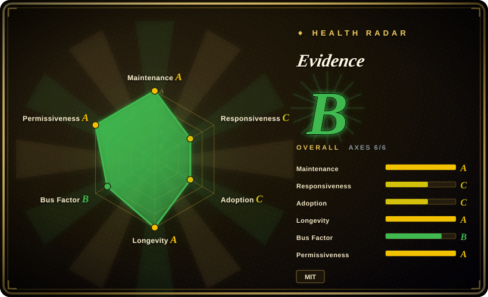
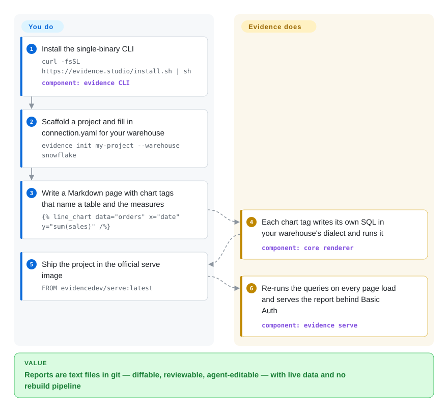

# Evidence

Your company's reports live inside a click-through BI tool, so nobody can diff a change, review it in a pull request, or hand it to a coding agent — and a chart someone broke just ships. Evidence turns a report into a Markdown file with SQL and chart tags that lives in git, and one CLI binary renders it against your warehouse with live queries.

## When to use

You're an analytics engineer whose team already models data in Snowflake, BigQuery, Postgres or ClickHouse, and the "dashboard layer" is a pile of Metabase questions nobody owns: when a metric definition changes you click through twenty cards, there is no history of who changed `revenue` to exclude refunds, and Claude Code or Cursor cannot touch any of it. You want reports treated like code. With Evidence each page is a `.md` file — prose plus tags like `` — that goes through a pull request, can be validated with `evidence validate`, and can be edited by an agent driving the CLI.

You pick it over Metabase or Superset precisely because those are GUI-first: they win when business users build their own questions by clicking, Evidence wins when a small technical team writes curated reports and wants git review, agent editing and a single-binary runtime instead of a multi-service BI server. Note the 2026-08 rewrite: today's open-source "Evidence Core" queries the warehouse live from a server (`evidence serve`); the old static-site Evidence (Svelte syntax, DuckDB in the browser) is now called "legacy" and is no longer on `main`.

## How it works

Evidence is a renderer for Markdown pages that contain data. You write the page and say *what* to show — a table name, an x column, an aggregate like `sum(sales)`, filters — using Markdoc tags (Markdoc is a Markdown dialect with `` tags for components). Evidence's components then write the SQL themselves, in your warehouse's own dialect, run it through a direct connector configured in `connection.yaml`, and draw the result with ECharts. There is no build step: `evidence dev` locally and `evidence serve` in production re-run the queries each time a page loads, so the data is as fresh as the warehouse. What stays your job is the warehouse itself (data prep happens there, not in Evidence), hosting the container, and access control — self-hosted gets only HTTP Basic Auth, while SSO, row-level security, SQL models and the web editor live in the paid Evidence Studio.

<!-- flow-steps:begin (generated from flows/evidence.json by tools/flow_card.py — do not edit) -->

Text version of the flow

1. **You**: Install the single-binary CLI — `curl -fsSL https://evidence.studio/install.sh | sh` — component: `evidence CLI`
2. **You**: Scaffold a project and fill in connection.yaml for your warehouse — `evidence init my-project --warehouse snowflake`
3. **You**: Write a Markdown page with chart tags that name a table and the measures — ``
4. **Evidence**: Each chart tag writes its own SQL in your warehouse's dialect and runs it — component: `core renderer`
5. **You**: Ship the project in the official serve image — `FROM evidencedev/serve:latest`
6. **Evidence**: Re-runs the queries on every page load and serves the report behind Basic Auth — component: `evidence serve`

**Value**: Reports are text files in git — diffable, reviewable, agent-editable — with live data and no rebuild pipeline

<!-- flow-steps:end -->

## When NOT to use

- **Business users must build their own questions by clicking.** Evidence is authored in Markdown and SQL by technical people; choose [Metabase](metabase.md) for a no-SQL question builder, or [Apache Superset](superset.md) for a SQL-Lab-plus-dashboard BI server.
- **You need SSO, per-page permissions or row-level security while self-hosting.** Self-hosted Evidence ships HTTP Basic Auth only (SSO means putting your own authenticating reverse proxy in front); access controls, RLS, SQL models, embedded analytics and the web editor are Evidence Studio features. If you cannot use the hosted service, Metabase or Superset give you built-in user/role management.
- **You are on legacy Evidence and depend on its static-site model.** As of 2026-10-08 `main` holds only the rewritten Core; the legacy npm package `@evidence-dev/evidence` was last published 2026-02-06 (40.1.8). Core drops templated pages (`[param].md`), `sources/` build-time queries, in-browser DuckDB, custom Svelte components, box plots and Venn diagrams, and needs a live warehouse connection. If you need a static site you can host on a CDN with no database behind it, look at Observable Framework (not indexed) or Quarto (not indexed) rather than migrating.
- **One project must join data from several warehouses.** Core supports one data warehouse per project, and self-hosting requires one of the eight direct connectors (BigQuery, ClickHouse, Cube, Databricks, Fabric, MotherDuck, Postgres, Snowflake). For MySQL or SQL Server directly, or for cross-source dashboards, use Metabase or Superset; the 100+ SaaS "data sources" in the docs are syncs into the hosted Evidence Warehouse, not something the open-source binary does.
- **You need an interactive app with forms and Python logic, not a report.** Use Streamlit (not indexed); Evidence pages express config, not code, and do not execute JavaScript.
- **You want a community-governed project.** The public repo is a Copybara mirror of the vendor's private `evidence-dev/studio` monorepo: outside PRs are re-landed internally and closed, and the roadmap is set by the company whose revenue is the hosted Studio. If that open-core shape is a blocker, Superset (Apache Software Foundation) is the governance-safe choice.

## Comparison

| Alternative | In index | Our verdict | Tradeoff |
|---|---|---|---|
| [Metabase](metabase.md) | ✅ | For dashboards that non-technical staff build and edit themselves, pick Metabase; pick Evidence when a few engineers own curated reports and want them reviewed in git and edited by agents. | Metabase gives a click-to-query builder and built-in users/groups in one JVM container, but its content lives in an app database you cannot diff; Evidence gives text-file reports and a single binary, but every chart needs someone who writes Markdown and SQL. |
| [Apache Superset](superset.md) | ✅ | For a self-hosted BI server with RBAC, SQL Lab and many database drivers under foundation governance, pick Superset; pick Evidence when you want narrative reports as code without running a web app, metadata DB, Redis and Celery. | Superset covers broad exploration and access control at the cost of a multi-service deployment; Evidence is one stateless container but self-hosted access control stops at Basic Auth and it serves one warehouse per project. |
| Lightdash | not indexed | If your metrics are already defined in dbt and you want business users to explore them, pick Lightdash; pick Evidence when the goal is written reports rather than a self-serve explore UI. | Lightdash reads the dbt semantic layer and gives a GUI on top; Evidence has no dbt coupling and puts the page text, not an explore screen, at the center. |
| Observable Framework | not indexed | When you want a fully static data site you can drop on any CDN, with data loaders that run at build time, pick Observable Framework; pick Evidence Core when live warehouse queries and no rebuilds matter more. | Static output is cheap and serverless but stale until the next build; Evidence Core needs a running server and warehouse credentials, but shows current data. |
| Streamlit | not indexed | For interactive Python apps with widgets and custom logic, pick Streamlit; pick Evidence for SQL-first reports that analysts read like documents. | Streamlit allows arbitrary Python at the price of writing an app; Evidence restricts you to declarative components, which keeps pages reviewable but rules out custom logic. |

## Tech stack

- **Languages:** TypeScript and Svelte (GitHub language stats, 2026-10-08); a pnpm monorepo with `core/` (the rendering engine) and `cli/` (the `evidence` / `evd` command).
- **Rendering:** SvelteKit 2 with Svelte 5, Tailwind CSS 4, a vendored fork of Markdoc (`@hughess/markdoc`) for page syntax, and a patched ECharts 6 for charts.
- **Runtime:** the CLI is compiled by Bun into one self-contained binary per platform (macOS arm64/x64, Linux x64/arm64, Windows x64) with the SvelteKit app embedded; `evidence serve` runs on `Bun.serve()`.
- **Connectors:** the CLI manifest bundles drivers for Snowflake, BigQuery, Databricks, ClickHouse, Postgres and `mssql`; the docs list eight direct connectors (BigQuery, ClickHouse, Cube, Databricks, Fabric, MotherDuck, Postgres, Snowflake).

## Dependencies

- **A data warehouse you can reach.** Self-hosted projects must use a direct connector configured in `connection.yaml` (credentials via `${VAR}` environment references in production). Without one, the CLI falls back to the hosted Evidence Warehouse, which needs an Evidence Studio login.
- **Install path:** `install.sh` / `install.ps1` download the binary from the vendor's Vercel Blob storage, not from GitHub Releases; production uses the `evidencedev/serve` Docker image.
- **Build from source:** Node 22.22+, pnpm and Bun.
- **Outbound telemetry:** the CLI and `evidence serve` send anonymous usage events (one per command, plus a daily heartbeat for `serve`) to evidence.studio unless you set `EVIDENCE_TELEMETRY_DISABLED=1` or `DO_NOT_TRACK=1`.

## Ops difficulty

**Low to medium.** One stateless container (`FROM evidencedev/serve:latest` + your project files) on Vercel, Render, Fly.io, Railway or any Docker host — no metadata database, cache or worker queue. The work moves elsewhere: every page view runs queries against your warehouse, so its cost and latency are now the report's cost and latency; secrets have to be moved out of `connection.yaml` into environment variables; authentication is a single shared Basic Auth password (rotate it to log everyone out) unless you put an SSO proxy in front. Upgrades are `evidence upgrade`, and the CLI refuses to run below a vendor-set minimum version.

## Health & viability

- **Maintenance (2026-10-08): very active, but on a new codebase.** Commits land almost daily (eight between 2026-10-01 and 10-07), and the changelog ships weekly. GitHub Releases stopped at the legacy npm packages (2026-02-06); the Core CLI is versioned through the vendor's install channel (0.10.1 on 2026-10-08).
- **Governance: single vendor, mirror workflow.** The repo is a Copybara projection of the private `evidence-dev/studio` monorepo; outside PRs are landed internally and closed. Commit history shows about 14 active maintainers in the last year with the top contributor at ~40% of commits — a team, but one company.
- **Responsiveness has slipped:** the scored median time to first response on issues is about three weeks (503.5 hours, 2026-10-08 radar), down from a PR-based near-zero in the previous score — expect slow answers on GitHub; the vendor points support to Slack.
- **Age / Lindy:** the repo dates from 2021-05 (~5.4 years) and is still active, but the 2026-08 rewrite reset the product: Core's syntax, runtime and data model are months old, so the Lindy prior applies to the team, not to today's API.
- **Adoption:** ~6,988 GitHub stars (2026-10-08); the measured registry signal is the legacy VS Code extension (19,847 Open VSX downloads in the last month), which says more about legacy users than about Core.
- **Risk flags:** MIT licensed with no relicense, but clearly open-core — auth, permissions, RLS, SQL models, embedded analytics and agents are Studio-only — and the legacy-to-Core migration is breaking (`evidence migrate` handles syntax, not removed features). Telemetry is on by default.

## Caveats (unverified)

- [推断] The legacy npm line (`@evidence-dev/evidence` 40.1.8, 2026-02-06) is no longer maintained: its code was removed from `main` in the 2026-08 "publish evidence core" commit, but no formal deprecation notice was found.
- [未验证] The migration guide's scale claim ("hundreds of millions of rows" for Core vs ~2M for legacy) is vendor marketing and depends on your warehouse, not on Evidence.
- [未验证] That `evidence init --warehouse …` plus `evidence serve` works end to end with no Studio account was read from the docs (`connection.yaml`: "no login required"), not run.
- [推断] The adoption grade is driven by the legacy VS Code extension's download count, which may not track Core usage.
- [未验证] MotherDuck and Cube connector details were taken from the direct-connector doc list; their driver code was not inspected.
