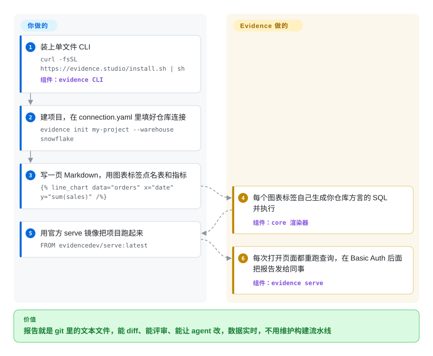

# Evidence

公司的报表都长在点选式 BI 工具里：改了什么没法 diff，没法走 PR 评审，也没法交给编码 agent 去改，有人把图表改坏了也就直接上线了。Evidence 把一份报表变成 git 里的一个 Markdown 文件，里面写 SQL 和图表标签，再由一个 CLI 二进制连着你的数据仓库实时查询、渲染出来。

## 何时使用

你是分析工程师，团队的数据已经在 Snowflake、BigQuery、Postgres 或 ClickHouse 里建好模，而“看板层”是一堆没人负责的 Metabase 问题卡：指标口径一改，你得点开二十张卡逐个改；`revenue` 是谁、什么时候改成不含退款的，没有任何记录；Claude Code 或 Cursor 也碰不到这些内容。你想让报表像代码一样管理。用 Evidence，每一页就是一个 `.md` 文件，正文加上 `` 这样的标签，走 PR 合并，能用 `evidence validate` 校验，也能让 agent 通过 CLI 去改。

你选它而不选 Metabase 或 Superset，恰恰因为那两个是图形界面优先：业务人员要自己点出问题时它们更合适；少数技术人员写精编报表、要 git 评审、要 agent 能改、只想跑一个二进制而不是一整套 BI 服务时，Evidence 更合适。注意 2026-08 的重写：现在开源的 “Evidence Core” 是由服务器（`evidence serve`）实时查询数据仓库；原来那个静态站点版 Evidence（Svelte 语法、浏览器里跑 DuckDB）已改称 “legacy”，`main` 分支上已经没有它的代码。

## 怎么用起来

Evidence 是一个“带数据的 Markdown 页面”渲染器。你来写页面，并用 Markdoc 标签（Markdoc 是一种带 `` 组件标签的 Markdown 方言）说明要展示什么：哪张表、x 轴用哪一列、`sum(sales)` 这样的聚合、哪些过滤条件。Evidence 的组件自己写 SQL，用你所在数据仓库的方言，经 `connection.yaml` 里配好的直连连接器执行，再用 ECharts 画出来。没有构建步骤：本地 `evidence dev`、线上 `evidence serve`，每次打开页面都会重跑查询，所以数据和仓库一样新。仍然归你管的是：数据仓库本身（数据加工在仓库里做，不在 Evidence 里）、托管这个容器、访问控制——自托管只有 HTTP Basic Auth，SSO、行级权限、SQL 模型、网页编辑器都在付费的 Evidence Studio 里。

<!-- flow-steps:begin (generated from flows/evidence.json by tools/flow_card.py — do not edit) -->

流程文字版

1. **你**：装上单文件 CLI — `curl -fsSL https://evidence.studio/install.sh | sh` — 组件：`evidence CLI`
2. **你**：建项目，在 connection.yaml 里填好仓库连接 — `evidence init my-project --warehouse snowflake`
3. **你**：写一页 Markdown，用图表标签点名表和指标 — ``
4. **Evidence**：每个图表标签自己生成你仓库方言的 SQL 并执行 — 组件：`core 渲染器`
5. **你**：用官方 serve 镜像把项目跑起来 — `FROM evidencedev/serve:latest`
6. **Evidence**：每次打开页面都重跑查询，在 Basic Auth 后面把报告发给同事 — 组件：`evidence serve`

**价值**：报告就是 git 里的文本文件，能 diff、能评审、能让 agent 改，数据实时，不用维护构建流水线

<!-- flow-steps:end -->

## 何时不用

- **业务人员要自己点选出问题。** Evidence 由技术人员用 Markdown 和 SQL 编写；需要免 SQL 的提问界面选 [Metabase](metabase.zh.md)，需要 SQL Lab 加看板的 BI 服务选 [Apache Superset](superset.zh.md)。
- **自托管时要 SSO、按页面授权或行级权限。** 自托管的 Evidence 只有 HTTP Basic Auth（要 SSO 得自己在前面放一个带认证的反向代理）；访问控制、行级权限、SQL 模型、嵌入式分析和网页编辑器都是 Evidence Studio 的功能。不能用托管服务时，Metabase 或 Superset 自带用户和角色管理。
- **你在用 legacy Evidence，并且依赖它的静态站点模式。** 截至 2026-10-08，`main` 上只剩重写后的 Core；legacy 的 npm 包 `@evidence-dev/evidence` 最后一次发布是 2026-02-06（40.1.8）。Core 去掉了模板页（`[param].md`）、构建期查询的 `sources/`、浏览器内 DuckDB、自定义 Svelte 组件、箱线图和韦恩图，而且必须实时连着数据仓库。如果你要的是一个能放上 CDN、背后不连数据库的静态站点，与其迁移，不如看 Observable Framework（未收录）或 Quarto（未收录）。
- **一个项目要拼多个数据仓库的数据。** Core 每个项目只支持一个数据仓库，自托管还必须用八种直连连接器之一（BigQuery、ClickHouse、Cube、Databricks、Fabric、MotherDuck、Postgres、Snowflake）。要直连 MySQL 或 SQL Server，或者做跨数据源看板，用 Metabase 或 Superset；文档里列的一百多个 SaaS “数据源”是同步进托管 Evidence Warehouse 的，开源二进制做不到。
- **你要的是带表单和 Python 逻辑的交互应用，不是报表。** 用 Streamlit（未收录）；Evidence 页面写的是配置，不是代码，也不执行 JavaScript。
- **你要社区治理的项目。** 公开仓库是厂商私有单仓 `evidence-dev/studio` 的 Copybara 镜像：外部 PR 在内部重新合入后被关闭，路线图由靠托管 Studio 赚钱的公司决定。这种开源核心（open-core）形态是硬伤的话，Apache 基金会治理的 Superset 更稳妥。

## 横向对比

| 替代品 | 是否收录 | 我们的评价 | 取舍 |
|---|---|---|---|
| [Metabase](metabase.zh.md) | ✅ | 看板要由非技术同事自己搭、自己改，选 Metabase；少数工程师负责精编报表、要在 git 里评审、要让 agent 改，选 Evidence。 | Metabase 有点选式查询界面，一个 JVM 容器就自带用户和分组，但内容存在应用数据库里没法 diff；Evidence 的报表是文本文件、运行时是单个二进制，但每张图都得有人写 Markdown 和 SQL。 |
| [Apache Superset](superset.zh.md) | ✅ | 要自托管、带 RBAC 和 SQL Lab、能连很多数据库、由基金会治理的 BI 服务，选 Superset；要“报表即代码”的叙事型报告，又不想维护 Web 应用、元数据库、Redis 和 Celery，选 Evidence。 | Superset 的探索能力和访问控制更全，代价是多服务部署；Evidence 只是一个无状态容器，但自托管的访问控制止步于 Basic Auth，且每个项目只连一个仓库。 |
| Lightdash | 未收录 | 指标已经定义在 dbt 里、想让业务人员自助探索，选 Lightdash；目标是写成文的报告而不是自助探索界面，选 Evidence。 | Lightdash 读取 dbt 语义层，在上面给一个图形界面；Evidence 不绑定 dbt，以页面正文而不是探索界面为中心。 |
| Observable Framework | 未收录 | 要一个能丢到任何 CDN 上的纯静态数据站点、数据加载器在构建期运行，选 Observable Framework；更看重实时查仓库、不用重新构建，选 Evidence Core。 | 静态产物便宜、无需服务器，但下次构建前数据都是旧的；Evidence Core 要跑服务器、要仓库凭据，换来的是实时数据。 |
| Streamlit | 未收录 | 要带控件和自定义逻辑的交互式 Python 应用，选 Streamlit；要分析师像读文档一样读的 SQL 优先报表，选 Evidence。 | Streamlit 能写任意 Python，代价是你在写一个应用；Evidence 只给声明式组件，页面好评审，但写不了自定义逻辑。 |

## 技术栈

- **语言：** TypeScript 和 Svelte（GitHub 语言统计，2026-10-08）；pnpm 单仓，分 `core/`（渲染引擎）和 `cli/`（`evidence` / `evd` 命令）两部分。
- **渲染：** SvelteKit 2 + Svelte 5、Tailwind CSS 4，页面语法用自维护的 Markdoc 分支（`@hughess/markdoc`），图表用打过补丁的 ECharts 6。
- **运行时：** CLI 由 Bun 编译成每个平台一个自包含二进制（macOS arm64/x64、Linux x64/arm64、Windows x64），SvelteKit 应用嵌在里面；`evidence serve` 跑在 `Bun.serve()` 上。
- **连接器：** CLI 依赖清单里打包了 Snowflake、BigQuery、Databricks、ClickHouse、Postgres 和 `mssql` 的驱动；文档列出八种直连连接器（BigQuery、ClickHouse、Cube、Databricks、Fabric、MotherDuck、Postgres、Snowflake）。

## 依赖

- **一个连得上的数据仓库。** 自托管项目必须用 `connection.yaml` 里配置的直连连接器（生产环境用 `${VAR}` 引用环境变量传凭据）。不配的话，CLI 会改用托管的 Evidence Warehouse，那就需要登录 Evidence Studio。
- **安装渠道：** `install.sh` / `install.ps1` 从厂商的 Vercel Blob 存储下载二进制，不走 GitHub Releases；生产环境用 `evidencedev/serve` Docker 镜像。
- **从源码构建：** Node 22.22+、pnpm 和 Bun。
- **出站遥测：** CLI 和 `evidence serve` 默认向 evidence.studio 发送匿名使用事件（每条命令一次，`serve` 另有每日心跳），设置 `EVIDENCE_TELEMETRY_DISABLED=1` 或 `DO_NOT_TRACK=1` 可关闭。

## 运维难度

**低到中。** 一个无状态容器（`FROM evidencedev/serve:latest` 加上项目文件），放在 Vercel、Render、Fly.io、Railway 或任意 Docker 主机上，不需要元数据库、缓存或任务队列。运维负担转移到了别处：每次打开页面都会查一次仓库，仓库的费用和延迟就是报表的费用和延迟；凭据要从 `connection.yaml` 挪进环境变量；认证只有一个共享的 Basic Auth 密码（想让所有人重新登录只能换密码），除非在前面加 SSO 代理。升级用 `evidence upgrade`，低于厂商设定的最低版本时 CLI 会拒绝运行。

## 健康度与可持续性

- **维护（2026-10-08）：非常活跃，但跑在一套新代码上。** 几乎每天都有提交（2026-10-01 到 10-07 之间八次），更新日志每周都有新条目。GitHub Releases 停在 legacy 的 npm 包（2026-02-06）；Core CLI 通过厂商自己的安装渠道发版（2026-10-08 为 0.10.1）。
- **治理：单一厂商，镜像式协作。** 仓库是私有单仓 `evidence-dev/studio` 的 Copybara 投影；外部 PR 在内部合入后关闭。提交记录显示近一年约 14 名活跃维护者，头号贡献者约占 40%——是个团队，但都在一家公司。
- **响应变慢：** 2026-10-08 雷达测得 issue 首次响应中位数约三周（503.5 小时），上一次评分时按 PR 计接近零——在 GitHub 上提问要预期回复慢，厂商把支持引向 Slack。
- **年龄 / Lindy：** 仓库创建于 2021-05（约 5.4 年）且仍活跃，但 2026-08 的重写等于让产品重新起步：Core 的语法、运行时和数据模型只有几个月历史，Lindy 先验只能算在团队头上，不能算在今天的 API 上。
- **采用：** 约 6,988 个 GitHub stars（2026-10-08）；评分用到的注册表信号是 legacy 的 VS Code 扩展（Open VSX 近一个月下载 19,847 次），反映的更多是 legacy 用户而不是 Core。
- **风险信号：** MIT 许可，没有改过许可证，但开源核心形态很明显——认证、权限、行级安全、SQL 模型、嵌入式分析和 agent 都只在 Studio 里；从 legacy 迁到 Core 是破坏性变更（`evidence migrate` 只处理语法，补不回被删掉的功能）。遥测默认开启。

## 存疑（未验证）

- [推断] legacy 的 npm 线（`@evidence-dev/evidence` 40.1.8，2026-02-06）已不再维护：它的代码在 2026-08 的 “publish evidence core” 提交里从 `main` 删除，但没找到正式的弃用公告。
- [未验证] 迁移指南里的规模说法（Core 能到“数亿行”，legacy 约 200 万行）是厂商宣传，实际取决于你的数据仓库而不是 Evidence。
- [未验证] “`evidence init --warehouse …` 加 `evidence serve` 不需要 Studio 账号就能完整跑通”来自文档（`connection.yaml` 一节写“no login required”），没有实际运行。
- [推断] 采用度评分主要由 legacy VS Code 扩展的下载量决定，未必反映 Core 的使用情况。
- [未验证] MotherDuck 和 Cube 连接器的细节只取自直连连接器文档列表，没有看驱动代码。
