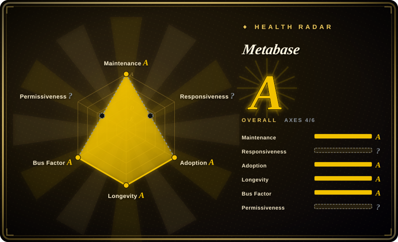
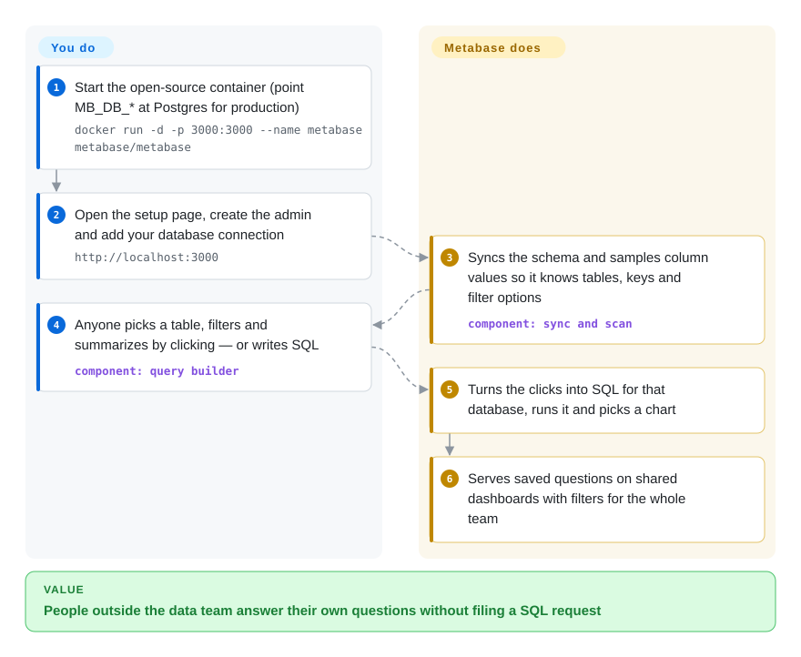

# Metabase

Every "how many signups came from the April campaign?" lands in the data team's queue as a SQL request, and the people asking wait days for a number they could have read off a table. Metabase is a self-hostable BI app that connects to your database and lets non-SQL staff pick a table, filter and summarize by clicking, then save the answer to a shared dashboard.

## When to use

You're the one data person (or a small data team) at a 50–300-person company. Sales, support and marketing each keep a spreadsheet of SQL snippets you wrote for them; every week someone pings you because `WHERE created_at > '2026-04-01'` needs to become May. You want them to answer those questions themselves against the production replica or the warehouse, and you want it running by this afternoon. You start the Metabase container, connect Postgres or Snowflake, and people get a point-and-click query builder, dashboards with filter widgets, and email/Slack subscriptions — while you keep a SQL editor for the hard ones.

You pick Metabase over [Apache Superset](superset.md) when the audience is non-technical and the ops budget is one container: Superset gives analysts more chart types and SQL Lab depth but asks for a web app plus Redis and Celery workers. You pick it over [Evidence](evidence.md) when people need to build their own questions in a GUI rather than read reports engineers wrote in Markdown. And over commercial tools (Looker, Tableau, Power BI) when you want to self-host the free AGPL edition and pay only if you later need SSO, row-level security or white-label embedding.

## How it works

Metabase is one Java application with a web UI. You connect it to a database it supports (Postgres, MySQL, Snowflake, BigQuery, Redshift, ClickHouse, SQL Server and about a dozen more, plus community drivers); it then *syncs* the schema and *scans* samples of column values in the background, so it knows which tables, keys and filter choices exist. When someone builds a question by clicking — pick a table, add a filter, summarize by a column — Metabase translates that into the database's own SQL through a per-database driver, runs it on your database (it does not copy your data), and picks a chart. Saved questions become cards on dashboards. Metabase also needs a small database of its own — the *application database*, where it keeps users, questions and dashboards: the default is an embedded H2 file that vanishes with the container, so for anything real you point the `MB_DB_*` variables at Postgres or MySQL. What stays your job: running that container and its app DB, upgrades, and modelling your data so a click-built question gives a correct number.

<!-- flow-steps:begin (generated from flows/metabase.json by tools/flow_card.py — do not edit) -->

Text version of the flow

1. **You**: Start the open-source container (point MB_DB_* at Postgres for production) — `docker run -d -p 3000:3000 --name metabase metabase/metabase`
2. **You**: Open the setup page, create the admin and add your database connection — `http://localhost:3000`
3. **Metabase**: Syncs the schema and samples column values so it knows tables, keys and filter options — component: `sync and scan`
4. **You**: Anyone picks a table, filters and summarizes by clicking — or writes SQL — component: `query builder`
5. **Metabase**: Turns the clicks into SQL for that database, runs it and picks a chart
6. **Metabase**: Serves saved questions on shared dashboards with filters for the whole team

**Value**: People outside the data team answer their own questions without filing a SQL request

<!-- flow-steps:end -->

## When NOT to use

- **You need SAML/JWT SSO, row- and column-level security, or Git-versioned content on the free edition.** Those are Pro/Enterprise features (paid per active user), as is removing the "Powered by Metabase" banner from static embeds; the open-source edition has Google sign-in and basic LDAP. If you must stay free and need fine-grained RBAC, [Apache Superset](superset.md) ships role-based access control, row-level security and LDAP/OAuth/OIDC login via Flask App Builder under Apache-2.0.
- **You want dashboards reviewed as code in pull requests.** Free Metabase stores questions and dashboards in its application database; Git sync ("remote sync") is a paid feature. Choose [Evidence](evidence.md) (reports as Markdown + SQL files) when diff-and-review matters more than click-to-query.
- **AGPL is a problem for how you distribute or modify it.** The core is AGPL-3.0 and the `enterprise/` directory is under a commercial license. Embedding the open-source build in a product you ship, or running a modified fork as a service, brings AGPL obligations; Superset (Apache-2.0) avoids that question.
- **Your analysts live in SQL and need deep, custom charting.** The query builder and chart set target non-SQL users; analysts who want many visualization types, SQL Lab and a semantic layer usually outgrow it — use Superset.
- **You need infrastructure metrics, logs or alert-driven dashboards.** Metabase queries business databases; for time-series observability use [Grafana](../observability/grafana.md).
- **You expected to run it on the default H2 file.** H2 is for demos — removing the container loses every question and dashboard, and the docs say to avoid it in production. Budget a Postgres (or MySQL/MariaDB) app DB from day one, or use Metabase Cloud.

## Comparison

| Alternative | In index | Our verdict | Tradeoff |
|---|---|---|---|
| [Apache Superset](superset.md) | ✅ | For SQL-fluent analysts who need many chart types, SQL Lab and free RBAC/SSO, pick Superset; for non-technical teams who need click-built questions running from one container, pick Metabase. | Superset is Apache-2.0 with richer access control for free, but needs a metadata DB, Redis and Celery workers; Metabase deploys as one JVM container plus an app DB, but SSO and row-level security are paid. |
| [Evidence](evidence.md) | ✅ | When a few engineers write curated reports that must be reviewed in git and edited by agents, pick Evidence; when many people must build their own questions without SQL, pick Metabase. | Evidence keeps reports as text files with a single-binary runtime, but every chart needs someone writing Markdown and SQL; Metabase offers self-serve querying, but its content lives in an app database that the free edition cannot version in git. |
| Redash | not indexed | Choose Redash when everyone who queries already writes SQL and you want a lightweight query-and-chart tool; pick Metabase when people who cannot write SQL must build their own questions. | Redash centers on saved SQL queries and their visualizations; Metabase adds a click-based query builder and embedding, at the cost of a heavier JVM app. |
| Looker / Tableau / Power BI | not a repo | When procurement already pays for one and you need its governed semantic layer and vendor support, use it; when you want to self-host BI without per-seat licences, pick Metabase. | Commercial suites bring modelling layers and support contracts but are closed and priced per user; Metabase OSS is free to self-host, and you pay only if you need its paid features. |

## Tech stack

- **Backend:** Clojure 1.12 on the JVM (requires Java 25 per the JAR install docs), Ring/Jetty HTTP, Liquibase migrations for the application database, c3p0 connection pooling, and one driver module per supported database under `src/metabase/driver` plus `modules/drivers`.
- **Frontend:** TypeScript/React built with rspack; the repo also produces the React embedding SDK.
- **Application database:** PostgreSQL (recommended), MySQL/MariaDB, or embedded H2 (demo only).
- **Distribution:** `metabase/metabase` (AGPL) and `metabase/metabase-enterprise` (commercial) Docker images, and a runnable `metabase.jar`.

## Dependencies

- **Java 25 runtime** if you run the JAR; none if you use the Docker image.
- **An application database** for production: PostgreSQL recommended, MySQL/MariaDB supported; Metabase does not create it for you (`createdb` first).
- **The data source(s) you analyze**, reachable from the Metabase host with read credentials.
- **Optional:** an SMTP server and/or a Slack app for dashboard subscriptions and alerts.

## Ops difficulty

**Low to medium.** Trying it is one `docker run`. Running it properly means: a separate Postgres app DB with backups (losing it loses every question, dashboard and permission), a JVM with enough heap, and upgrades that run app-DB migrations on startup — follow the release line you are on, take a backup first, and do not roll back without restoring it. Large instances push load onto the source databases through syncs, scans and dashboard refreshes, so schedule those and use caching. There are no worker queues or caches to run, which is why it is lighter than Superset.

## Health & viability

- **Maintenance (2026-10-08): very active.** Commits land every week, and releases are frequent: v0.64.1 on 2026-10-07, with patch releases still shipping for both the 0.63 and 0.58 lines (2026-10-01).
- **Governance and backing:** owned by Metabase, Inc., which funds development through Metabase Cloud and Pro/Enterprise plans. Commit history shows ~111 active contributors in the last year with no one above ~6% of commits — a large staffed team, but a single company sets the roadmap.
- **Age / Lindy:** the repo was created in 2015-02 (~11.7 years) and is still shipping weekly — old and active, the strongest Lindy position in this category.
- **Adoption:** ~49,571 GitHub stars and more than 275 million Docker pulls of `metabase/metabase` (2026-10-08), the strongest adoption signal on the radar.
- **Risk flags:** open-core — SSO, row/column security, Git sync and white-label embedding are paid; AGPL-3.0 core plus a commercial license on `enterprise/` (GitHub's API reports `NOASSERTION`, which is why the radar leaves the license axis unscored); 4,500+ open issues, so a niche bug may wait.

## Caveats (unverified)

- [推断] "Translates clicks into the database's own SQL through a per-database driver" is from the repo layout (`src/metabase/driver`, `modules/drivers`) and the sync/scan docs, not from reading the query processor end to end.
- [未验证] Whether the 0.58 line is a formally designated long-term-support branch: it still receives patch releases alongside 0.63, but no support-window policy was read.
- [未验证] Which Metabot features, if any, work on the open-source edition; the README lists Metabot without a plan label and the plan pages were not read.
- [推断] AGPL obligations for embedding or offering a modified build as a service depend on your distribution model; this is not legal advice.
- [未验证] The radar's responsiveness axis has no signal (`?`), so issue response times on this repo were not measured.
