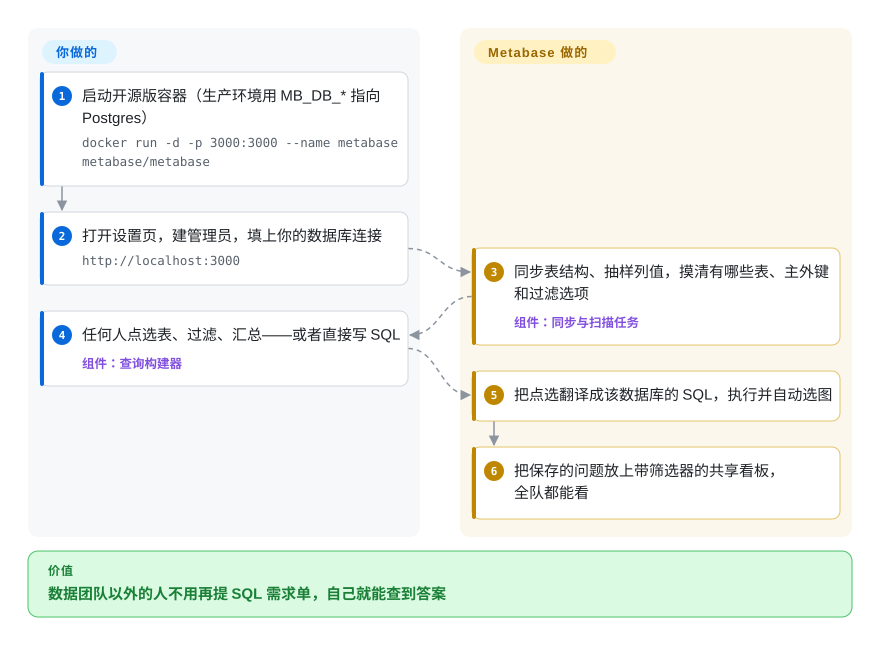

# Metabase

“四月那次活动带来了多少注册？”这类问题全变成 SQL 需求单排进数据团队的队列，提问的人要等好几天，才拿到一个本来自己看一眼表就能知道的数。Metabase 是一个可以自托管的 BI 应用：连上你的数据库，让不会 SQL 的同事点选表、加过滤、做汇总，再把答案存到共享看板上。

## 何时使用

你是一家 50 到 300 人公司里唯一的数据负责人（或者一个小数据团队）。销售、客服、市场各自存着一份你帮他们写的 SQL 片段；每周都有人来找你，因为 `WHERE created_at > '2026-04-01'` 要改成五月。你希望他们对着生产只读副本或数据仓库自己回答这些问题，而且今天下午就能用上。你启动 Metabase 容器，连上 Postgres 或 Snowflake，大家就有了点选式查询构建器、带筛选控件的看板、邮件和 Slack 订阅；难的问题你还可以用 SQL 编辑器自己写。

受众不懂技术、运维预算只够一个容器时，你选 Metabase 而不是 [Apache Superset](superset.zh.md)：Superset 给分析师更多图表类型和更深的 SQL Lab，但要跑 Web 应用加 Redis 和 Celery worker。大家需要在图形界面里自己搭问题、而不是读工程师用 Markdown 写好的报告时，你选它而不是 [Evidence](evidence.zh.md)。想自托管免费的 AGPL 版本、只在以后需要 SSO、行级权限或白标嵌入时才付费，你选它而不是 Looker、Tableau、Power BI 这类商业工具。

## 怎么用起来

Metabase 是一个带网页界面的 Java 应用。你把它连到它支持的数据库（Postgres、MySQL、Snowflake、BigQuery、Redshift、ClickHouse、SQL Server 等十几种，外加社区驱动）；它随后在后台“同步”表结构、“扫描”各列的抽样值，从而知道有哪些表、哪些主外键、过滤下拉框里该列哪些选项。有人点选着搭一个问题——选表、加过滤、按某列汇总——Metabase 就通过对应数据库的驱动把它翻译成该库自己的 SQL，在你的数据库上执行（它不会把你的数据搬走），再自动选一种图表。保存的问题会成为看板上的卡片。Metabase 自己还需要一个小数据库，叫“应用数据库”，用来存用户、问题和看板：默认是一个嵌入式 H2 文件，容器一删就没了，所以正式使用时要用 `MB_DB_*` 环境变量把它指向 Postgres 或 MySQL。仍然归你管的是：运行这个容器和它的应用数据库、升级，以及把数据建模好，让点出来的问题算出的是正确的数。

<!-- flow-steps:begin (generated from flows/metabase.json by tools/flow_card.py — do not edit) -->

流程文字版

1. **你**：启动开源版容器（生产环境用 MB_DB_* 指向 Postgres） — `docker run -d -p 3000:3000 --name metabase metabase/metabase`
2. **你**：打开设置页，建管理员，填上你的数据库连接 — `http://localhost:3000`
3. **Metabase**：同步表结构、抽样列值，摸清有哪些表、主外键和过滤选项 — 组件：`同步与扫描任务`
4. **你**：任何人点选表、过滤、汇总——或者直接写 SQL — 组件：`查询构建器`
5. **Metabase**：把点选翻译成该数据库的 SQL，执行并自动选图
6. **Metabase**：把保存的问题放上带筛选器的共享看板，全队都能看

**价值**：数据团队以外的人不用再提 SQL 需求单，自己就能查到答案

<!-- flow-steps:end -->

## 何时不用

- **你要在免费版上用 SAML/JWT 单点登录、行列级权限或 Git 版本化内容。** 这些是 Pro/Enterprise 功能（按活跃用户收费），去掉静态嵌入里的 “Powered by Metabase” 横幅也要付费；开源版只有 Google 登录和基础 LDAP。必须免费又要细粒度权限控制，选 [Apache Superset](superset.zh.md)，它在 Apache-2.0 下通过 Flask App Builder 提供基于角色的权限、行级安全和 LDAP/OAuth/OIDC 登录。
- **你要把看板当代码在 PR 里评审。** 免费版 Metabase 把问题和看板存在应用数据库里；Git 同步（“remote sync”）是付费功能。更看重 diff 和评审而不是点选查询时，选 [Evidence](evidence.zh.md)（报表就是 Markdown + SQL 文件）。
- **AGPL 和你分发或修改它的方式冲突。** 核心是 AGPL-3.0，`enterprise/` 目录用商业许可。把开源版嵌进你要发给客户的产品，或者把改过的分支当服务运营，都会带来 AGPL 义务；Superset（Apache-2.0）没有这个问题。
- **你的分析师整天写 SQL，要深度定制图表。** 查询构建器和图表集合面向不会 SQL 的人；需要大量可视化类型、SQL Lab 和语义层的分析师通常会用不够——选 Superset。
- **你要看基础设施指标、日志或靠告警驱动的看板。** Metabase 查的是业务数据库；时序可观测性用 [Grafana](../observability/grafana.zh.md)。
- **你打算一直跑在默认的 H2 文件上。** H2 只适合演示——删掉容器就丢掉所有问题和看板，文档明确说生产环境避免使用。从第一天起就准备一个 Postgres（或 MySQL/MariaDB）应用数据库，或者直接用 Metabase Cloud。

## 横向对比

| 替代品 | 是否收录 | 我们的评价 | 取舍 |
|---|---|---|---|
| [Apache Superset](superset.zh.md) | ✅ | 分析师熟练写 SQL、要很多图表类型、要 SQL Lab、要免费的权限控制和 SSO，选 Superset；非技术团队要点选搭问题、只想跑一个容器，选 Metabase。 | Superset 是 Apache-2.0，免费版访问控制更全，但要元数据库、Redis 和 Celery worker；Metabase 一个 JVM 容器加一个应用数据库就能跑，但 SSO 和行级权限要付费。 |
| [Evidence](evidence.zh.md) | ✅ | 少数工程师写精编报表、要在 git 里评审、要让 agent 改，选 Evidence；很多人要不写 SQL 自己搭问题，选 Metabase。 | Evidence 的报表是文本文件、运行时是单个二进制，但每张图都要有人写 Markdown 和 SQL；Metabase 能自助查询，但内容存在应用数据库里，免费版没法纳入 git 版本管理。 |
| Redash | 未收录 | 所有查数的人都会写 SQL、只要一个轻量的“查询加出图”工具，选 Redash；不会 SQL 的人也要自己搭问题，选 Metabase。 | Redash 以保存的 SQL 查询及其可视化为中心；Metabase 多了点选式查询构建器和嵌入能力，代价是更重的 JVM 应用。 |
| Looker / Tableau / Power BI | 非仓库 | 采购已经买了其中之一、需要它的受治理语义层和厂商支持时，继续用它；想自托管 BI、不按席位付许可费，选 Metabase。 | 商业套件带建模层和支持合同，但闭源、按用户计价；Metabase 开源版自托管免费，只有用到付费功能才花钱。 |

## 技术栈

- **后端：** JVM 上的 Clojure 1.12（JAR 安装文档要求 Java 25）、Ring/Jetty HTTP、用 Liquibase 迁移应用数据库、c3p0 连接池；每种支持的数据库在 `src/metabase/driver` 和 `modules/drivers` 下各有一个驱动模块。
- **前端：** TypeScript/React，用 rspack 构建；同一仓库也产出 React 嵌入 SDK。
- **应用数据库：** PostgreSQL（推荐）、MySQL/MariaDB，或嵌入式 H2（仅限演示）。
- **分发形式：** `metabase/metabase`（AGPL）和 `metabase/metabase-enterprise`（商业许可）两个 Docker 镜像，以及可直接运行的 `metabase.jar`。

## 依赖

- **Java 25 运行时**（跑 JAR 时需要；用 Docker 镜像则不需要）。
- **生产用的应用数据库：** 推荐 PostgreSQL，也支持 MySQL/MariaDB；Metabase 不会替你建库（先 `createdb`）。
- **你要分析的数据源**，要能从 Metabase 主机访问，并配好只读凭据。
- **可选：** 用于看板订阅和告警的 SMTP 服务器和/或 Slack 应用。

## 运维难度

**低到中。** 试用只要一条 `docker run`。正式运行则意味着：一个单独的 Postgres 应用数据库并做好备份（它丢了，所有问题、看板和权限都没了）、给 JVM 足够的堆内存，以及升级时启动阶段会跑应用数据库迁移——沿着你所在的发布线升级，升级前先备份，不恢复备份就不要回退。大实例会通过同步、扫描和看板刷新把压力压到源数据库上，所以要安排好这些任务的时间并开启缓存。不需要额外的 worker 队列或缓存服务，这也是它比 Superset 轻的原因。

## 健康度与可持续性

- **维护（2026-10-08）：非常活跃。** 每周都有提交，发版频繁：2026-10-07 发布 v0.64.1，0.63 和 0.58 两条线也仍在出补丁版（2026-10-01）。
- **治理与支撑：** 归 Metabase, Inc. 所有，靠 Metabase Cloud 和 Pro/Enterprise 订阅为开发买单。提交记录显示近一年约 111 名活跃贡献者，没有人超过约 6%——团队庞大且有专职人员，但路线图由一家公司决定。
- **年龄 / Lindy：** 仓库创建于 2015-02（约 11.7 年），至今每周发版——又老又活跃，是本分类里 Lindy 位置最强的。
- **采用：** 约 49,571 个 GitHub stars，`metabase/metabase` 镜像累计 Docker 拉取超过 2.75 亿次（2026-10-08），是雷达上最强的采用信号。
- **风险信号：** 开源核心——SSO、行列级权限、Git 同步、白标嵌入都要付费；核心 AGPL-3.0，`enterprise/` 目录是商业许可（GitHub API 报 `NOASSERTION`，所以雷达没给许可证轴打分）；未关闭 issue 超过 4,500 个，小众 bug 可能要等。

## 存疑（未验证）

- [推断] “通过对应数据库的驱动把点选翻译成该库自己的 SQL”依据的是仓库结构（`src/metabase/driver`、`modules/drivers`）和同步/扫描文档，没有完整读查询处理器代码。
- [未验证] 0.58 是否是正式指定的长期支持分支：它和 0.63 一起还在出补丁，但没读到支持期限政策。
- [未验证] Metabot 的哪些功能（如果有的话）能在开源版上用；README 列出 Metabot 时没标套餐，也没读套餐页。
- [推断] 嵌入开源版或把修改版当服务提供时的 AGPL 义务取决于你的分发方式；这不是法律意见。
- [未验证] 雷达的响应度轴没有信号（`?`），所以没有测到这个仓库的 issue 响应时间。
