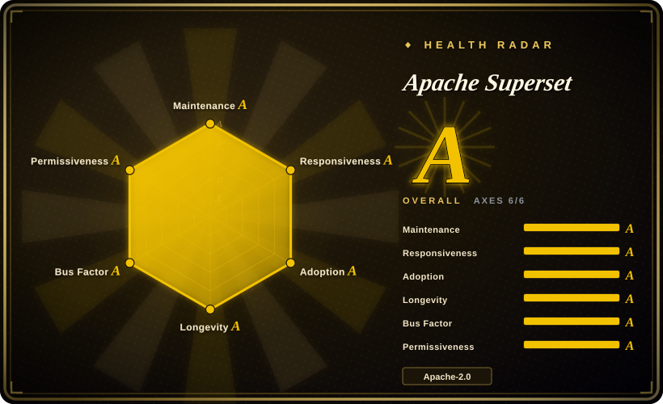
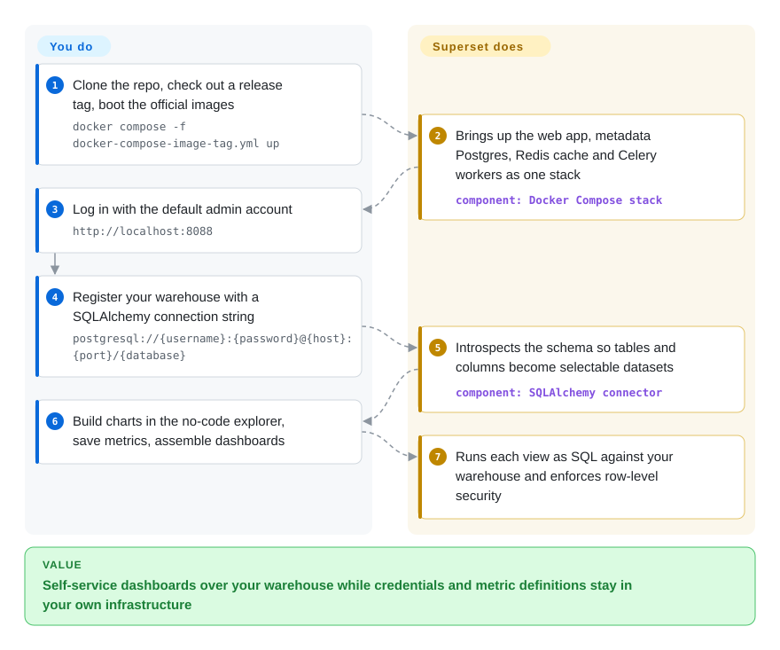

# Apache Superset

A self-hosted, enterprise-grade BI web application: explore SQL databases through a no-code chart builder and SQL Lab, then assemble the results into interactive dashboards backed by a lightweight semantic layer.

## When to use

You're a data or analytics engineer on a team that already has a SQL warehouse (Postgres, BigQuery, Snowflake, Databricks, Trino, etc.) and a growing demand for self-service dashboards. Analysts keep pinging you for one-off charts, and the business wants shared, refreshable dashboards instead of screenshots pasted into decks. You don't want to send your warehouse credentials to a SaaS BI vendor, and you'd rather own the deployment than pay per-seat. You stand up Superset, point it at the warehouse over its SQLAlchemy connector, and let analysts write queries in SQL Lab, save them as datasets, and build charts in the no-code explorer — defining reusable metrics and calculated columns in the semantic layer so "revenue" means the same thing on every dashboard. Row-level security and role-based access keep each team scoped to its own data.

You also reach for it when you need broad chart variety and dashboard interactivity (cross-filters, drill-downs, native filters) over warehouse tables, and when you want dashboard definitions and database connections to live in a system you control and can export/import as code. Because it speaks SQLAlchemy, it connects to most SQL engines without a bespoke driver per source, making it the BI front-end for whatever warehouse you actually query.

## How it works

Superset is a Flask/Python web app (TypeScript/React front end) that never copies your data: charts are stored as *query specifications*, and each dashboard view translates one into SQL, runs it against the warehouse live, and renders the result. It keeps its own metadata — dashboards, charts, saved datasets, users, connections — in a separate Postgres/MySQL database, so the artifact surface is pure configuration, and the docs export/import path is YAML. You register a source with a SQLAlchemy connection string; Superset introspects its schema and exposes tables and columns as *datasets*, on which you define metrics and calculated columns — that layer is what makes “revenue” one definition instead of fifty. The no-code Explore UI assembles a chart from those building blocks (and SQL Lab lets analysts start from raw SQL and save it as a virtual dataset); a dashboard lays the charts out and wires cross-filters and native filters on top. Async execution, cache warm-up, and scheduled reports run in Celery workers + Beat against a Redis broker, and row-level security rules are enforced when the query is generated — what stays yours is running the multi-service stack and upgrading it.

<!-- flow-steps:begin (generated from flows/superset.json by tools/flow_card.py — do not edit) -->

Text version of the flow

1. **You**: Clone the repo, check out a release tag, boot the official images — `docker compose -f docker-compose-image-tag.yml up`
2. **Apache Superset**: Brings up the web app, metadata Postgres, Redis cache and Celery workers as one stack — component: `Docker Compose stack`
3. **You**: Log in with the default admin account — `http://localhost:8088`
4. **You**: Register your warehouse with a SQLAlchemy connection string — `postgresql://{username}:{password}@{host}:{port}/{database}`
5. **Apache Superset**: Introspects the schema so tables and columns become selectable datasets — component: `SQLAlchemy connector`
6. **You**: Build charts in the no-code explorer, save metrics, assemble dashboards
7. **Apache Superset**: Runs each view as SQL against your warehouse and enforces row-level security

**Value**: Self-service dashboards over your warehouse while credentials and metric definitions stay in your own infrastructure

<!-- flow-steps:end -->

## When NOT to use

- **You need metrics/observability dashboards, not warehouse BI.** Superset queries SQL data sources for analytics; for time-series infra metrics, logs, and alerting over Prometheus/Loki/InfluxDB, that's [Grafana](../observability/grafana.md) — a different category of tool. Don't bend Superset into a monitoring console.
- **Your data is unstructured, log, or document-shaped.** It is a SQL BI layer. It has no native story for raw log search, full-text/document analytics, or NoSQL stores that don't expose a SQL/SQLAlchemy dialect.
- **You want a single-process, low-ops deploy.** Production Superset is a multi-service stack — web app + a metadata database + a cache (Redis) + Celery workers (and Celery Beat) for async queries, alerts, and scheduled reports. Running and upgrading that is real ops burden; if you want the simplest possible setup, [Metabase](metabase.md) is closer to a single-jar/single-container experience.
- **You expect Superset to model or move your data.** It is a *read/visualize* layer, not an ETL/ELT or transformation tool. It does not extract, load, or materialize pipelines; do your modeling upstream (dbt, your warehouse, an orchestrator) and point Superset at the result. Its semantic layer is lightweight (metrics/calculated columns/virtual datasets), not a full modeling language. [推断]
- **You need polished embedded analytics as a core product surface.** Embedded SDK / dashboard embedding exists, but its capabilities, theming, and licensing fit are something to verify against your specific embedding requirements before committing. [未验证]
- **Tiny team, few dashboards, no warehouse.** If you have a handful of CSVs and one analyst, the operational weight of the full stack outweighs the payoff versus a notebook or a lighter tool.

## Comparison

| Alternative | In index | Our verdict | Tradeoff |
|---|---|---|---|
| [Metabase](metabase.md) | ✅ | Choose Metabase when simple deployment and non-SQL question building matter more than chart depth; choose Superset for warehouse BI teams that accept a multi-service stack. | Open-source BI with a far simpler deploy (single jar/container) and a friendlier no-SQL question builder; easier for non-technical users, but a lighter semantic/customization story and less raw-SQL/chart depth than Superset. |
| [Grafana](../observability/grafana.md) | ✅ | Choose Grafana for observability dashboards, time-series metrics, logs, and alerting; choose Superset for SQL warehouse exploration and BI dashboards. | Observability-first dashboards over time-series/metrics/logs (Prometheus, Loki, InfluxDB) with strong alerting; can query SQL too, but it is built for monitoring panels, not warehouse-style ad-hoc BI exploration. |
| Redash | 未收录 | Choose Redash for a lighter query-centric workflow around saved SQL and dashboards; choose Superset when visualization breadth, governance, and a richer BI surface justify the ops cost. | Query-centric: write SQL, save queries, build dashboards from them; simpler model and lighter than Superset, but a narrower visualization set and a weaker semantic/governance layer. |
| Tableau / Power BI | 未收录 | Choose Tableau or Power BI when mature commercial visuals, data prep, and enterprise support outweigh cost and lock-in; choose Superset for self-hosted open-source BI. | Proprietary, commercial BI with mature visuals, data prep, and enterprise support; richer polish and ecosystem, but licensing cost, vendor lock-in, and (for Power BI) Microsoft-stack gravity — not self-hosted open source. |
| Looker | 未收录 | Choose Looker when governed semantic modeling in LookML is the core requirement; choose Superset when a lighter self-hosted SQL BI layer is enough. | Proprietary (Google) BI built around LookML, a real modeling language and governed semantic layer; stronger modeling/governance than Superset's lightweight layer, but commercial, locked-in, and priced for the enterprise. |

## Tech stack

- **Backend:** Python / Flask (Flask App Builder) with SQLAlchemy as the database-access layer; a REST API exposes most operations.
- **Frontend:** TypeScript / React single-page app; charts render via a plugin-based visualization framework.
- **Data access:** connects to any database with a SQLAlchemy dialect / DB-API driver — 50+ engines including Postgres, MySQL, BigQuery, Snowflake, Databricks, Trino/Presto, ClickHouse, and more.
- **Async/processing:** Celery workers (plus Celery Beat scheduler) handle async SQL Lab queries, cache warm-up, alerts, and scheduled reports.
- **Caching:** a configurable cache (commonly Redis) for query results and metadata; results caching is pluggable.
- **Semantic layer:** datasets with metrics, calculated columns, and virtual (SQL-defined) datasets, plus row-level security rules.

## Dependencies

- **Metadata database (required):** a SQL database Superset uses for its own state — dashboards, charts, users, connections. SQLite works for local trials only; production wants Postgres or MySQL.
- **Cache / message broker (effectively required at scale):** Redis (or equivalent) for caching and as the Celery broker/result backend.
- **Celery workers (required for async features):** one or more workers, and Celery Beat, to run async queries, alerts, scheduled reports, and cache warm-up. Without them, async SQL Lab and reporting don't function.
- **A SQL data source (yours to run):** the actual analytical database/warehouse you point Superset at — Superset stores no analytical data itself.
- **Web server / runtime:** a WSGI/ASGI app server (e.g. Gunicorn) for the Flask app; official Docker images and a Helm chart are published for deployment (both confirmed present 2026-09).

## Ops difficulty

**Medium-to-high.** A `docker compose` quickstart gets you a demo in minutes, but that is explicitly not a production topology. A real deployment means running and coordinating several moving parts: the web app, a metadata Postgres/MySQL, Redis, and Celery workers + Beat — each needing to be sized, secured, monitored, and upgraded together. Upgrades involve database migrations (Alembic) and occasionally breaking config/feature-flag changes, so version bumps need testing. You also own auth integration (LDAP/OAuth/OIDC via Flask App Builder), row-level security configuration, secret management for database connections, and tuning cache + async timeouts so heavy queries don't wedge the workers. The connector to each warehouse adds its own driver and credential management. None of it is exotic, but it is a genuine multi-service application to operate — closer to running a web platform than dropping in a single binary.

## Health & viability

- **Responsiveness**: Grade A — median first-response time 7.7 hours across 6 qualifying issues/PRs (re-scored 2026-09-28).
- **Maintenance (as of 2026-09):** default branch pushed the same day this page was re-verified; latest app release v6.1.0 (2026-05-13) is still current — a ~4-month gap between app releases, while the Helm chart keeps shipping (0.22.8 on 2026-09-09) and CI/docs updates are daily. Not archived. ~630 open issues/PRs reflects scale and breadth of use, not neglect. [推断]
- **Governance & backing:** an **Apache Software Foundation** top-level project — foundation governance, a PMC rather than a single maintainer or vendor, and ASF's relicense/IP guardrails. This is about the strongest governance posture in the index: no one company can unilaterally rug-pull the license. [推断]
- **Age & Lindy verdict:** created 2015-07, so ~11 years old **and still active** — a textbook **strong Lindy** bet: long-lived, foundation-backed, widely deployed. Old + active ⇒ durable. [推断]
- **Adoption/ecosystem:** broad enterprise/production adoption, 50+ SQLAlchemy database connectors, a plugin-based viz framework, and mature docs — deep ecosystem and a wide dependent base. [未验证]
- **Risk flags:** no relicense or open-core trap (Apache-2.0, ASF-governed). The real "risk" is operational, not viability: it is a genuine multi-service stack (metadata DB + Redis + Celery) to run and upgrade — see Ops difficulty, not a sustainability concern.

## Caveats (unverified)

- [未验证] Latest app release verified as v6.1.0 (published 2026-05-13, GitHub API); ~74.9k GitHub stars as of 2026-09-28 — star counts and version numbers are date-sensitive and shift release-to-release, treat as indicative.
- [未验证] "50+ database connectors" and the specific engine list come from the project's own framing; the supported set and each connector's maturity vary — verify the exact engine/driver you depend on against the current docs.
- [未验证] The official Docker image (apache/superset) and Helm chart are now confirmed present this pass (README links, repo `helm/superset`, chart release 0.22.8), but their production-readiness and default-config sanity were not assessed line-by-line.
- [未验证] Embedded analytics / dashboard-embedding capabilities and any licensing constraints were not verified for this page; confirm against current docs before relying on them.
- [推断] Calling the semantic layer "lightweight" (vs LookML-style modeling) is an inference from its metrics/calculated-column/virtual-dataset model, not a measured comparison.
- [推断] Production requiring metadata DB + Redis + Celery workers is inferred from the standard documented architecture; a stripped-down single-service deploy may be possible for limited use but isn't the supported production path.
