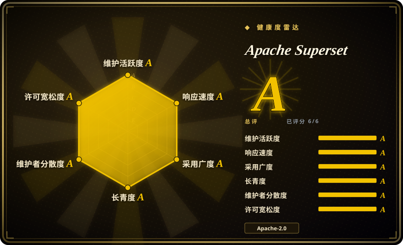
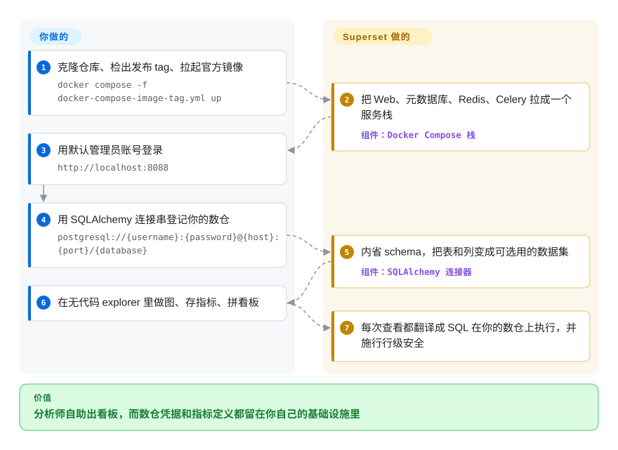

# Apache Superset

可自托管的企业级 BI Web 应用：通过无代码图表构建器和 SQL Lab 探索 SQL 数据库，再把结果拼成交互式看板，背后由一层轻量语义层支撑。

## 何时使用

你是某个团队的数据 / 分析工程师，团队已经有一套 SQL 数仓（Postgres、BigQuery、Snowflake、Databricks、Trino 等），对自助看板的需求在快速增长。分析师不停来找你要各种一次性图表，业务方想要可共享、可刷新的看板，而不是粘进 PPT 的截图。你不想把数仓凭据交给某个 SaaS BI 厂商，也宁愿自己掌控部署而不是按人头付费。于是你把 Superset 搭起来，用它的 SQLAlchemy 连接器指向数仓，让分析师在 SQL Lab 里写查询、存成数据集、再到无代码 explorer 里搭图表——在语义层里定义可复用的指标和计算列，这样“营收”在每个看板上含义一致。行级安全和基于角色的访问把每个团队限定在各自的数据范围内。

当你需要在数仓表上获得丰富的图表种类和看板交互（交叉过滤、下钻、原生过滤器），并希望看板定义和数据库连接都放在一个你能掌控、能以代码形式导出 / 导入的系统里时，你也会选它。因为它讲 SQLAlchemy，连接大多数 SQL 引擎都不需要为每种来源写专用驱动，所以它能成为你真正查询的那个数仓前面的 BI 前端。

## 怎么用起来

Superset 是一个 Flask/Python 的 Web 应用（前端是 TypeScript/React），它从不复制你的数据：图表存下来的是*查询规格*，每次打开看板都会把它翻译成 SQL、实时打到数仓上执行、再把结果渲染出来。它自己的元数据——看板、图表、数据集、用户、连接——存在一个独立的 Postgres/MySQL 库里，所以整个资产面就是纯配置，文档里的导出导入走的是 YAML。你用一条 SQLAlchemy 连接串登记数据源；Superset 内省它的 schema，把表和列暴露成*数据集*，你在数据集上定义指标和计算列——这层就是让“营收”变成一个定义而不是五十个定义的东西。无代码的 Explore 界面用这些积木拼出图表（SQL Lab 则让分析师从原始 SQL 出发、存成虚拟数据集）；看板把图表排好版，再挂上交叉过滤和原生过滤器。异步执行、缓存预热和定时报表跑在 Celery worker + Beat 里，以 Redis 做 broker；行级安全规则在生成查询的那一刻强制执行——留在你手上的，是把这套多服务栈跑起来并持续升级。

<!-- flow-steps:begin (generated from flows/superset.json by tools/flow_card.py — do not edit) -->

流程文字版

1. **你**：克隆仓库、检出发布 tag、拉起官方镜像 — `docker compose -f docker-compose-image-tag.yml up`
2. **Apache Superset**：把 Web、元数据库、Redis、Celery 拉成一个服务栈 — 组件：`Docker Compose 栈`
3. **你**：用默认管理员账号登录 — `http://localhost:8088`
4. **你**：用 SQLAlchemy 连接串登记你的数仓 — `postgresql://{username}:{password}@{host}:{port}/{database}`
5. **Apache Superset**：内省 schema，把表和列变成可选用的数据集 — 组件：`SQLAlchemy 连接器`
6. **你**：在无代码 explorer 里做图、存指标、拼看板
7. **Apache Superset**：每次查看都翻译成 SQL 在你的数仓上执行，并施行行级安全

**价值**：分析师自助出看板，而数仓凭据和指标定义都留在你自己的基础设施里

<!-- flow-steps:end -->

## 何时不用

- **你要的是指标 / 可观测性看板，而非数仓 BI。** Superset 查询 SQL 数据源做分析；若你要的是 Prometheus/Loki/InfluxDB 上的时序基础设施指标、日志和告警，那是 [Grafana](../observability/grafana.zh.md)——另一类工具。别把 Superset 掰成监控控制台。
- **你的数据是非结构化的、日志型或文档型的。** 它是 SQL BI 层，对原始日志检索、全文 / 文档分析，或不暴露 SQL/SQLAlchemy 方言的 NoSQL 存储，都没有原生解法。
- **你想要单进程、低运维的部署。** 生产级 Superset 是多服务栈——Web 应用 + 一个元数据库 + 一个缓存（Redis）+ Celery workers（及 Celery Beat）来跑异步查询、告警和定时报表。运维和升级这一套是实打实的负担；若你想要尽可能简单的搭建，[Metabase](metabase.zh.md) 更接近单 jar / 单容器的体验。
- **你指望 Superset 来建模或搬运数据。** 它是*读取 / 可视化*层，不是 ETL/ELT 或变换工具。它不抽取、不加载、不物化管线；建模请放在上游（dbt、数仓、编排器），让 Superset 指向结果。它的语义层是轻量的（指标 / 计算列 / 虚拟数据集），不是一门完整的建模语言。[推断]
- **你需要把成熟的嵌入式分析作为核心产品形态。** 嵌入 SDK / 看板嵌入是存在的，但其能力、主题定制和授权匹配度，需要你对照自己具体的嵌入需求先核实，再决定是否押注。[未验证]
- **小团队、看板很少、没有数仓。** 如果你只有几个 CSV 和一个分析师，整套栈的运维重量相对回报并不划算，不如用 notebook 或更轻的工具。

## 横向对比

| 替代品 | 是否收录 | 我们的评价 | 取舍 |
|---|---|---|---|
| [Metabase](metabase.zh.md) | ✅ | 当简单部署和无 SQL 问题构建器比图表深度更重要时，选 Metabase；当数仓 BI 团队能接受多服务栈时，选 Superset。 | 开源 BI，部署简单得多（单 jar / 容器），无 SQL 的问题构建器更友好；对非技术用户更易上手，但语义 / 定制能力更轻、原始 SQL 与图表深度不如 Superset。 |
| [Grafana](../observability/grafana.zh.md) | ✅ | 当目标是可观测性看板、时序指标、日志和告警时，选 Grafana；当目标是 SQL 数仓探索和 BI 看板时，选 Superset。 | 以可观测性为先，面向时序 / 指标 / 日志（Prometheus、Loki、InfluxDB）做看板，告警能力强；也能查 SQL，但它是为监控面板而生，不是数仓式的临时 BI 探索。 |
| Redash | 未收录 | 当你要更轻的 saved SQL 加看板查询工作流时，选 Redash；当可视化广度、治理和更完整 BI 表面值得运维成本时，选 Superset。 | 以查询为中心：写 SQL、存查询、再据此搭看板；模型更简单、比 Superset 更轻，但可视化集更窄、语义 / 治理层更弱。 |
| Tableau / Power BI | 未收录 | 当成熟商业可视化、数据准备和企业支持足以抵消成本与锁定时，选 Tableau 或 Power BI；当要自托管开源 BI 时，选 Superset。 | 专有商业 BI，可视化、数据准备和企业支持成熟；打磨和生态更强，但有授权成本、厂商绑定，以及（Power BI 的）微软栈引力——不是自托管开源。 |
| Looker | 未收录 | 当核心需求是 LookML 里的受治理语义建模时，选 Looker；当较轻的自托管 SQL BI 层已经够用时，选 Superset。 | 专有（Google）BI，围绕 LookML 这门真正的建模语言和受治理语义层构建；建模 / 治理强于 Superset 的轻量语义层，但商业、绑定且面向企业定价。 |

## 技术栈

- **后端：** Python / Flask(Flask App Builder)，以 SQLAlchemy 作为数据库访问层；一套 REST API 暴露大多数操作。
- **前端：** TypeScript / React 单页应用；图表通过插件化的可视化框架渲染。
- **数据访问：** 连接任何带 SQLAlchemy 方言 / DB-API 驱动的数据库——50+ 引擎，含 Postgres、MySQL、BigQuery、Snowflake、Databricks、Trino/Presto、ClickHouse 等。
- **异步 / 处理：** Celery workers（加 Celery Beat 调度器）处理异步 SQL Lab 查询、缓存预热、告警和定时报表。
- **缓存：** 可配置的缓存（常用 Redis），用于查询结果和元数据；结果缓存可插拔。
- **语义层：** 带指标、计算列和虚拟（SQL 定义）数据集的数据集，外加行级安全规则。

## 依赖

- **元数据库（必需）:** 一个供 Superset 存自身状态的 SQL 数据库——看板、图表、用户、连接。SQLite 只适合本地试用；生产要用 Postgres 或 MySQL。
- **缓存 / 消息代理（规模上来后基本必需）:** Redis（或等价物），用于缓存以及作为 Celery 的 broker / result backend。
- **Celery workers（异步功能必需）:** 一个或多个 worker 加 Celery Beat，跑异步查询、告警、定时报表和缓存预热。没有它们，异步 SQL Lab 和报表就不工作。
- **一个 SQL 数据源（你自己跑）:** 你让 Superset 指向的那个实际分析数据库 / 数仓——Superset 自身不存任何分析数据。
- **Web 服务器 / 运行时：** Flask 应用需要一个 WSGI/ASGI 应用服务器（如 Gunicorn）；项目发布了官方 Docker 镜像和 Helm chart 用于部署（2026-09 已核实存在）。

## 运维难度

**中到高。** 一个 `docker compose` 快速启动能在几分钟内跑出一个 demo，但那明确不是生产拓扑。真正的部署意味着运行并协调好几个活动部件：Web 应用、一个元数据 Postgres/MySQL、Redis，以及 Celery workers + Beat——每一个都要做容量规划、加固、监控，并一起升级。升级涉及数据库迁移（Alembic），偶尔还有破坏性的配置 / feature-flag 变更，所以版本升级需要测试。你还要自己负责接入认证（经 Flask App Builder 的 LDAP/OAuth/OIDC）、配置行级安全、给数据库连接做密钥管理，以及调缓存 + 异步超时以免重查询把 worker 卡死。每接一个数仓还会带来各自的驱动和凭据管理。这些都不算冷僻，但它确实是一个需要运维的多服务应用——更接近跑一个 Web 平台，而非塞进一个单二进制。

## 健康度与可持续性

- **响应速度**：Grade A——中位首次响应时间 7.7 小时，基于 6 个 qualifying issues/PRs（2026-09-28 重算）。
- **Maintenance (as of 2026-09):** 默认分支在最后核验当天仍有 push；最新应用版本 v6.1.0（2026-05-13 发布）至今仍是最新——应用发版间隔约 4 个月，但 Helm chart 一直在出（0.22.8，2026-09-09），CI/文档几乎每天在动。未归档。约 630 个未关闭 issue/PR 反映的是规模与使用广度，而非荒废。[推断]
- **治理与背书：** 一个 **Apache 软件基金会**顶级项目——基金会治理，由 PMC 而非单一维护者或厂商主导，还有 ASF 的 relicense/IP 护栏。这是本索引里数一数二强的治理姿态：没有任何一家公司能单方面对 license 反水。[推断]
- **年龄与 Lindy 判断：** 建于 2015-07，约 11 年**且仍然活跃**——教科书式的**强 Lindy** 押注：长寿、基金会背书、广泛部署。老 + 活跃 ⇒ 耐久。[推断]
- **采用/生态：** 广泛的企业/生产采用、50+ 个 SQLAlchemy 数据库连接器、插件化的可视化框架，以及成熟文档——生态深、依赖面广。[未验证]
- **风险标记：** 没有 relicense 或开源核心陷阱（Apache-2.0、ASF 治理）。真正的「风险」是运维而非可持续性：它确实是一套要运行和升级的多服务栈（元数据库 + Redis + Celery）——见运维难度，而非可持续性顾虑。

## 存疑（未验证）

- [未验证] 最新应用版本核实为 v6.1.0（2026-05-13 发布，GitHub API）；截至 2026-09-28 约 74.9k GitHub star——star 数和版本号对时间敏感、随版本变动，仅供参考。
- [未验证] “50+ 数据库连接器”及具体引擎列表来自项目自身表述；支持集合与各连接器成熟度参差——依赖某个具体引擎 / 驱动前请对照当前文档核实。
- [未验证] 官方 Docker 镜像（apache/superset）与 Helm chart 的存在已在本轮核实（README 链接与仓库内 helm/superset 目录、chart 发版 0.22.8），但其生产就绪度与默认配置的合理性未逐条评估。
- [未验证] 嵌入式分析 / 看板嵌入的能力及任何授权限制未为本页核实；在依赖它们前请对照当前文档确认。
- [推断] 把语义层称为“轻量”（相对 LookML 式建模）是从其指标 / 计算列 / 虚拟数据集模型做出的推断，而非实测对比。
- [推断] 生产需要元数据库 + Redis + Celery workers 是从标准文档化架构推断；受限用途下或许能跑精简的单服务部署，但那不是受支持的生产路径。
