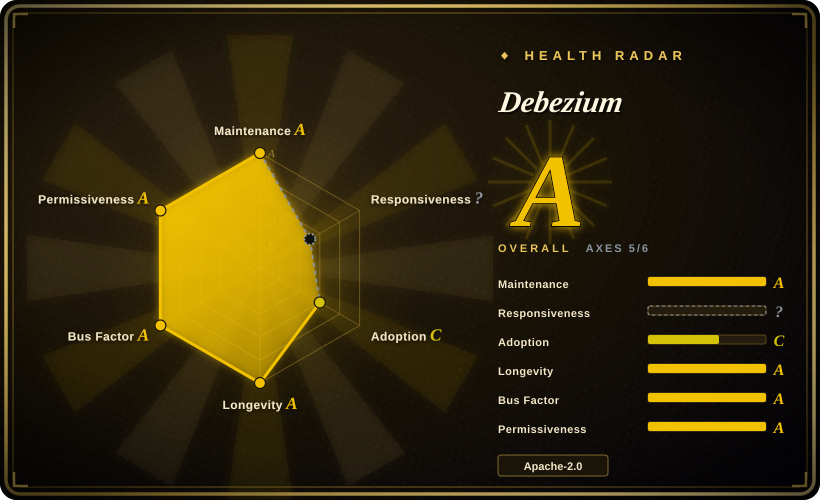
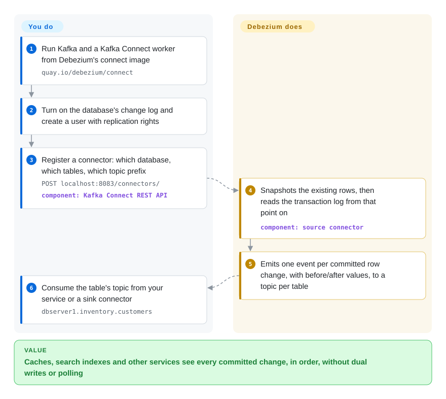

# Debezium

Your app writes an order to Postgres and then also updates Elasticsearch and the Redis cache — and the day it crashes between those writes, search shows an order that does not exist. Debezium removes the second write: it reads the database's own transaction log and publishes every committed row change, in order, as an event that the search index, cache and other services consume.

## When to use

You're a backend or data-platform engineer and several systems need to follow one operational database: a search index, a cache, a warehouse, another team's service. Today the application does "dual writes" — commit to MySQL, then call Elasticsearch — or a cron job runs `SELECT * FROM orders WHERE updated_at > :last_run` every five minutes and still misses hard deletes. You want each committed `INSERT`, `UPDATE` and `DELETE`, with before and after values, delivered in commit order, with consumers able to stop and resume without losing anything. You run Debezium's connector for your database inside Kafka Connect, and every table becomes a Kafka topic of change events.

You pick Debezium over a hand-written binlog reader such as [python-mysql-replication](python-mysql-replication.md) when you need more than one database type, durable offsets and replay, schema-change handling and an ecosystem of sinks rather than a library you will build all of that around. You pick it over polling-based sync because log-based capture sees deletes and every intermediate change without adding query load. And you pick it over Flink CDC or a commercial replicator when you already run Kafka (or are willing to) and want an Apache-2.0, foundation-hosted project with the widest open-source connector set.

## How it works

Every serious database keeps a log of committed changes for its own crash recovery and replication — MySQL's binlog, Postgres's write-ahead log (WAL), MongoDB's oplog, SQL Server's CDC tables, Oracle's redo log. Debezium connectors pretend to be a replication client: they first take a consistent *snapshot* of the tables you selected, then follow that log and turn each committed row change into a uniform event (`before`, `after`, operation, source position). By default they run inside Kafka Connect, Kafka's framework for running connectors, which stores each connector's log position and writes the events to one Kafka topic per table, so any number of consumers can read, stop and resume independently. What Debezium does for you is the per-database log decoding, snapshotting, ordering and offset bookkeeping. What you still do: run Kafka and Kafka Connect, change database settings and grants (for example `wal_level=logical` on Postgres), and write or choose the consumers and sink connectors that act on the events. If Kafka is too much, the same connectors can run inside your JVM application through the *embedded engine*, or through Debezium Server (now in its own repository) to send events to other brokers.

<!-- flow-steps:begin (generated from flows/debezium.json by tools/flow_card.py — do not edit) -->

Text version of the flow

1. **You**: Run Kafka and a Kafka Connect worker from Debezium's connect image — `quay.io/debezium/connect`
2. **You**: Turn on the database's change log and create a user with replication rights
3. **You**: Register a connector: which database, which tables, which topic prefix — `POST localhost:8083/connectors/` — component: `Kafka Connect REST API`
4. **Debezium**: Snapshots the existing rows, then reads the transaction log from that point on — component: `source connector`
5. **Debezium**: Emits one event per committed row change, with before/after values, to a topic per table
6. **You**: Consume the table's topic from your service or a sink connector — `dbserver1.inventory.customers`

**Value**: Caches, search indexes and other services see every committed change, in order, without dual writes or polling

<!-- flow-steps:end -->

## When NOT to use

- **You do not run Kafka and do not want to.** The default deployment is Kafka + Kafka Connect, a cluster to operate. For one MySQL source feeding a Python consumer, [python-mysql-replication](python-mysql-replication.md) reads the binlog directly in-process; for Debezium's connectors without Kafka, use the embedded engine or Debezium Server (separate repo) — or Flink CDC (not indexed) if you were going to run Flink anyway.
- **You need joins, aggregations or direct writes into a lakehouse as part of the pipeline.** Debezium captures and publishes; it does not transform beyond single-message transforms. Flink CDC (not indexed), which embeds Debezium's connectors inside Flink jobs, covers capture-plus-processing in one place.
- **Hourly or daily batch sync is good enough.** Log-based CDC adds replication slots, connector state and schema-history topics to operate. If minutes-to-hours of lag is fine and hard deletes don't matter, a scheduled ELT tool such as Airbyte (not indexed) or a plain incremental query is less to run.
- **You cannot change the source database's logging or grant replication rights.** Debezium needs binlog in row format on MySQL, `wal_level=logical` and a replication slot on Postgres, CDC enabled per table on SQL Server, supplemental logging on Oracle. On a locked-down managed database where you can't get these, use query-based polling (for example the Kafka Connect JDBC source, not indexed) and accept missed deletes.
- **A stalled consumer would be dangerous to the source.** On Postgres, an inactive or lagging connector keeps its replication slot open and the server keeps WAL files, so disk usage can climb until the database runs out of space — the docs have a whole section on it. If you cannot monitor connector lag and slot size, do not point it at a production primary.
- **Your Oracle plan relies on XStream or JSON columns.** The XStream adapter and Oracle JSON support require an Oracle GoldenGate license; the free path is the LogMiner adapter. If you need vendor-supported Oracle replication anyway, budget for GoldenGate instead.
- **You only need MySQL → Elasticsearch, nothing else.** [go-mysql-elasticsearch](go-mysql-elasticsearch.md) is a single small service for exactly that pipe, but it has had no commits since 2023-10 (health grade D) — prefer Debezium plus an Elasticsearch sink for anything you'll keep running.

## Comparison

| Alternative | In index | Our verdict | Tradeoff |
|---|---|---|---|
| [python-mysql-replication](python-mysql-replication.md) | ✅ | For a single MySQL source read by a Python process you control, pick python-mysql-replication; for several databases, durable offsets and replay by many consumers, pick Debezium. | The library needs no Kafka and runs in your process, but you build position tracking, snapshots and schema-change handling yourself; Debezium provides those at the cost of running Kafka Connect. |
| [go-mysql-elasticsearch](go-mysql-elasticsearch.md) | ✅ | Use it only as a reference for a one-off MySQL→Elasticsearch pipe; for a pipeline you will run in production, pick Debezium with an Elasticsearch sink, because the Go tool is unmaintained. | One small binary with a mapping file versus a Kafka-based stack; simplicity now, but no upstream fixes later. |
| Flink CDC | not indexed | If you already run Flink and want capture, transformation and writing to the destination in one job, pick Flink CDC; if you want a durable, replayable change stream that many independent consumers share, pick Debezium on Kafka. | Flink CDC reuses Debezium's connectors and removes the Kafka hop, but ties capture to Flink job lifecycles and state; Debezium + Kafka keeps capture decoupled from every consumer. |
| Canal | not indexed | For a MySQL-only shop already built around Alibaba's tooling and Chinese-language docs, Canal is the familiar choice; for multiple database types and Kafka Connect's sink ecosystem, pick Debezium. | Canal is a MySQL-binlog specialist with its own server and client protocol; Debezium covers MySQL, MariaDB, Postgres, MongoDB, Oracle, SQL Server and more with a single event format. |
| Airbyte | not indexed | When you need many SaaS and database sources landed in a warehouse on a schedule, pick Airbyte; when you need sub-second, per-row change events for operational systems, pick Debezium. | Airbyte is a batch ELT platform with a UI and hundreds of connectors; Debezium is a streaming capture layer with no destination management of its own. |

## Tech stack

- **Language:** Java — connectors target Java 17 and the build needs JDK 21+ and Maven 3.9.8+ (README, `pom.xml`, 2026-10-08).
- **Runtime:** Kafka Connect source connectors (built against Kafka 4.3.1); the same connectors also run through the embedded engine or Debezium Server.
- **Connectors in this repo:** MySQL, MariaDB, PostgreSQL (`pgoutput`, `decoderbufs`, `wal2json` decoders), MongoDB, Oracle (LogMiner, XStream), SQL Server, plus a JDBC sink. Db2, Informix, Cassandra, Spanner, Vitess, CockroachDB and others are documented but live in separate `debezium-connector-*` repositories.
- **Extras:** an ANTLR-based DDL parser (MIT-licensed grammars), single-message transforms, Quarkus outbox-pattern extension, OpenLineage integration.

## Dependencies

- **Kafka + Kafka Connect** (the standard deployment), plus topics for connector config, offsets, status and — for MySQL/Oracle-style connectors — schema history. Alternatively a JVM host for the embedded engine or Debezium Server.
- **Source database configuration:** row-based binlog and a replication-capable user on MySQL/MariaDB; `wal_level=logical`, a replication slot and publication on Postgres; CDC enabled per database and table on SQL Server; supplemental logging (and LogMiner or GoldenGate XStream) on Oracle; a replica set or sharded cluster on MongoDB.
- **Optional:** a schema registry (Avro/Protobuf) if you don't want JSON events with embedded schemas; sink connectors for your destinations.
- **Container images:** `quay.io/debezium/connect` bundles Kafka Connect with the connectors.

## Ops difficulty

**Medium to high.** Running a connector is one REST call; running CDC in production is a standing service. You operate Kafka Connect (workers, rebalances, upgrades that must match connector versions), monitor per-connector lag and errors, and protect the source: watch Postgres replication-slot WAL retention, keep MySQL binlog retention longer than any plausible connector outage, and re-snapshot carefully when you add tables or after a long outage. Schema changes flow into events, so downstream consumers must tolerate new or changed fields. Teams that already run Kafka find it routine; teams adopting Kafka just for Debezium take on two systems at once.

## Health & viability

- **Maintenance (2026-10-08): very active.** Commits every week; minor versions roughly quarterly with weekly-to-biweekly patches — 3.6.0.Final (2026-07-01), 3.6.3.Final (2026-09-18), 3.7.0.Final (2026-09-29).
- **Governance and backing:** the repo's policy files name the Commonhaus Foundation as the project's foundation, and Red Hat ships a supported downstream build (the docs carry Red Hat product conditionals). About 147 contributors were active in the last year with the top committer near 19% — no single-person bus factor.
- **Age / Lindy:** created 2016-01 (~10.7 years) and shipping a minor release every quarter — old and active, a strong Lindy position for infrastructure you'll run for years.
- **Adoption:** ~13,198 GitHub stars (2026-10-08) and 594 dependent repositories of `io.debezium:debezium-api` on Maven Central; it is the capture layer inside several other tools (Flink CDC embeds its connectors).
- **Risk flags:** Apache-2.0 with no relicense; issues are tracked in a separate `debezium/dbz` repository, so this repo's issue tab is off and the radar cannot score responsiveness. Oracle XStream and JSON support depend on a paid Oracle GoldenGate license, not on Debezium.

## Caveats (unverified)

- [未验证] Commonhaus Foundation stewardship is taken from the repo's `AI_USAGE_POLICY.md` mention and the `jenkins-jobs/foundation` pipelines; the foundation's own project page was not read.
- [推断] Red Hat's continued investment is inferred from the product conditionals in the docs and the long-time core committers; current employer of each maintainer was not checked.
- [未验证] That Flink CDC and other tools embed Debezium connectors is from general knowledge of those projects, not from reading their manifests in this pass.
- [未验证] The exact current set of connectors in separate `debezium-connector-*` repos and their maturity (incubating vs stable) was not checked per connector.
- [推断] Patch cadence ("weekly-to-biweekly") is read from the 3.6.x tag dates, not from a published release policy.
