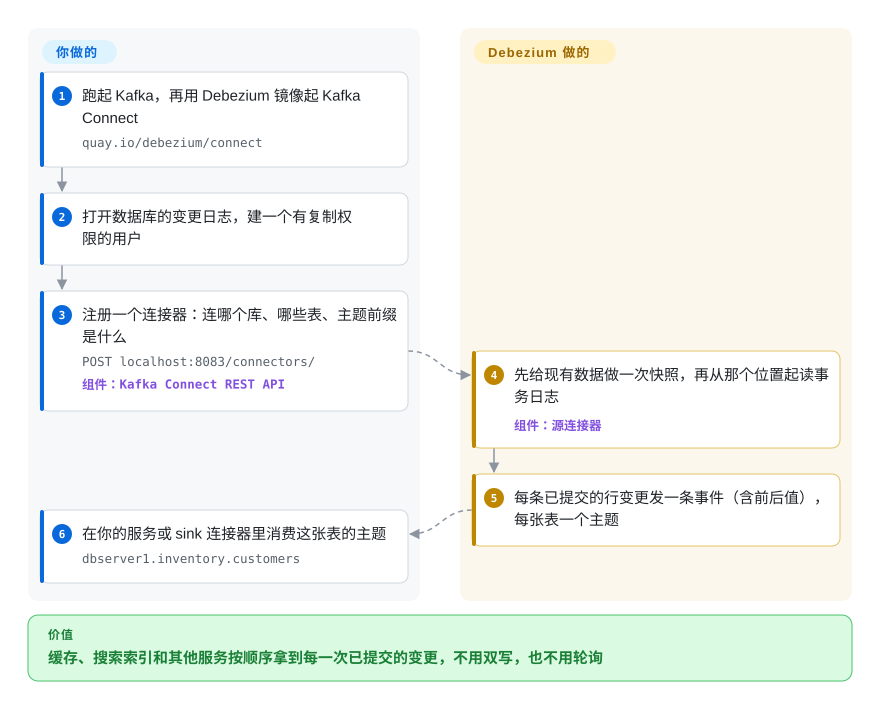

# Debezium

你的应用先把订单写进 Postgres，再去更新 Elasticsearch 和 Redis 缓存——哪天恰好在两次写之间崩了，搜索里就会出现一笔根本不存在的订单。Debezium 把第二次写去掉：它读数据库自己的事务日志，把每一条已提交的行变更按顺序发成事件，搜索索引、缓存和其他服务去消费这些事件就行。

## 何时使用

你是后端或数据平台工程师，好几个系统都得跟着一个业务数据库走：搜索索引、缓存、数据仓库、另一个团队的服务。现在的做法要么是应用“双写”——先提交到 MySQL，再调 Elasticsearch——要么是定时任务每五分钟跑一次 `SELECT * FROM orders WHERE updated_at > :last_run`，而且照样漏掉物理删除。你想要的是：每一次已提交的 `INSERT`、`UPDATE`、`DELETE` 都带着前后值、按提交顺序送达，消费方停下再启动也不丢东西。你在 Kafka Connect 里跑对应数据库的 Debezium 连接器，每张表就变成一个装满变更事件的 Kafka 主题。

你选 Debezium 而不是 [python-mysql-replication](python-mysql-replication.zh.md) 这类手写 binlog 读取器，是因为你要的不止一种数据库，还要持久化的读取位置和重放、表结构变更处理、现成的 sink 生态，而不是一个你还得围着它自己搭这些的库。你选它而不是轮询式同步，是因为基于日志的捕获能看到删除和每一次中间变更，又不给数据库加查询压力。你选它而不是 Flink CDC 或商业复制工具，是因为你已经在跑 Kafka（或者愿意跑），并且想要一个 Apache-2.0、由基金会托管、开源连接器覆盖面最广的项目。

## 怎么用起来

正经的数据库都会为崩溃恢复和主从复制记一份“已提交变更”的日志——MySQL 的 binlog、Postgres 的预写日志（WAL）、MongoDB 的 oplog、SQL Server 的 CDC 表、Oracle 的 redo log。Debezium 连接器把自己伪装成一个复制客户端：先给你选中的表做一次一致性“快照”，然后顺着这份日志往下读，把每一条已提交的行变更变成统一格式的事件（`before`、`after`、操作类型、日志位置）。默认情况下它们跑在 Kafka Connect 里——Kafka 用来运行连接器的框架——由它记住每个连接器读到了日志的哪个位置，并把事件写进每张表一个的 Kafka 主题，任意多个消费方都能各自读取、停下、再接着读。Debezium 替你做的是：按数据库解码日志、做快照、保证顺序、记录读取位置。仍然归你做的是：运行 Kafka 和 Kafka Connect，改数据库配置和授权（比如 Postgres 上的 `wal_level=logical`），以及编写或挑选处理这些事件的消费方和 sink 连接器。嫌 Kafka 太重的话，同样的连接器也能通过“嵌入式引擎”跑在你自己的 JVM 应用里，或者通过 Debezium Server（现在在独立仓库）把事件发到别的消息系统。

<!-- flow-steps:begin (generated from flows/debezium.json by tools/flow_card.py — do not edit) -->

流程文字版

1. **你**：跑起 Kafka，再用 Debezium 镜像起 Kafka Connect — `quay.io/debezium/connect`
2. **你**：打开数据库的变更日志，建一个有复制权限的用户
3. **你**：注册一个连接器：连哪个库、哪些表、主题前缀是什么 — `POST localhost:8083/connectors/` — 组件：`Kafka Connect REST API`
4. **Debezium**：先给现有数据做一次快照，再从那个位置起读事务日志 — 组件：`源连接器`
5. **Debezium**：每条已提交的行变更发一条事件（含前后值），每张表一个主题
6. **你**：在你的服务或 sink 连接器里消费这张表的主题 — `dbserver1.inventory.customers`

**价值**：缓存、搜索索引和其他服务按顺序拿到每一次已提交的变更，不用双写，也不用轮询

<!-- flow-steps:end -->

## 何时不用

- **你没跑 Kafka，也不想跑。** 默认部署是 Kafka + Kafka Connect，是一套要运维的集群。只有一个 MySQL 源、消费方是 Python，就用 [python-mysql-replication](python-mysql-replication.zh.md) 在进程内直接读 binlog；想用 Debezium 的连接器又不要 Kafka，用嵌入式引擎或 Debezium Server（独立仓库）——如果你本来就要跑 Flink，用 Flink CDC（未收录）。
- **管道里就要做关联、聚合，或者直接写进湖仓。** Debezium 只负责捕获和发布，除了单条消息转换之外不做加工。Flink CDC（未收录）把 Debezium 的连接器嵌进 Flink 作业里，捕获加处理一处搞定。
- **按小时或按天的批量同步就够了。** 基于日志的 CDC 要额外运维复制槽、连接器状态和表结构历史主题。能接受几分钟到几小时的延迟、也不在乎物理删除，用 Airbyte（未收录）这类定时 ELT 工具或一条增量查询，要运维的东西更少。
- **你改不了源库的日志配置，也拿不到复制权限。** Debezium 需要：MySQL 开 ROW 格式 binlog；Postgres 设 `wal_level=logical` 并建复制槽；SQL Server 按表开启 CDC；Oracle 开补充日志。托管数据库锁得太死、拿不到这些时，用基于查询的轮询（例如 Kafka Connect JDBC source，未收录），并接受会漏掉删除。
- **消费卡住会危及源库，而你兜不住。** 在 Postgres 上，连接器停了或落后时，复制槽一直开着，服务器就一直保留 WAL 文件，磁盘会一路涨到数据库写满——官方文档专门有一节讲这个。没法监控连接器延迟和复制槽大小，就不要把它接到生产主库上。
- **你的 Oracle 方案依赖 XStream 或 JSON 列。** XStream 适配器和 Oracle JSON 支持都要求 Oracle GoldenGate 许可；免费路线是 LogMiner 适配器。反正要买厂商支持的 Oracle 复制，就直接预算 GoldenGate。
- **你只要 MySQL → Elasticsearch 这一条管道。** [go-mysql-elasticsearch](go-mysql-elasticsearch.zh.md) 是专做这件事的小服务，但它 2023-10 之后就没有提交了（健康度 D）——要长期运行的话，用 Debezium 加一个 Elasticsearch sink。

## 横向对比

| 替代品 | 是否收录 | 我们的评价 | 取舍 |
|---|---|---|---|
| [python-mysql-replication](python-mysql-replication.zh.md) | ✅ | 单个 MySQL 源、由你自己控制的 Python 进程来读，选 python-mysql-replication；多种数据库、要持久化读取位置、要多个消费方重放，选 Debezium。 | 这个库不需要 Kafka、跑在你的进程里，但读取位置、快照、表结构变更都得自己做；Debezium 把这些都备齐了，代价是要运行 Kafka Connect。 |
| [go-mysql-elasticsearch](go-mysql-elasticsearch.zh.md) | ✅ | 只把它当一次性 MySQL→Elasticsearch 管道的参考；要在生产上长期跑的管道，选 Debezium 加 Elasticsearch sink，因为这个 Go 工具已经没人维护。 | 一个小二进制加一份映射文件，对比一套基于 Kafka 的栈；眼下简单，但以后拿不到上游修复。 |
| Flink CDC | 未收录 | 已经在跑 Flink、想在一个作业里完成捕获、转换和写入目标，选 Flink CDC；要一条持久、可重放、给很多互不相干的消费方共享的变更流，选跑在 Kafka 上的 Debezium。 | Flink CDC 复用 Debezium 的连接器、省掉 Kafka 这一跳，但捕获和 Flink 作业的生命周期与状态绑在一起；Debezium + Kafka 让捕获和每个消费方都解耦。 |
| Canal | 未收录 | 只用 MySQL、团队本来就围着阿里系工具和中文文档转，Canal 更顺手；要多种数据库和 Kafka Connect 的 sink 生态，选 Debezium。 | Canal 专精 MySQL binlog，有自己的服务端和客户端协议；Debezium 用同一种事件格式覆盖 MySQL、MariaDB、Postgres、MongoDB、Oracle、SQL Server 等。 |
| Airbyte | 未收录 | 要把大量 SaaS 和数据库源按计划落进数据仓库，选 Airbyte；要给业务系统提供亚秒级、逐行的变更事件，选 Debezium。 | Airbyte 是带界面、有几百个连接器的批量 ELT 平台；Debezium 是流式捕获层，本身不管目标端。 |

## 技术栈

- **语言：** Java——连接器以 Java 17 为目标，构建需要 JDK 21+ 和 Maven 3.9.8+（README、`pom.xml`，2026-10-08）。
- **运行时：** Kafka Connect 源连接器（基于 Kafka 4.3.1 构建）；同样的连接器也能通过嵌入式引擎或 Debezium Server 运行。
- **本仓库内的连接器：** MySQL、MariaDB、PostgreSQL（`pgoutput`、`decoderbufs`、`wal2json` 三种解码插件）、MongoDB、Oracle（LogMiner、XStream）、SQL Server，外加一个 JDBC sink。Db2、Informix、Cassandra、Spanner、Vitess、CockroachDB 等有文档，但代码在各自独立的 `debezium-connector-*` 仓库里。
- **其他组件：** 基于 ANTLR 的 DDL 解析器（语法文件为 MIT 许可）、单条消息转换、Quarkus outbox 模式扩展、OpenLineage 集成。

## 依赖

- **Kafka + Kafka Connect**（标准部署），外加存连接器配置、读取位置、状态的主题，以及 MySQL/Oracle 这类连接器所需的表结构历史主题。也可以换成一台跑嵌入式引擎或 Debezium Server 的 JVM 主机。
- **源库配置：** MySQL/MariaDB 要 ROW 格式 binlog 和有复制权限的用户；Postgres 要 `wal_level=logical`、复制槽和 publication；SQL Server 要按库按表开启 CDC；Oracle 要补充日志（以及 LogMiner 或 GoldenGate XStream）；MongoDB 要副本集或分片集群。
- **可选：** 不想用自带 schema 的 JSON 事件时，需要一个 schema registry（Avro/Protobuf）；以及对应目标端的 sink 连接器。
- **容器镜像：** `quay.io/debezium/connect` 把 Kafka Connect 和连接器打包在一起。

## 运维难度

**中到高。** 跑一个连接器只要一次 REST 调用；在生产上跑 CDC 则是一项长期服务。你要运维 Kafka Connect（worker、重平衡、升级时版本要和连接器对齐），监控每个连接器的延迟和报错，还要保护源库：盯住 Postgres 复制槽保留的 WAL，MySQL 的 binlog 保留时间要长于连接器可能停摆的最长时间，新增表或长时间中断后要谨慎地重新做快照。表结构变更会流进事件里，下游消费方必须能容忍新增或改动的字段。本来就在跑 Kafka 的团队会觉得这是常规工作；为了 Debezium 才引入 Kafka 的团队，等于一次接手两个系统。

## 健康度与可持续性

- **维护（2026-10-08）：非常活跃。** 每周都有提交；大约每季度一个次版本，补丁一到两周一个——3.6.0.Final（2026-07-01）、3.6.3.Final（2026-09-18）、3.7.0.Final（2026-09-29）。
- **治理与支撑：** 仓库的政策文件把 Commonhaus 基金会列为项目所属基金会，Red Hat 发行有支持的下游版本（文档里带 Red Hat 产品条件分支）。近一年约 147 名活跃贡献者，头号提交者约占 19%——不存在单人巴士因子问题。
- **年龄 / Lindy：** 创建于 2016-01（约 10.7 年），至今每季度发一个次版本——又老又活跃，作为要跑很多年的基础设施，Lindy 位置很强。
- **采用：** 约 13,198 个 GitHub stars（2026-10-08），Maven Central 上 `io.debezium:debezium-api` 有 594 个依赖仓库；它还是好几个其他工具的捕获层（Flink CDC 内嵌了它的连接器）。
- **风险信号：** Apache-2.0，没有改过许可证；issue 放在单独的 `debezium/dbz` 仓库里，本仓库关闭了 issue 页，所以雷达给不出响应度分数。Oracle XStream 和 JSON 支持依赖付费的 Oracle GoldenGate 许可，这一点和 Debezium 本身无关。

## 存疑（未验证）

- [未验证] Commonhaus 基金会托管一事取自仓库 `AI_USAGE_POLICY.md` 里的提及和 `jenkins-jobs/foundation` 流水线，没有读基金会自己的项目页。
- [推断] Red Hat 仍在持续投入，是从文档里的产品条件分支和长期核心提交者推断的，没有逐个核实维护者的现任雇主。
- [未验证] Flink CDC 等工具内嵌 Debezium 连接器，来自对这些项目的一般了解，本次没有读它们的依赖清单。
- [未验证] 独立 `debezium-connector-*` 仓库里目前到底有哪些连接器、各自成熟度（孵化中还是稳定）没有逐个核实。
- [推断] “补丁一到两周一个”是从 3.6.x 的 tag 日期读出来的，不是官方发布政策。
