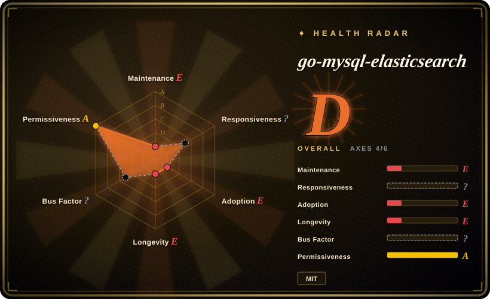
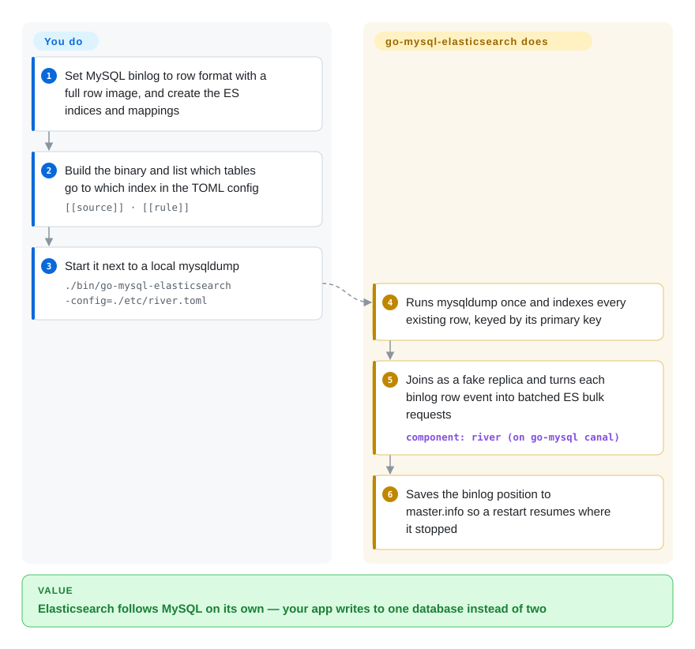

# go-mysql-elasticsearch

A small Go service that syncs MySQL into Elasticsearch in real time: it does an initial dump, then tails the MySQL binlog as a fake replica and applies inserts/updates/deletes to ES indices per a mapping rule file.

## When to use

You run a MySQL-backed app and you need full-text or analytical search over that data in Elasticsearch — but you don't want your application to write to two stores and keep them consistent by hand. You want ES to *follow* MySQL automatically. You configure go-mysql-elasticsearch with your MySQL connection, your ES endpoint, and a set of rules mapping tables → indices/types with field mappings. On start it dumps the existing rows into ES, then registers as a replication client and **tails the binlog**, so every subsequent INSERT/UPDATE/DELETE in MySQL is streamed into the matching ES document — a lightweight CDC pipeline in one binary, no Kafka, no Debezium cluster.

You reach for it when the job is specifically **MySQL→ES, one direction, modest scale**, and you'd rather run a single Go process than stand up a full streaming platform. It's the minimal "keep my search index in sync with my database" tool.

## How it works

The trick is that MySQL already broadcasts every change to its replicas through the *binlog* — the database's own append-only log of row changes. go-mysql-elasticsearch connects as if it were one more replica (via the `canal` package of the same author's `go-mysql` library), so MySQL streams it every INSERT, UPDATE and DELETE without your app doing anything. **It does**: one initial `mysqldump` copy of the existing rows, then the endless follow — turning each row change into an Elasticsearch document write keyed by the table's primary key, batching them into bulk requests, and saving its binlog position to a `master.info` file so a restart picks up where it left off. **You do**: turn on row-format binlog with a full row image, create the ES indices and mappings yourself (the README warns against relying on default mappings), and write a TOML file that says which tables map to which index and which columns are renamed or filtered. It is a mail-forwarding rule for your database: MySQL keeps receiving the mail, and a copy lands in Elasticsearch. Mind the version wall — the README only supports MySQL < 8.0 and ES < 6.0.

<!-- flow-steps:begin (generated from flows/go-mysql-elasticsearch.json by tools/flow_card.py — do not edit) -->

Text version of the flow

1. **You**: Set MySQL binlog to row format with a full row image, and create the ES indices and mappings
2. **You**: Build the binary and list which tables go to which index in the TOML config — `[[source]] · [[rule]]`
3. **You**: Start it next to a local mysqldump — `./bin/go-mysql-elasticsearch -config=./etc/river.toml`
4. **go-mysql-elasticsearch**: Runs mysqldump once and indexes every existing row, keyed by its primary key
5. **go-mysql-elasticsearch**: Joins as a fake replica and turns each binlog row event into batched ES bulk requests — component: `river (on go-mysql canal)`
6. **go-mysql-elasticsearch**: Saves the binlog position to master.info so a restart resumes where it stopped

**Value**: Elasticsearch follows MySQL on its own — your app writes to one database instead of two

<!-- flow-steps:end -->

## When NOT to use

- **It's effectively unmaintained.** The last commit on `master` is 2020-08 (a README edit; the last code change is 2019-11) — the 2023-10 `pushed_at` comes from a side branch. **No tagged releases**, an old `go.mod` (Go 1.12-era deps), and the README itself opens with a "Call for Committer/Maintainer" notice. For a new production pipeline in 2026, pick a maintained CDC tool ([Debezium](debezium.md) or Canal) unless you are prepared to fork and own this code.
- **You need many sources/sinks or transformations.** This is point-to-point MySQL→ES only. If you need Postgres, multiple sinks, schema-change handling, or rich transforms, a real CDC platform (Debezium/Kafka Connect, Flink CDC) is the right tool.
- **DDL / schema evolution matters.** Binlog-tailing tools handle row events well; online schema changes, new columns, and table renames are where lightweight syncers break or silently drift. Verify behavior for your migration patterns.
- **You need exactly-once / strong delivery guarantees.** A single-process binlog tailer's failure/restart and checkpoint semantics are simpler than a platform with offsets and a durable log; validate recovery and dedup for your durability needs.
- **Your MySQL is 8.x or your Elasticsearch is 6+.** The README's own notice lists **MySQL < 8.0 and ES < 6.0** as the supported versions (MySQL 8 and ES 6 sit in its Todo list), and the ES client still builds typed URLs (`/<index>/<type>/_mapping`), which ES 8 no longer accepts. On a current stack use [Debezium](debezium.md) with an Elasticsearch sink connector, or Canal, instead.

## Comparison

| Alternative | In index | Our verdict | Tradeoff |
|---|---|---|---|
| [Debezium](debezium.md) (+ Kafka Connect) | ✅ | Choose Debezium when you need the industrial-strength CDC platform. | The industrial-strength CDC standard; durable, multi-source, exactly-once-ish via Kafka — but it's a whole platform to run vs one Go binary. |
| Logstash JDBC input | 未收录 | Choose Logstash JDBC input when polling is acceptable and simpler startup matters more than true CDC. | Polling-based (not binlog CDC), simpler to start, but query-polling misses deletes and adds DB load; coarser than true CDC. |
| Flink CDC | 未收录 | Choose Flink CDC when you need full stream-processing CDC with transforms and many connectors. | Full stream-processing CDC with transforms and many connectors; powerful and maintained, far heavier operationally. |
| Canal (Alibaba) | 未收录 | Choose Canal when you need a mature Java MySQL binlog CDC server. | Mature MySQL binlog CDC server (Java); more robust and active, but a server to operate rather than a single-binary syncer. |
| go-mysql (library) | 未收录 | Choose go-mysql directly when you want to build a custom Go syncer. | The underlying binlog/replication library this tool is built on; use it directly if you want to build a custom syncer rather than this canned one. |

## Tech stack

- **Language:** Go (single binary).
- **Built on:** the `go-mysql` library (binlog parsing / fake-replica replication protocol) by the same org/author (siddontang).
- **Mechanism:** initial `mysqldump`-style load, then a binlog replication client streaming row events to ES.
- **Config:** a rule/config file mapping MySQL tables to ES indices/types with field mappings; Prometheus client present for metrics.

## Dependencies

- **MySQL:** with binary logging enabled in **ROW** format and replication privileges for the tool to act as a replica.
- **Elasticsearch:** a reachable ES cluster as the sink (version compatibility is your responsibility — see "removed types" above).
- **Build:** a Go toolchain (the repo's `go.mod` targets Go 1.12; building on a modern toolchain may need attention).
- **Per-table and host requirements (README notice):** binlog row image must be **full**, every synced table needs a primary key (it becomes the ES document `id`), table format cannot be altered while it runs, and `mysqldump` must be on the same host or it skips the initial dump and syncs binlog only.
- **No message broker** — it's direct MySQL→ES, no Kafka in the path.

## Ops difficulty

**Medium, and rising with neglect.** The happy path is light: one binary, one config, point it at MySQL + ES. But operating it for real means owning the unglamorous parts: enabling ROW-format binlog and replica privileges, handling the initial-dump-then-stream cutover, checkpoint/resume after restarts, and watching for drift when MySQL schemas change. The **maintenance gap is the dominant ops cost** — with no upstream code change since 2019 and no releases ever, you may have to patch ES-client or Go-version issues yourself, so budget for forking and self-maintenance rather than relying on upstream fixes. [推断]

## Health & viability

- **Responsiveness**: Cannot be scored — no_traffic.
- **Maintenance (2026-10).** **Stale.** Last push 2023-10 (side branch; `master` last moved 2020-08), **no tagged releases at all**, `go.mod` pinned to ~2019-era deps (Go 1.12). Not archived, but the README asks for a new maintainer — development has stopped.
- **Governance / bus factor.** Authored by siddontang (also behind the `go-mysql` library and PingCAP-adjacent tooling); now under the `go-mysql-org` org. Effective bus factor is low given the inactivity. [推断]
- **Age & Lindy verdict.** Created 2015-01 (~11 years old) **but no longer active** ⇒ Lindy **does not** apply — age without ongoing maintenance is a stale-repo risk, not a durability signal. [推断]
- **Adoption.** 4.2k stars, ~796 forks — strong historical popularity (it was a go-to MySQL→ES syncer); the 219 open issues against a dormant repo signal accumulated unaddressed problems. [未验证]
- **Risk flags.** Inactivity + modern-ES "types" removal + old deps = the headline risks. MIT license is clean (no relicense concern), but bet on this only if you're prepared to maintain a fork. [推断]

## Caveats (unverified)

- [未验证] Stars ~4.2k, forks ~796, 219 open issues as of 2026-06 — volatile, indicative only.
- [未验证] "No releases" is from the GitHub releases API returning empty; the project may still be used at HEAD, but there is no versioned, tagged artifact.
- [未验证] The README's supported-version notice (MySQL < 8.0, ES < 6.0) dates from an unmaintained README; whether HEAD happens to work against newer versions was not tested. The exact MySQL replication privileges needed are not listed in the README.
- [未验证] Prometheus metrics come from commit #340 ("refactor status with prometheus", 2019-11) and the `go.mod` dependency; their shape was not checked in a running instance.
- [推断] "Budget for forking" reflects the maintenance gap, an inference from cadence, not a statement that the tool is broken today.
