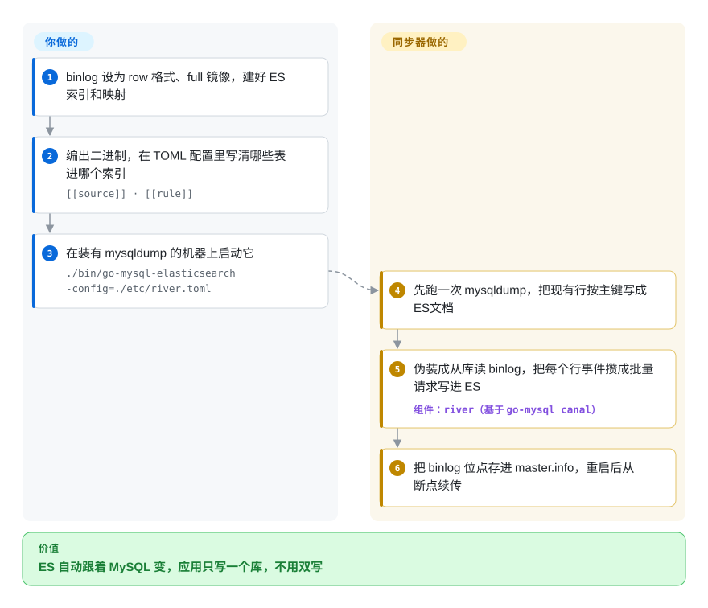

# go-mysql-elasticsearch

一个小巧的 Go 服务，实时把 MySQL 同步进 Elasticsearch：先做一次初始 dump，再以伪从库身份 tail MySQL binlog，按一份映射规则文件把 insert／update／delete 应用到 ES 索引。

## 何时使用

你跑着一个 MySQL 后端的应用，需要在 Elasticsearch 上对这些数据做全文或分析检索——但你不想让应用同时写两个存储、再手工保持一致。你想让 ES 自动*跟随* MySQL。你用你的 MySQL 连接、ES 端点，以及一组把表 → 索引／类型并带字段映射的规则，配置 go-mysql-elasticsearch。启动时它把现有行 dump 进 ES，随后注册为复制客户端并 **tail binlog**，于是 MySQL 里之后每一次 INSERT/UPDATE/DELETE 都被流式写入匹配的 ES 文档——一个单二进制里的轻量 CDC 管线，没有 Kafka，没有 Debezium 集群。

当任务恰好是 **MySQL→ES、单向、中等规模**，而你宁愿跑一个 Go 进程也不想架一整套流式平台时，你会选它。它是最小化的「让我的搜索索引与数据库保持同步」工具。

## 怎么用起来

窍门在于 MySQL 本来就会通过 *binlog*（数据库自己记的一本只追加、不改写的行变更日志）把每次改动广播给从库。go-mysql-elasticsearch 把自己伪装成又一个从库连上去（用的是同一作者 `go-mysql` 库里的 `canal` 包），于是 MySQL 会把每条 INSERT、UPDATE、DELETE 都推给它，你的应用什么也不用改。**它做的**：先用 `mysqldump` 把现有数据整体拷一遍，然后一直跟下去，把每条行变更变成一次以主键为文档 id 的 ES 写入，攒成批量请求发出去，并把 binlog 位点存进 `master.info` 文件，重启后从断点接着跑。**你做的**：打开 row 格式、full row image 的 binlog；自己建好 ES 索引和映射（README 明确不建议依赖默认映射）；写一份 TOML，说明哪张表进哪个索引、哪些列改名或过滤。它就像给数据库设了一条邮件自动转发：MySQL 照常收信，Elasticsearch 自动收到一份抄送。注意版本墙：README 只支持 MySQL < 8.0、ES < 6.0。

<!-- flow-steps:begin (generated from flows/go-mysql-elasticsearch.json by tools/flow_card.py — do not edit) -->

流程文字版

1. **你**：binlog 设为 row 格式、full 镜像，建好 ES 索引和映射
2. **你**：编出二进制，在 TOML 配置里写清哪些表进哪个索引 — `[[source]] · [[rule]]`
3. **你**：在装有 mysqldump 的机器上启动它 — `./bin/go-mysql-elasticsearch -config=./etc/river.toml`
4. **go-mysql-elasticsearch**：先跑一次 mysqldump，把现有行按主键写成 ES 文档
5. **go-mysql-elasticsearch**：伪装成从库读 binlog，把每个行事件攒成批量请求写进 ES — 组件：`river（基于 go-mysql canal）`
6. **go-mysql-elasticsearch**：把 binlog 位点存进 master.info，重启后从断点续传

**价值**：ES 自动跟着 MySQL 变，应用只写一个库，不用双写

<!-- flow-steps:end -->

## 何时不用

- **它实际上已无人维护。** `master` 上最后一次提交是 2020-08（改 README；最后一次改代码是 2019-11），2023-10 的 `pushed_at` 来自一个旁支分支。**没有任何打过 tag 的发布**，`go.mod` 陈旧（Go 1.12 时代的依赖），README 开头就挂着“征集提交者／维护者”的公告。2026 年新建生产管线，请选仍在维护的 CDC 工具（[Debezium](debezium.zh.md) 或 Canal），除非你准备好 fork 下来自己维护。
- **你需要多源／多 sink 或变换。** 这只是点对点 MySQL→ES。若你要 Postgres、多个 sink、schema 变更处理或丰富变换，真正的 CDC 平台（Debezium／Kafka Connect、Flink CDC）才对路。
- **DDL／schema 演化很重要。** binlog-tail 工具擅长处理行事件；在线 schema 变更、新增列、表改名正是轻量同步器崩坏或悄悄漂移之处。请为你的迁移模式核实其行为。
- **你需要 exactly-once／强投递保证。** 单进程 binlog tailer 的失败／重启与检查点语义，比带 offset 和持久日志的平台更简单；请为你的持久性需求验证恢复与去重。
- **你的 MySQL 是 8.x，或 Elasticsearch 是 6 及以上。** README 自己的说明写明支持 **MySQL < 8.0、ES < 6.0**（MySQL 8 和 ES 6 还在它的 Todo 里），ES 客户端仍按带 type 的路径（`/<index>/<type>/_mapping`）发请求，而 ES 8 已不接受这种路径。在当前版本的技术栈上，请改用 [Debezium](debezium.zh.md) 加 Elasticsearch sink connector，或 Canal。

## 横向对比

| 替代品 | 是否收录 | 我们的评价 | 取舍 |
|---|---|---|---|
| [Debezium](debezium.zh.md)（+ Kafka Connect） | ✅ | 需要工业级 CDC 平台时，选 Debezium。 | 工业级 CDC 标准；经 Kafka 实现持久、多源、近似 exactly-once——但它是一整套平台要运维，对比一个 Go 二进制。 |
| Logstash JDBC input | 未收录 | 可接受轮询且更重视起步简单时，选 Logstash JDBC input。 | 基于轮询（非 binlog CDC），起步更简单，但查询轮询漏掉删除并增加 DB 负载；比真 CDC 粗糙。 |
| Flink CDC | 未收录 | 需要带变换和多连接器的完整流处理 CDC 时，选 Flink CDC。 | 完整流处理 CDC，带变换和众多连接器；强大且有维护，运维重得多。 |
| Canal（阿里） | 未收录 | 需要成熟的 Java MySQL binlog CDC 服务端时，选 Canal。 | 成熟的 MySQL binlog CDC 服务端（Java）；更稳健更活跃，但要运维一个服务端而非单二进制同步器。 |
| go-mysql（库） | 未收录 | 想自建 Go 同步器时，直接选 go-mysql。 | 本工具构建其上的底层 binlog／复制库；若你想自建同步器而非用这个现成的，直接用它。 |

## 技术栈

- **语言：** Go（单二进制）。
- **构建于：** 同组织／作者（siddontang）的 `go-mysql` 库（binlog 解析／伪从库复制协议）。
- **机制：** 先做类 `mysqldump` 的初始加载，再用一个 binlog 复制客户端把行事件流到 ES。
- **配置：** 一份把 MySQL 表映射到 ES 索引／类型并带字段映射的规则／配置文件；含 Prometheus 客户端用于指标。

## 依赖

- **MySQL：** 开启 **ROW** 格式 binlog，并赋予工具作为从库的复制权限。
- **Elasticsearch：** 一个可达的 ES 集群作 sink（版本兼容性归你负责——见上文「移除 types」）。
- **构建：** Go 工具链（仓库 `go.mod` 瞄准 Go 1.12；在现代工具链上构建可能需要留意）。
- **表与主机要求（README 说明）：** binlog row image 必须是 **full**；每张要同步的表都得有主键（主键值就是 ES 文档的 `id`）；运行期间不能改表结构；`mysqldump` 必须和它装在同一台机器上，否则跳过初始 dump、只同步 binlog。
- **无消息中间件**——直连 MySQL→ES，路径上没有 Kafka。

## 运维难度

**中，且因失修而上升。** 顺路径很轻：一个二进制、一份配置，指向 MySQL + ES。但真要运维就得扛起那些不光鲜的部分：开启 ROW 格式 binlog 和从库权限、处理「先 dump 后流」的切换、重启后的检查点／续传，以及在 MySQL schema 变更时盯着漂移。**维护断层才是主导运维成本**——上游自 2019 年起没改过代码、也从未发布过版本，你可能得自己打 ES 客户端或 Go 版本的补丁，所以请按 fork 自管来预算，而非指望上游修复。[推断]

## 健康度与可持续性

- **响应速度**：无法计算——no_traffic。
- **维护（2026-10）。** **停滞。** 最后 push 于 2023-10（旁支分支；`master` 最后变动在 2020-08），**完全没有打 tag 的发布**，`go.mod` 锁在约 2019 年代的依赖（Go 1.12）。未归档，但 README 在征集新维护者——开发已经停了。
- **治理／bus factor。** 由 siddontang 创作（也是 `go-mysql` 库及 PingCAP 相邻工具背后的人）；现归于 `go-mysql-org` 组织。鉴于不活跃，实际 bus factor 偏低。[推断]
- **年龄与 Lindy 判断。** 2015-01 创建（约 11 年）**但不再活跃** ⇒ Lindy **不**适用——没有持续维护的年龄是陈旧仓库风险，而非持久性信号。[推断]
- **采用度。** 4.2k star、约 796 fork——历史人气很高（它曾是首选的 MySQL→ES 同步器）；一个休眠仓库上的 219 个 open issue 标志积累的未解问题。[未验证]
- **风险标记。** 不活跃 + 现代 ES「types」移除 + 旧依赖 = 头号风险。MIT 许可干净（无 relicense 顾虑），但只有在你准备好维护一个 fork 时才押注它。[推断]

## 存疑（未验证）

- [未验证] 截至 2026-06 约 4.2k star、约 796 fork、219 个 open issue——易变，仅供参考。
- [未验证] 「无发布」出自 GitHub releases API 返回为空；项目或仍在 HEAD 被使用，但没有带版本号、打过 tag 的产物。
- [未验证] README 里的支持版本说明（MySQL < 8.0、ES < 6.0）出自一份没人维护的 README；HEAD 能否碰巧跑在更新的版本上未经测试。README 没有列出所需的具体 MySQL 复制权限。
- [未验证] Prometheus 指标出自提交 #340（“refactor status with prometheus”，2019-11）和 `go.mod` 依赖；没有在运行中的实例里检查其形态。
- [推断] 「按 fork 预算」反映维护断层，是从节奏做出的推断，并非断言该工具今天就坏了。
