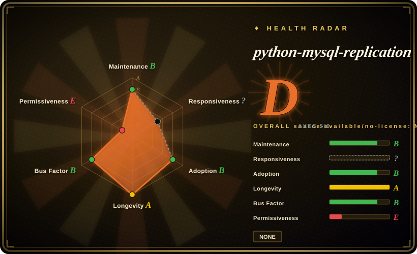
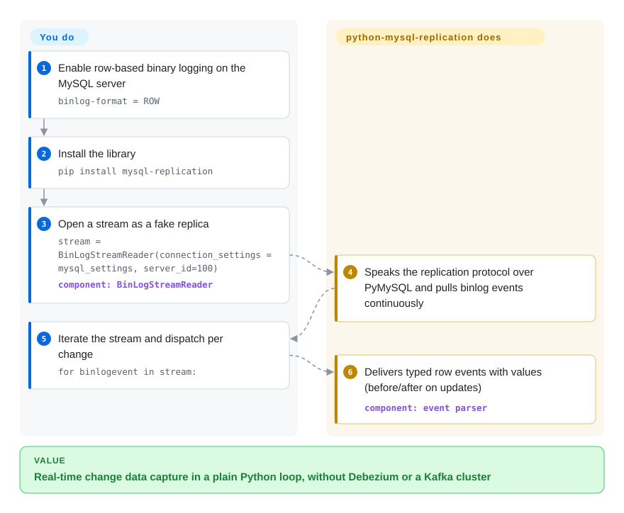

# python-mysql-replication

Polling a MySQL table for changes is too slow and silently misses deletes, but standing up Debezium + Kafka for one focused job is overkill. python-mysql-replication speaks the MySQL replication protocol in pure Python (built on PyMySQL): you connect as a fake replica, stream the binlog, and get parsed row/query/rotate events as Python objects — the building block under most Python CDC tooling for MySQL.

## When to use

You're a Python engineer who needs to react to changes in a MySQL database as they happen — invalidate a cache, push updates to a search index, fan out to a message queue, or build an audit trail — and polling the tables is too slow and misses deletes. You want change-data-capture, but you don't want to stand up Debezium and a Kafka cluster for a focused job. You `pip install mysql-replication`, point a `BinLogStreamReader` at your MySQL with replica credentials, and iterate over the binlog: each event arrives as a typed Python object (`WriteRowsEvent`, `UpdateRowsEvent`, `DeleteRowsEvent`, with before/after values), so you write a plain Python loop that does whatever you need per row change.

You reach for it as a **library, not a turnkey tool** — it gives you the parsed stream and leaves the application logic (what to do with each event, checkpointing, delivery) to you. It's the right primitive when you're building a custom sync/CDC pipeline in Python and want full control rather than a heavyweight platform.

## How it works

The library talks to MySQL exactly the way a real replica does — the same dump-binlog handshake over the wire — but in pure Python on top of a plain PyMySQL socket, which is why it needs no compiled dependencies. You hand `BinLogStreamReader` a normal pymysql connection dict plus a `server_id`, optionally a start position (`log_file`/`log_pos`) or a GTID set via `auto_position`, and it registers with the server and streams the *binlog* — MySQL's append-only record of every committed change — decoding each event into a Python object. Row events come typed: `WriteRowsEvent`, `UpdateRowsEvent`, `DeleteRowsEvent`, carrying the actual column values (updates expose `before_values`/`after_values` per row); DDL arrives as `QueryEvent`, and rotation/GTID bookkeeping is surfaced so you can track your position. What it deliberately does *not* do is delivery: your consumer loop decides what each change means, and persisting the resume position, surviving failovers, and re-reading purged binlogs are yours. Server-side requirements are visible in the README: `binlog-format = ROW` for row events, and on MySQL 8.0.14+ `binlog_row_metadata = FULL` and `binlog_row_image = FULL`.

<!-- flow-steps:begin (generated from flows/python-mysql-replication.json by tools/flow_card.py — do not edit) -->

Text version of the flow

1. **You**: Enable row-based binary logging on the MySQL server — `binlog-format = ROW`
2. **You**: Install the library — `pip install mysql-replication`
3. **You**: Open a stream as a fake replica — `stream = BinLogStreamReader(connection_settings = mysql_settings, server_id=100)` — component: `BinLogStreamReader`
4. **python-mysql-replication**: Speaks the replication protocol over PyMySQL and pulls binlog events continuously
5. **You**: Iterate the stream and dispatch per change — `for binlogevent in stream:`
6. **python-mysql-replication**: Delivers typed row events with values (before/after on updates) — component: `event parser`

**Value**: Real-time change data capture in a plain Python loop, without Debezium or a Kafka cluster

<!-- flow-steps:end -->

## When NOT to use

- **You want a finished pipeline, not a library.** This parses the binlog; *you* write the consumer, the checkpoint store, the retry/delivery logic, and the schema-change handling. If you want sink connectors and exactly-once out of the box, use Debezium/Flink CDC instead.
- **You need durable, exactly-once delivery.** It hands you an event stream; resume position (binlog file + pos / GTID) management and dedup are your responsibility, and a naive loop can lose or double-process on crash. Design checkpointing carefully.
- **High-throughput / very large schemas.** Pure-Python parsing is convenient but not the fastest path; for extreme event volumes a C/Java-based CDC (Debezium, Canal) may be more efficient. Benchmark for your load.
- **Non-MySQL or MySQL forks with protocol quirks.** It targets MySQL/MariaDB's binlog protocol; exotic forks, proxies, or unusual binlog settings (non-ROW format, missing privileges) can break it. Verify ROW-format binlog and replica privileges.
- **You're on a managed DB without binlog access.** Some managed MySQL offerings restrict the replication/binlog privileges this needs; confirm your provider exposes them.

## Comparison

| Alternative | In index | Our verdict | Tradeoff |
|---|---|---|---|
| [Debezium](debezium.md) | ✅ | Choose Debezium when you need the full Kafka Connect CDC platform. | Full CDC platform (Kafka Connect) with connectors, schema history, exactly-once-ish delivery; far heavier — this library is the lightweight, code-it-yourself counterpart. |
| Canal (Alibaba) | 未收录 | Choose Canal when you need a mature Java MySQL binlog CDC server. | Mature Java binlog CDC server; robust and active, but a server to operate, not a Python library you embed in your app. |
| Maxwell's Daemon | 未收录 | Choose Maxwell's Daemon when you need a ready binlog-to-JSON daemon. | Reads MySQL binlog and emits JSON to Kafka/Kinesis/etc.; a ready daemon rather than a library, narrower output model. |
| go-mysql (library) | 未收录 | Choose go-mysql when you need the Go-ecosystem equivalent binlog library. | The Go-ecosystem equivalent binlog library; pick by language when building a custom CDC consumer. |
| [go-mysql-elasticsearch](go-mysql-elasticsearch.md) | ✅ | Choose go-mysql-elasticsearch when your target is specifically MySQL→Elasticsearch sync. | A canned Go syncer built on the same ecosystem; narrower and less embeddable than this Python library, but already packages the Elasticsearch path. |
| Polling (SQLAlchemy / cron) | 未收录 | Choose polling when you lack binlog privileges and can accept missed deletes, load, and lag. | No binlog privileges needed and trivially simple, but misses deletes, adds query load, and lags — the limitation CDC removes. |

## Tech stack

- **Language:** Python (pure-Python protocol implementation).
- **Built on:** **PyMySQL** (`pymysql>=1.1.0`) for the wire connection; `packaging` for version handling — per `setup.py` those are the only two install requirements.
- **Core API:** `BinLogStreamReader` yielding typed events (write/update/delete row events, query events, rotate/GTID events).
- **Targets:** MySQL and MariaDB binlog protocol, ROW-format binlog; the README tests matrix lists MySQL 8.0.14+ (v1.0 line), MariaDB 10.6, CPython 3.10–3.14, plus PyPy 3.7/3.9.

## Dependencies

- **Runtime libs:** `pymysql>=1.1.0` and `packaging` — that's the install footprint (a small, pure-Python dependency set).
- **MySQL/MariaDB:** with **binary logging in ROW format** and an account holding `REPLICATION SLAVE`/`REPLICATION CLIENT` privileges; on MySQL 8.0.14+ the README also requires the server variables `binlog_row_metadata=FULL` and `binlog_row_image=FULL`.
- **Python:** CPython 3.10–3.14 (plus PyPy 3.7/3.9) per the README's test matrix.
- **No broker / no service** — it's an embeddable library; the only external system is the database itself.

## Ops difficulty

**Low as a library, medium for the pipeline you build around it.** Installing and reading events is trivial — `pip install`, a few lines, and you're streaming. The operational weight is in the application you wrap it in: durable **position/GTID checkpointing** so you resume correctly after a restart, handling MySQL failovers and binlog rotation/purging, dealing with schema (DDL) changes mid-stream, and back-pressure if your consumer is slower than the change rate. The library is reliable and well-trodden; the hard, undelegated parts are delivery semantics and resume correctness, which are inherent to CDC, not flaws in the library.

## Health & viability

- **Maintenance (2026-09).** **Active** — releases 1.0.16 (2026-07-12) and 1.0.17 (2026-08-06) landed in quick succession, the latter adding MySQL 8.4-era compatibility (its notes cover `SHOW BINARY LOG STATUS` and binlog-reset handling); the default branch was pushed 2026-09-25. Reaching a maintained 1.0.x line after years of 0.x signals a stabilized library. Not archived.
- **Governance / bus factor.** Owned by an individual (julien-duponchelle, `owner.type: User`) but with a **multi-contributor** history and named maintainers beyond the author (sean-k1, dongwook-chan) — healthier than a true solo project, though the namesake owner is central. The User-owned + long-lived combination is worth noting but mitigated by the active contributor set. [推断]
- **Age & Lindy verdict.** Created 2012-09 (~14 years) and **still actively shipping** ⇒ a **strong Lindy** signal — one of the oldest, most-depended-on Python MySQL CDC primitives, not a newcomer. [推断]
- **Adoption.** 2.4k stars, 691 forks (GitHub API 2026-09-28); the README lists a long production-user roster (Yelp's MySQLStreamer, pg_chameleon, Singer's tap-mysql, Localstack, …). ~113 open issues is normal churn for a protocol library tracking MySQL/MariaDB changes.
- **Risk flags.** Licensing is the one fuzzy spot: the README carries the Apache-2.0 text, but the repo ships **no `LICENSE` file** and the GitHub API reports no detected license — treat as Apache-2.0 per the README/package metadata, but the absence of a license file is a real ambiguity to confirm before redistribution. [未验证]

## Caveats (unverified)

- [未验证] **License is declared, not file-backed:** the README's Licence section carries the Apache-2.0 text and `setup.py` declares `license="Apache 2"`, but there is no `LICENSE` file in the repo (contents listing, 2026-09-28) and the GitHub API returns no license — recorded here as `Apache-2.0` on the strength of the README/package metadata; confirm directly before relying on it for redistribution.
- [未验证] Stars 2,414, forks 691, ~113 open issues as of 2026-09-28 — volatile, indicative only.
- [未验证] v1.0.16/v1.0.17 released 2026-07-12/2026-08-06 (GitHub API); the install name on PyPI is `mysql-replication` (not the repo slug) — verified from the README's own install line.
- [推断] The `REPLICATION SLAVE`/`REPLICATION CLIENT` privilege requirement is inferred from how binlog replication clients work; the README states the server config (`log_bin`, `binlog-format = ROW`, and `binlog_row_metadata=FULL`/`binlog_row_image=FULL` on MySQL 8.0.14+) but does not spell out the GRANT. Confirm exact privileges against your MySQL version's docs.
- [未验证] The supported-version matrix (MySQL 8.0.14+ / MariaDB 10.6 / Python 3.10–3.14 / PyPy) is the README's "project status" list; older MySQL 5.x lines are only claimed for v0.1–v0.45, and the matrix wasn't executed here. Known limitations (e.g. GEOMETRY fields undecoded, `binlog_row_image=FULL` only) are in the project docs.
