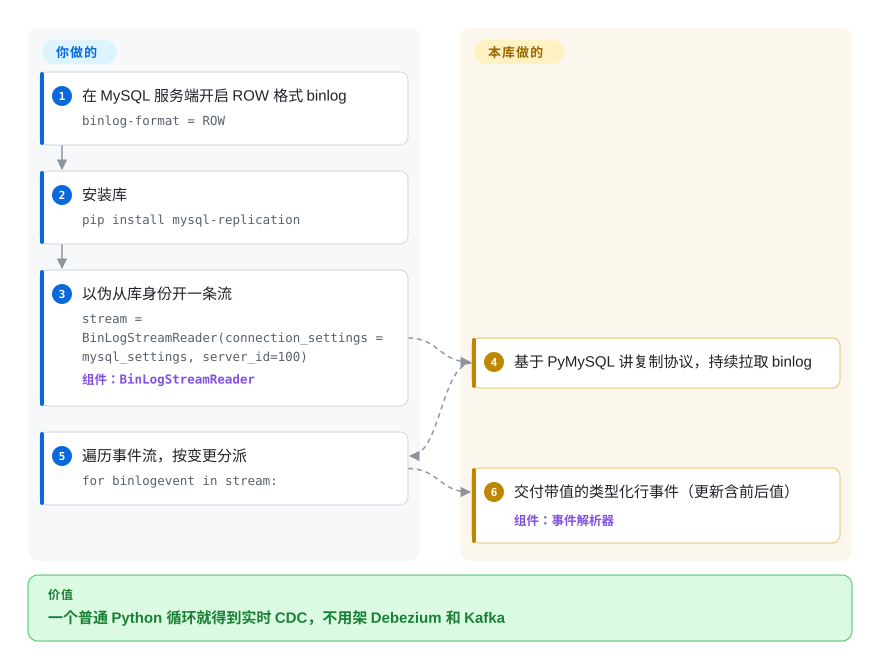

# python-mysql-replication

轮询 MySQL 表来感知变化太慢，还会悄悄漏掉删除；而为一个小任务架起 Debezium 加 Kafka 又太重。python-mysql-replication 用纯 Python（构建于 PyMySQL）实现了 MySQL 复制协议：以伪从库身份连接、流式读取 binlog，把解析后的 row／query／rotate 事件作为 Python 对象交给你——大多数 Python MySQL CDC 工具底下的那块积木。

## 何时使用

你是 Python 工程师，需要在 MySQL 数据库变化发生时即刻作出反应——失效缓存、把更新推给搜索索引、扇出到消息队列，或建审计轨迹——而轮询表太慢且漏掉删除。你想要变更数据捕获（CDC），但又不想为一个聚焦的活儿架起 Debezium 加一个 Kafka 集群。你 `pip install mysql-replication`，用从库凭据把一个 `BinLogStreamReader` 指向你的 MySQL，再遍历 binlog：每个事件作为带类型的 Python 对象到来（`WriteRowsEvent`、`UpdateRowsEvent`、`DeleteRowsEvent`，带前后值），于是你写一个普通 Python 循环，对每条行变更做你需要做的事。

你把它当作**库而非开箱即用的工具**——它给你解析后的事件流，把应用逻辑（每个事件怎么处理、检查点、投递）留给你。当你在用 Python 搭一个自定义同步／CDC 管线、想要完全控制而非一个笨重平台时，它是对的原语。

## 怎么用起来

这个库与 MySQL 对话的方式和真正的从库一模一样——同样的 dump-binlog 握手、同样的线上协议——只是用纯 Python 跑在普通 PyMySQL 套接字上，所以它没有任何编译期依赖。你把普通的 pymysql 连接字典加一个 `server_id` 交给 `BinLogStreamReader`，可选地给起始位点（`log_file`/`log_pos`）或经 `auto_position` 给 GTID 集合，它便向服务端注册，开始流式读取 *binlog*——MySQL 记录每笔已提交变更的追加式日志——并把每个事件解码成 Python 对象。行事件是带类型的：`WriteRowsEvent`、`UpdateRowsEvent`、`DeleteRowsEvent`，携带真实列值（更新事件每行给出 `before_values`/`after_values`）；DDL 以 `QueryEvent` 到来；轮转／GTID 簿记也会浮出水面，方便你追踪位点。它刻意*不*管投递：消费循环里每个变更意味着什么由你决定，持久化续传位点、扛故障切换、重读被清理的 binlog 都是你的事。服务端的硬性要求写在 README 里：要拿行事件必须 `binlog-format = ROW`，MySQL 8.0.14 起还要 `binlog_row_metadata = FULL` 与 `binlog_row_image = FULL`。

<!-- flow-steps:begin (generated from flows/python-mysql-replication.json by tools/flow_card.py — do not edit) -->

流程文字版

1. **你**：在 MySQL 服务端开启 ROW 格式 binlog — `binlog-format = ROW`
2. **你**：安装库 — `pip install mysql-replication`
3. **你**：以伪从库身份开一条流 — `stream = BinLogStreamReader(connection_settings = mysql_settings, server_id=100)` — 组件：`BinLogStreamReader`
4. **python-mysql-replication**：基于 PyMySQL 讲复制协议，持续拉取 binlog
5. **你**：遍历事件流，按变更分派 — `for binlogevent in stream:`
6. **python-mysql-replication**：交付带值的类型化行事件（更新含前后值） — 组件：`事件解析器`

**价值**：一个普通 Python 循环就得到实时 CDC，不用架 Debezium 和 Kafka

<!-- flow-steps:end -->

## 何时不用

- **你想要成品管线而非库。** 这里解析 binlog；消费者、检查点存储、重试／投递逻辑和 schema 变更处理都得*你*写。若你想要开箱即用的 sink 连接器和 exactly-once，请改用 Debezium／Flink CDC。
- **你需要持久、exactly-once 的投递。** 它交给你一条事件流；恢复位点（binlog 文件 + pos／GTID）管理与去重归你负责，朴素的循环在崩溃时可能丢失或重复处理。请仔细设计检查点。
- **高吞吐／超大 schema。** 纯 Python 解析很方便但不是最快路径；对极端事件量，基于 C／Java 的 CDC（Debezium、Canal）可能更高效。请按你的负载基准测试。
- **非 MySQL 或带协议怪癖的 MySQL 分叉。** 它瞄准 MySQL／MariaDB 的 binlog 协议；冷门分叉、代理或异常 binlog 设置（非 ROW 格式、缺权限）会让它崩。请核实 ROW 格式 binlog 与从库权限。
- **你在没有 binlog 访问权的托管 DB 上。** 一些托管 MySQL 限制了它所需的复制／binlog 权限；请确认你的服务商开放了这些。

## 横向对比

| 替代品 | 是否收录 | 我们的评价 | 取舍 |
|---|---|---|---|
| [Debezium](debezium.zh.md) | ✅ | 需要完整 Kafka Connect CDC 平台时，选 Debezium。 | 完整 CDC 平台（Kafka Connect），带连接器、schema 历史、近似 exactly-once 投递；重得多——本库是其轻量、自己写代码的对照面。 |
| Canal（阿里） | 未收录 | 需要成熟的 Java MySQL binlog CDC 服务端时，选 Canal。 | 成熟的 Java binlog CDC 服务端；稳健且活跃，但要运维一个服务端，而非你嵌进应用的 Python 库。 |
| Maxwell's Daemon | 未收录 | 需要现成的 binlog 到 JSON 守护进程时，选 Maxwell's Daemon。 | 读 MySQL binlog 并把 JSON 发往 Kafka/Kinesis 等；是现成守护进程而非库，输出模型更窄。 |
| go-mysql（库） | 未收录 | 需要 Go 生态里等价的 binlog 库时，选 go-mysql。 | Go 生态里等价的 binlog 库；构建自定义 CDC consumer 时按语言选。 |
| [go-mysql-elasticsearch](go-mysql-elasticsearch.zh.md) | ✅ | 目标专门是 MySQL→Elasticsearch 同步时，选 go-mysql-elasticsearch。 | 同一 Go 生态里打包好的同步器；比这个 Python 库更窄、没那么适合嵌入，但已经封装好 Elasticsearch 路径。 |
| 轮询（SQLAlchemy／cron） | 未收录 | 没有 binlog 权限且能接受漏删除、负载和延迟时，选轮询。 | 不需 binlog 权限且极其简单，但漏掉删除、增加查询负载且有滞后——正是 CDC 要消除的局限。 |

## 技术栈

- **语言：** Python（纯 Python 协议实现）。
- **构建于：** **PyMySQL**（`pymysql>=1.1.0`）做线连接；`packaging` 做版本处理——按 `setup.py`，安装依赖仅此两项。
- **核心 API：** `BinLogStreamReader`，产出带类型的事件（写／更新／删除行事件、query 事件、rotate/GTID 事件）。
- **目标：** MySQL 与 MariaDB binlog 协议，ROW 格式 binlog；README 测试矩阵列有 MySQL 8.0.14+（v1.0 线）、MariaDB 10.6、CPython 3.10–3.14，以及 PyPy 3.7/3.9。

## 依赖

- **运行时库：** `pymysql>=1.1.0` 与 `packaging`——这就是安装足迹（一组小巧的纯 Python 依赖）。
- **MySQL／MariaDB：** 开启 **ROW 格式 binlog**，并有持 `REPLICATION SLAVE`／`REPLICATION CLIENT` 权限的账号；MySQL 8.0.14 起 README 还要求服务端变量 `binlog_row_metadata=FULL` 与 `binlog_row_image=FULL`。
- **Python：** 按 README 测试矩阵为 CPython 3.10–3.14（外加 PyPy 3.7/3.9）。
- **无中间件／无服务**——它是可嵌入的库；唯一的外部系统是数据库本身。

## 运维难度

**作为库低，作为你围绕它搭的管线则中等。** 安装并读事件很简单——`pip install`、几行代码，你就在流式读取了。运维重量在你包裹它的那个应用：持久的**位点／GTID 检查点**以便重启后正确续传、处理 MySQL 故障切换与 binlog 轮转／清理、处理流中途的 schema（DDL）变更，以及当消费者慢于变更速率时的背压。库本身可靠、久经踩踏；难且无法外包的部分是投递语义与续传正确性，那是 CDC 固有的，而非库的缺陷。

## 健康度与可持续性

- **维护（2026-09）。** **活跃**——1.0.16（2026-07-12）与 1.0.17（2026-08-06）接连发布，后者带上了 MySQL 8.4 时代的兼容（其 release 说明覆盖 `SHOW BINARY LOG STATUS` 与 binlog reset 处理）；默认分支 2026-09-25 仍有 push。多年 0.x 后进入持续维护的 1.0.x 线，标志一个已稳定、有维护的库。未归档。
- **治理／bus factor。** 由个人持有（julien-duponchelle，`owner.type: User`）但有**多贡献者**历史，且除原作者外有具名维护者（sean-k1、dongwook-chan）——比真正的单人项目更健康，尽管同名 owner 居核心。User 持有 + 长寿的组合值得留意，但被活跃的贡献者群所缓解。[推断]
- **年龄与 Lindy 判断。** 2012-09 创建（约 14 年）且**仍在活跃发布** ⇒ **强 Lindy** 信号——它是最古老、被依赖最多的 Python MySQL CDC 原语之一，而非新秀。[推断]
- **采用度。** 2.4k star、691 fork（GitHub API 2026-09-28）；README 列着一长串生产用户与衍生项目（Yelp 的 MySQLStreamer、pg_chameleon、Singer 的 tap-mysql、Localstack 等）。约 113 个 open issue 对一个跟随 MySQL／MariaDB 变化的协议库属正常折腾。
- **风险标记。** 许可是唯一模糊处：README 的 Licence 一节载有 Apache-2.0 条文，但仓库**没有 `LICENSE` 文件**，GitHub API 也报未检测到许可——按 README／包元数据当 Apache-2.0 对待，但缺少许可文件是再分发前应确认的真实歧义。[未验证]

## 存疑（未验证）

- [未验证] **许可是声明的，无文件背书：** README 的 Licence 一节载有 Apache-2.0 条文、`setup.py` 声明 `license="Apache 2"`，但仓库里没有 `LICENSE` 文件（2026-09-28 内容清单核实），GitHub API 也未返回许可——此处凭 README／包元数据记为 `Apache-2.0`；再分发前请直接确认。
- [未验证] 截至 2026-09-28 约 2,414 star、691 fork、约 113 个 open issue——易变，仅供参考。
- [未验证] 1.0.16／1.0.17 发布于 2026-07-12／2026-08-06（GitHub API）；PyPI 上的安装名是 `mysql-replication`（不是仓库 slug）——已从 README 安装行核实。
- [推断] `REPLICATION SLAVE`／`REPLICATION CLIENT` 权限要求是从 binlog 复制客户端的一般工作方式推断；README 给出了服务端配置（`log_bin`、`binlog-format = ROW`，MySQL 8.0.14+ 的 `binlog_row_metadata=FULL`/`binlog_row_image=FULL`）但未写明确切的 GRANT。请对照你的 MySQL 版本文档确认。
- [未验证] 支持版本矩阵（MySQL 8.0.14+／MariaDB 10.6／Python 3.10–3.14／PyPy）是 README 的 project status 清单；MySQL 5.x 老版本只对 v0.1–v0.45 声称可用，且该矩阵未在本地跑过。已知限制（如 GEOMETRY 字段不解码、仅支持 `binlog_row_image=FULL`）见项目文档。
