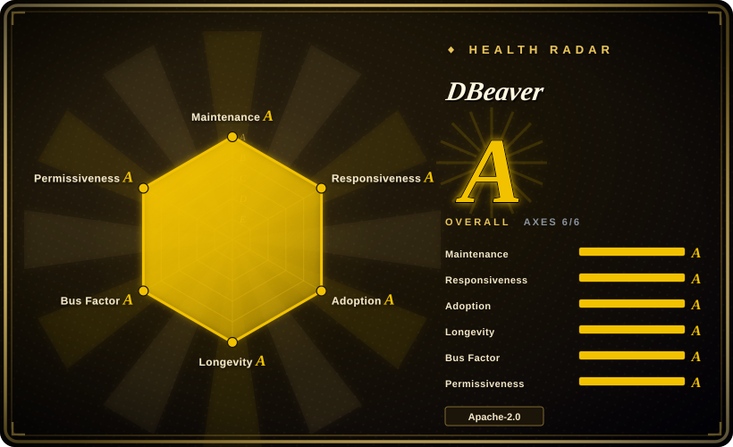
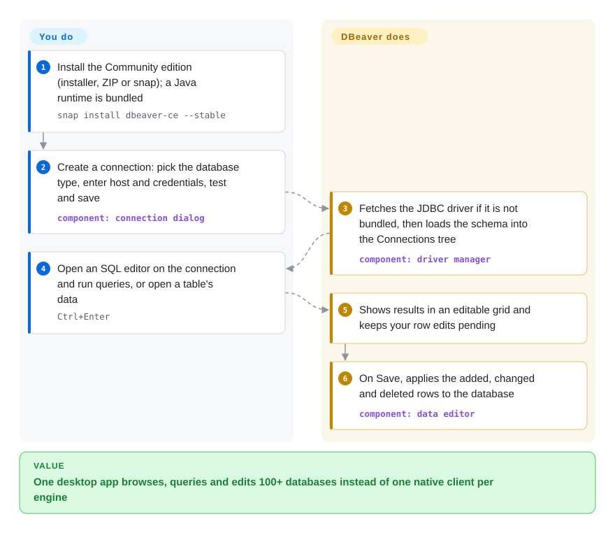

# DBeaver

You touch Postgres in the morning, a customer's SQL Server after lunch and a ClickHouse cluster at night, and each one wants its own client, its own way to save connections and its own SSH-tunnel setup. DBeaver is one free desktop app that connects to more than 100 databases through their JDBC drivers and gives every one the same SQL editor, table browser, data grid and ER diagram.

## When to use

You're a backend developer, data analyst or the de-facto DBA on a team whose estate is a mix: production Postgres behind a bastion host, a MySQL replica, an Oracle schema you inherited, SQLite files from a mobile app, and lately DuckDB and ClickHouse. You keep switching between `psql`, SQL Server Management Studio and a trial copy of something; connection details live in five places, and editing one bad row means hand-writing an `UPDATE ... WHERE id = 48213` and hoping. You install DBeaver Community, save every connection (with its SSH tunnel) in one tree, browse schemas, run SQL with autocomplete, fix the row directly in the result grid, export a table to CSV or Excel, and draw the ER diagram when someone asks how the tables relate.

You pick DBeaver over DataGrip when the tool must be free and open source (Apache-2.0) and cover long-tail engines — Dameng, Kingbase, OceanBase, TDengine, Exasol and dozens more ship as built-in drivers. You pick it over lighter clients such as Beekeeper Studio or DbGate when breadth of databases and admin features (execution plans, database administration tools, data migration between databases) matter more than startup speed and a minimal UI.

## How it works

DBeaver is a desktop application built on Eclipse RCP — the same plug-in platform the Eclipse IDE uses — and it bundles its own Java runtime, so you do not install Java separately. Each database is reached through a JDBC driver, Java's standard database-connector API; DBeaver ships or automatically downloads the right driver the first time you connect, so adding a new engine is a driver choice, not a new tool. Once connected it reads the database's catalog (schemas, tables, columns, keys) and builds the same navigator tree, SQL editor with completion, editable result grid and ER diagrams for every engine. Edits in the grid are held as pending changes and written back only when you press Save. What stays your job: having network access and credentials to each database (DBeaver can open the SSH tunnel for you), and being careful — it is a power tool pointed at production, with no review step between your Save and the database.

<!-- flow-steps:begin (generated from flows/dbeaver.json by tools/flow_card.py — do not edit) -->

Text version of the flow

1. **You**: Install the Community edition (installer, ZIP or snap); a Java runtime is bundled — `snap install dbeaver-ce --stable`
2. **You**: Create a connection: pick the database type, enter host and credentials, test and save — component: `connection dialog`
3. **DBeaver**: Fetches the JDBC driver if it is not bundled, then loads the schema into the Connections tree — component: `driver manager`
4. **You**: Open an SQL editor on the connection and run queries, or open a table's data — `Ctrl+Enter`
5. **DBeaver**: Shows results in an editable grid and keeps your row edits pending
6. **DBeaver**: On Save, applies the added, changed and deleted rows to the database — component: `data editor`

**Value**: One desktop app browses, queries and edits 100+ databases instead of one native client per engine

<!-- flow-steps:end -->

## When NOT to use

- **Your main databases are NoSQL (MongoDB, Redis, Cassandra, DynamoDB, Neo4j).** In DBeaver these are Pro-only, as are ODBC connections and files-as-database (CSV/Parquet/JSON). If you need them free, use an engine-specific client such as MongoDB Compass or Redis Insight (not indexed), or DbGate (not indexed), whose community edition targets both SQL and NoSQL.
- **The team needs shared, browser-based access with centrally managed credentials.** DBeaver Community is a single-user desktop app; every developer keeps their own connections. CloudBeaver (not indexed, same vendor) is the web version for that.
- **You want a fast-starting, minimal client and only use Postgres/MySQL/SQLite.** DBeaver is an Eclipse RCP application with 130+ plug-ins and its own bundled JRE; Beekeeper Studio (not indexed) is lighter for the common engines.
- **You live in one engine and need its deepest admin tooling.** For PostgreSQL server administration (roles, maintenance, backup dialogs, monitoring) pgAdmin (not indexed) goes further; for SQL Server, Microsoft's own tools.
- **You want IDE-grade SQL intelligence wired into your application code.** JetBrains DataGrip (not a repo, commercial) has stronger refactoring and code-aware completion; DBeaver's editor is good, not IDE-level.
- **Schema changes and data fixes must be reviewed and repeatable.** A GUI that writes to the database on Save is the wrong place for production changes; use a migration tool such as Flyway or Liquibase (not indexed) in CI, and keep DBeaver for read-mostly exploration.
- **Your AI assistant must be Anthropic, Gemini, Bedrock or Ollama.** Community's AI chat supports OpenAI-compatible endpoints and Copilot; native support for the other providers is in the Pro editions.

## Comparison

| Alternative | In index | Our verdict | Tradeoff |
|---|---|---|---|
| DataGrip | not a repo | If your company pays for JetBrains and you want IDE-level SQL refactoring and completion tied to project code, pick DataGrip; if it must be free and cover long-tail engines, pick DBeaver Community. | DataGrip is a closed, paid product with stronger code intelligence; DBeaver is Apache-2.0 with a wider built-in driver list, but some features (NoSQL, extra AI providers) sit behind its own Pro edition. |
| Beekeeper Studio | not indexed | For a quick, minimal client over Postgres, MySQL, SQLite and similar engines, pick Beekeeper Studio; when you need 100+ drivers, ER diagrams, execution plans and cross-database data transfer, pick DBeaver. | Beekeeper trades breadth for a lighter, simpler UI; DBeaver trades startup weight and UI density for coverage. |
| DbGate | not indexed | When you need SQL and NoSQL (for example MongoDB) side by side in a free client, or a browser-run version, try DbGate; for relational breadth and mature admin features, pick DBeaver. | DbGate's free edition reaches NoSQL that DBeaver gates behind Pro; DBeaver has the longer track record and far larger relational driver list. |
| CloudBeaver | not indexed | When a team needs browser access with connections and permissions managed on a server, pick CloudBeaver; when each person works on their own machine, pick DBeaver desktop. | CloudBeaver shares DBeaver's back-end plug-ins but must be deployed and secured as a service; the desktop app needs no server but nothing is shared centrally. |
| pgAdmin | not indexed | For Postgres-only DBAs who need the full server-administration surface, pick pgAdmin; for developers moving across many engines, pick DBeaver. | pgAdmin goes deeper into one engine; DBeaver gives one consistent tool for many engines with shallower engine-specific admin. |

## Tech stack

- **Language and platform:** Java on OSGi + Eclipse RCP; the Community edition is 130+ plug-ins, with model plug-ins separated from UI plug-ins so CloudBeaver reuses the same back end.
- **Database access:** JDBC for nearly everything; JSQLParser and ANTLR4 for SQL parsing and completion.
- **Libraries:** SSHJ (SSH tunnels), Apache POI (Excel export), JFreeChart, JTS (spatial viewer), Apache JEXL; third-party dependencies come from P2 repositories, including the vendor's own `dbeaver-deps-ce`.
- **Runtime:** OpenJDK 25 bundled in every distribution (replaceable via the `jre` directory).

## Dependencies

- **Nothing server-side** — it is a desktop app on Windows, macOS or Linux (installer, ZIP, snap).
- **JDBC drivers** for each engine: bundled or downloaded on first connect, so an air-gapped machine needs the driver jars supplied manually.
- **Network reach and credentials** for each database; optionally an SSH bastion, which DBeaver can tunnel through.
- **Optional:** an OpenAI-compatible endpoint or Copilot account for the AI chat.

## Ops difficulty

**Low.** There is nothing to deploy. The costs are per-workstation: upgrades every two weeks (do not unzip a new version over an old one), driver downloads that corporate proxies or air-gapped networks may block, and saved connection credentials living in each user's workspace — decide whether people may save production passwords at all. The real operational risk is human: a grid edit on a production connection goes straight to the database on Save, so use read-only connection settings or read-only database users for production.

## Health & viability

- **Maintenance (2026-10-08): very active.** A release roughly every two weeks — 26.1.3 (2026-07-19) through 26.2.2 (2026-10-04) — plus daily early-access builds.
- **Responsiveness:** issues get a first response in a few hours (median 2.8 h on the 2026-10-08 radar), unusually fast for a project with 3,300+ open issues.
- **Governance and backing:** run by DBeaver's commercial company, which sells the commercial PRO editions built on this code. The founder (`serge-rider`) authored most of the historical commits (~19,900), but in the last year ~141 contributors were active and the top three hold ~38% — the bus factor has broadened.
- **Age / Lindy:** created 2015-10 (~11 years) and still shipping every two weeks — old and active, a safe long-term bet for a desktop tool.
- **Adoption:** ~51,979 GitHub stars and ~44 million downloads of GitHub release assets (2026-10-08).
- **Risk flags:** open-core — NoSQL drivers, ODBC, files-as-database, federated queries and extra AI providers are Pro-only, so check the edition before you plan around a driver. The Community code itself is Apache-2.0 with no relicense.

## Caveats (unverified)

- [未验证] The README lists ODBC under Pro features while also saying DBeaver "supports any database which has JDBC or ODBC driver"; which edition includes ODBC was not confirmed.
- [未验证] Names and prices of the individual commercial editions were not read; the README only says "PRO versions" / "Commercial versions".
- [未验证] DbGate's free NoSQL coverage and Beekeeper Studio's lighter footprint are from general knowledge of those projects, not re-checked in this pass.
- [未验证] How saved passwords are protected in the Community workspace was not checked; treat stored production credentials as sensitive.
- [推断] Release-asset download counts include every platform package and early releases, so they overstate distinct users.
