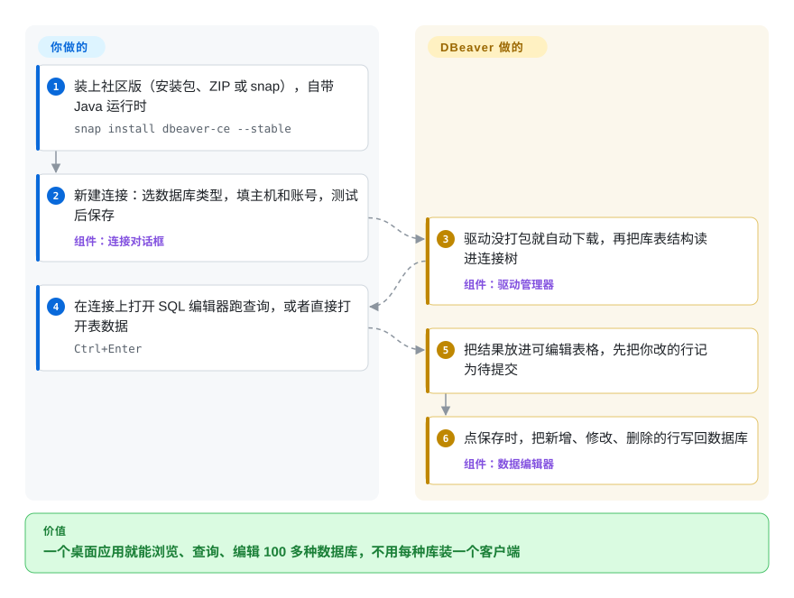

# DBeaver

上午连 Postgres，下午连客户的 SQL Server，晚上查 ClickHouse 集群，每种库都要一个自己的客户端、一套自己的连接保存方式、一遍自己的 SSH 隧道配置。DBeaver 是一个免费的桌面应用，通过各家的 JDBC 驱动连 100 多种数据库，给每一种都配上同样的 SQL 编辑器、表浏览器、数据表格和 ER 图。

## 何时使用

你是后端开发、数据分析师，或者团队里事实上的 DBA，手上的库五花八门：堡垒机后面的生产 Postgres、一个 MySQL 只读副本、一套接手来的 Oracle schema、移动端留下的 SQLite 文件，最近又多了 DuckDB 和 ClickHouse。你在 `psql`、SQL Server Management Studio 和某个试用版工具之间来回切；连接信息散在五个地方；改一行脏数据得手写 `UPDATE ... WHERE id = 48213` 然后祈祷。装上 DBeaver 社区版，所有连接（连同 SSH 隧道）存在一棵树里，浏览 schema、带补全写 SQL、直接在结果表格里改那一行、把表导出成 CSV 或 Excel，有人问表之间什么关系时画一张 ER 图。

工具必须免费开源（Apache-2.0），还要覆盖长尾数据库时，你选 DBeaver 而不是 DataGrip——达梦、人大金仓、OceanBase、TDengine、Exasol 等几十种都有内置驱动。数据库覆盖面和管理功能（执行计划、数据库管理工具、跨库数据迁移）比启动速度和极简界面更重要时，你选它而不是 Beekeeper Studio 或 DbGate 这类轻量客户端。

## 怎么用起来

DBeaver 是基于 Eclipse RCP（Eclipse IDE 用的同一套插件平台）的桌面应用，自带 Java 运行时，不用另装 Java。每种数据库都通过 JDBC 驱动访问——JDBC 是 Java 的标准数据库连接接口；第一次连接时，DBeaver 用自带的驱动或自动下载对应驱动，所以多支持一种数据库只是多选一个驱动，不是多装一个工具。连上之后它读取数据库的目录信息（schema、表、列、键），为每种库生成同样的导航树、带补全的 SQL 编辑器、可编辑的结果表格和 ER 图。在表格里做的修改先记为待提交，点“保存”才写回数据库。仍然归你管的是：每个数据库的网络可达性和账号（SSH 隧道 DBeaver 可以替你开），以及小心使用——它是一把直接对着生产库的电动工具，你点保存和数据落库之间没有任何评审环节。

<!-- flow-steps:begin (generated from flows/dbeaver.json by tools/flow_card.py — do not edit) -->

流程文字版

1. **你**：装上社区版（安装包、ZIP 或 snap），自带 Java 运行时 — `snap install dbeaver-ce --stable`
2. **你**：新建连接：选数据库类型，填主机和账号，测试后保存 — 组件：`连接对话框`
3. **DBeaver**：驱动没打包就自动下载，再把库表结构读进连接树 — 组件：`驱动管理器`
4. **你**：在连接上打开 SQL 编辑器跑查询，或者直接打开表数据 — `Ctrl+Enter`
5. **DBeaver**：把结果放进可编辑表格，先把你改的行记为待提交
6. **DBeaver**：点保存时，把新增、修改、删除的行写回数据库 — 组件：`数据编辑器`

**价值**：一个桌面应用就能浏览、查询、编辑 100 多种数据库，不用每种库装一个客户端

<!-- flow-steps:end -->

## 何时不用

- **你主要用 NoSQL（MongoDB、Redis、Cassandra、DynamoDB、Neo4j）。** 这些在 DBeaver 里只有 Pro 版支持，ODBC 连接和“把文件当数据库”（CSV/Parquet/JSON）也是。要免费的，用 MongoDB Compass 或 Redis Insight 这类专用客户端（未收录），或者社区版同时面向 SQL 和 NoSQL 的 DbGate（未收录）。
- **团队要在浏览器里共享访问，凭据集中管理。** DBeaver 社区版是单用户桌面应用，每个开发者各存各的连接。这种需求用同一厂商的网页版 CloudBeaver（未收录）。
- **你只用 Postgres/MySQL/SQLite，想要启动快、界面简的客户端。** DBeaver 是带 130 多个插件、自带 JRE 的 Eclipse RCP 应用；常见库用 Beekeeper Studio（未收录）更轻。
- **你只用一种数据库，需要它最深的管理工具。** PostgreSQL 的服务器管理（角色、维护、备份对话框、监控）pgAdmin（未收录）做得更深；SQL Server 用微软自家工具。
- **你要和应用代码打通的 IDE 级 SQL 智能。** JetBrains DataGrip（非仓库，商业软件）的重构和代码感知补全更强；DBeaver 的编辑器够用，但不是 IDE 级别。
- **表结构变更和数据修复必须经过评审、可重复执行。** 一个点保存就直接写库的图形工具不该用来做生产变更；在 CI 里用 Flyway 或 Liquibase 这类迁移工具（未收录），DBeaver 留给以读为主的探索。
- **你的 AI 助手必须是 Anthropic、Gemini、Bedrock 或 Ollama。** 社区版的 AI 对话支持 OpenAI 兼容接口和 Copilot；其他提供方的原生支持在 Pro 版里。

## 横向对比

| 替代品 | 是否收录 | 我们的评价 | 取舍 |
|---|---|---|---|
| DataGrip | 非仓库 | 公司已经买了 JetBrains、想要和项目代码打通的 IDE 级 SQL 重构与补全，选 DataGrip；必须免费、还要覆盖长尾数据库，选 DBeaver 社区版。 | DataGrip 闭源收费，代码智能更强；DBeaver 是 Apache-2.0，内置驱动更多，但部分功能（NoSQL、更多 AI 提供方）在它自己的 Pro 版里。 |
| Beekeeper Studio | 未收录 | 只要一个面向 Postgres、MySQL、SQLite 等常见库的轻快客户端，选 Beekeeper Studio；需要 100 多种驱动、ER 图、执行计划、跨库数据迁移，选 DBeaver。 | Beekeeper 用覆盖面换来更轻、更简单的界面；DBeaver 用启动开销和更密的界面换来覆盖面。 |
| DbGate | 未收录 | 要在一个免费客户端里同时用 SQL 和 NoSQL（比如 MongoDB），或者要能在浏览器里跑，试试 DbGate；要关系型数据库的广度和成熟的管理功能，选 DBeaver。 | DbGate 免费版能连 DBeaver 放在 Pro 里的 NoSQL；DBeaver 的历史更长，关系型驱动列表大得多。 |
| CloudBeaver | 未收录 | 团队要在浏览器里访问、连接和权限由服务器统一管理，选 CloudBeaver；每个人在自己机器上干活，选 DBeaver 桌面版。 | CloudBeaver 复用 DBeaver 的后端插件，但要作为服务部署并做好安全；桌面版不需要服务器，但也没有任何集中共享。 |
| pgAdmin | 未收录 | 只管 Postgres、需要完整服务器管理界面的 DBA，选 pgAdmin；在多种数据库之间切换的开发者，选 DBeaver。 | pgAdmin 在一种库上挖得更深；DBeaver 用一个一致的工具覆盖多种库，各库专属的管理功能浅一些。 |

## 技术栈

- **语言与平台：** Java，基于 OSGi + Eclipse RCP；社区版由 130 多个插件组成，模型插件和界面插件分开，所以 CloudBeaver 能复用同一套后端。
- **数据库访问：** 几乎全部走 JDBC；SQL 解析和补全用 JSQLParser 和 ANTLR4。
- **依赖库：** SSHJ（SSH 隧道）、Apache POI（导出 Excel）、JFreeChart、JTS（空间数据查看器）、Apache JEXL；第三方依赖来自 P2 仓库，包括厂商自己的 `dbeaver-deps-ce`。
- **运行时：** 每个发行包都自带 OpenJDK 25（可替换 `jre` 目录）。

## 依赖

- **不需要任何服务端**——它是 Windows、macOS、Linux 上的桌面应用（安装包、ZIP、snap）。
- **各数据库的 JDBC 驱动：** 自带或首次连接时自动下载，所以隔离网络里的机器要手动提供驱动 jar。
- **到每个数据库的网络和账号；** 可选一台 SSH 堡垒机，DBeaver 可以穿过它建隧道。
- **可选：** 给 AI 对话用的 OpenAI 兼容接口或 Copilot 账号。

## 运维难度

**低。** 没有东西要部署。成本都在每台工作站上：大约两周一次升级（不要把新版解压到旧版目录上）；公司代理或隔离网络可能挡住驱动下载；保存的连接凭据放在每个人的工作区里——要先定好能不能保存生产库密码。真正的运维风险在人：在生产连接上改表格，点保存就直接写进数据库，所以生产连接请用只读连接设置或只读数据库账号。

## 健康度与可持续性

- **维护（2026-10-08）：非常活跃。** 大约每两周一个版本——从 26.1.3（2026-07-19）到 26.2.2（2026-10-04）——另有每日抢先体验版。
- **响应度：** issue 几小时内就有首次回复（2026-10-08 雷达测得中位数 2.8 小时），对一个有 3,300 多个未关闭 issue 的项目来说很少见。
- **治理与支撑：** 由 DBeaver 的商业公司运营，公司出售基于这份代码的商业 PRO 版。创始人（`serge-rider`）贡献了历史上的大部分提交（约 19,900 次），但近一年约 141 名贡献者活跃、前三名约占 38%——巴士因子已经变宽。
- **年龄 / Lindy：** 创建于 2015-10（约 11 年），至今每两周发版——又老又活跃，作为桌面工具是稳妥的长期选择。
- **采用：** 约 51,979 个 GitHub stars，GitHub release 资产下载约 4,400 万次（2026-10-08）。
- **风险信号：** 开源核心——NoSQL 驱动、ODBC、文件即数据库、联邦查询和更多 AI 提供方都只在 Pro 版，所以规划前先确认某个驱动在哪个版本里。社区版代码本身是 Apache-2.0，没有改过许可证。

## 存疑（未验证）

- [未验证] README 一边把 ODBC 列在 Pro 功能里，一边说 DBeaver “支持任何有 JDBC 或 ODBC 驱动的数据库”；ODBC 到底在哪个版本里没有确认。
- [未验证] 各商业版的名称和价格没有读；README 只写了 “PRO versions” / “Commercial versions”。
- [未验证] DbGate 免费版的 NoSQL 覆盖、Beekeeper Studio 更轻量，来自对这些项目的一般了解，本次没有复核。
- [未验证] 社区版工作区里保存的密码如何保护没有核实；把保存的生产凭据当作敏感信息处理。
- [推断] release 资产下载量包含所有平台安装包和早期版本，会高估实际用户数。
