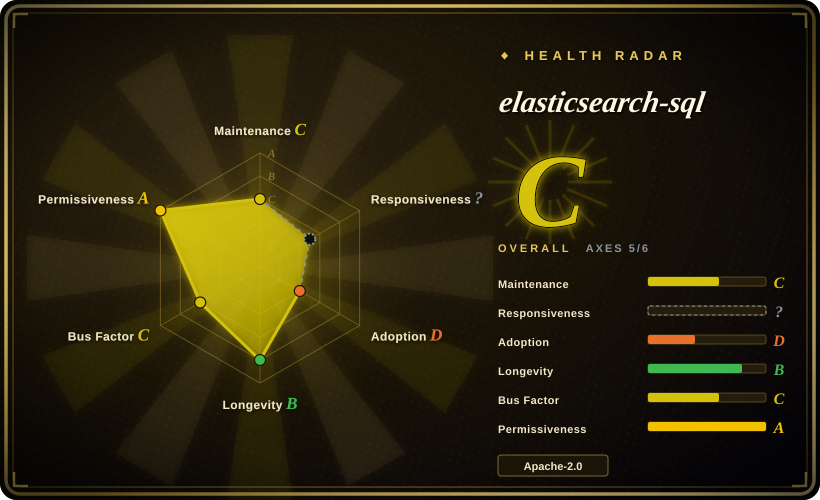
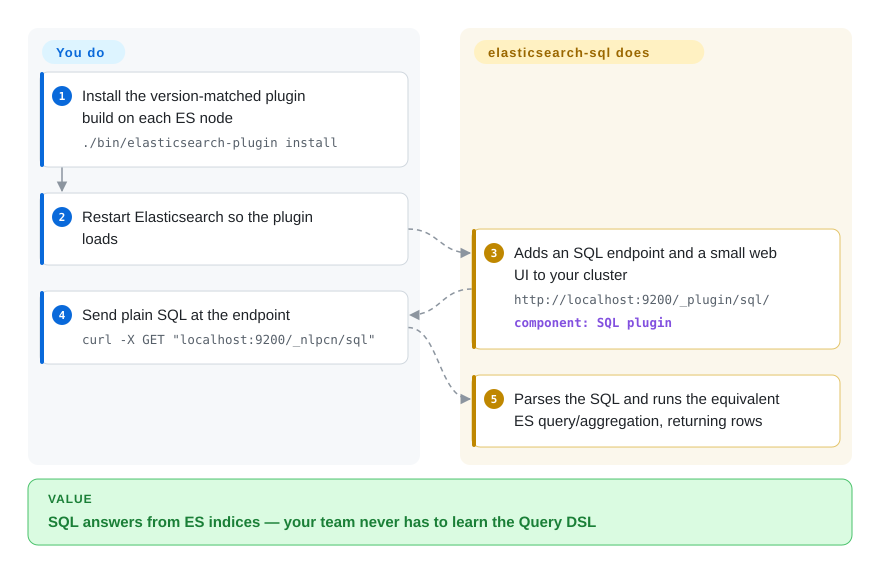

# elasticsearch-sql

Query Elasticsearch with SQL instead of its native JSON Query DSL — a community plugin (and library) that parses SQL into ES queries/aggregations; it still ships version-matched releases (v9.3.x ↔ ES 9.x), but its README now declares the project deprecated in favor of first-party SQL.

## When to use

You're an analyst or backend engineer whose team already speaks SQL, and you've inherited an Elasticsearch cluster as the data store. The native Query DSL is a wall of nested JSON, and onboarding people onto it is slow — but everyone can write `SELECT age, COUNT(*) FROM bank GROUP BY age ORDER BY age` in their sleep. You install elasticsearch-sql, point it at your cluster, and now SQL strings get translated into the equivalent ES query/aggregation under the hood — so dashboards, ad-hoc exploration, and people coming from a relational background can hit ES without learning DSL first.

You reach for it specifically as a **translation/convenience layer**: SELECT/WHERE/GROUP BY/aggregations expressed in familiar SQL, often exposed through a small web UI or used as an embeddable Java library that turns a SQL string into an ES request. It shines when the friction is *people knowing DSL*, not raw query power.

## How it works

Once chosen, there are two ways in: as a cluster plugin with a small web UI, or as an embeddable Java library that turns a SQL string into an ES request. The plugin path is the backbone: you install the build whose version matches your ES major (v9.3.4.0 for ES 9.3.4) and restart the node; the cluster then answers a REST endpoint, `/_nlpcn/sql` (the SQL statement goes in the request body, results come back as rows) plus `/_nlpcn/sql/explain`, which takes the same input and returns the Query DSL it *would* run — the escape hatch for checking a translation before trusting it. Under the hood the plugin parses your SQL into an AST (the project's lineage is Alibaba Druid's SQL parser) and rewrites it into an equivalent ES query or aggregation executed inside the node. What stays yours: choosing index shapes and query forms that translate cleanly, eyeballing `explain` output for anything non-trivial, and installing a matching plugin build on every ES major upgrade — the project itself is in release-maintenance mode (its README declares it deprecated), so expect version-matched builds, not new features.

<!-- flow-steps:begin (generated from flows/elasticsearch-sql.json by tools/flow_card.py — do not edit) -->

Text version of the flow

1. **You**: Install the version-matched plugin build on each ES node — `./bin/elasticsearch-plugin install`
2. **You**: Restart Elasticsearch so the plugin loads
3. **elasticsearch-sql**: Adds an SQL endpoint and a small web UI to your cluster — `http://localhost:9200/_plugin/sql/` — component: `SQL plugin`
4. **You**: Send plain SQL at the endpoint — `curl -X GET "localhost:9200/_nlpcn/sql"`
5. **elasticsearch-sql**: Parses the SQL and runs the equivalent ES query/aggregation, returning rows

**Value**: SQL answers from ES indices — your team never has to learn the Query DSL

<!-- flow-steps:end -->

## When NOT to use

- **The upstream itself says stop.** The README banner (verified 2026-09-28, and already present at the v9.0.0 tag) reads "this project is no longer in active development, and is deprecated", pointing users to Elastic's x-pack-sql and AWS's OpenDistro SQL. Version-matched builds still ship (v9.3.4 released 2026-05-04), so existing deployments keep working — but start nothing new on this plugin.
- **Elastic's own X-Pack SQL covers you.** Modern Elasticsearch ships a first-party SQL/ES|QL capability (`_sql` endpoint, JDBC/ODBC) — the successor this project's own README recommends. If it supports your queries, prefer the vendor feature; it's maintained in lockstep with the engine and avoids a third-party plugin.
- **You need full SQL semantics.** This translates a *subset* of SQL to ES; complex JOINs (ES isn't relational), correlated subqueries, window functions, and exact SQL-standard semantics are where the abstraction leaks. Verify your specific queries translate correctly. [未验证]
- **Version-matching is a burden you can't carry.** The plugin version-tracks the ES major (the v9.x line ↔ ES 9.x); upgrading ES means finding/upgrading a matching plugin build, and a lagging plugin can block an ES upgrade.
- **OpenSearch, not Elasticsearch.** Post-fork compatibility with OpenSearch is not guaranteed; check before relying on it there.
- **Performance-critical hot paths.** SQL→DSL translation hides what query actually runs; for tuned, latency-sensitive queries, writing DSL directly gives you control the translation layer abstracts away.

## Comparison

| Alternative | In index | Our verdict | Tradeoff |
|---|---|---|---|
| Elasticsearch SQL / ES\|QL (X-Pack) | 未收录 | Choose Elastic's first-party SQL/ES\|QL for anything starting today — this project's own README deprecates itself in favor of exactly that. Turn to this plugin only to keep an existing deployment running. | Elastic's first-party SQL and the newer ES\|QL pipe language, with JDBC/ODBC; maintained with the engine. This plugin predates and overlaps it, and its upstream has stopped developing it. |
| OpenSearch SQL plugin | 未收录 | Choose OpenSearch SQL when you run OpenSearch — it is also the successor the plugin's own README recommends (via OpenDistro). | The OpenSearch fork's own SQL/PPL plugin; the analogous answer if you run OpenSearch instead of Elastic. |
| Native Query DSL | 未收录 | Choose native Query DSL when you need maximum version-native power and control. | Maximum power and control, version-native, but verbose JSON with a steep learning curve — the friction this project removes. |
| Presto/Trino + ES connector | 未收录 | Choose Presto or Trino when you need a full ANSI-SQL engine federating ES with other sources. | Full ANSI-SQL engine that can federate ES with other sources; far heavier to operate, but real SQL semantics and JOINs across stores. |

## Tech stack

- **Language:** Java.
- **SQL parsing:** historically built on Alibaba **Druid**'s SQL parser to turn SQL into an AST before translating to ES queries.
- **Form factors:** an Elasticsearch site/plugin with a small web UI, plus use as an embeddable Java library / JDBC-style integration.
- **Versioning:** releases version-matched to the Elasticsearch major (v9.3.x tracks ES 9.x).

## Dependencies

- **Elasticsearch cluster:** a running ES of the matching major version — the plugin is meaningless without it.
- **Java runtime:** a JVM compatible with both the plugin and your ES version. [未验证]
- **Version-matched build:** you must install the plugin build that corresponds to your ES major; mismatches won't load.
- **No separate datastore** — it queries your existing ES indices.

## Ops difficulty

**Medium.** The translation library itself is light, but the operational reality is **version-coupling to Elasticsearch**: every ES major upgrade requires a matching plugin build, so the plugin sits on your upgrade critical path. As a cluster-installed plugin it shares ES's lifecycle (restart on install, compatibility testing). Embedding it as a Java library sidesteps the plugin-install/restart dance but ties you to its API. The harder questions are correctness (does my SQL translate to the query I expect?) and keeping plugin builds in sync across ES upgrades — not running a separate service.

## Health & viability

- **Responsiveness**: cannot be scored — no recent issue/PR window signal (radar `?`).
- **Maintenance (2026-09).** Last default-branch commit 2026-05-04 (~5 months at check time); newest release v9.3.4, same date, tracking ES 9.3.x. **Coasting in release-maintenance**: builds still match new ES majors, but the README banner — present at least as far back as the v9.0.0 tag — says the project is deprecated and no longer in active development. Not archived.
- **Governance / backing.** A **community project** under the NLPchina org (contributors incl. ansjsun, shi-yuan); no corporate vendor behind it — bus-factor rests on a tiny active maintainer set, which compounds the deprecation banner. [推断]
- **Age & Lindy verdict.** Created 2014-08 (~12 years) and still shipping version-matched builds in 2026 ⇒ it *has* the Lindy mileage, but upstream's own deprecation notice caps how much you should bet on its remaining life. [推断]
- **Adoption.** ~7.0k stars, ~1.5k forks (GitHub API 2026-09-28), 331 open issues — heavy historical adoption, especially in the Chinese ES community where it long predated first-party SQL.
- **Risk flags.** The deprecation banner is now the dominant risk: a self-declared end of development means correctness fixes arrive only when someone rebuilds against a new ES major. Overlap with Elastic's native SQL/ES|QL (and OpenSearch SQL) is the reason upstream recommends leaving.

## Caveats (unverified)

- [未验证] Stars ~7.0k, forks ~1.53k, 331 open issues as of 2026-09-28 (GitHub API) — volatile, indicative only.
- [未验证] That it's built on Druid's SQL parser is from general project history; not re-confirmed against the current source tree.
- [未验证] The exact subset of SQL supported (which JOINs/subqueries/functions translate) shifts release-to-release — verify your queries against the version you install.
- [未验证] Compatibility with OpenSearch and the precise ES version-matching matrix were not confirmed from the repo for this entry.
- [未验证] Whether Elastic's first-party SQL/ES|QL covers a given workload depends on the ES version and feature tier; not verified here.
- [未验证] That `/_nlpcn/sql/explain` returns the generated Query DSL is from the README's section title and example; its exact response shape was not executed here.
- [推断] The DEPRECATED banner is confirmed present in the current README and at the v9.0.0 tag; the date it was first added was not measured commit-by-commit.
