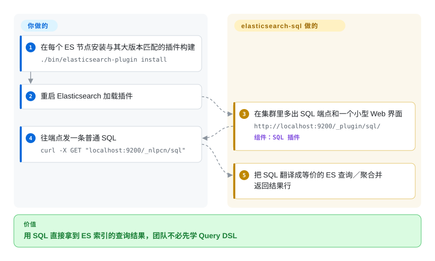

# elasticsearch-sql

用 SQL 而非原生 JSON Query DSL 查询 Elasticsearch——一个社区插件（兼库），把 SQL 翻译成 ES 查询／聚合；它仍在发与大版本对齐的构建（v9.3.x ↔ ES 9.x），但 README 已自述废弃、建议改用官方 SQL。

## 何时使用

你是分析师或后端工程师，团队本就说 SQL，又接手了一个当数据存储用的 Elasticsearch 集群。原生 Query DSL 是一堵嵌套 JSON 的墙，带人上手很慢——但人人都能闭着眼写 `SELECT age, COUNT(*) FROM bank GROUP BY age ORDER BY age`。你装上 elasticsearch-sql，指向你的集群，于是 SQL 字符串在底层被翻译成等价的 ES 查询／聚合——看板、临时探查，以及关系型背景出身的人，都能在不先学 DSL 的情况下打到 ES。

你尤其会把它当作一个**翻译／便利层**：用熟悉的 SQL 表达 SELECT/WHERE/GROUP BY／聚合，常通过一个小型 Web UI 暴露，或当作可嵌入的 Java 库、把一条 SQL 字符串变成一个 ES 请求。当摩擦在于*人不会 DSL*、而非原始查询能力时，它最闪光。

## 怎么用起来

选定之后有两条接入路径：作为集群插件带一个小型 Web 界面，或作为可嵌入的 Java 库把一条 SQL 字符串变成 ES 请求。插件路径是主干：安装与你的 ES 大版本匹配的构建（ES 9.3.4 对应 v9.3.4.0）并重启节点，集群随后多出一个 REST 端点 `/_nlpcn/sql`（请求体里放 SQL 语句，返回结果行），外加 `/_nlpcn/sql/explain`——同样的输入，返回它*将要*执行的 Query DSL，是你在信任翻译结果前先核对的逃生门。底层机制：插件把你的 SQL 解析成 AST（项目血统是阿里 Druid 的 SQL 解析器），再改写成等价的 ES 查询或聚合、在节点内执行。仍归你的部分：挑能干净翻译的索引结构与查询形态、对不简单的查询先跑一遍 explain、每次 ES 大版本升级都装匹配的插件构建——项目本身已进入只发维护版的状态（README 自述废弃），所以只有版本对齐的构建，不会有新功能。

<!-- flow-steps:begin (generated from flows/elasticsearch-sql.json by tools/flow_card.py — do not edit) -->

流程文字版

1. **你**：在每个 ES 节点安装与其大版本匹配的插件构建 — `./bin/elasticsearch-plugin install`
2. **你**：重启 Elasticsearch 加载插件
3. **elasticsearch-sql**：在集群里多出 SQL 端点和一个小型 Web 界面 — `http://localhost:9200/_plugin/sql/` — 组件：`SQL 插件`
4. **你**：往端点发一条普通 SQL — `curl -X GET "localhost:9200/_nlpcn/sql"`
5. **elasticsearch-sql**：把 SQL 翻译成等价的 ES 查询／聚合并返回结果行

**价值**：用 SQL 直接拿到 ES 索引的查询结果，团队不必先学 Query DSL

<!-- flow-steps:end -->

## 何时不用

- **上游自己就叫停。** README 顶部横幅（2026-09-28 核实，且早在 v9.0.0 tag 就存在；英文原文）大意为「本项目不再积极开发，已废弃」，并指向 Elastic 的 x-pack-sql 与 AWS 的 OpenDistro SQL。版本匹配的构建仍在发（v9.3.4 发布于 2026-05-04），存量部署可以继续跑——但别再开启任何新项目。
- **Elastic 自家的 X-Pack SQL 已能覆盖你。** 现代 Elasticsearch 自带一方 SQL／ES|QL 能力（`_sql` 端点、JDBC/ODBC）——这正是本项目 README 自己推荐的接班人。若它支持你的查询，优先用厂商特性：与引擎同步维护，还免去一个第三方插件。
- **你需要完整 SQL 语义。** 这里翻译的是 SQL 的一个*子集*；复杂 JOIN（ES 非关系型）、相关子查询、窗口函数和严格 SQL 标准语义，正是抽象漏水之处。请核实你具体的查询能正确翻译。[未验证]
- **版本对齐是你扛不动的负担。** 插件版本跟随 ES 大版本（v9.x 线 ↔ ES 9.x）；升级 ES 意味着要找到／升级一个匹配的插件构建，而一个滞后的插件会卡住 ES 升级。
- **是 OpenSearch 而非 Elasticsearch。** 分叉后与 OpenSearch 的兼容性无保证；在那边依赖它前请先确认。
- **性能关键的热路径。** SQL→DSL 翻译隐藏了实际跑的查询；对调过优、延迟敏感的查询，直接写 DSL 能给你翻译层抽掉的那份控制力。

## 横向对比

| 替代品 | 是否收录 | 我们的评价 | 取舍 |
|---|---|---|---|
| Elasticsearch SQL / ES\|QL（X-Pack） | 未收录 | 今天开始的新项目请选 Elastic 一方 SQL/ES\|QL——本项目的 README 正是宣布自己废弃并把它指定为接班人。只有为了维持存量部署时才回头看这个插件。 | Elastic 一方 SQL 与更新的 ES\|QL 管道语言，带 JDBC/ODBC；随引擎维护。本插件早于它且有重叠，且其上游已停止开发。 |
| OpenSearch SQL 插件 | 未收录 | 跑 OpenSearch 时选 OpenSearch SQL——它同时也是本插件 README 指定的接班人（经 OpenDistro）。 | OpenSearch 分叉自己的 SQL/PPL 插件；若你跑 OpenSearch 而非 Elastic，这是对应答案。 |
| 原生 Query DSL | 未收录 | 需要版本原生、控制力最大的查询能力时，选原生 Query DSL。 | 能力与控制力最大、版本原生，但冗长 JSON 学习曲线陡——正是本项目要消除的摩擦。 |
| Presto/Trino + ES 连接器 | 未收录 | 需要能联邦 ES 与其他源的完整 ANSI-SQL 引擎时，选 Presto 或 Trino。 | 完整 ANSI-SQL 引擎，可把 ES 与其他源联邦；运维重得多，但有真正的 SQL 语义和跨存储 JOIN。 |

## 技术栈

- **语言：** Java。
- **SQL 解析：** 历史上构建于阿里 **Druid** 的 SQL 解析器，把 SQL 变成 AST 再翻译为 ES 查询。
- **形态：** 一个带小型 Web UI 的 Elasticsearch 站点／插件，外加作为可嵌入 Java 库／JDBC 风格集成使用。
- **版本：** 发布版与 Elasticsearch 大版本对齐（v9.3.x 跟随 ES 9.x）。

## 依赖

- **Elasticsearch 集群：** 一个匹配大版本的运行中 ES——没它插件毫无意义。
- **Java 运行时：** 一个同时兼容插件与你 ES 版本的 JVM。[未验证]
- **版本匹配的构建：** 你必须安装与你 ES 大版本对应的插件构建；不匹配则加载不了。
- **无独立数据存储**——它查询你已有的 ES 索引。

## 运维难度

**中。** 翻译库本身很轻，但运维现实是**与 Elasticsearch 的版本耦合**：每次 ES 大版本升级都需要一个匹配的插件构建，于是插件落在你升级的关键路径上。作为集群安装的插件，它共享 ES 的生命周期（安装时重启、兼容性测试）。把它当 Java 库嵌入可绕开插件安装／重启那套，但会绑定它的 API。更难的问题是正确性（我的 SQL 是否翻译成我预期的查询？）和在 ES 升级中保持插件构建同步——而非跑一个独立服务。

## 健康度与可持续性

- **响应速度**：无法计算——近期 issue/PR 窗口无信号（雷达 `?`）。
- **维护（2026-09）。** 默认分支最后提交 2026-05-04（核实时约 5 个月前）；最新发布 v9.3.4 同日，跟随 ES 9.3.x。处于**只发维护版的滑行状态**：构建仍与大版本对齐，但 README 横幅——至少可追溯到 v9.0.0 tag——写明项目已废弃、不再积极开发。未归档。
- **治理／背书。** NLPchina 组织下的**社区项目**（贡献者含 ansjsun、shi-yuan）；背后没有企业厂商——bus-factor 系于极小的活跃维护群，叠加自述废弃，风险被放大。[推断]
- **年龄与 Lindy 判断。** 2014-08 创建（约 12 年）且 2026 年仍在发版本匹配构建 ⇒ 它有 Lindy 资历，但上游自己的废弃声明给可押注的剩余寿命设了上限。[推断]
- **采用度。** 约 7.0k star、约 1.5k fork（GitHub API 2026-09-28），331 个 open issue——历史采用度高，尤其在中文 ES 社区，它长期早于一方 SQL。
- **风险标记。** 废弃横幅如今是首要风险：自述停止开发意味着正确性修复只在有人为新 ES 大版本重新构建时才来。与 Elastic 原生 SQL/ES|QL（及 OpenSearch SQL）的重叠，正是上游建议离开的原因。

## 存疑（未验证）

- [未验证] 截至 2026-09-28 约 7.0k star、约 1.53k fork、331 个 open issue（GitHub API）——易变，仅供参考。
- [未验证] 「构建于 Druid 的 SQL 解析器」出自一般项目历史，未对照当前源码树重新确认。
- [未验证] 支持的 SQL 确切子集（哪些 JOIN／子查询／函数能翻译）随版本变动——请对照你安装的版本核实你的查询。
- [未验证] 与 OpenSearch 的兼容性、以及精确的 ES 版本匹配矩阵，本条目未从仓库确认。
- [未验证] Elastic 一方 SQL／ES|QL 是否覆盖某负载取决于 ES 版本与特性层级，这里未验证。
- [未验证] `/_nlpcn/sql/explain` 返回生成的 Query DSL，出自 README 的章节标题与示例；其确切响应结构未在此实测。
- [推断] DEPRECATED 横幅已确认存在于当前 README 及 v9.0.0 tag；其首次加入的时间未逐 commit 测量。
