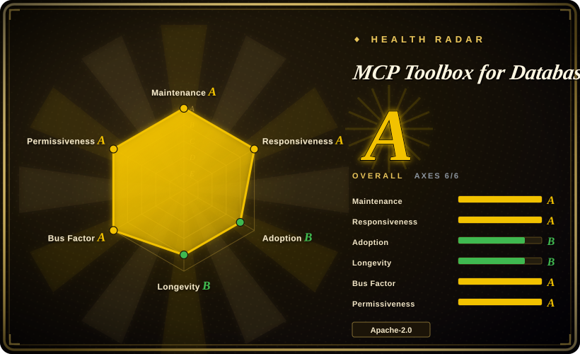
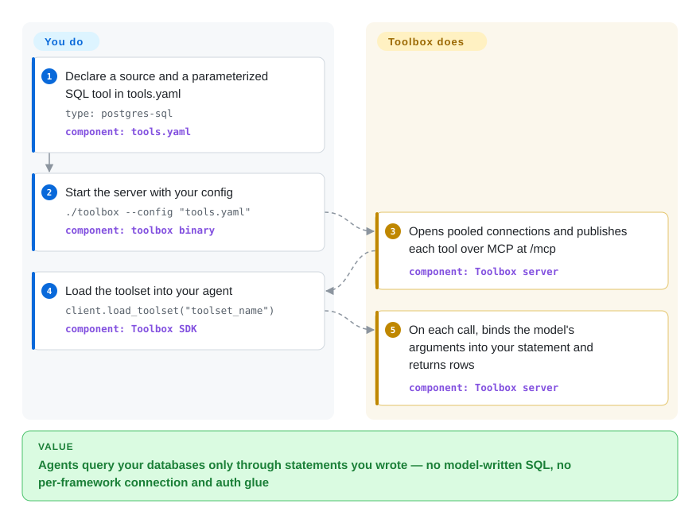

# MCP Toolbox for Databases

Your agent needs to read a production database, and the two usual options are both bad: hand it a connection string and let it write any SQL it likes, or hand-write connection, pooling, and auth glue for every agent framework you use. MCP Toolbox is a Google-run Go server that sits between the agent and the database and exposes only the queries you declared in a YAML file (or a ready-made set of generic tools) as MCP tools — the standard plug-in format agents like Claude Code and Gemini CLI understand.

## When to use

You're building a customer-support or analytics agent that has to answer "what's the status of order 8812?" from a Cloud SQL Postgres instance. Letting the model write SQL means one day it sends `SELECT * FROM orders` against a 40-million-row table, or something worse; writing a bespoke LangChain tool for each query means duplicating pooling, IAM auth, and tracing in every service that hosts an agent. You declare the query once in `tools.yaml` — `statement: SELECT * FROM orders WHERE id = $1`, with a typed `order_id` parameter — run the `toolbox` binary next to your app, and every agent (ADK, LangGraph, LlamaIndex, Genkit, or any MCP client) loads the same vetted tool by name. The model fills the parameter; it never writes the SQL.

Pick it over a minimal "run any SQL" database MCP server (DBHub, Postgres MCP Pro) when the deciding factor is **curated, parameterized tools served to production agents** across many sources — 57 source types in `internal/sources` as of 2026-09-29, from Postgres/MySQL/Oracle to BigQuery, Spanner, Firestore, Looker, and Neo4j — with connection pooling, OIDC-bound parameters, and OpenTelemetry in one process. It is also the most direct route if your data lives on Google Cloud: IAM-authenticated Cloud SQL/AlloyDB connectors and an engine-enforced read-only mode exist there first. For "let me talk to my dev database from the IDE", its `--prebuilt=postgres` mode works too, but that is the use case where lighter servers compete best.

## How it works

Toolbox is a single server process — you run it; your agents are its clients. You write a `tools.yaml` that lists **sources** (connection details, secrets as `${ENV_VAR}`), **tools** (one parameterized statement or API call each, with a description the model reads), and **toolsets** (named groups of tools per agent). On start, Toolbox opens a pooled connection to each source and publishes every tool over MCP — the Model Context Protocol, a standard JSON-RPC format for listing tools and calling them — at `http://127.0.0.1:5000/mcp` (or over stdin/stdout with `--stdio`). When the model calls a tool, Toolbox binds the model's arguments as query parameters into *your* statement, runs it, and returns rows; it can also replace a parameter with a claim from the caller's login token, so "the current user's id" never comes from the model. Think of it as a bank teller window rather than a vault key: the customer can ask for the listed transactions, not walk into the vault. The alternative entry point is `--prebuilt=<database>`: instead of your YAML, Toolbox loads a shipped config with generic tools (for Postgres, 29 tools including `execute_sql`, `list_tables`, `get_query_plan`), which is the IDE/co-pilot path — and there the model *does* write the SQL. You own: the YAML, the database credentials and grants, where the server runs, and how it is exposed. Toolbox owns: pooling, the MCP/HTTP surface, config hot-reload, auth-token checks, and telemetry.

<!-- flow-steps:begin (generated from flows/mcp-toolbox.json by tools/flow_card.py — do not edit) -->

Text version of the flow

1. **You**: Declare a source and a parameterized SQL tool in tools.yaml — `type: postgres-sql` — component: `tools.yaml`
2. **You**: Start the server with your config — `./toolbox --config "tools.yaml"` — component: `toolbox binary`
3. **MCP Toolbox for Databases**: Opens pooled connections and publishes each tool over MCP at /mcp — component: `Toolbox server`
4. **You**: Load the toolset into your agent — `client.load_toolset("toolset_name")` — component: `Toolbox SDK`
5. **MCP Toolbox for Databases**: On each call, binds the model's arguments into your statement and returns rows — component: `Toolbox server`

**Value**: Agents query your databases only through statements you wrote — no model-written SQL, no per-framework connection and auth glue

<!-- flow-steps:end -->

## When NOT to use

- **You only want your coding assistant to poke at a local dev database.** The prebuilt Postgres config loads 29 tools into the model's context; DBHub (not indexed) exposes two by default and claims ~1.4k tokens vs ~19k for Toolbox in its own comparison [未验证: competitor's self-reported measurement]. For a quick local "explore my schema" session, a minimal server or plain `psql` via the agent's shell is lighter.
- **You need "read-only" to be a hard guarantee on a self-hosted database.** The engine-level read-only lock is documented only for Cloud SQL Postgres/MySQL, AlloyDB, and BigQuery (`docs/.../security/read-only.md`, read 2026-09-29). Elsewhere, `readOnly` is a per-tool flag, and issue #3987 (open, 2026-09) shows an Oracle tool marked `readOnly: true` still committing an `UPDATE`; a maintainer called it a known issue. Enforce read-only in the database itself: a dedicated role with `SELECT`-only grants, or a read replica. If you need guardrails like approval flows and data masking, Bytebase (not indexed) sells that layer.
- **You would expose it beyond localhost without hardening.** `--allowed-hosts` and `--allowed-origins` both default to `*` and traffic is plain HTTP unless you pass `--tls-cert/--tls-key` (CLI reference, 2026-09-29); the project's own hardening guide warns that `*` is unsafe even on localhost because of DNS rebinding. If you can't own that config, put it behind an authenticated gateway like [Kong](../../api-gateway/kong.md), or use Google's managed Cloud MCP servers for GCP data.
- **You want the model to design queries for open-ended analytics.** Toolbox's safety comes from fixed statements; the prebuilt `execute_sql` path gives that up entirely. For natural-language-to-SQL with retrieval over your schema and past queries, a text-to-SQL layer like Vanna (not indexed, archived) or a BI tool's conversational layer is the closer fit — and still needs a read-only role.
- **Your stack is not Google-adjacent and you want a vendor-neutral roadmap.** The server is Apache-2.0 and runs anywhere, but the roadmap is set by a Google team that also sells managed MCP servers, `go.mod` pulls in a broad set of `cloud.google.com` libraries, and several features (IAM connectors, engine read-only, Looker/Dataplex tools) are GCP-first. For a Postgres-only deployment with tuning and health tools, Postgres MCP Pro (not indexed) is narrower and vendor-neutral.
- **You can't absorb config churn.** v1.0.0 (2026-04-10) renamed the repo from `genai-toolbox`, disabled the legacy `/api` endpoint, renamed `kind`→`type` and `authSources`→`authService`, and declared the old nested YAML format frozen; releases land roughly every 1–2 weeks. Pin a version and read `UPGRADING.md` and the changelog before bumping.

## Comparison

| Alternative | In index | Our verdict | Tradeoff |
|---|---|---|---|
| DBHub (`bytebase/dbhub`) | not indexed | For an IDE or coding agent exploring a few SQL databases, pick DBHub; pick Toolbox when production agents need curated parameterized tools, many source types, and per-user auth. Not added in this tab-intake batch. | Two default tools, TOML multi-connection, SSH tunnels, read-only/row-limit guards, MIT — but six SQL engines only and no custom-tool framework or SDKs. |
| Postgres MCP Pro (`crystaldba/postgres-mcp`) | not indexed | If your only database is Postgres and you want the agent to diagnose it (index tuning, health checks) under a restricted mode, pick Postgres MCP Pro; pick Toolbox when you have several engines or need fixed business queries rather than DBA tooling. Not added in this tab-intake batch. | Deep Postgres-specific analysis and a small vendor-neutral codebase (MIT, Python) vs. Toolbox's breadth, Go single binary, and Google backing. |
| Vanna (`vanna-ai/vanna`) | not indexed | Treat Vanna as a pattern source for retrieval-augmented text-to-SQL only — the repo is archived (GitHub API, 2026-09-29); choose Toolbox when the model should call fixed queries instead of generating SQL. Not added in this tab-intake batch. | Model writes SQL from learned schema and examples (flexible, open-ended questions) vs. declared statements (predictable, reviewable) — and archived means no upstream fixes. |
| Google Cloud managed MCP servers | not a repo | When your data is all on Google Cloud and you want zero ops for developer assistants, pick the managed servers; pick Toolbox when you need custom tools, non-Google or on-prem sources, or to self-host. | Hosted Google Cloud service, not a repository — managed stability and governance vs. self-hosted flexibility and earlier access to new features (per Toolbox's own FAQ). |

## Tech stack

- **Server:** Go (module `github.com/googleapis/mcp-toolbox`, go 1.25), HTTP via `go-chi`, YAML config via `goccy/go-yaml`, file-watch hot reload via `fsnotify`, JWT/JWKS validation for auth services.
- **Drivers:** native Go drivers per source — `pgx` (Postgres), `go-sql-driver/mysql`, `go-mssqldb`, `go-ora` (Oracle, pure Go; `godror` optional with `useOCI: true`), `mongo`, `go-redis`, `neo4j-go-driver`, `clickhouse-go`, `gosnowflake`, plus Google Cloud client libraries (AlloyDB/Cloud SQL connectors, BigQuery, Spanner, Firestore, Bigtable, Dataplex).
- **Protocol:** MCP over streamable HTTP (`/mcp`, `/mcp/{toolset}`) or stdio; a legacy native `/api` endpoint disabled by default since v1.0; advertises a Google-specific MCP extension (`com.google.cloud/toolbox.v1`) by default.
- **Client SDKs (separate repos):** Python (`toolbox-core`, `toolbox-langchain`, `toolbox-llamaindex`), JS/TS (`@toolbox-sdk/core`, `@toolbox-sdk/adk`), Go (`mcp-toolbox-sdk-go`), Java.
- **Observability:** OpenTelemetry traces and metrics, exportable to any OTLP endpoint or Google Cloud.

## Dependencies

- **Runtime:** the single `toolbox` binary (Linux/macOS/Windows, amd64/arm64), a container image in Google Artifact Registry, Homebrew, or `npx @toolbox-sdk/server` (needs Node.js; the README calls it the convenience path, not the reliable one). No database of its own.
- **Your databases:** network reachability and credentials for each source; Google Cloud sources need Application Default Credentials / IAM. Oracle's optional OCI driver needs Oracle Instant Client installed.
- **Auth (optional):** an OIDC provider (Google or generic) for authorized invocation, token-bound parameters, or whole-server MCP authorization (generic provider only).
- **Clients:** any MCP client, or one of the Toolbox SDKs inside your agent app.

## Ops difficulty

**Low to run, medium to run safely.** Locally it is one binary and one YAML file with hot reload. For a shared or production deployment you own: TLS, `--allowed-hosts`/`--allowed-origins` (both default to `*`), an auth service, least-privilege database roles (the tool-level `readOnly` flag is not a substitute outside the Cloud SQL/AlloyDB/BigQuery engine-lock path), secrets via environment variables, and horizontal scaling (deploy guides exist for Cloud Run, Kubernetes, and Docker). Budget time for upgrades: frequent minor releases and a v1.0 that already broke config keys and the default endpoint.

## Health & viability

- **Maintenance:** very active as of 2026-09-29 — 53 GitHub releases since v0.0.1 (2024-10-28), v1.0.0 on 2026-04-10, and 1–2-week minor cadence through v1.13.1 (2026-09-25); release-please and renovate automate releases and dependency bumps.
- **Governance / bus factor:** a Google team under the `googleapis` org; top human committers (Yuan325, twishabansal, duwenxin99, anubhav756, averikitsch, kurtisvg) appear to be Google staff [推断: GitHub profiles and review roles, not an org chart]; external contributions require the Google CLA. Roadmap is Google's, not a foundation's.
- **Backing & longevity:** ~2.3 years old (created 2024-06-07) and past 1.0, so the Lindy prior is still weak; the backer is strong but has a record of retiring products and runs a competing managed offering, so the self-hosted server's long-term priority is a bet on Google's MCP strategy.
- **Adoption:** ~16.5k stars, ~1.7k forks, 342 open issues (2026-09-29); SDKs published on PyPI, npm, Go, and Maven Central; listed in Google Antigravity's MCP store and packaged as Gemini CLI extensions.
- **Risk flags:** Apache-2.0 (LICENSE read 2026-09-29), no relicense history found; permissive network defaults; per-engine read-only enforcement gap (issue #3987); fast-moving config schema with a frozen legacy format.

## Caveats (unverified)

- `[未验证：竞品自测数据，未复现]` DBHub's "~1.4k vs ~19k tokens" comparison comes from DBHub's README; I counted 29 tools in Toolbox's prebuilt `postgres.yaml` but did not measure token cost.
- `[推断：依据是 read-only.md 的支持矩阵只列 4 个引擎]` Self-hosted Postgres/MySQL/Oracle get no engine-level read-only lock — inferred from the docs' enforcement matrix and issue #3987, not from testing each driver.
- `[推断：依据是 GitHub 用户资料和 review 角色]` The core maintainers are Google employees; I did not confirm employment.
- `[未验证：未实测部署]` Cloud Run/Kubernetes deployment and horizontal scaling behavior are taken from docs titles and FAQ; not deployed here.
- `[未验证：未读全部 57 个 source 的实现]` Feature parity (auth-bound parameters, `readOnly`, prebuilt configs) differs by source; this page generalizes from the Postgres, Oracle, and BigQuery docs.
- `[推断：依据是 FAQ 的对比表述]` The managed Google Cloud MCP servers may get features later than, or differently from, the open-source server — the FAQ says Toolbox gets "cutting-edge features" first, but the long-term split is Google's call.
