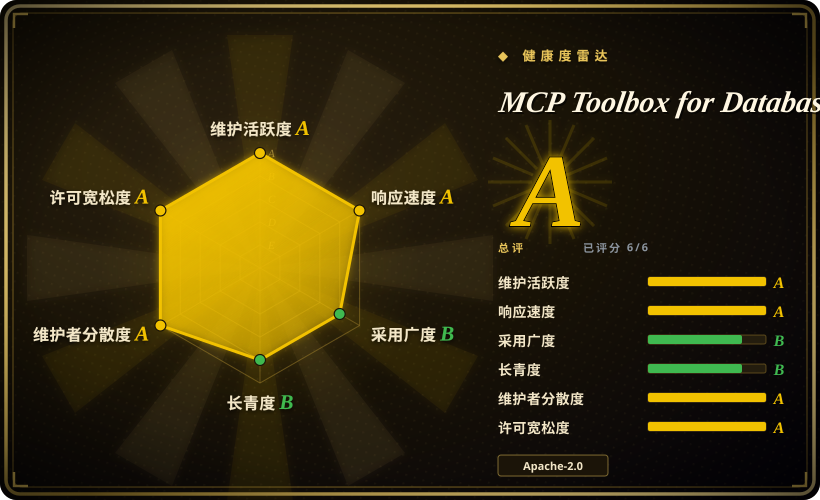
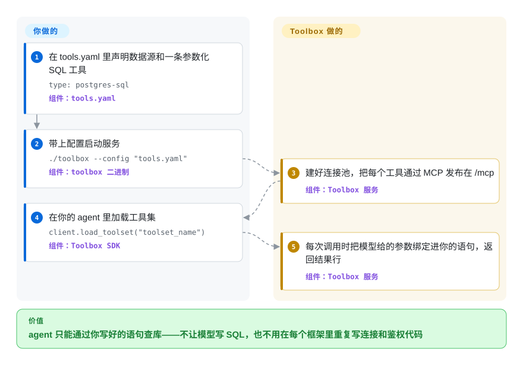

# MCP Toolbox for Databases

你的 agent 要查生产库，常见的两条路都不好走：要么把连接串直接交给它、让它想写什么 SQL 就写什么；要么在每个 agent 框架里各写一套连接、连接池和鉴权胶水代码。MCP Toolbox 是 Google 团队维护的一个 Go 服务，挡在 agent 和数据库中间，只把你在 YAML 里写好的查询（或一套现成的通用工具）以 MCP 工具的形式放出去——MCP 是 Claude Code、Gemini CLI 这类 agent 都认的插件格式。

## 何时使用

你在做一个客服或数据分析 agent，它要从 Cloud SQL 上的 Postgres 里回答“8812 号订单现在什么状态”。让模型自己写 SQL，总有一天它会对一张四千万行的表发出 `SELECT * FROM orders`，甚至更糟；给每条查询手写一个 LangChain 工具，又意味着每个挂 agent 的服务都要重复一遍连接池、IAM 鉴权和链路追踪。用 Toolbox，你在 `tools.yaml` 里把查询声明一次——`statement: SELECT * FROM orders WHERE id = $1`，外加一个带类型的 `order_id` 参数——在应用旁边跑起 `toolbox` 二进制，所有 agent（ADK、LangGraph、LlamaIndex、Genkit 或任意 MCP 客户端）按名字加载同一个审过的工具。模型只负责填参数，SQL 永远不是它写的。

它和 DBHub、Postgres MCP Pro 这类“随便跑 SQL”的极简数据库 MCP 服务的分水岭在于：**给生产 agent 提供审定过的参数化工具**，而且覆盖的数据源多——截至 2026-09-29，`internal/sources` 下有 57 种数据源类型，从 Postgres、MySQL、Oracle 到 BigQuery、Spanner、Firestore、Looker、Neo4j——连接池、绑定登录身份的参数、OpenTelemetry 全在一个进程里。数据在 Google Cloud 上时它也是最顺的一条路：走 IAM 鉴权的 Cloud SQL／AlloyDB 连接器和由数据库引擎强制执行的只读模式都是先在那里落地的。如果你只是想“在 IDE 里跟开发库聊两句”，它的 `--prebuilt=postgres` 模式也能用，但那正是更轻的同类最有优势的场景。

## 怎么用起来

Toolbox 是一个独立的服务进程——你来跑它，你的 agent 是它的客户端。你写一份 `tools.yaml`，里面列出**数据源**（连接信息，密码等机密用 `${ENV_VAR}` 引用）、**工具**（每个工具对应一条参数化语句或一次 API 调用，外加一段给模型读的描述）和**工具集**（按 agent 分组的一组工具）。启动时，Toolbox 给每个数据源建好连接池，再把每个工具通过 MCP 发布在 `http://127.0.0.1:5000/mcp`（或者加 `--stdio` 走标准输入输出）——MCP 即 Model Context Protocol，一种用 JSON-RPC 列出工具、调用工具的标准格式。模型调用某个工具时，Toolbox 把模型给的参数当作查询参数绑定进**你写的**语句里执行，再把结果行返回；它还能用调用方登录令牌里的某个字段顶替某个参数，这样“当前用户的 id”就不会由模型来填。打个比方，它是银行柜台窗口而不是金库钥匙：客户只能办单子上列出来的业务，进不了金库。另一个入口是 `--prebuilt=<database>`：不读你的 YAML，而是加载项目自带的通用工具配置（Postgres 那份有 29 个工具，包括 `execute_sql`、`list_tables`、`get_query_plan`），这是给 IDE／编程助手用的路子——而且在这条路上，SQL **是**模型写的。归你管的：YAML、数据库账号与授权、服务跑在哪、怎么对外暴露。归 Toolbox 管的：连接池、MCP／HTTP 接口、配置热加载、令牌校验和遥测。

<!-- flow-steps:begin (generated from flows/mcp-toolbox.json by tools/flow_card.py — do not edit) -->

流程文字版

1. **你**：在 tools.yaml 里声明数据源和一条参数化 SQL 工具 — `type: postgres-sql` — 组件：`tools.yaml`
2. **你**：带上配置启动服务 — `./toolbox --config "tools.yaml"` — 组件：`toolbox 二进制`
3. **MCP Toolbox for Databases**：建好连接池，把每个工具通过 MCP 发布在 /mcp — 组件：`Toolbox 服务`
4. **你**：在你的 agent 里加载工具集 — `client.load_toolset("toolset_name")` — 组件：`Toolbox SDK`
5. **MCP Toolbox for Databases**：每次调用时把模型给的参数绑定进你的语句，返回结果行 — 组件：`Toolbox 服务`

**价值**：agent 只能通过你写好的语句查库——不让模型写 SQL，也不用在每个框架里重复写连接和鉴权代码

<!-- flow-steps:end -->

## 何时不用

- **你只想让编程助手随手看看本地开发库。** 预置的 Postgres 配置会往模型上下文里塞 29 个工具；DBHub（未收录）默认只暴露两个，并在它自己的对比里声称自身约 1.4k token、Toolbox 约 19k [未验证：竞品自测数据]。临时“看看我的表结构”这种活，用极简服务，或者直接让 agent 在 shell 里跑 `psql` 更轻。
- **你要求“只读”在自建数据库上是硬保证。** 引擎级只读锁只在 Cloud SQL Postgres／MySQL、AlloyDB 和 BigQuery 上有文档（`docs/.../security/read-only.md`，2026-09-29 阅读）。其他引擎上 `readOnly` 只是工具级开关；issue #3987（2026-09 开启，未关闭）演示了一个标了 `readOnly: true` 的 Oracle 工具照样提交了 `UPDATE`，维护者回复这是已知问题。只读要在数据库本身落实：建一个只有 `SELECT` 权限的专用角色，或者连只读副本。如果你要审批流、数据脱敏这类护栏，Bytebase（未收录）卖的就是这一层。
- **你打算不做加固就把它暴露到 localhost 之外。** `--allowed-hosts` 和 `--allowed-origins` 默认都是 `*`，不传 `--tls-cert/--tls-key` 就是明文 HTTP（CLI 参考文档，2026-09-29）；项目自己的加固指南也警告，因为 DNS 重绑定攻击，`*` 即使在 localhost 上也不安全。如果你没法管好这套配置，把它放到带鉴权的网关后面，比如 [Kong](../../api-gateway/kong.zh.md)；数据在 GCP 上的话，用 Google 托管的 Cloud MCP 服务。
- **你想让模型自己设计查询做开放式分析。** Toolbox 的安全性来自固定语句；预置的 `execute_sql` 那条路把这点完全放弃了。要基于表结构和历史查询做检索增强的自然语言转 SQL，Vanna（未收录，已归档）这类 text-to-SQL 层或 BI 工具自带的对话层更对口——而且照样需要只读角色。
- **你的技术栈跟 Google 不沾边，又想要厂商中立的路线图。** 服务端是 Apache-2.0、哪都能跑，但路线图由一个同时在卖托管 MCP 服务的 Google 团队决定，`go.mod` 拉进了一大片 `cloud.google.com` 库，好几项能力（IAM 连接器、引擎级只读、Looker／Dataplex 工具）都是 GCP 优先。只有 Postgres、还想要调优和健康检查工具的话，Postgres MCP Pro（未收录）更窄也更中立。
- **你扛不住配置频繁变动。** v1.0.0（2026-04-10）把仓库从 `genai-toolbox` 改名，默认关掉了旧的 `/api` 端点，把 `kind` 改成 `type`、`authSources` 改成 `authService`，并宣布旧的嵌套 YAML 格式不再加新功能；版本大约每一到两周发一次。锁定版本，升级前读 `UPGRADING.md` 和变更日志。

## 横向对比

| 替代品 | 是否收录 | 我们的评价 | 取舍 |
|---|---|---|---|
| DBHub（`bytebase/dbhub`） | 未收录 | IDE 或编程 agent 要浏览几个 SQL 库时选 DBHub；生产 agent 需要审定过的参数化工具、多种数据源和按用户鉴权时选 Toolbox。本次标签页收录批次未添加。 | 默认两个工具、TOML 多连接、SSH 隧道、只读与行数上限护栏、MIT 许可——但只支持六种 SQL 引擎，没有自定义工具框架和 SDK。 |
| Postgres MCP Pro（`crystaldba/postgres-mcp`） | 未收录 | 只有 Postgres、想让 agent 在受限模式下诊断它（索引调优、健康检查）时选 Postgres MCP Pro；有多种引擎、或要的是固定业务查询而不是 DBA 工具时选 Toolbox。本次标签页收录批次未添加。 | 深度的 Postgres 专项分析、代码库小且厂商中立（MIT，Python），对比 Toolbox 的覆盖面、Go 单二进制和 Google 背书。 |
| Vanna（`vanna-ai/vanna`） | 未收录 | 仓库已归档（GitHub API，2026-09-29），只把它当检索增强 text-to-SQL 的设计参考；要让模型调用固定查询而不是生成 SQL 时选 Toolbox。本次标签页收录批次未添加。 | 模型根据学到的表结构和示例写 SQL（灵活，适合开放问题），对比声明好的语句（可预期、可审查）——且已归档意味着上游不再修复。 |
| Google Cloud 托管 MCP 服务 | 非仓库 | 数据全在 Google Cloud、想给开发助手零运维接入时选托管服务；需要自定义工具、非 Google 或本地机房数据源、或必须自托管时选 Toolbox。 | 这是托管的 Google Cloud 服务，不是仓库——托管带来的稳定与治理，对比自托管的灵活性和更早拿到新功能（据 Toolbox 自己的 FAQ）。 |

## 技术栈

- **服务端：** Go（模块 `github.com/googleapis/mcp-toolbox`，go 1.25），HTTP 用 `go-chi`，YAML 配置用 `goccy/go-yaml`，热加载用 `fsnotify` 监听文件，鉴权服务用 JWT／JWKS 校验。
- **驱动：** 每种数据源用原生 Go 驱动——`pgx`（Postgres）、`go-sql-driver/mysql`、`go-mssqldb`、`go-ora`（Oracle，纯 Go；`useOCI: true` 时可选 `godror`）、`mongo`、`go-redis`、`neo4j-go-driver`、`clickhouse-go`、`gosnowflake`，外加 Google Cloud 客户端库（AlloyDB／Cloud SQL 连接器、BigQuery、Spanner、Firestore、Bigtable、Dataplex）。
- **协议：** MCP，走 streamable HTTP（`/mcp`、`/mcp/{toolset}`）或 stdio；旧的原生 `/api` 端点自 v1.0 起默认关闭；默认还会声明一个 Google 自己的 MCP 扩展（`com.google.cloud/toolbox.v1`）。
- **客户端 SDK（独立仓库）：** Python（`toolbox-core`、`toolbox-langchain`、`toolbox-llamaindex`）、JS／TS（`@toolbox-sdk/core`、`@toolbox-sdk/adk`）、Go（`mcp-toolbox-sdk-go`）、Java。
- **可观测性：** OpenTelemetry 链路和指标，可导出到任意 OTLP 端点或 Google Cloud。

## 依赖

- **运行时：** 单个 `toolbox` 二进制（Linux／macOS／Windows，amd64／arm64），或 Google Artifact Registry 里的容器镜像、Homebrew、`npx @toolbox-sdk/server`（需要 Node.js；README 说这是图方便的路子，不是稳妥的路子）。自身不需要数据库。
- **你的数据库：** 每个数据源都要网络可达并有账号；Google Cloud 数据源需要 Application Default Credentials／IAM。Oracle 的可选 OCI 驱动需要装 Oracle Instant Client。
- **鉴权（可选）：** 一个 OIDC 身份提供方（Google 或通用型），用于调用前鉴权、令牌绑定参数，或整服务的 MCP 鉴权（后者只支持通用型）。
- **客户端：** 任意 MCP 客户端，或在你的 agent 应用里用 Toolbox SDK。

## 运维难度

**跑起来低，跑得安全中等。** 本地就是一个二进制加一份 YAML，还能热加载。共享或生产部署要你自己负责：TLS、`--allowed-hosts`／`--allowed-origins`（默认都是 `*`）、鉴权服务、最小权限的数据库角色（在 Cloud SQL／AlloyDB／BigQuery 的引擎锁之外，工具级 `readOnly` 开关替代不了它）、用环境变量注入机密，以及横向扩展（有 Cloud Run、Kubernetes、Docker 的部署指南）。升级要留时间：小版本发得勤，v1.0 已经改过一次配置键和默认端点。

## 健康度与可持续性

- **维护：** 截至 2026-09-29 非常活跃——从 v0.0.1（2024-10-28）起共 53 个 GitHub 发布，v1.0.0 在 2026-04-10，之后按一到两周一个小版本推进到 v1.13.1（2026-09-25）；发布和依赖升级由 release-please、renovate 自动化。
- **治理与巴士因子：** `googleapis` 组织下的 Google 团队；排名靠前的人类提交者（Yuan325、twishabansal、duwenxin99、anubhav756、averikitsch、kurtisvg）看起来是 Google 员工 [推断：依据是 GitHub 资料和评审角色，没有组织架构图]；外部贡献需要签 Google CLA。路线图归 Google，不归基金会。
- **背书与长寿：** 约 2.3 年（2024-06-07 创建），已过 1.0，Lindy 先验仍然偏弱；背后的公司很强，但有下线产品的前科，而且自己在卖托管的同类服务，所以自托管服务端的长期优先级，等于押注 Google 的 MCP 战略。
- **采用度：** 约 16.5k star、约 1.7k fork、342 个未关闭 issue（2026-09-29）；SDK 发布在 PyPI、npm、Go 和 Maven Central；上架 Google Antigravity 的 MCP 商店，并打包成 Gemini CLI 扩展。
- **风险信号：** Apache-2.0（2026-09-29 读过 LICENSE），未发现改许可证的历史；网络默认值宽松；各引擎只读执行力度不一（issue #3987）；配置 schema 变动快，旧格式已冻结。

## 存疑（未验证）

- `[未验证：竞品自测数据，未复现]` DBHub 的“约 1.4k 对约 19k token”来自 DBHub 的 README；我数过 Toolbox 预置 `postgres.yaml` 里有 29 个工具，但没有测 token 开销。
- `[推断：依据是 read-only.md 的支持矩阵只列 4 个引擎]` 自建 Postgres／MySQL／Oracle 没有引擎级只读锁——根据文档的执行矩阵和 issue #3987 推断，没有逐个驱动实测。
- `[推断：依据是 GitHub 用户资料和 review 角色]` 核心维护者是 Google 员工；没有核实雇佣关系。
- `[未验证：未实测部署]` Cloud Run／Kubernetes 部署和横向扩展表现取自文档目录和 FAQ，这里没有实际部署。
- `[未验证：未读全部 57 个 source 的实现]` 各数据源的功能覆盖（令牌绑定参数、`readOnly`、预置配置）并不一致；本页是从 Postgres、Oracle 和 BigQuery 的文档归纳的。
- `[推断：依据是 FAQ 的对比表述]` 托管的 Google Cloud MCP 服务拿到新功能的时间和形态可能与开源服务端不同——FAQ 说 Toolbox 先拿到“最前沿的功能”，但长期怎么分工由 Google 决定。
