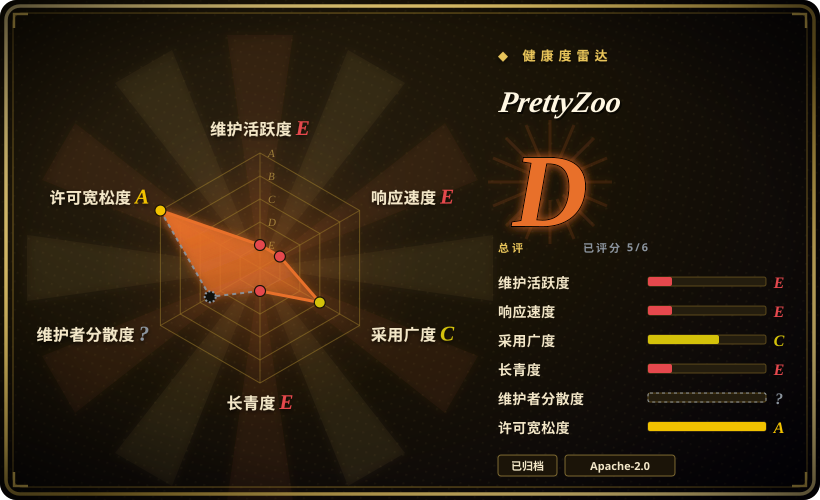
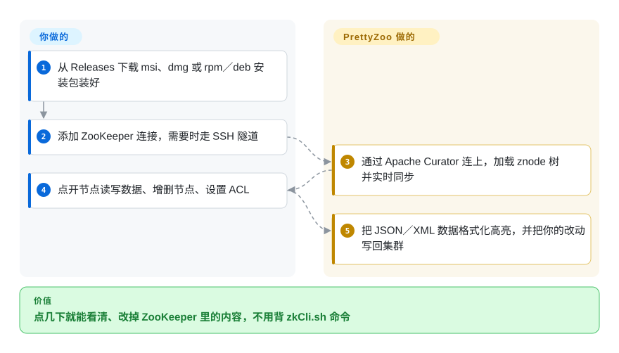

# PrettyZoo

一个跨平台的 Apache ZooKeeper 桌面 GUI（Win／Mac／Linux）——浏览 znode 树、查看／编辑节点数据、管理 ACL 与连接，无需跌进 `zkCli.sh` shell。**已归档：作者在 README 里的公告（落款 2024-01-09）宣布停止维护。**

## 何时使用

你是后端或平台工程师，运维着倚赖 ZooKeeper 的系统——Kafka、HBase、某个 Dubbo／遗留服务注册中心，或基于 Curator 的协调层——你需要*看一看、戳一戳* znode 树，又不想记一堆 `zkCli.sh` 命令。你想可视化地展开层级、读某个节点的数据、查 `/services` 下的子节点、改掉一个过期的配置值、检查 ACL。你启动 PrettyZoo，保存集群连接，在一个 JavaFX 桌面应用里点点点遍历树——比在 CLI 里敲 `get`／`ls`／`set` 友好得多，尤其在带新人或盯一个抽风的注册中心时。

它最有用的定位是一个**开发者／运维便利 GUI**，用于开发和事故排查中的查看与轻量编辑——那个「我只是想看看 ZooKeeper 里现在有什么」的工具。

## 怎么用起来

PrettyZoo 是一扇看 ZooKeeper 的桌面窗口。ZooKeeper 是 Kafka、Dubbo 这类系统用来存配置和服务注册信息的小型协调数据库，数据排成一棵树，树上每个节点叫 *znode*。可以把 PrettyZoo 想成一个文件管理器，每个文件夹就是一个 znode。**它替你做的是管道活**：通过 Apache Curator（一个常用的 Java 版 ZooKeeper 客户端库）连上集群、加载整棵树、节点变化时实时同步、会话断了自动重连，并把 JSON／XML 节点数据格式化显示。**你做的是决定**：连哪个集群（直连或走 SSH 隧道）、打开哪个节点、改什么、设什么 ACL（访问控制列表，规定谁能读写这个节点）。点鼠标不够用时，它还内置一个终端，可以敲 zkCli 风格的命令。服务器端什么都不用装，连接配置只存在你本机。

<!-- flow-steps:begin (generated from flows/prettyzoo.json by tools/flow_card.py — do not edit) -->

流程文字版

1. **你**：从 Releases 下载 msi、dmg 或 rpm／deb 安装包装好
2. **你**：添加 ZooKeeper 连接，需要时走 SSH 隧道
3. **PrettyZoo**：通过 Apache Curator 连上，加载 znode 树并实时同步
4. **你**：点开节点读写数据、增删节点、设置 ACL
5. **PrettyZoo**：把 JSON／XML 数据格式化高亮，并把你的改动写回集群

**价值**：点几下就能看清、改掉 ZooKeeper 里的内容，不用背 zkCli.sh 命令

<!-- flow-steps:end -->

## 何时不用

- **它已归档——没有未来修复。** 作者在 README 公告（落款 2024-01-09）里宣布结束维护，且仓库已归档；bug、操作系统兼容性破坏（新 macOS／JDK）和安全问题上游都不会修。若要持续依赖，请把 fork-或-替换计入。[推断]
- **生产自动化／脚本化。** GUI 是给人用的；对可重复运维、配置即代码或 CI，你要的是 `zkCli.sh`、ZooKeeper API 或 Curator——而非桌面应用里的点点点。
- **你根本不跑 ZooKeeper。** 许多技术栈已把协调从 ZooKeeper 上挪走（Kafka KRaft 去掉了 ZK 依赖；别处用 etcd／Consul）。若你不用 ZooKeeper，这工具没活儿。
- **封闭／无头环境。** 桌面 JavaFX 应用需要图形会话；对服务器、堡垒机或无头集群，你终究还得回到 CLI。
- **你需要对谁改了什么做细粒度审计／RBAC。** 它是单用户桌面客户端；不提供对 ZooKeeper 变更的治理、审计轨迹或多用户访问控制。

## 横向对比

| 替代品 | 是否收录 | 我们的评价 | 取舍 |
|---|---|---|---|
| `zkCli.sh`（内置） | 未收录 | 需要永远可用、可脚本化的 ZooKeeper 自带客户端时，选 zkCli.sh。 | 随 ZooKeeper 自带、可脚本化、永远可用——但是裸 CLI，无树可视化，浏览／带新人更慢。 |
| ZooInspector | 未收录 | 需要经典 Swing ZooKeeper GUI 时，选 ZooInspector。 | 经典的基于 Swing 的 ZK GUI；UI 更老更笨重，但历史上是参考级桌面查看器。 |
| zkui / zk-web | 未收录 | 需要基于 Web、多用户的 ZooKeeper UI 时，选 zkui 或 zk-web。 | 基于 Web 的 ZooKeeper UI（部署为服务、多用户），而非桌面应用；部署模型不同。 |
| Apache Curator | 未收录 | 需要编程式访问 ZooKeeper 的 Java 客户端库时，选 Apache Curator。 | 用于编程式访问 ZK 的 Java 客户端*库*（recipes、leader 选举）——用于构建，而非临时 GUI 查看。 |
| Kafka KRaft / etcd | 未收录 | 战略答案是移除 ZooKeeper 时，选 Kafka KRaft 或 etcd。 | 战略替代：把 ZooKeeper 整个从你的技术栈里去掉，使 ZK GUI 失去意义。 |

## 技术栈

- **语言：** Java，带 **JavaFX** 桌面 UI。
- **ZooKeeper 客户端：** 构建于 Apache Curator Framework（README 明写）做连接／znode 操作。
- **打包：** Windows／macOS／Linux 的原生安装包作为 GitHub release 发布（末版 v2.1.1，2023-02）。
- **形态：** 独立桌面应用——无服务端组件。

## 依赖

- **一个可达的 ZooKeeper 集群**供连接（它是客户端；自身不管理任何东西）。
- **一个桌面操作系统 + 图形会话**（Win／Mac／Linux）；视你用的安装包，捆绑或系统的 JRE／JavaFX 运行时。
- **无数据存储、无服务**——连接配置本地存在你机器上。
- **兼容性提醒：** 由于它归档在 2023 时代的构建上，较新的 JDK／macOS 版本可能需要一个兼容的 JRE，或无法干净运行。[未验证]

## 运维难度

**运行起来极低——但无人维护。** 作为桌面客户端没有任何要部署或运维的东西：装上二进制、加个连接、点点看。唯一的「运维」关切是**归档风险**——在新操作系统或 JDK 上，2023 的构建可能起不来，且没有上游来修。对偶尔查看尚可容忍；对一个团队天天依赖的工具，缺维护才是真实成本，会把你推向有维护的替代品或一个 fork。

## 健康度与可持续性

- **响应速度**：Grade E。
- **维护（2026-10）。** **已归档／已废弃。** 作者在 README 里发了明确的「我决定停止维护这个项目」通知（落款 2024-01-09）；仓库已归档，末版 v2.1.1（2023-02），最后 push 2024-01，0 个 open issue（归档时清空）。[推断]
- **治理／bus factor。** 一个**单作者**项目（vran-dev，`owner.type: User`），如今已终结——往后 bus factor 实际为零；任何未来生命取决于社区 fork。[推断]
- **年龄与 Lindy 判断。** 2019-09 创建（约 6 年）**但不再维护** ⇒ Lindy **不**适用——它曾跑得不错，但一个废弃仓库的年龄不是持久性信号。[推断]
- **采用度。** 3.2k star、约 378 fork——在它活跃的年头里曾是受欢迎、被喜爱的 ZK GUI（README 在归档时感谢了用户）；star 反映的是过去而非持续的势头。[未验证]
- **风险标记。** 废弃是主导标记。Apache-2.0 许可干净且宽松，至少让任何想继续它的人在法律上易于 fork／延续。[推断]

## 存疑（未验证）

- [未验证] 截至 2026-06 约 3.2k star、约 378 fork——易变，仅供参考；0 个 open issue 反映归档而非活跃 triage。
- [未验证] README 写明“由 JavaFX 和 Apache Curator Framework 构建”；v2.1.1 实际打包的 Curator／ZooKeeper 客户端版本未对照构建文件核实。
- [未验证] 2023 时代的发布在当前 macOS／JDK 版本上能否干净运行未经测试；请把操作系统／JDK 兼容性当作未验证。
- [推断] 「单作者／bus factor 为零」是从 `owner.type: User` 加上作者自己的停止维护通知推断的。
