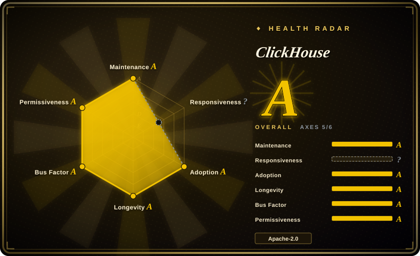
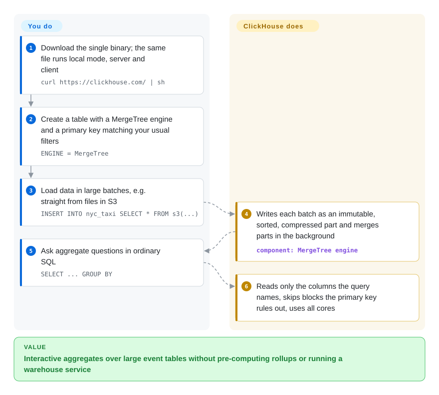

# ClickHouse

Your dashboard query — "events per country per hour for the last 90 days" — takes minutes on Postgres or MySQL, because a row store reads every column of every row just to count a few of them. ClickHouse stores each column separately and compressed, and only scans the columns and key ranges a query actually touches.

## When to use

You run product analytics, observability or ad-tech data for a team, and the events table has grown into the hundreds of millions of rows. The `GROUP BY` behind a dashboard tile now runs for minutes on the primary Postgres, competes with live traffic, and someone has already proposed nightly rollup tables that will be stale by lunch. You want to keep writing plain SQL, keep the data on hardware you control, and get answers fast enough that people can explore instead of waiting.

You reach for ClickHouse because it is a server built for exactly that shape of work: append-mostly event data, wide tables, aggregate queries, many concurrent dashboard users. Pick it over DuckDB when several services and people must query the same continuously growing dataset through a server (DuckDB is an embedded library, best for one process). Pick it over Elasticsearch when the questions are SQL aggregates rather than full-text relevance. Pick it over a hosted warehouse when you need self-hosting under Apache-2.0 and sub-second interactive latency matters more than zero ops.

## How it works

ClickHouse is one binary: the same file runs as `clickhouse-local` (query files with no setup), as a server, and as the client. You create tables with a **MergeTree** engine and a primary key — here the key is a *sort order*, not a uniqueness constraint: rows are stored sorted by it so the engine can skip whole blocks of rows a filter cannot match. Every insert writes a new immutable **part** (a sorted, compressed chunk of column files) and background merges fold parts together, which is why the docs ask for large batches instead of row-by-row inserts. At query time it reads only the columns named in the query and fans the work out across all cores. What it does for you: columnar storage, compression, merges, parallel execution, and table functions that read S3, Kafka, Postgres and many file formats in place. What stays yours: choosing the sort key, batching writes, modelling updates (they are expensive rewrites — see below), and, once you need replication, running ClickHouse Keeper (its coordination service) and planning shards.

<!-- flow-steps:begin (generated from flows/clickhouse.json by tools/flow_card.py — do not edit) -->

Text version of the flow

1. **You**: Download the single binary; the same file runs local mode, server and client — `curl https://clickhouse.com/ | sh`
2. **You**: Create a table with a MergeTree engine and a primary key matching your usual filters — `ENGINE = MergeTree`
3. **You**: Load data in large batches, e.g. straight from files in S3 — `INSERT INTO nyc_taxi SELECT * FROM s3(...)`
4. **ClickHouse**: Writes each batch as an immutable, sorted, compressed part and merges parts in the background — component: `MergeTree engine`
5. **You**: Ask aggregate questions in ordinary SQL — `SELECT ... GROUP BY`
6. **ClickHouse**: Reads only the columns the query names, skips blocks the primary key rules out, uses all cores

**Value**: Interactive aggregates over large event tables without pre-computing rollups or running a warehouse service

<!-- flow-steps:end -->

## When NOT to use

- **Your workload is transactional: many small row-level updates, deletes, foreign keys, multi-statement transactions.** Use PostgreSQL or MySQL instead. ClickHouse's own docs describe `ALTER TABLE … UPDATE/DELETE` as *mutations* that asynchronously rewrite whole data parts, cannot be rolled back, and should be avoided when frequent; corrections are meant to be modelled with ReplacingMergeTree/CollapsingMergeTree, which are only eventually consistent until merges or `FINAL` catch up.
- **Data arrives one row at a time from many writers and you will not batch.** Each insert creates a part; thousands of tiny inserts per second overwhelm background merges. Put a buffer (Kafka, async inserts, a batching collector) in front — or, if the volume is modest, keep it in Postgres. For a single analyst process over local files, DuckDB avoids the server entirely.
- **The data fits on a laptop and only one process queries it.** Use DuckDB: in-process, nothing to deploy, reads Parquet/CSV directly. A ClickHouse server adds a service, ports, users and upgrades you do not need yet.
- **You need a managed, elastic, compute/storage-separated cluster but do not want to operate one.** The SharedMergeTree engine that powers ClickHouse Cloud's separation of compute and storage is a cloud feature; self-hosted clusters use ReplicatedMergeTree + Keeper, and scaling them is your work. Use ClickHouse Cloud (not a repo) or another hosted warehouse if ops headcount is the constraint.
- **Your queries are full-text relevance search or key-value point lookups.** Use Elasticsearch/OpenSearch for ranked text search, and a key-value store such as [Valkey](valkey.md) for single-key reads at high QPS; ClickHouse's sparse primary index is built for range scans, not single-row lookups by arbitrary columns.

## Comparison

| Alternative | In index | Our verdict | Tradeoff |
|---|---|---|---|
| [DuckDB](duckdb.md) | ✅ | For one process analysing local or object-store files, pick DuckDB; pick ClickHouse when many users and services must query one growing shared dataset through a server. | DuckDB has zero ops and lives inside your Python/R/CLI process, but allows only one writing process per file; ClickHouse costs a server to run but serves concurrent dashboards and continuous ingestion. |
| StarRocks | 未收录 | Pick StarRocks when your analytics are join-heavy star schemas with frequent upserts; pick ClickHouse for wide, append-mostly event tables where scan speed per server matters most. | StarRocks offers a MySQL-protocol MPP engine with primary-key tables built for updates, at the cost of a frontend/backend node topology; ClickHouse is simpler to start (one binary) but treats updates as expensive. |
| Apache Doris | 未收录 | Pick Doris when you want an Apache-governed MPP warehouse that speaks the MySQL protocol and handles upserts; pick ClickHouse when vendor-backed release velocity and its table-function ecosystem matter more. | Doris trades ClickHouse's single-binary simplicity for FE/BE node roles and foundation governance; ClickHouse's roadmap is owned by ClickHouse Inc. |
| Apache Druid / Apache Pinot | 未收录 | Pick Druid or Pinot when you need user-facing, high-concurrency real-time analytics with built-in stream ingestion; pick ClickHouse when you want general SQL and far fewer moving parts. | Druid/Pinot ingest directly from streams with many specialised node types and stricter data modelling; ClickHouse needs a batching layer for streams but is much simpler to operate and query. |
| Elasticsearch | 未收录 | Pick Elasticsearch when log search means ranked full-text queries; pick ClickHouse when logs are queried mostly with filters and aggregates and storage cost is the pain. | Elasticsearch indexes every field for search, which costs disk and memory; ClickHouse's compressed columns are far cheaper per GB but give no relevance ranking. Elasticsearch's license is also a mix of AGPL/SSPL/Elastic License, not Apache-2.0. |

## Tech stack

- **Language:** C++ (`CMAKE_CXX_STANDARD 23`, built with CMake); the server, client, local mode and Keeper are all one statically linked `clickhouse` binary.
- **Storage engine:** the MergeTree family (MergeTree, ReplacingMergeTree, CollapsingMergeTree, AggregatingMergeTree, …) — columnar, sorted, compressed parts with background merges and sparse primary indexes.
- **Interfaces:** native TCP protocol, HTTP interface, plus MySQL- and PostgreSQL-wire compatibility; official clients for many languages.
- **Coordination:** ClickHouse Keeper (C++, uses the Raft consensus algorithm via eBay's NuRaft; speaks the ZooKeeper client protocol) for replicated tables and distributed DDL.

## Dependencies

- **Single node:** nothing beyond the binary (or the official `clickhouse` Docker image). Linux and macOS natively; Windows only through WSL.
- **Replication / high availability:** ClickHouse Keeper (bundled in the same binary, usually run as a 3-node ensemble) or an external ZooKeeper.
- **Ingestion:** for streams, a batching layer — Kafka engine tables, async inserts, or a collector — rather than per-event inserts.
- **Optional:** S3-compatible object storage for tiered or table-function storage; no other required services.

## Ops difficulty

**Low to start, medium-to-high at cluster scale.** A single node is one binary and a config directory, and `clickhouse-local` needs no server at all. The difficulty arrives with production: picking sort keys and partitions you cannot cheaply change later, watching part counts and merges, avoiding mutations, sizing memory for big `GROUP BY`s and joins, and — for replication — running Keeper, defining shards and replicas, and rebalancing data yourself. Monthly feature releases plus LTS lines (26.3, 26.8 as of 2026-10) mean you should pin to an LTS and plan upgrades.

## Health & viability

- **Maintenance (as of 2026-10-08):** extremely active. Monthly feature releases (26.9 in September 2026) with patch builds landing on several lines at once — 26.9, 26.8-lts, 26.7, 26.3-lts all received releases on 2026-10-06/07.
- **Governance / bus factor:** owned by ClickHouse Inc., the company that sells ClickHouse Cloud and sets the roadmap. 233 contributors were active in the last 12 months, though the top contributor alone accounts for about a third of recent commits — a broad team with a strong lead.
- **Backing & longevity:** the GitHub repo dates from 2016-06 and the project marked its 10-year anniversary in the 26.6 release; ten years of continuous activity plus a funded vendor gives a strong Lindy prior.
- **Adoption:** ~50.3k stars and ~9.1k forks; ~6.7M Docker Hub pulls of `library/clickhouse` and a large client/integration ecosystem.
- **Risk flags:** Apache-2.0 with no relicense so far, but it is a single-vendor open-core shape: the cloud's compute/storage separation (SharedMergeTree) is not in the open-source repo. The responsiveness axis could not be scored by the tool (no issue-response window signal); with ~8.2k open issues, triage depth on community reports is unclear.

## Caveats (unverified)

- [推断] SharedMergeTree being cloud-only is inferred from the docs placing it under ClickHouse Cloud and from no `SharedMergeTree` source appearing under `src/Storages/MergeTree` in the public repo tree (the tree listing was truncated, so the check is not exhaustive).
- [推断] Characterisations of StarRocks, Apache Doris, Druid, Pinot and Elasticsearch in the comparison are from general knowledge of those projects, not re-read for this page.
- [未验证] The "~a third of recent commits" figure comes from the health scorer's `top1_share` (0.321) over its 12-month window, not from an independent count.
- [未验证] The open-issue count (~8.2k) is GitHub's `open_issues_count`, which includes pull requests.
