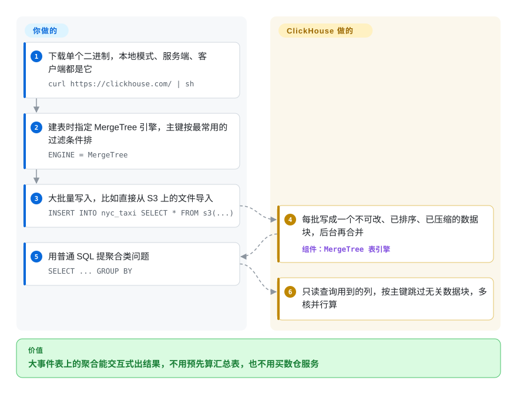

# ClickHouse

看板上一条“最近 90 天、按国家按小时统计事件数”的查询，在 Postgres 或 MySQL 上要跑好几分钟：行存数据库为了数其中几列，得把每一行的每一列都读一遍。ClickHouse 把每一列单独压缩存放，查询只扫它真正用到的列和主键范围。

## 何时使用

你在团队里负责产品分析、可观测性或广告数据，事件表已经涨到几亿行。看板上每个图块背后的 `GROUP BY` 在主库 Postgres 上要跑几分钟，还和线上流量抢资源；已经有人提议每晚算一遍汇总表，可那张表到中午就过时了。你想继续写普通 SQL，数据留在自己掌控的机器上，而且查询要快到大家愿意边看边探索，而不是排队等结果。

这时候想到 ClickHouse，是因为它就是为这种形状的工作造的服务端：以追加为主的事件数据、很宽的表、聚合查询、很多人同时看板。和 DuckDB 比：当多个服务、多个人要通过一个服务端查询同一份持续增长的数据时选 ClickHouse（DuckDB 是嵌入式库，适合单进程）。和 Elasticsearch 比：问题是 SQL 聚合而不是全文相关度排序时选 ClickHouse。和托管数仓比：需要 Apache-2.0 自托管、并且在意亚秒级交互延迟胜过零运维时选它。

## 怎么用起来

ClickHouse 只有一个二进制文件：同一个文件既能当 `clickhouse-local`（不起服务、直接查文件），也能当服务端和客户端。你建表时指定 **MergeTree** 引擎和一个主键——这里的主键是*排序顺序*，不是唯一约束：数据按它排好存放，引擎就能整块跳过过滤条件不可能命中的数据。每次写入都会生成一个新的、不可修改的**数据块**（part，一组排好序、压缩过的列文件），后台再把这些块合并起来，所以官方文档要求大批量写入，而不是一行一行插。查询时它只读 SQL 里提到的列，并把计算分摊到所有 CPU 核。它替你做的：列式存储、压缩、后台合并、并行执行，以及能直接读 S3、Kafka、Postgres 和多种文件格式的表函数。留给你的：选排序键、把写入攒成批、设计更新方式（更新是昂贵的重写，见下文），以及需要副本时运行 ClickHouse Keeper（它的协调服务）并规划分片。

<!-- flow-steps:begin (generated from flows/clickhouse.json by tools/flow_card.py — do not edit) -->

流程文字版

1. **你**：下载单个二进制，本地模式、服务端、客户端都是它 — `curl https://clickhouse.com/ | sh`
2. **你**：建表时指定 MergeTree 引擎，主键按最常用的过滤条件排 — `ENGINE = MergeTree`
3. **你**：大批量写入，比如直接从 S3 上的文件导入 — `INSERT INTO nyc_taxi SELECT * FROM s3(...)`
4. **ClickHouse**：每批写成一个不可改、已排序、已压缩的数据块，后台再合并 — 组件：`MergeTree 表引擎`
5. **你**：用普通 SQL 提聚合类问题 — `SELECT ... GROUP BY`
6. **ClickHouse**：只读查询用到的列，按主键跳过无关数据块，多核并行算

**价值**：大事件表上的聚合能交互式出结果，不用预先算汇总表，也不用买数仓服务

<!-- flow-steps:end -->

## 何时不用

- **负载是事务型的：大量单行更新删除、外键、多语句事务。** 改用 PostgreSQL 或 MySQL。ClickHouse 自己的文档说明，`ALTER TABLE … UPDATE/DELETE` 是异步重写整个数据块的 *mutation*，提交后不能回滚，频繁使用会拖垮性能；修正数据应该用 ReplacingMergeTree/CollapsingMergeTree 建模，而它们在合并完成或加 `FINAL` 之前只是最终一致。
- **数据一行一行地从很多写入方进来，而且你不打算攒批。** 每次插入都生成一个数据块，每秒几千次小插入会压垮后台合并。前面加一层缓冲（Kafka、异步插入、带批处理的采集器）；量不大就留在 Postgres。如果只是一个分析进程查本地文件，用 DuckDB 连服务端都省了。
- **数据一台笔记本装得下，而且只有一个进程查。** 用 DuckDB：进程内运行，不用部署，直接读 Parquet/CSV。起一个 ClickHouse 服务端会多出服务、端口、用户和升级，这些你暂时都用不上。
- **你要托管、弹性、计算存储分离的集群，但不想自己运维。** 支撑 ClickHouse Cloud 计算存储分离的 SharedMergeTree 引擎是云端功能；自托管集群用的是 ReplicatedMergeTree 加 Keeper，扩缩容都得自己做。运维人手是瓶颈时，用 ClickHouse Cloud（非仓库）或其他托管数仓。
- **查询是全文相关度搜索或按键点查。** 排序式全文检索用 Elasticsearch/OpenSearch，高 QPS 的单键读取用 [Valkey](valkey.zh.md) 这类键值库；ClickHouse 的稀疏主键索引为范围扫描而设计，不擅长按任意列查单行。

## 横向对比

| 替代品 | 是否收录 | 我们的评价 | 取舍 |
|---|---|---|---|
| [DuckDB](duckdb.zh.md) | ✅ | 单个进程分析本地或对象存储上的文件，选 DuckDB；很多用户和服务要通过服务端查同一份持续增长的数据，选 ClickHouse。 | DuckDB 零运维、跑在你的 Python/R/CLI 进程里，但每个库文件只允许一个进程写；ClickHouse 要多运行一个服务端，换来并发看板和持续写入。 |
| StarRocks | 未收录 | 分析以多表 join 的星型模型为主、且更新频繁时选 StarRocks；宽表、以追加为主、最看重单机扫描速度的事件数据选 ClickHouse。 | StarRocks 是兼容 MySQL 协议的 MPP 引擎，有专为更新设计的主键表，代价是前端/后端两类节点的拓扑；ClickHouse 起步更简单（一个二进制），但更新代价高。 |
| Apache Doris | 未收录 | 想要 Apache 基金会治理、兼容 MySQL 协议、能做 upsert 的 MPP 数仓时选 Doris；更看重厂商驱动的发版速度和表函数生态时选 ClickHouse。 | Doris 用 FE/BE 两类节点和基金会治理，换掉了 ClickHouse 单二进制的简单；ClickHouse 的路线图由 ClickHouse Inc. 掌握。 |
| Apache Druid / Apache Pinot | 未收录 | 需要面向终端用户、高并发、内置流式摄取的实时分析时选 Druid 或 Pinot；想要通用 SQL、组件少得多时选 ClickHouse。 | Druid/Pinot 直接从流里摄取，但节点类型多、数据建模更严格；ClickHouse 接流需要一层攒批，但运维和查询都简单得多。 |
| Elasticsearch | 未收录 | 日志检索意味着带相关度排序的全文查询时选 Elasticsearch；日志主要靠过滤和聚合来查、存储成本是痛点时选 ClickHouse。 | Elasticsearch 为搜索给每个字段建索引，磁盘和内存开销大；ClickHouse 的压缩列每 GB 成本低得多，但没有相关度排序。Elasticsearch 的许可证是 AGPL/SSPL/Elastic License 的组合，不是 Apache-2.0。 |

## 技术栈

- **语言：** C++（`CMAKE_CXX_STANDARD 23`，用 CMake 构建）；服务端、客户端、本地模式和 Keeper 都在同一个静态链接的 `clickhouse` 二进制里。
- **存储引擎：** MergeTree 家族（MergeTree、ReplacingMergeTree、CollapsingMergeTree、AggregatingMergeTree 等）——列式、有序、压缩的数据块，后台合并，稀疏主键索引。
- **接口：** 原生 TCP 协议、HTTP 接口，以及兼容 MySQL 和 PostgreSQL 的线协议；官方提供多种语言的客户端。
- **协调：** ClickHouse Keeper（C++ 实现，通过 eBay 的 NuRaft 使用 Raft 共识算法；兼容 ZooKeeper 客户端协议），用于副本表和分布式 DDL。

## 依赖

- **单节点：** 只要这个二进制（或官方 `clickhouse` Docker 镜像）。原生支持 Linux 和 macOS；Windows 只能通过 WSL。
- **副本/高可用：** ClickHouse Keeper（同一个二进制，通常跑 3 节点）或外部 ZooKeeper。
- **数据摄取：** 流式数据需要一层攒批——Kafka 引擎表、异步插入或采集器——而不是逐条插入。
- **可选：** S3 兼容的对象存储，用于分层存储或表函数；没有其他必需服务。

## 运维难度

**起步低，集群规模下中到高。** 单节点就是一个二进制加一个配置目录，`clickhouse-local` 甚至不需要服务端。难度在上生产之后：排序键和分区一旦选定就很难低成本改，要盯数据块数量和合并，要避开 mutation，要为大 `GROUP BY` 和 join 预留内存；需要副本时还要运行 Keeper、定义分片和副本、自己做数据再平衡。每月一个功能版本，另有 LTS 线（截至 2026-10 是 26.3、26.8），应该钉在 LTS 上并规划升级。

## 健康度与可持续性

- **维护（截至 2026-10-08）：** 极其活跃。每月一个功能版本（2026 年 9 月发布 26.9），补丁版本同时落在多条线上——26.9、26.8-lts、26.7、26.3-lts 都在 2026-10-06/07 发了版。
- **治理/巴士因子：** 归 ClickHouse Inc. 所有，这家公司卖 ClickHouse Cloud，也掌握路线图。过去 12 个月有 233 名活跃贡献者，但头号贡献者一人约占近期提交的三分之一——团队很宽，但有一个强核心。
- **背书与长期性：** GitHub 仓库建于 2016-06，项目在 26.6 版本时办了十周年发布会；十年持续活跃，加上有融资的厂商，Lindy 先验很强。
- **采用度：** 约 5.03 万 star、约 9.1 千 fork；Docker Hub 上 `library/clickhouse` 约 670 万次拉取，客户端和集成生态很大。
- **风险信号：** Apache-2.0，至今没有改过许可证，但这是单一厂商的开源核心形态：云端的计算存储分离（SharedMergeTree）不在开源仓库里。工具没能给响应度打分（没有 issue 响应窗口信号）；约 8.2 千个未关闭 issue，社区问题的分诊深度不清楚。

## 存疑（未验证）

- [推断] SharedMergeTree 只在云端，是根据文档把它放在 ClickHouse Cloud 目录下、以及公开仓库 `src/Storages/MergeTree` 下找不到 `SharedMergeTree` 源码推断的（仓库树列表被截断，检查并不完整）。
- [推断] 对比表里对 StarRocks、Apache Doris、Druid、Pinot、Elasticsearch 的描述来自对这些项目的一般了解，本页没有重新阅读它们的资料。
- [未验证] “头号贡献者约占三分之一”来自健康度打分器在 12 个月窗口内的 `top1_share`（0.321），不是独立统计。
- [未验证] 未关闭 issue 数（约 8.2 千）是 GitHub 的 `open_issues_count`，其中包含 pull request。
